# Chapter X - Self-Attention & Transformer

#### Tranaformer = Seq2seq model with “Self-attention”

[1.Self-attention机制原理](#1)

​		[1.1 RNN与CNN解决序列问题](#1.1)

​		[1.2 Self-Attention的基本过程](#1.2)

​		[1.3 Self-Attention的矩阵表示](#1.3)

​		[1.4 Multi-head Self-attention（以2 heads 为例）](#1.4)

​		[1.5 Positional Encoding](#1.5)

[2.Self-attention在Seq2Seq Model中的用法](#2)

​		[2.1 Seq2Seq with Self-attention模型结构](#2.1)

[3.Transformer](#3)

​		[3.1 模型结构](#3.1)

​		[3.2 Attention Visualization](#3.2)

​		[3.3 Example Application](#3.3)

#### 1.Self-attention机制原理

1. RNN与CNN解决序列问题

   - 当遇到文本序列问题时，常用的解法为RNN或Bi-RNN等等。例如左图所示，当得到输出$b^4$时，网络已经对整个输入序列进行了学习。但是RNN的一个缺点是难以并行化，当一个序列作为输入时，为了得到$b^4$，需要顺序的读入$a^1$至$a^4$，该过程难以并行化。

     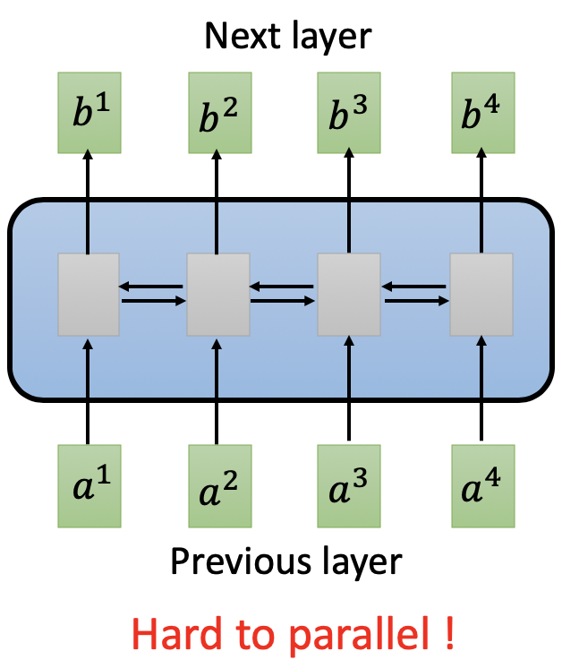

   - 基于RNN难以并行化的特点，一些学者提出使用CNN来代替RNN，如下图所示。输入仍旧是一个序列$a^1$至$a^4$，图中的三角符号表示一个Filter，其对应的输入是Sequence中一小段序列，二者进行內积操作即可。然后通过平移Filter以获取不同的输入（Filter相当于滑动窗口的概念），这样就可以使得CNN将一个Sequence转换为另一个Sequence。一个输入会对应多个Filter。下图中红色和黄色的三角代表两个Filter，两个Filter在与输入做內积的过程，以及一个Filter与不同的序列段做內积的过程均可以并行化，这样就可以解决并行化的问题。

     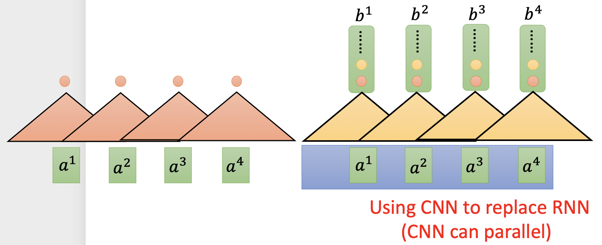

   - CNN解决Sequence问题时，会受到Filter窗口“视野”的限制，即一个Filter只能读取一小段序列的输入。相比之下，RNN的$b^4$是在全序列视野下产生的。解决该问题的方法是进行多层的卷积操作，高层的Filter（下图中的蓝色三角形）就能够拥有更大的视野，足以考虑到整个Sequence。

     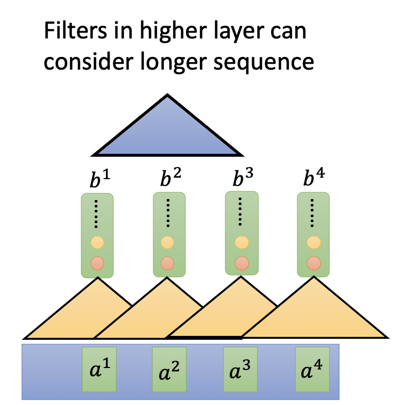

     

2. Self-Attention的基本过程

   - Self-Attention是由谷歌在《Attention is all you need》（https://arxiv.org/abs/1706.03762）中提出的一种替代RNN或CNN解决序列问题的模型，能够像RNN一样让每一个输出都由整个输入控制，且易并行化，还不用CNN一样叠很多层。

   - $x^1$至$x^4$为Input Sequence，乘以$W$进行Embedding得到$a^i=Wx^i$。然后用$a^i$分别乘以不同的transfomation matrix得到$q^i、k^i、v^i$，其中$q^i=W^qa^i$，表示query（to match others）；其中$k^i=W^k a^i$，表示key（to be matched）；其中$v^i=W^v a^i$，表示information to be extracted；

     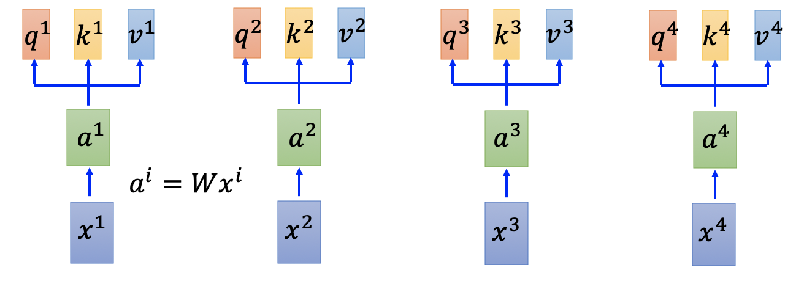

   - 使用每个query $q$去对每个key $k$做attention（计算两者的相似度）。首先用$q^1$和$k^1$做attention，得到attention weight $\alpha_{1,1}$，同理对$k^2、k^3、k^4$做attention得到$\alpha_{1,2}、\alpha_{1,3}、\alpha_{1,4}$。论文中使用的attention方法为Scaled Dot-Product Attention，即$\alpha_{1,i}=\frac{q^1·k^i}{\sqrt{d}}$，其中 $d$ 为 $q$ 和 $k$ 的维度。公式中除以$\sqrt{d}$的原因是因为$q$ 和 $k$ 的內积值会随着其维度的增大而增大，除以$\sqrt{d}$可以平衡该数值

     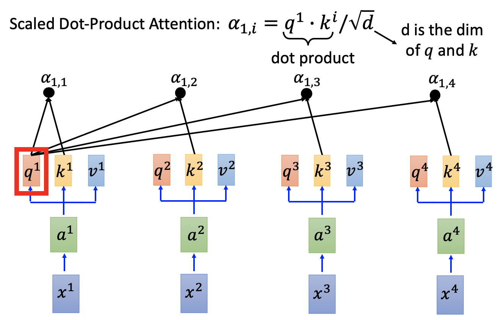

   - 对得到的Attention值进行Soft-max，得到$\hat{\alpha_{1,i}}$，即$\hat{\alpha_{1,i}}=exp(\alpha_{1,i})/\sum_{j}exp(\alpha_{1,i})$

     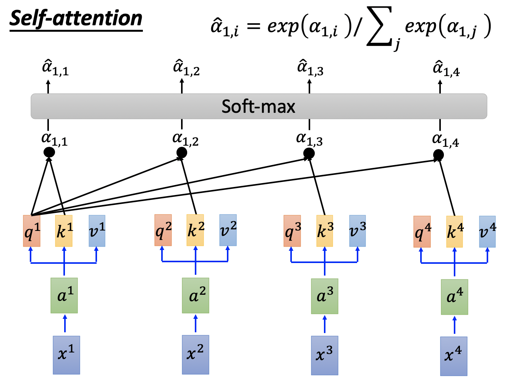

   - 将$\hat{\alpha_{1,i}}$与$v^i$相乘得到$b^1$，即$b^1=\sum \limits _{i}\hat{\alpha_{1,i}}v^i$。$b^1$实际上是对$v^1、v^2、v^3、v^4$做weighted sum，权重由$q$和$k$计算得出。这样$b^1$的产生由整个Sequence决定，如果模型需要由局部产生输出结果，可以将无关部分的权重直接置为零即可。

     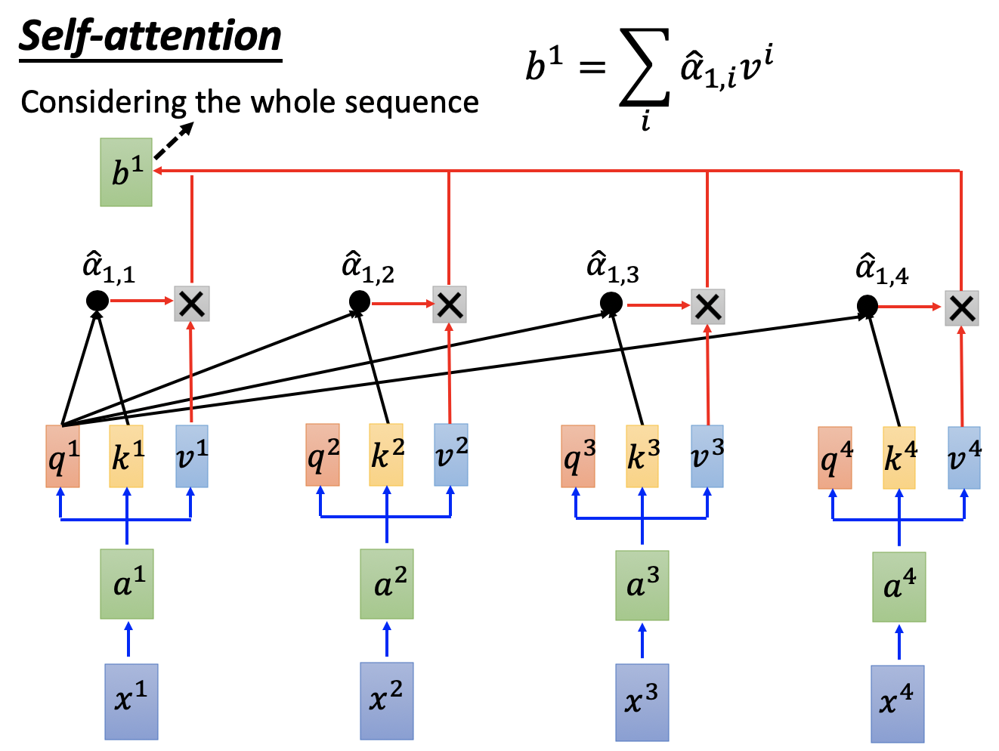

   - 以此类推可以得到$b^2、b^3、b^4$，计算过程相互独立，可以并行计算。 

     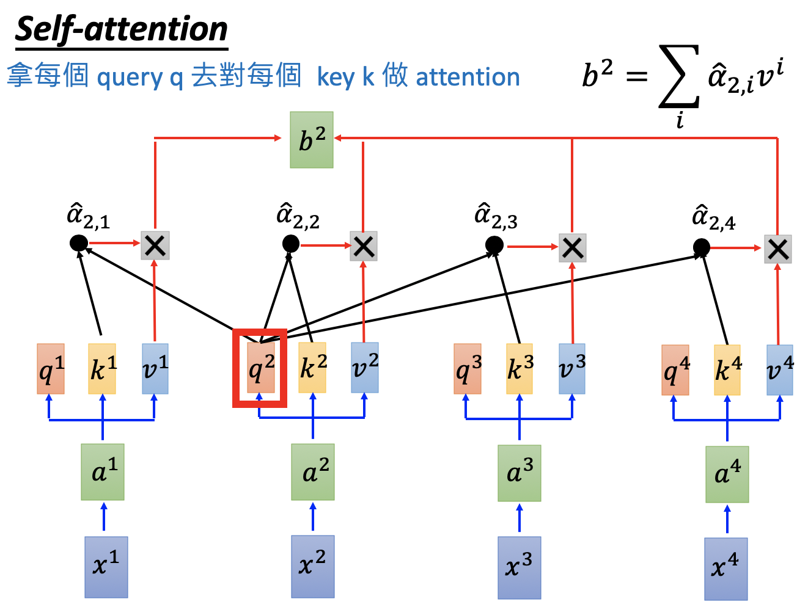

     

3. Self-Attention的矩阵表示

   - Transform过程的矩阵形式为：$Q=W^qI、K=W^kI、V=W^vI$

     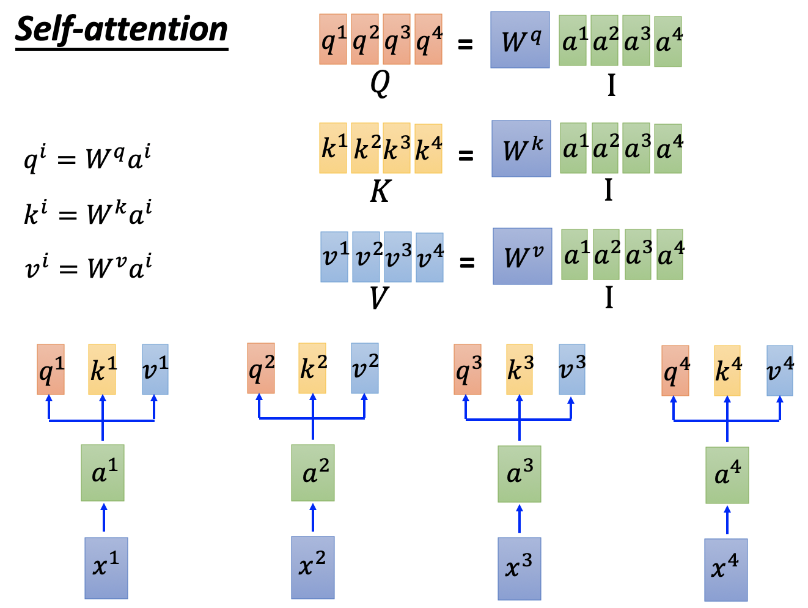

   - Attention过程的矩阵形式为：$\begin{pmatrix} \alpha_{1,1} \\ \alpha_{1,2} \\\alpha_{1,3} \\ \alpha_{1,4} \end{pmatrix} = \begin{pmatrix} {k^1}^T \\ {k^2}^T \\ {k^3}^T \\ {k^4}^T \end{pmatrix} q^1$（为了证明过程的简洁明了，此处忽略$\sqrt{d}$），以此类推可以得到$\begin{pmatrix} \alpha_{2,1} \\ \alpha_{2,2} \\\alpha_{2,3} \\ \alpha_{2,4} \end{pmatrix} = \begin{pmatrix} {k^1}^T \\ {k^2}^T \\ {k^3}^T \\ {k^4}^T \end{pmatrix} q^2$          $\begin{pmatrix} \alpha_{3,1} \\ \alpha_{3,2} \\\alpha_{3,3} \\ \alpha_{3,4} \end{pmatrix} = \begin{pmatrix} {k^1}^T \\ {k^2}^T \\ {k^3}^T \\ {k^4}^T \end{pmatrix} q^3$          $\begin{pmatrix} \alpha_{4,1} \\ \alpha_{4,2} \\\alpha_{4,3} \\ \alpha_{4,4} \end{pmatrix} = \begin{pmatrix} {k^1}^T \\ {k^2}^T \\ {k^3}^T \\ {k^4}^T \end{pmatrix} q^4$。整理可得$\hat{A} \quad \stackrel{Soft-max}{\longleftarrow} \quad A = K^TQ$

     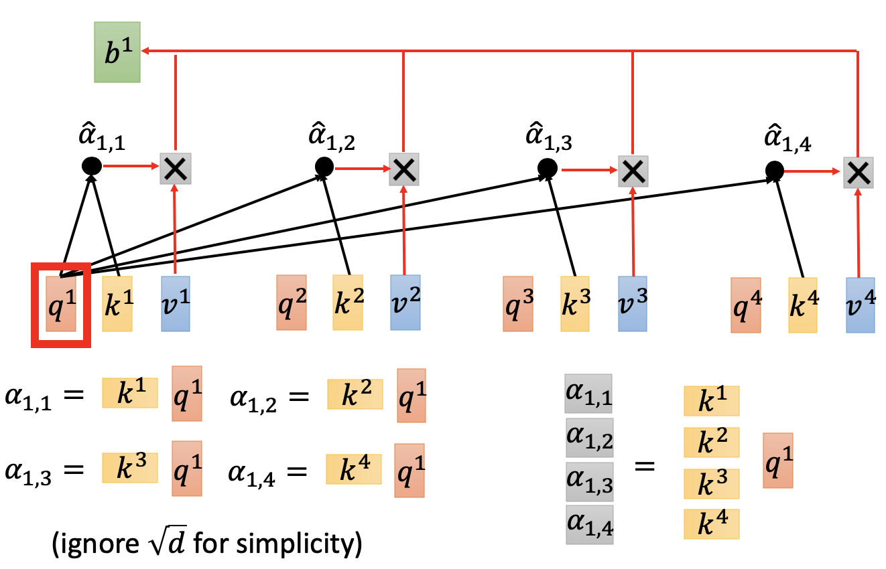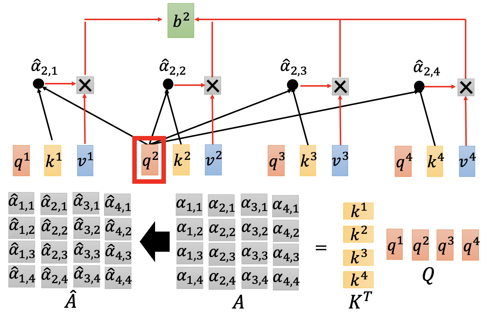

   

   - Weighted Sum过程的矩阵形式为：$O=V\hat{A}$

     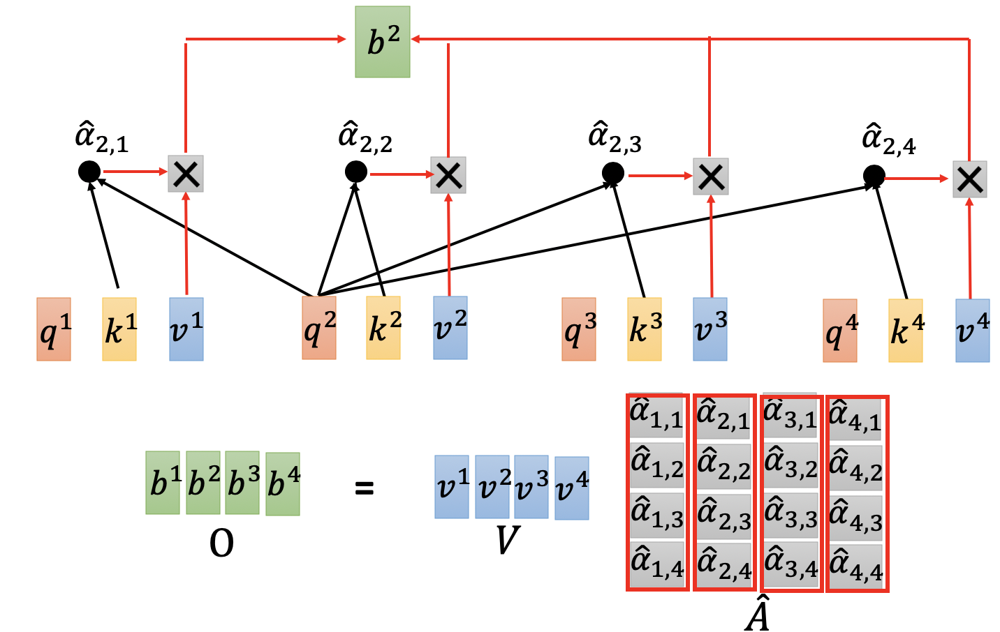

   - Summary：矩阵计算可以用GPU进行加速

     $\left\{ \begin{eqnarray} Q=W^qI \\ K=W^kI \\ V=W^vI \end{eqnarray} \right.$                    $\hat{A} \quad \stackrel{Soft-max}{\longleftarrow} \quad A = K^TQ$                    $O=V\hat{A}$

     

4. Multi-head Self-attention（以2 heads 为例）

   - 在Transform部分乘以两个矩阵得到两组$Q、K、V$

     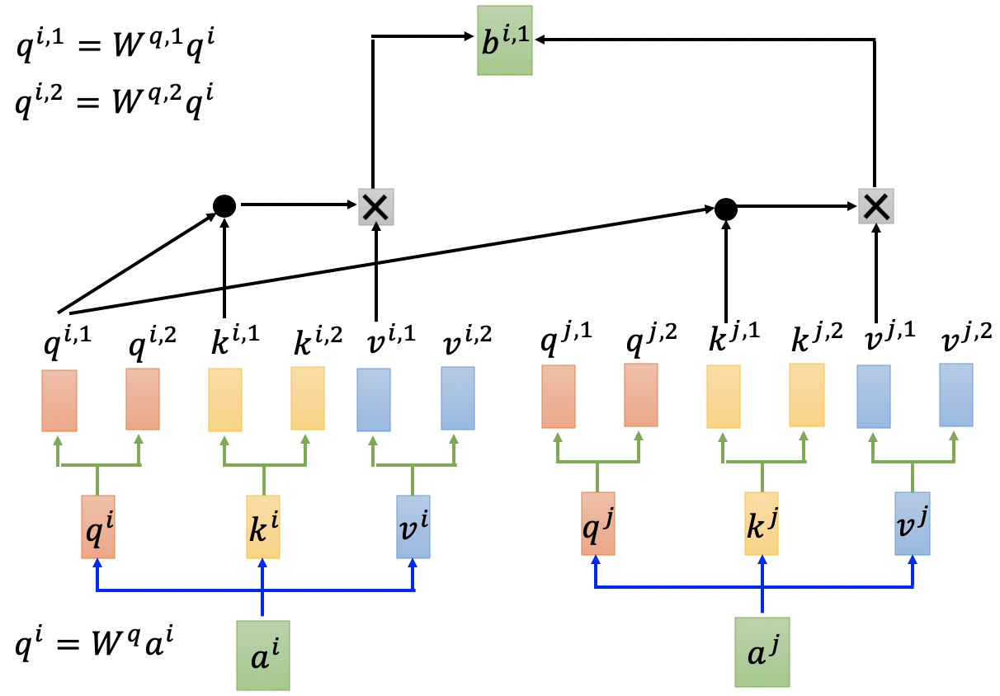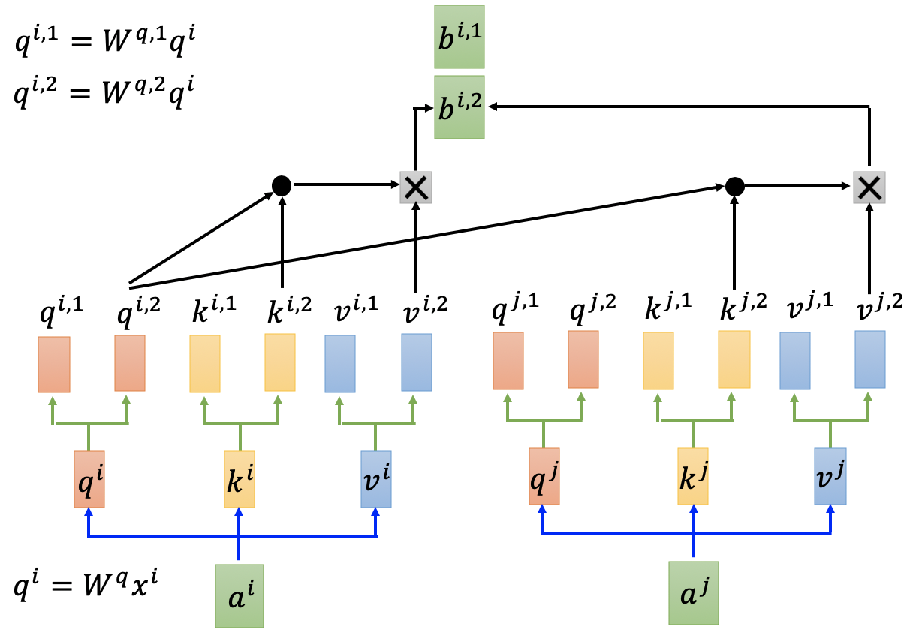

   - 两组$Q、K、V$分别进行Self-Attention类似的运算得到两组输出$b^{i,1}、b^{i,2}$，两者根据具体需求乘以权重矩阵得到最后的输出$b^i$

     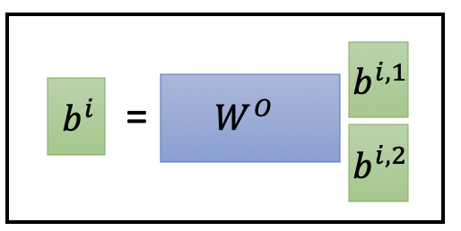

   - Multi-head Self-attentionde优点在于不同的Head可以侧重于不同的视野（局部序列 或 全局序列），然后根据需求算加权和

     

5. Positional Encoding

   - 在Self-Attention中，输入的顺序对结果并不产生影响。为了解决该问题，在original paper的策略是输入经过embedding后需要加上一个position vector $e^i$ （人共设置的，而不是从数据中学到的；每一个位置都有不同的position vector，代表该位置

     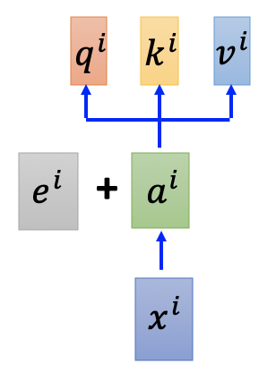

   - $e^i$和$a^i$做加法而不是链接运算的原因是：假设$p^i$为one-hot vector，第$i$个维度为1，表示位置。将$p^i$接在$x^i$之后组成一个联合向量。联合向量乘以权重矩阵$W$（分为两部分，一个是与$x^i$相乘的$W^I$，另一个是与$p^i$相乘的$W^P$）。可以得出：$a^i=W^Ix^i$和$e^i=W^Pp^i$，这就是为什么$e^i$代表了位置的原因。

     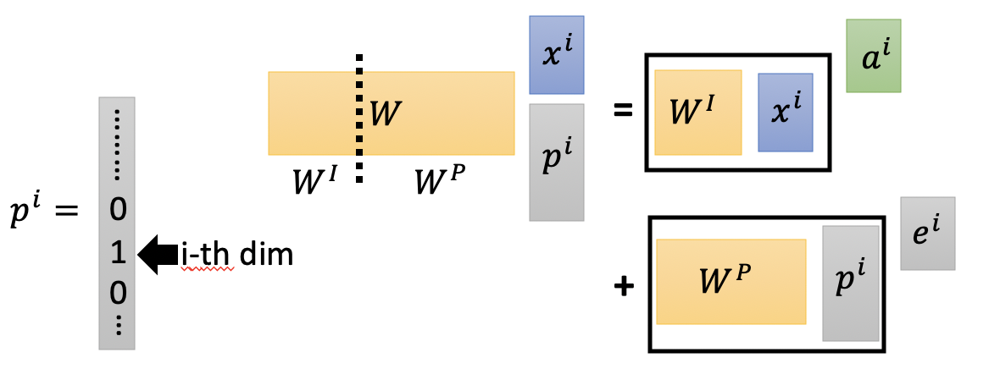

   - 其中经过验证$W^P$经过网络学习得到的话，效果并不好。现行方法是人共设置$W^P$，如下图所示

     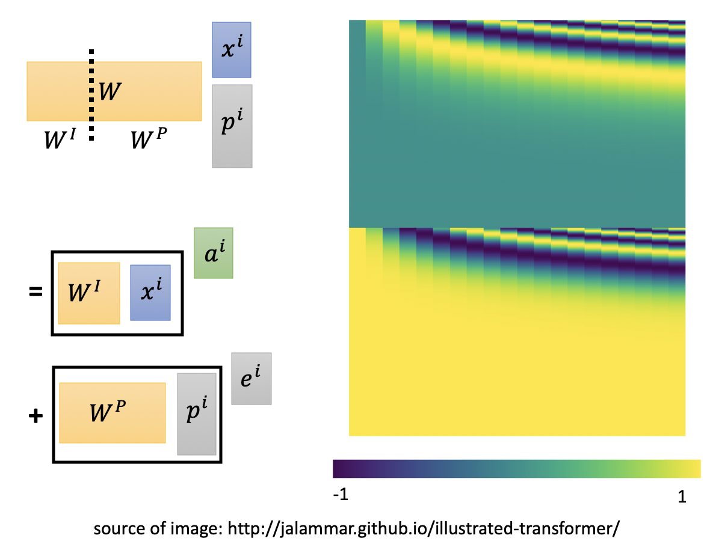

     

#### 2.Self-attention在Seq2Seq Model中的用法

1. Seq2Seq with Self-attention模型结构

   - 使用RNN解决Seq2Seq问题时，Encoder和Decoder都是RNN或Bi-RNN。使用Self-Attention解决该问题时，需要将RNN网络结构替换为Self-Attention Layer

     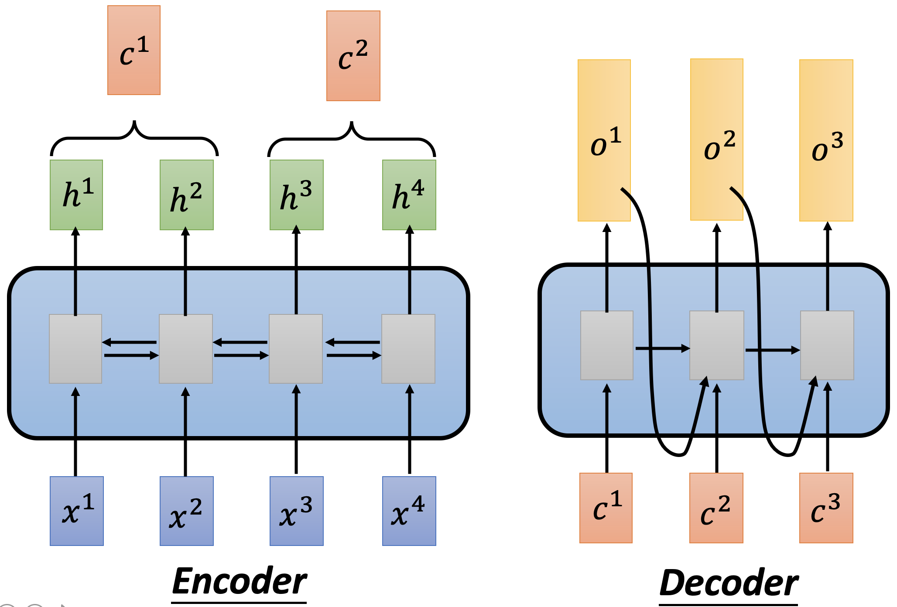          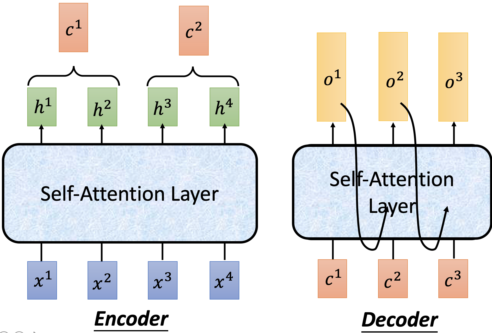

   - 关于Seq2Seq with Self-attention的动画讲解：https://ai.googleblog.com/2017/08/transformer-novel-neural-network.html

     

#### 3.Transfomer

1. 模型结构

   - 由Encoder和Decoder组成。以汉译英为例，Encoder的输入为 “机器学习”，Decoder的输入为起始符 “<BOS>”，Decoder的输出为 “machine learning”

     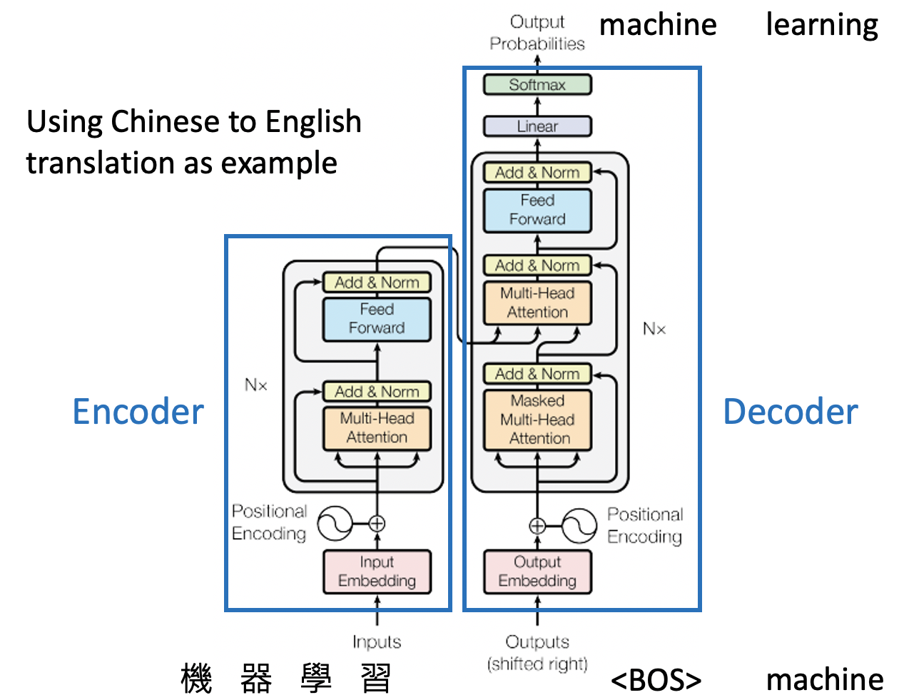

   - Encoder部分：

     - Input经过Embedding Layer转换成Vector，再加上Positional Encoding，形成一个新的输入向量送入灰色盒子部分，然后循环执行该部分。

     - 灰色盒子内部首先是一个Multi-Head Attention Layer，经过该层后会得到一个新的Sequence（$a^i \rightarrow b^i$）

     - 再进行 “Add & Norm” 部分，“Add”部分将Multi-head Attention的输入和输出相加（$b'=a^i+b^i$） ，"Norm"部分是对加和结果进行Layer Norm（具体参见https://arxiv.org/abs/1607.06450）。在Batch Normalization是对一个Batch Size内不同数据的同一纬度做正则化，目标是不同数据同一纬度的均值为0，方差为1。Layer Normalization不需要考虑Batch，是对一笔data的所有维度进行正则化。Layer Normalization一般会和RNN共同使用。

       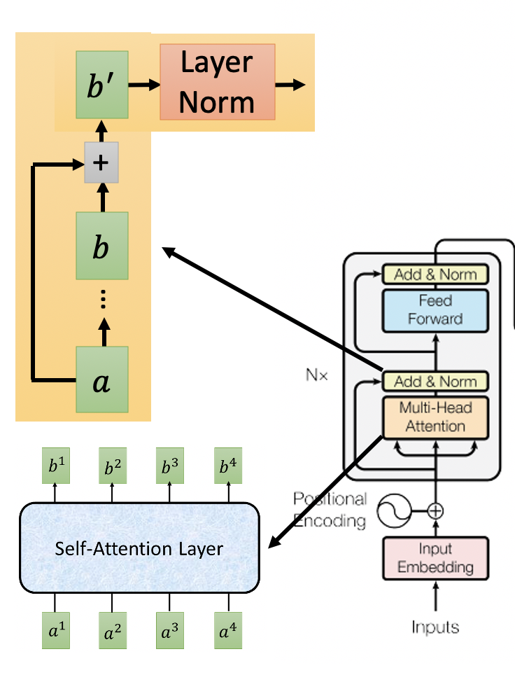                    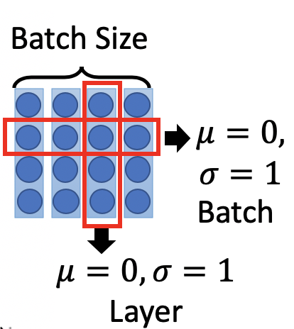

     - 然后进入Feed Forward Layer和Add & Norm Layer

   - Decoder部分：

     - Input是Decoder部分前一个timestamp产生的输出，经过Embedding Layer转换成Vector，再加上Positional Encoding，形成一个新的输入向量送入灰色盒子部分，然后循环执行该部分。
     - 灰色盒子内部首先是一个Masked Multi-Head Attention Layer（Masked指的是只会对已经产生的Sequence部分做Attention操作），然后进行 “Add & Norm” 部分。
     - 然后进入Multi-Head Attention Layer，其输入是上一步输出和Decoder输出的结合
     - 再进入Feed Forward Layer和Add & Norm Layer，得到最终输出

     

2. Attention Visualization

   - 在训练完Transformer后，将其Attention部分单独出来进行分析如下，“it”在不同的语境下会attention到不同的单词上去

     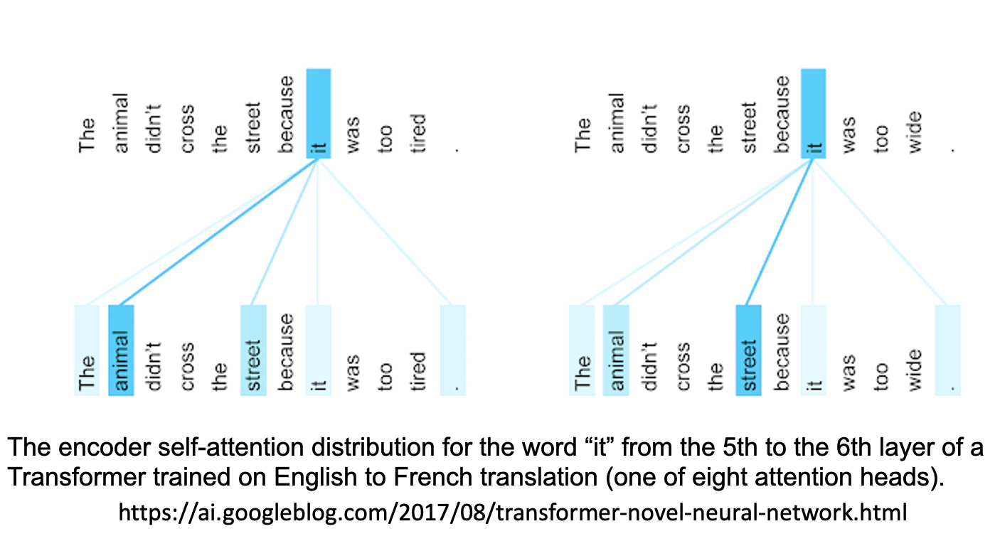

   - Multi-Head attention会使用多组$Q、K、V$，不同组可以实现不同的效果。如下图所示，红色组的Attention更关注的是Local Sequence（许多Word被attent到其后面出现的Word上）；绿色组的Attention更关注的是更长的Sequence

     

3. Example Application

   - 可以使用Seq2Seq的地方，都可以用Transformer代替。比如做Summarizer

     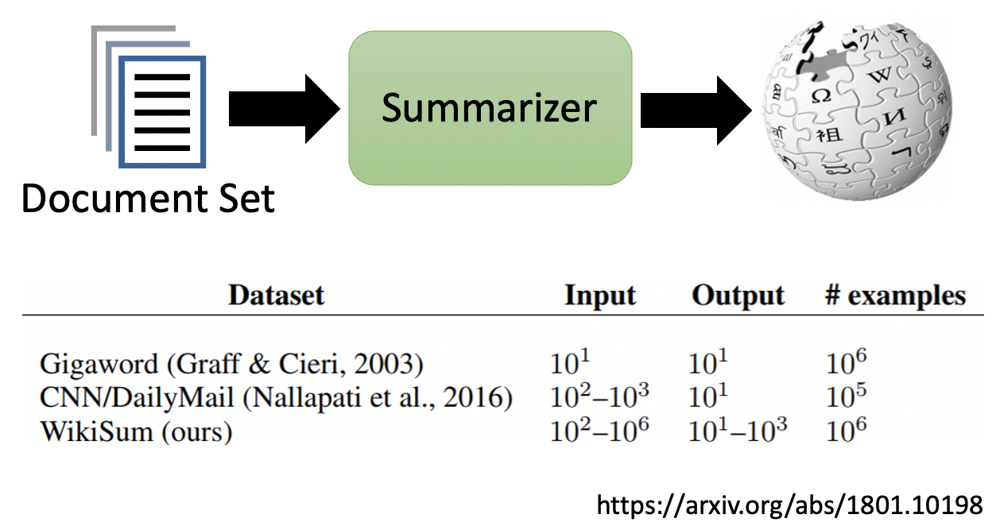

   - Universal Transformer（https://ai.googleblog.com/2018/08/moving-beyond-translation-with.html）

     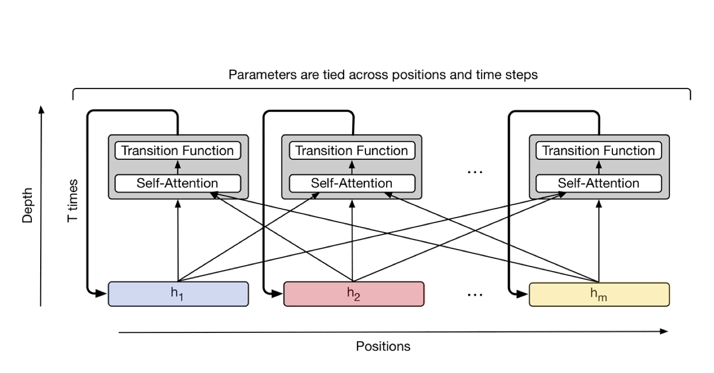

   - Self-Attention GAN（https://arxiv.org/abs/1805.08318）

     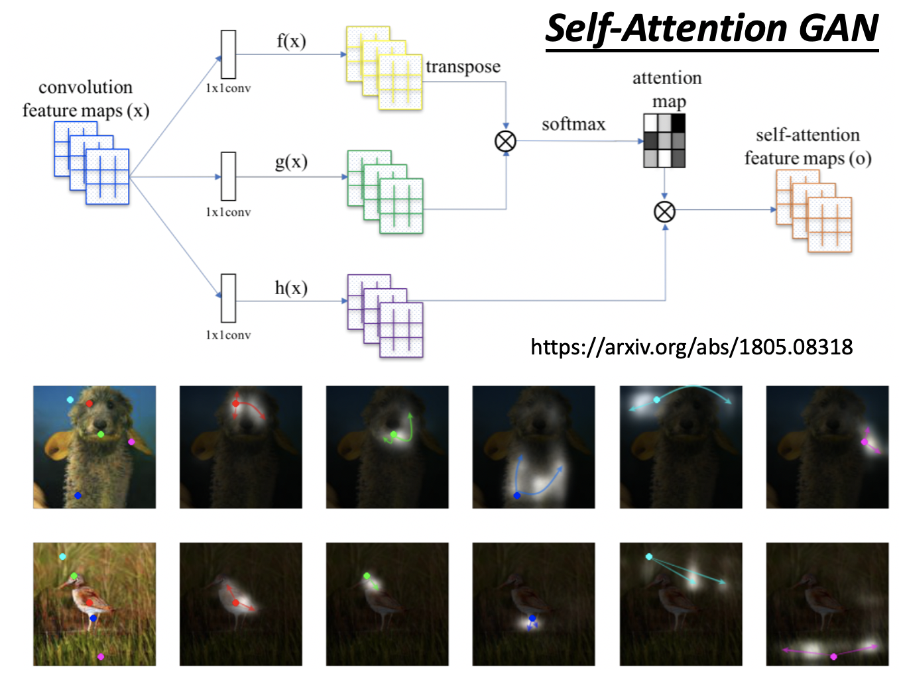

