# Chapter 9 - Recurrent Neural Network

[1.Introduction](#1)

​		[1.1 RNN Application - Slot Filling](#1.1)

​		[1.2 RNN Structure](#1.2)

[2.Long Short-term Memory](#2)

​		[2.1 Long Short-term Memory Cell](#2.1)

​		[2.2 LSTM Cell的串联与叠加](#2.2)

[3.RNN的学习过程和训练技巧](#3)

​		[3.1 RNN难以训练的原因](#3.1)

​		[3.2 RNN的训练技巧](#3.2)

[4.RNN Application](#4)

​		[4.1 Sentiment Analysis（Many to One）](#4.1)

​		[4.2 Key Term Extraction（Many to One）](#4.2)

​		[4.3 Speech Recognizition（Many to Many）](#4.3)

​		[4.4 Machine Translation（Many to Many）](4.4)

​		[4.5 Machine Translation（Many to Many）](#4.5)

​		[4.6 Syntactic Parsing（Beyond Sequence）](#4.6)

​		[4.7 Sequence-to-Sequence Auto-encoder（Text）](#4.7)

​		[4.8 Sequence-to-Sequence Auto-encoder（Speech）](#4.8)

​		[4.9 Chat-bot](#4.9)

[5.Attention-based Model（Chapter 11会展开讲解Self-Attention的原理）](#5)

​		[5.1 Attention-based Model基本原理](#5.1)

​		[5.2 Attention-based Model Applications](#5.2)

[6.Deep Learning VS. Structured Learning](#6)

​		[6.1 Deep Learning与Structured Learning的比较](#6.1)

​		[6.2 Integrating Deep Learning and Structured Learning](#6.2)

​		[6.3 Structured Learning的本质](#6.3)

#### 1.Introduction - RNN的基本结构 

1. RNN Application - Slot Filling 

   - Slot Filling（填槽）指让用户意图转化为用户明确的指令而补全信息的过程。该过程可以通过Feedforward Network进行，首先将词汇通过“1-of-N Encoding“进行编码

   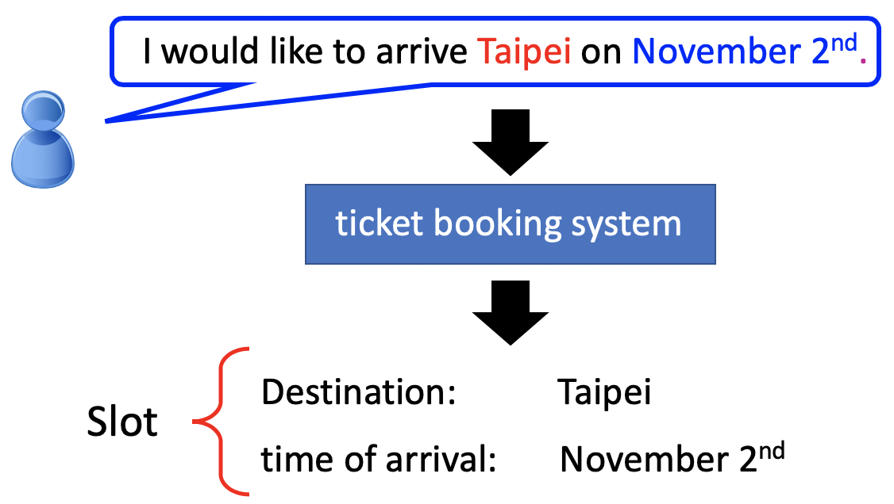                    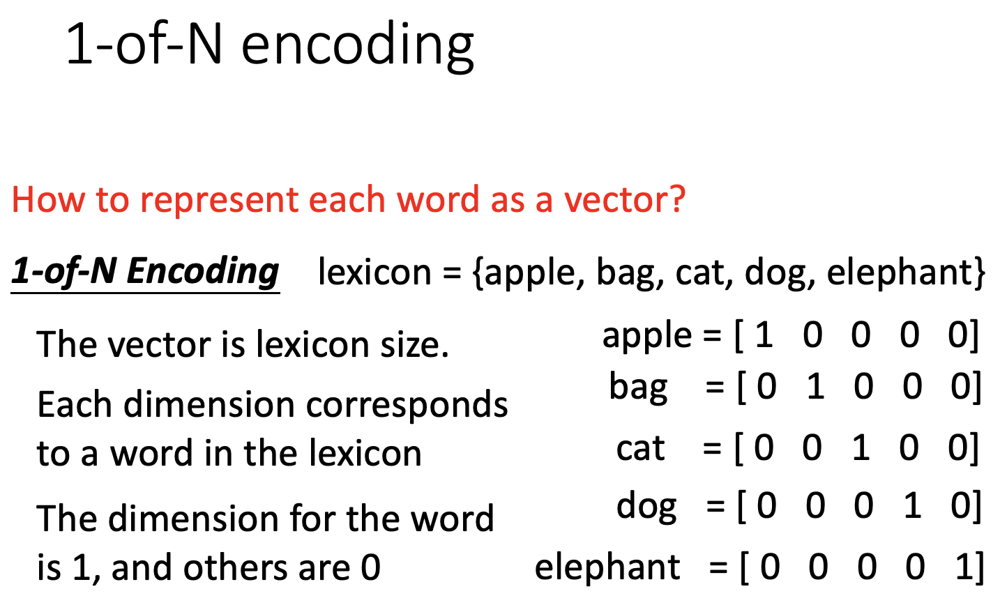

   - 除了”1-of-N“编码方式之外，还可以是使用Dimension for ”Other“(没有在字典中的词汇都按照”other“对待)、Word hashing(按照字母组合的方式进行编码)

     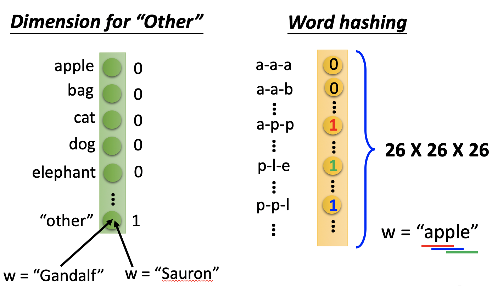

   - 对输入进行编码后，作为输入送入神经网络，输出表示的是该单词属于该slot的概率值。但该方法并不能完全解决该问题，假设当arrive和leave均为another时，无法辨别taipei为出发地还是目的地。因为两句话的编码结果相同，送入神经网络得到的输出是相同的，均为出发地或者目的地。针对于该问题的解决办法是，让网络具有短期的记忆能力，在对taipei进行分类时，网络能够记忆之前的输入（即arrive或leave），此时就可以解决该问题，这种类型的网络被称为循环神经网络（Recurrent Neural Network）

     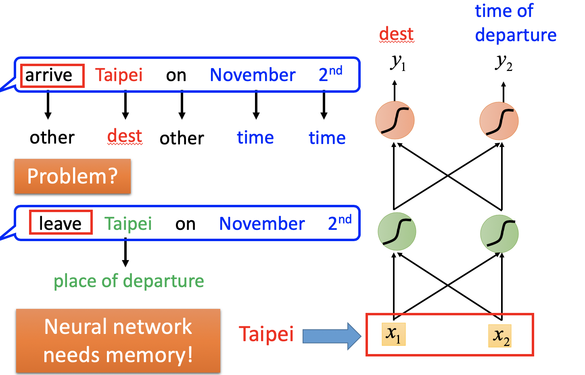

2. RNN Structure  

   - RNN的hidden layer的output会被存储在内存中，在之后的计算中会被当做另一个input。

     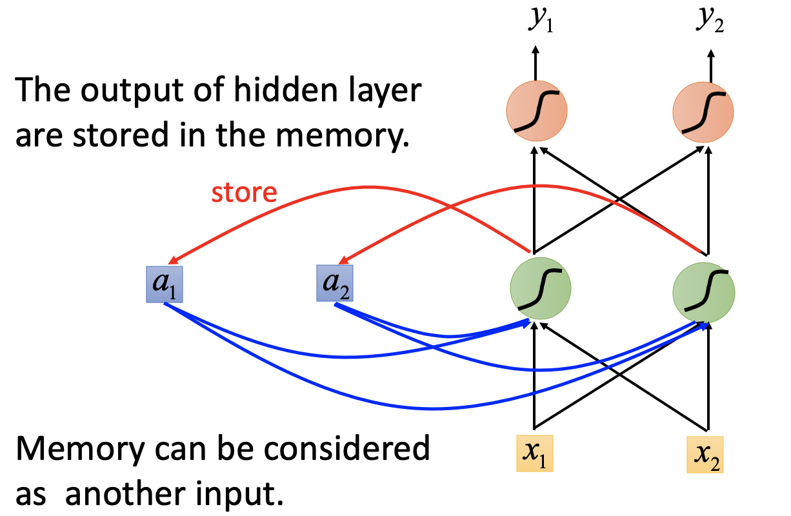

   - 假设右下图中：所有权重均为1，bias为0，所有的activation function均为Linear的，则对于图中的输入[1 1]，输出为[4 4]，隐层输出[2 2]被存储起来；下一组输入[1 1]，输出为[12 12]，隐层输出[6 6]被存储起来，以此类推。==需要注意的是，Input Sequence的顺序会影响Output Sequence的顺序。==

     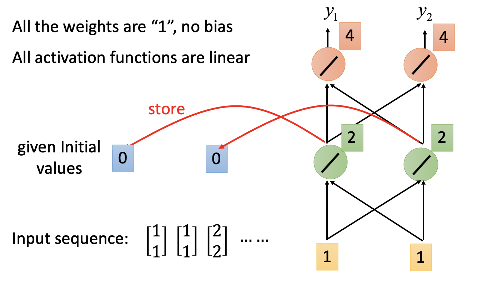

     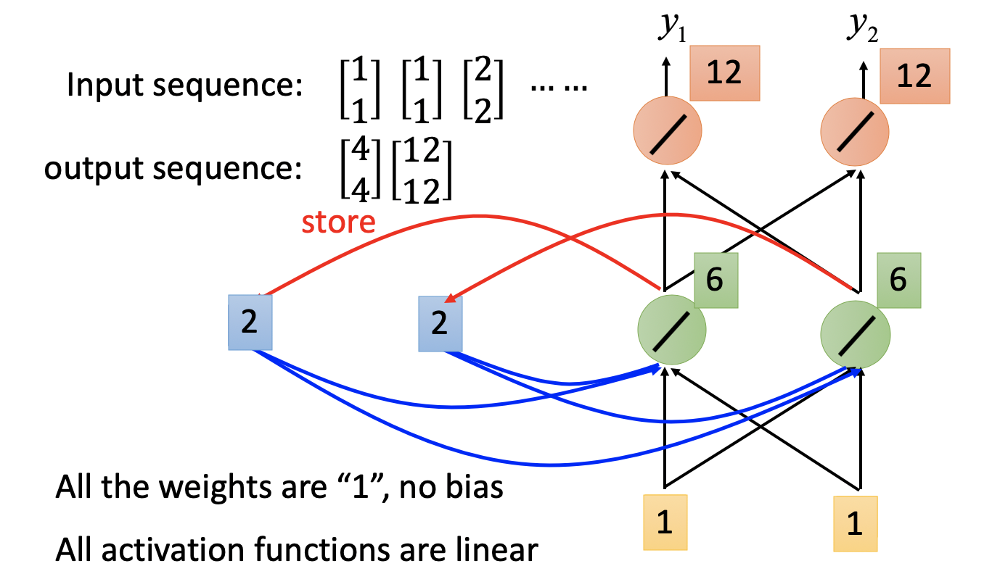

     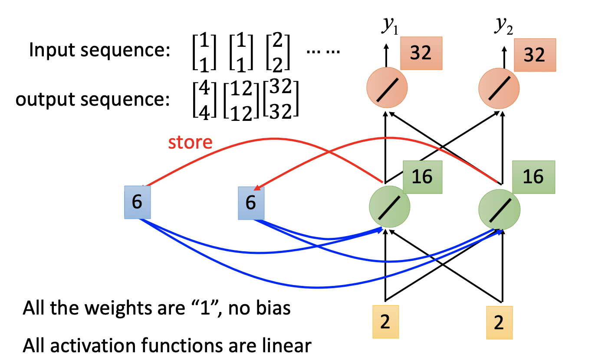

     

   - 上述隐层输出循环使用的过程，可以描述为下图。三次使用的网络结构是相同的，可以理解为不同时间点的snapshot。

     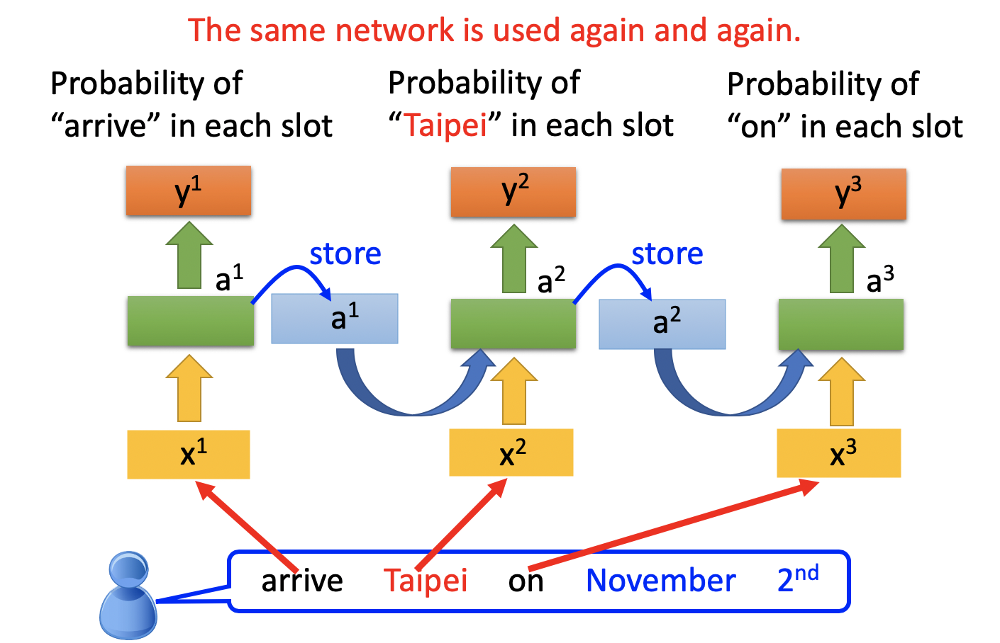

   - 循环神经网络通过“记忆”的方式可以实现上下文关联，如下图所示，leave和arrive作为输入后的隐层输出是不同的，该输出与“Taipei”共同作为输入产生的输出也会不同。

     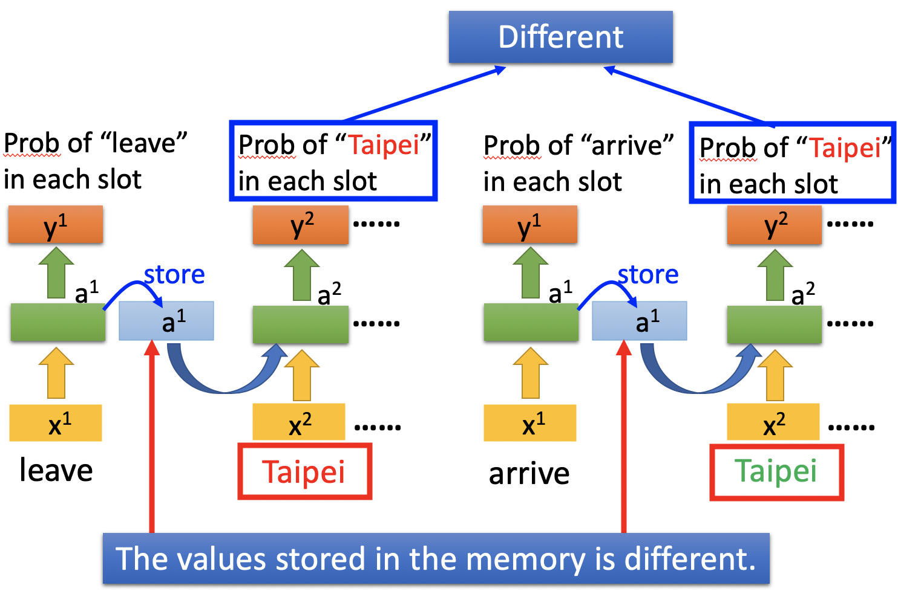

   - RNN也可以是“Deep”的，可以含有很多层hidden layer，t时刻隐层的输出会作为t+1时刻的隐层输入的一部分

     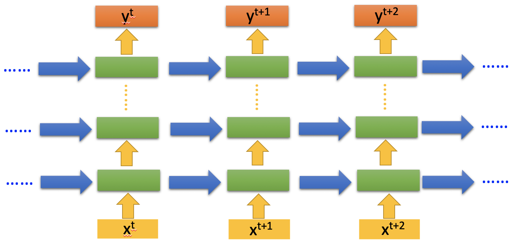

   - RNN有许多变种，包括“Elman Network”（将隐层输出存储起来）、“Jordan Network”（将输出层输出存储起来）、“Bidirectional RNN”（双向循环网络，将正向Input Sequence的隐层输出和逆向Input Sequence的输出合并送入输出层，该方法可以使得对上下文的关联程度更高，因为$x_{t+1}$受正向序列$x_1→x_t$和逆向序列$x_N→x_{t+2}$的共同影响）

     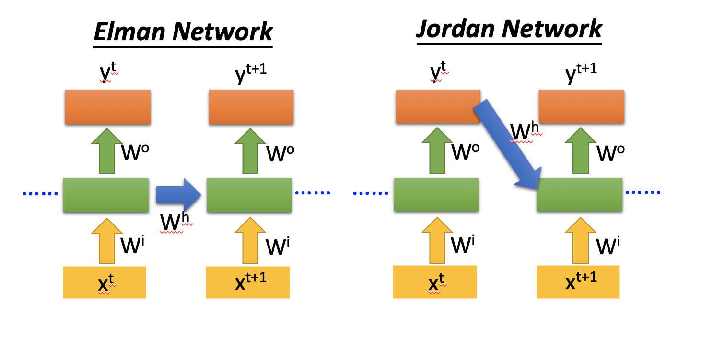

     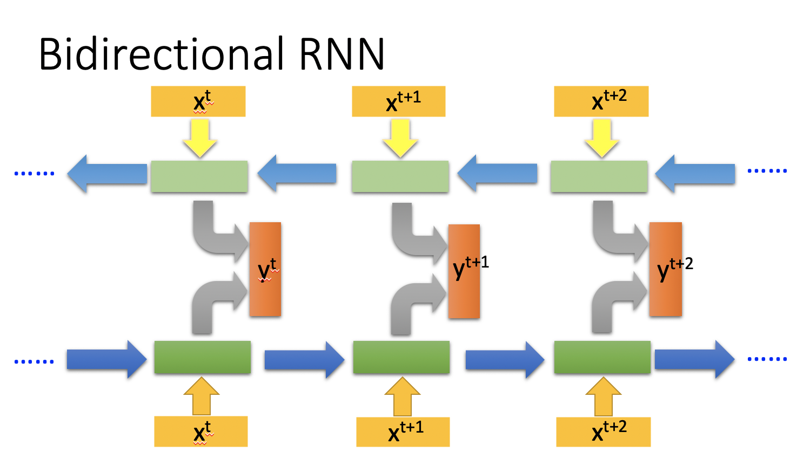

#### 2.Long Short-term Memory（LSTM） 

1. Long Short-term Memory Cell结构 

   - LSTM Cell结构主要包括Input Gate（控制神经网络的其他部分是否可以将变量写入memory cell中，input gate的打开与关闭可以由网络自主学习）、Output Gate（控制神经网络的其他部分是否可以读取memory cell中的变量，output gate的打开与关闭可以由网络自主学习）、Forget Gate（控制memory cell是否继续保留或者是遗忘掉memory cell中的值），因此RNN中的special neuron包含4个inputs（3个control signal和真正的input）和一个output

     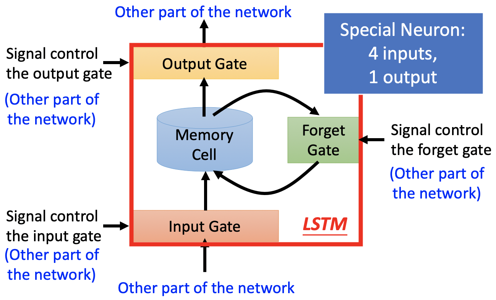

   - 假设此时神经元中的memory存储的是$c$，外接的输入为$Z$，Input Gate为$Z_i$，Output Gate为$Z_o$，Forget Gate为$Z_f$，神经元的输出为$a$；所有Gate的activation function（$f(Z_i),f(Z_f),f(Z_o)$）通常为sigmoid function，因为其输出在0~1之间，可以代表该门控的打开与关闭。实际的计算过程为：①计算$g(Z)f(Z_i)$；②读取$c$，并与$f(Z_f)$相乘得到$cf(Z_f)$；③计算$c'=g(Z)f(Z_i)+cf(Z_f)$，$f(Z_i)$控制是否使用输入参与到运算中，$f(Z_f)$控制是否使用原有的记忆值$c$，其打开时表示记忆，关闭时表示遗忘，然后将$c'$更新到memory cell中；④计算输出$a=h(c')f(z_o)$

     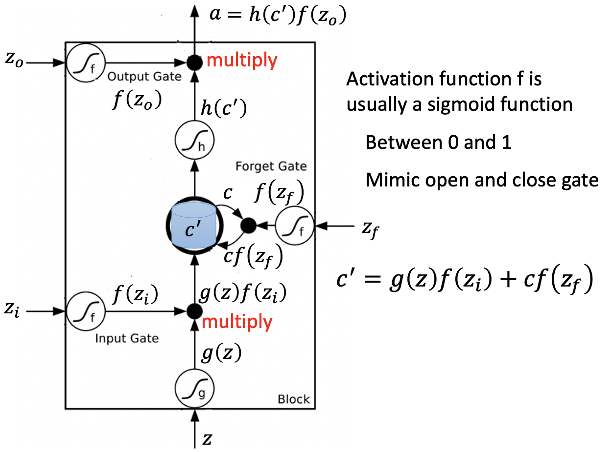

   - Example - 网络中只有一个LSTM Cell，Input为3维的Vector，Output为1维的Vector。当Input的第二个维度为$x_2=1$时，$x_1$被写入memory cell；当$x_2=-1$时，重置memory cell；当$x_3=1$时，输出memory cell中的值

     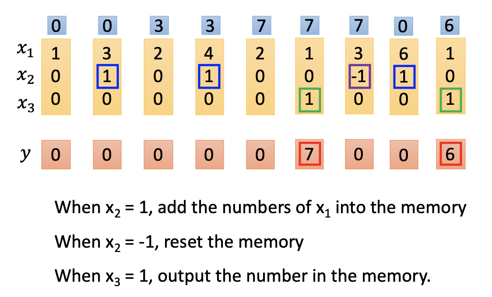

   - Example - 下图网络中有四个scalar input，假设网络的weights和bias已经通过训练学习到了，memory cell中的初始值为0，如下如所示 。

     

   - Example - 第一组输入为[3 1 0]，则Input Gate打开、Forget Gate打开，Output Gate关闭，memory cell中值更新为$0*1+3 = 3$，输出值为0；

     ​				  第二组输入为[4 1 0]，则Input Gate打开、Forget Gate打开，Output Gate关闭，memory cell中值更新为$3*1+4=7$，输出值为0；

     ​				  第三组输入为[2 0 0]，则Input Gate关闭、Forget Gate打开、Output Gate关闭，memory cell中值更新为$7*1+0=7$，输出值为0；

     ​				  第四组输入为[1 0 1]，则Input Gate关闭、Forget Gate打开、Output Gate打开，memory cell中值更新为$7*1+0=7$，输出值为7；

     ​				  第四组输入为[3 -1 0]，则Input Gate关闭、Forget Gate关闭、Output Gate关闭，memory cell中值更新为$7*0+0=0$，输出值为0；

     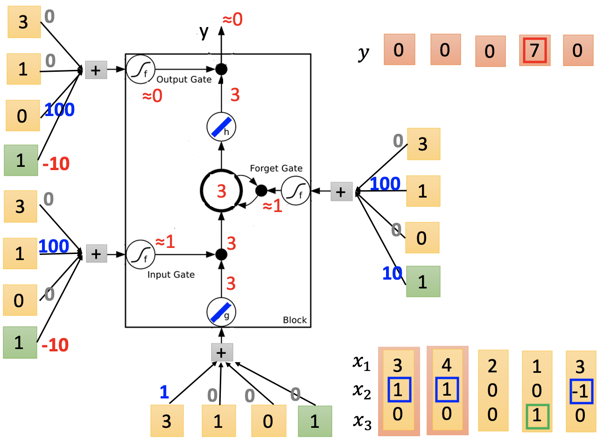          

     

     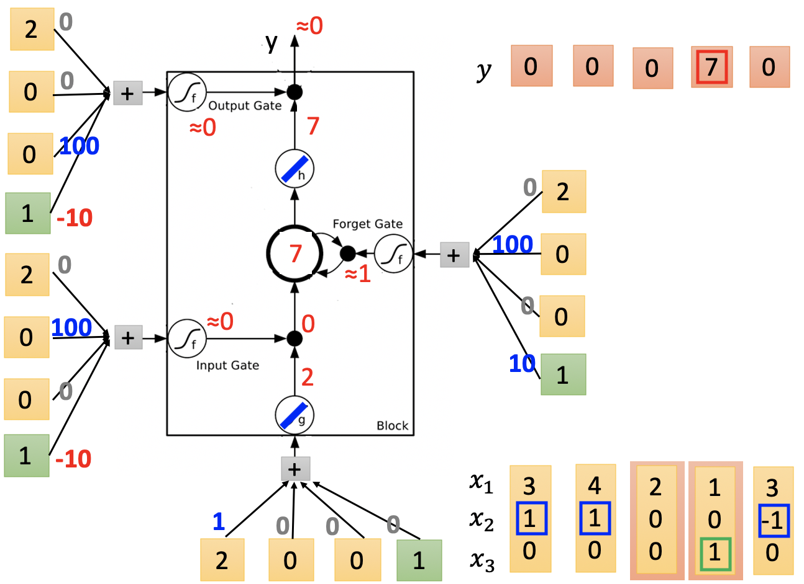          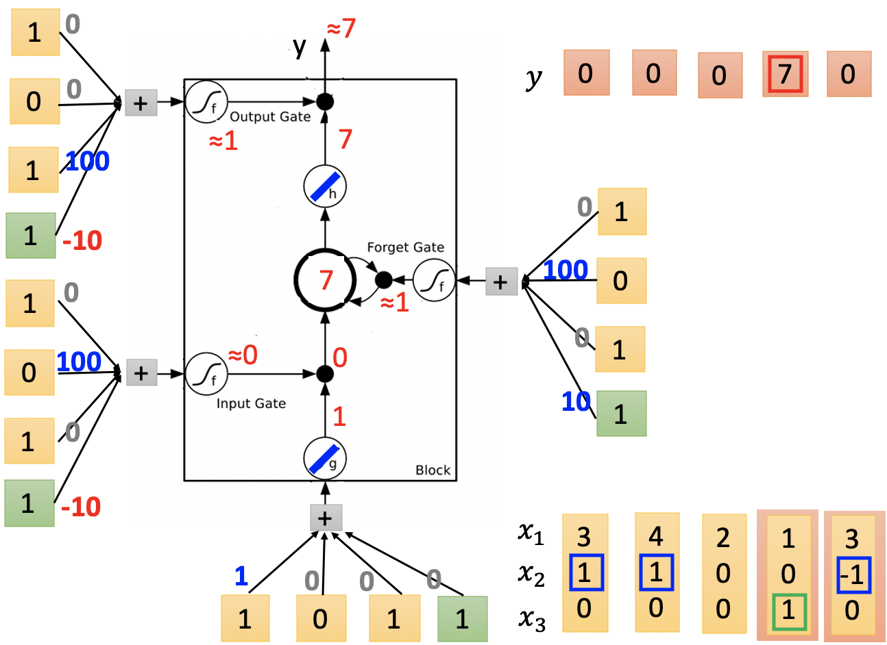

     

     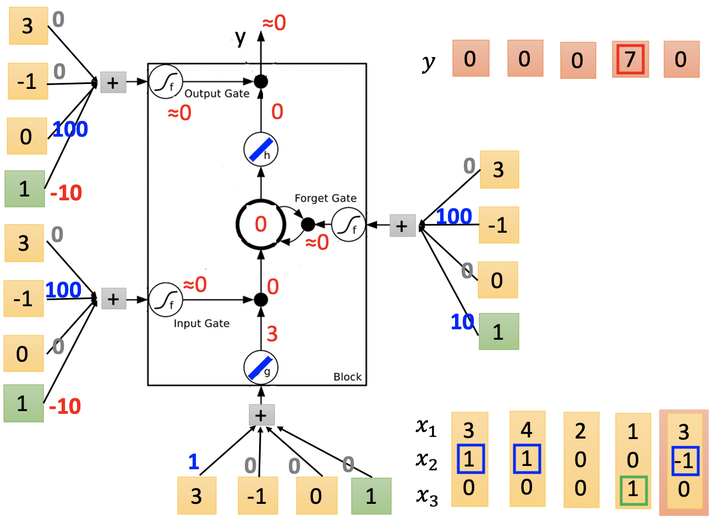

     

2. LSTM Cell的串联与叠加 

   - ==Long Short-term Memory Cell（四个Inputs和一个Output）相当于Deep Neural Network中的Neuron（一个Input和一个Output）；当神经元数目相同时，LSTM的参数是DNN的4倍==

     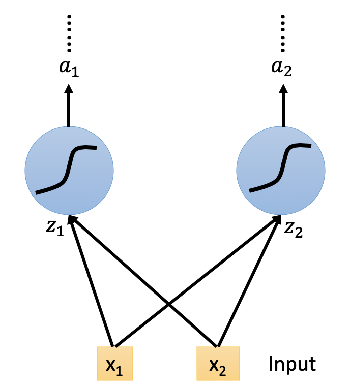          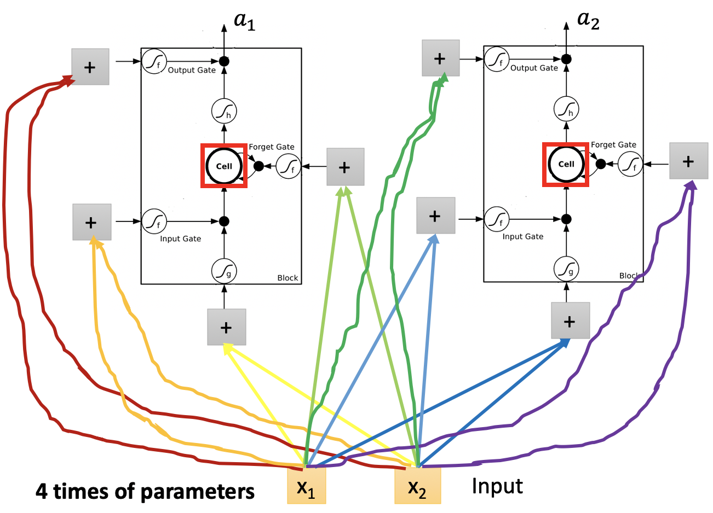

   - 将多个LSTM Cell串联在一起，所有memory cell中存储的scalar组合成$c^{t-1}$。在时间点$t$输入向量$x^t$，该向量分别与Transform Vector $z$（$z$的维度与Cell的数量相对应，每一个维度控制一个LSTM的输入）、Transform Vector $z^i$（$z^i$的维度与Cell的数量相对应，每一个维度控制一个LSTM的Input Gate）、Transform Vector $z^f$（$z^f$的维度与Cell的数量相对应，每一个维度控制一个LSTM的Forget Gate）、Transform Vector $z^o$（$z^o$的维度与Cell的数量相对应，每一个维度控制一个LSTM的Output Gate）相乘。$z、z^i、z^f、z^o$四个向量各自的第i个dimension共同作用，操控第i个LSTM Cell

     

   - $t$时刻具体的运算过程如下图所示：

     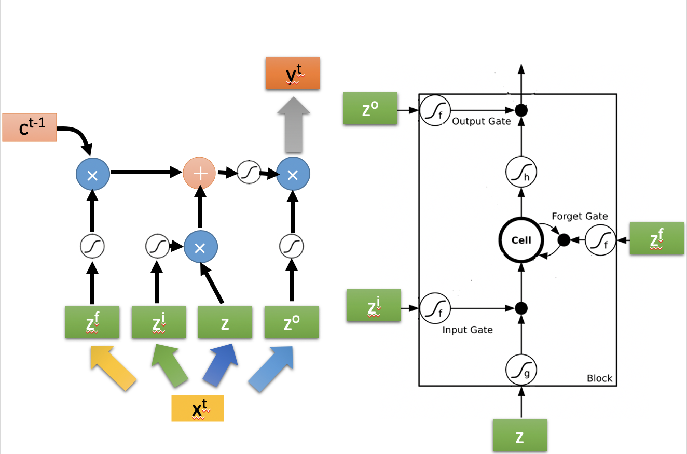

   - $t+1$时刻具体的运算过程如下图所示：需要注意的是 “真正的” LSTM会将$t$时刻的$c^t，h^t(=y^t)$与$x^{t+1}$组合成新的输入送入LSTM Cell

     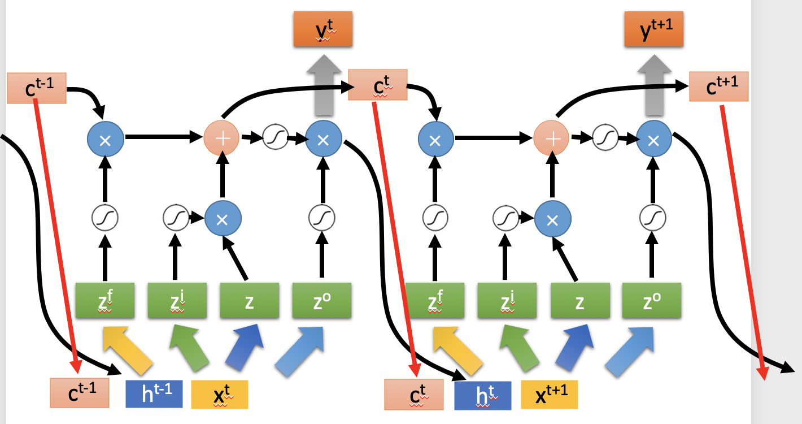

   - Multiple-layer LSTM的结构如下图所示，将横向串联的LSTM结构在纵向叠起来

     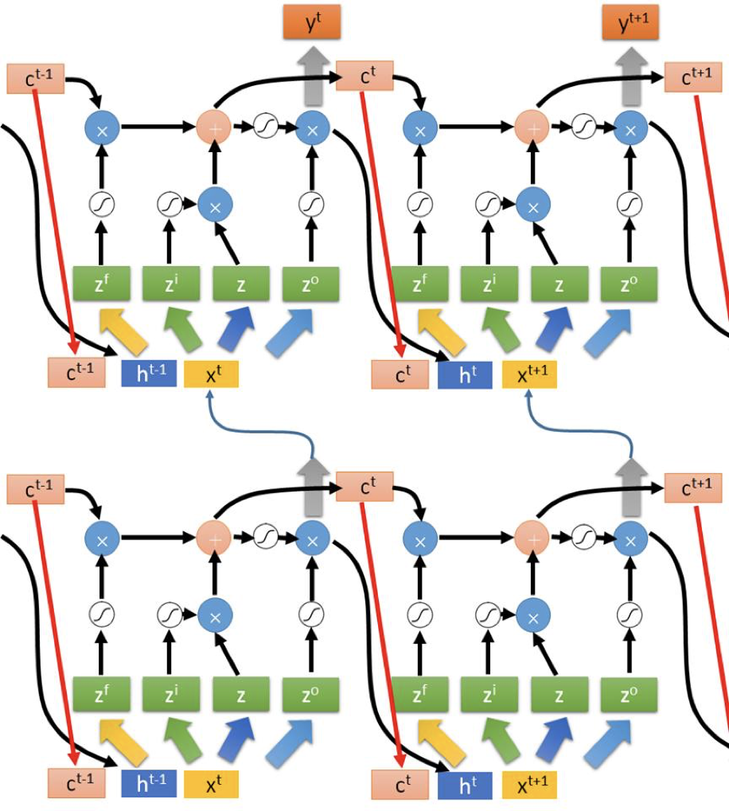

     

#### 3.RNN的学习过程和训练技巧 

1. RNN难以训练的原因 

   - LSTM Learning Target：以语义标注应用为例，给定一个句子如“arrive Taipei on November 2nd”，需要给出对应的语义为other-destination-other-time-time。将arrive输入到第一个LSTM Cell中，输出一个reference vector（其长度对应字典的长度，其中某一个维度为1，表示输入词arrive属于该语义），以此类推。一系列reference vector就是网络的learning target

     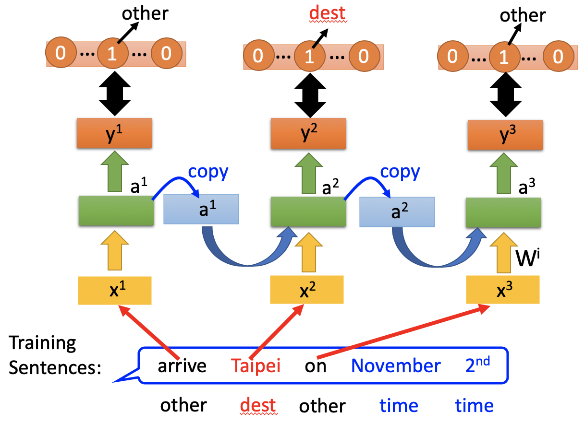

   - LSTM Training：确定好了learning target后，Loss Function就是所有reference vectors的cross entropy，网络的训练方式就是Backpropagation through time（BPTT，核心原理同样是Gradient Descent）

     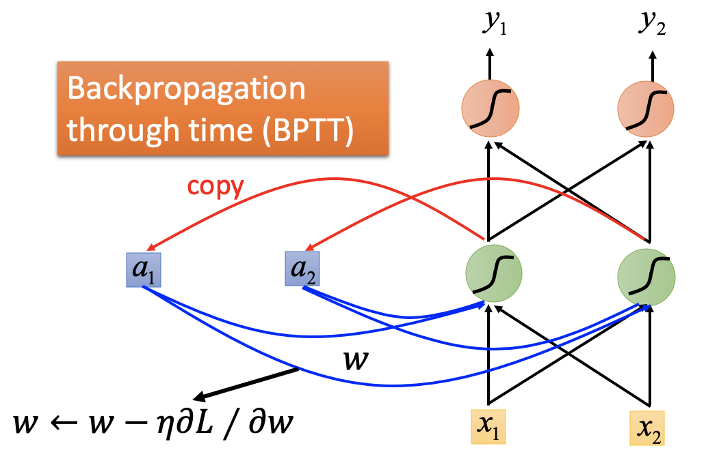

   - 基于经验可知，RNN-based Network的训练并不容易，如下图的绿线所示，其total loss抖动很厉害。

     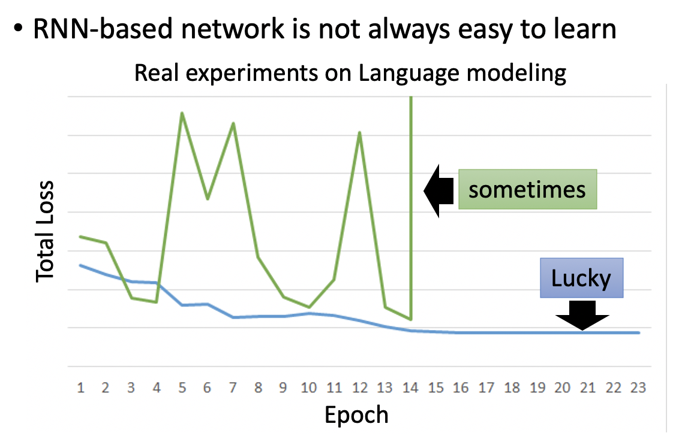

   - 针对于不易训练的特点，Razvan Pascanu提出：RNN中error surface（total loss对于参数的变化情况）是非常崎岖的，一些地方非常平坦，一些地方非常陡峭。假设训练过程中碰到了截断面，就会造成total loss忽高忽低。最初的解决方案是Clipping，即设定一个阈值，当梯度大于该阈值时就令梯度等于该值，如下图中黄色点到绿色点的变化就是Clipping。

     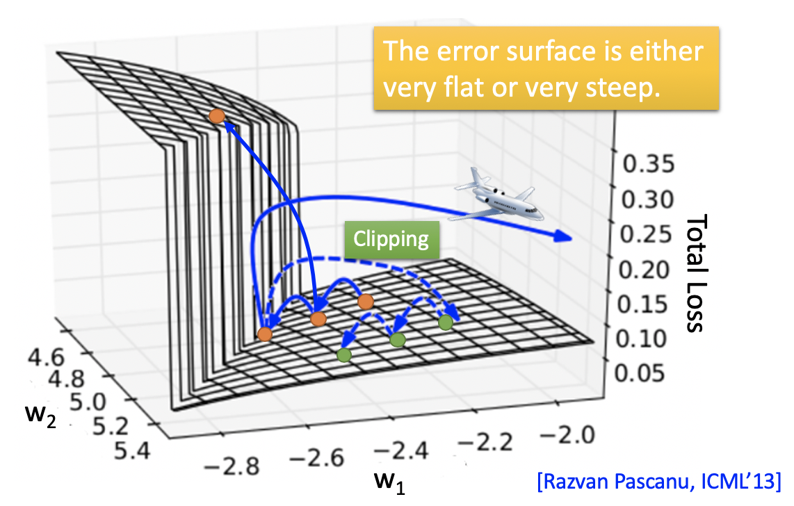

   - 按照下图构造一个简单的一层RNN，输入和输出权重均为1，中间变量的传递权重为$w$，则$y^{1000}=w^{999}$，当$w=1$时，$y^{1000}=1$；当$w=1.01$时，$y^{1000}\approx 20000$；此时$\frac{\partial L}{\partial w}$很大，需要一个小的learning rate。当$w=0.99$时，$y^{1000}\approx0$；当$w=$时，$y^{0.01}\approx 0$；此时$\frac{\partial L}{\partial w}$很小，需要一个大的learning rate。该例子可以说明在$w$取不同值时，会对梯度值产生巨大的影响。所以RNN难以训练的原因不是因为Activation的选取，而是参数在不同时间点被反复的使用。

     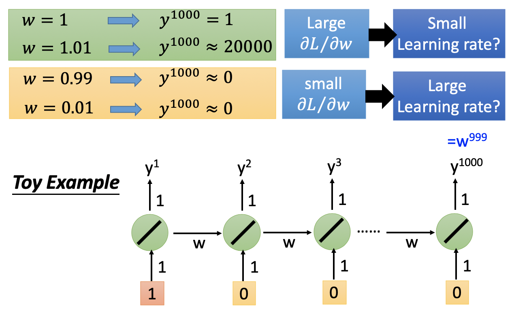

2. RNN的训练技巧 

   - 使用LSTM Cell结构，可以解决Gradient Vanishing问题（即去除error surface中特别平坦的部分），但无法解决Gradient Explode问题，因此可以将learning rate设置的小一些进行训练。在RNN中，memory cell中的值会不断地被更新，而LSTM中memory cell的值和input是相加的。假设某一个参数对memory cell中的值产生了影响，只要改Cell的Forget Gate始终打开，该影响就会一直持续下去；而在RNN中，一个参数对memory cell的值产生影响，一旦该Cell被上一个Cell的输出值更新后，该影响就消失了。所以在LSTM中不会出现梯度消失的问题，即参数对训练过程始终产生影响。在LSTM第一个版本提出时，为了解决Gradient Vanishing的问题，是没有Forget Gate的。Forget Gate加入后，一般的训练过程中，也不需要给Forget Gate过大的bias，保证Forget Gate在大多数情况下都是开启的。

     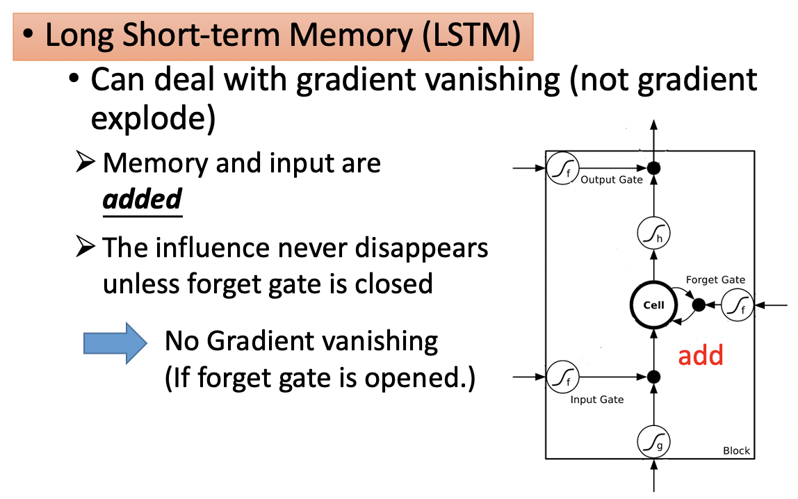

   - 使用Gated Recurrent Unit（GRU），相比LSTM少了一个Gate，少了一些参数，更易于训练。其核心宗旨为 “旧的不去，新的不来”

   - 使用其他RNN变种，如下图所示：

     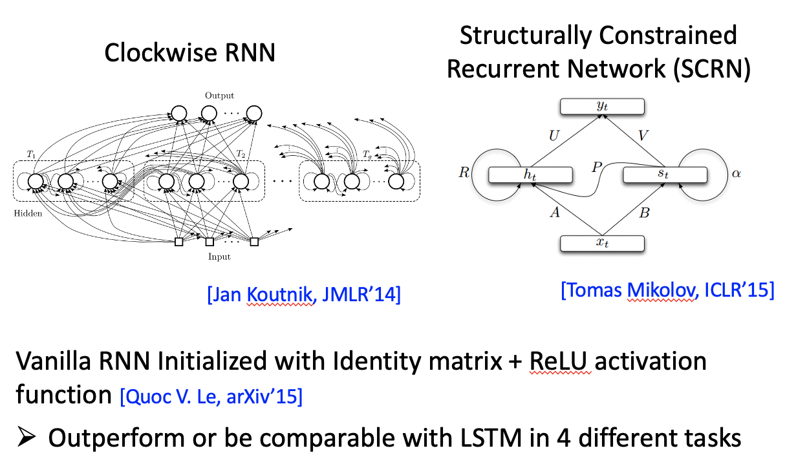

   - 对于RNN，如果使用随机初始化权重的方式，使用Sigmoid Activation Function的效果更好；如果使用Identity Matrix初始化权重的方式，使用ReLU Activation Function的效果更好

     

#### 4.RNN Application 

1. Sentiment Analysis（Many to One）：Input是一个vector sequence，输出是一个vector。 

   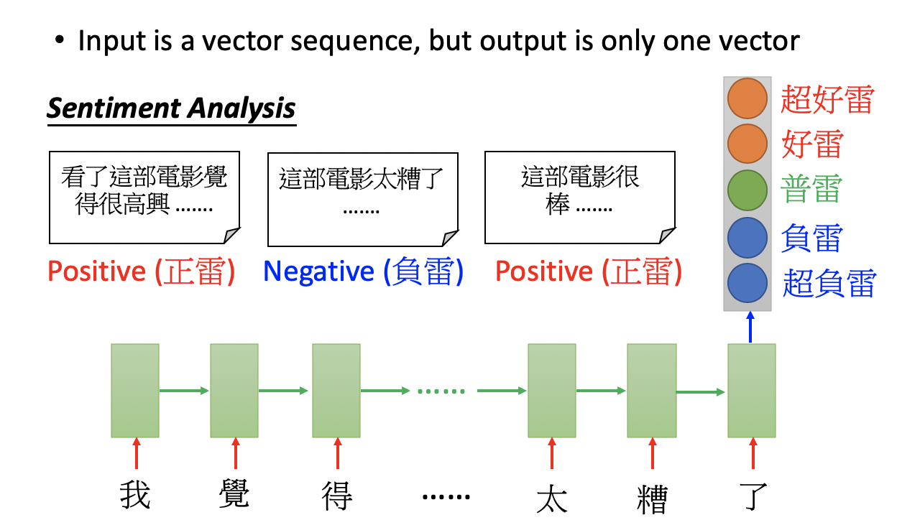

2. Key Term Extraction（Many to One）：将文档数据集的words经过Embedding Layer，送入RNN中，将最后一个Output做Attention，得到最后的Output。 

   

3. Speech Recognizition（Many to Many）：Input（Vector Sequence，一段声音讯号）和Output（Character Sequence）都是Sequence，但是Output会更短一些。例如，一段语音序列作为输入，经过识别后可以得出其对应的字符 “好好好棒棒棒棒棒”，经过Trimming裁剪后得到最终的输出 “好棒”。在实际语境中“好棒”为褒义的，而“好棒棒”为讽刺性的，为了将二者区分开，每输出一个完整的字符后，再输出一个$\phi$代表空字符（Connectionist Temporal Classification, CTC)，即可解决叠字的问题。 

   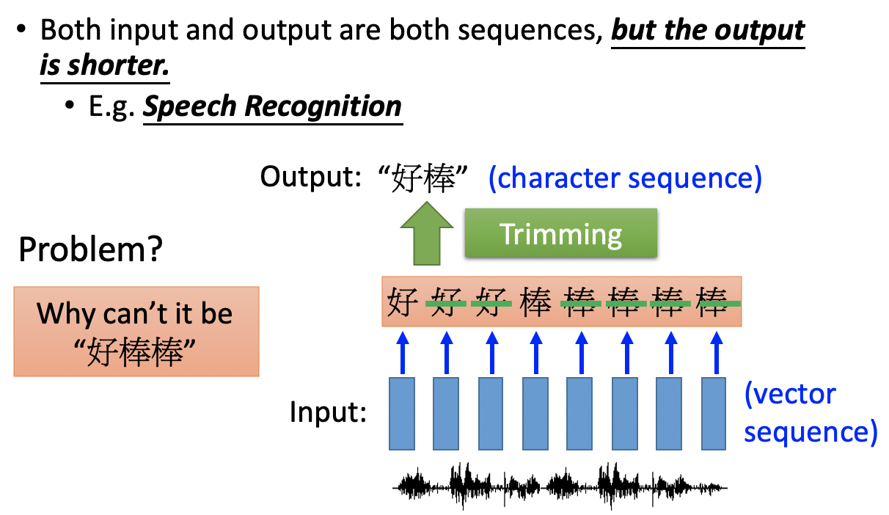

   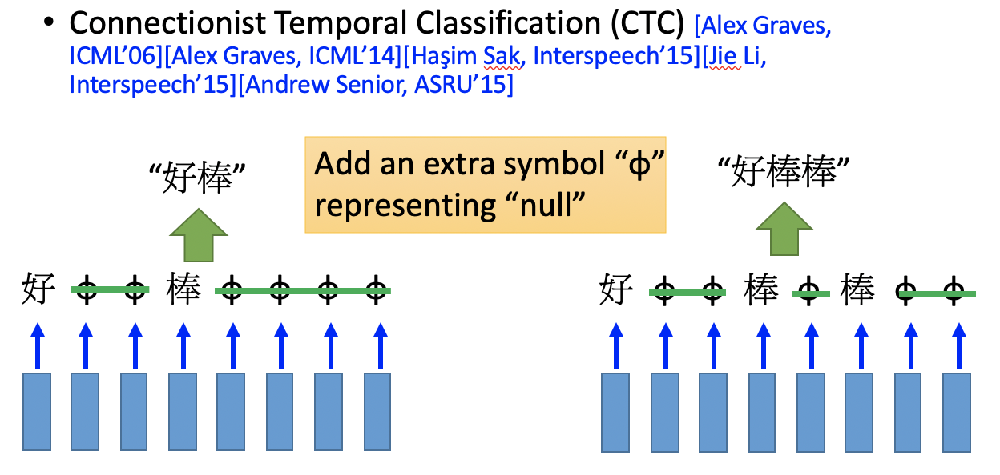

4. Machine Translation（Many to Many）：Sequence to Sequence Learning，Input和Output的长度没有具体的限制 

   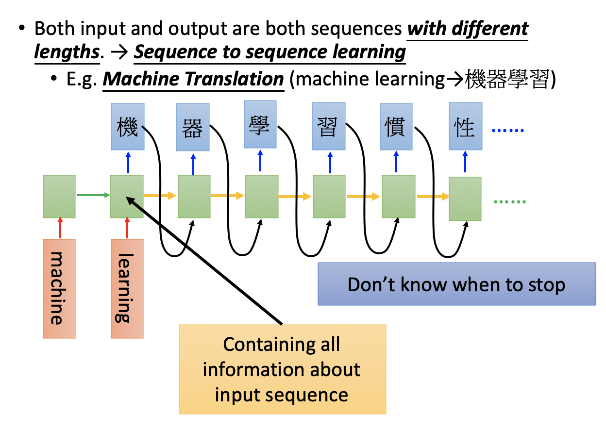

5. Machine Translation（Many to Many）：直接将一种语言的声音讯号作为网络输入，不需要语音识别，直接输出另一种语言的文字。 

   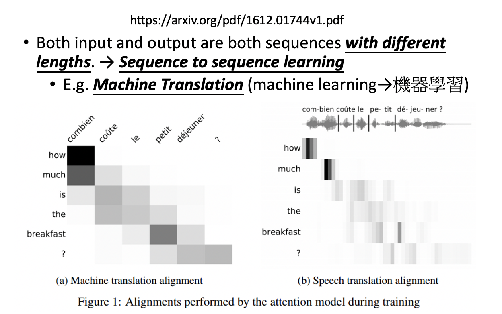

6. Syntactic Parsing（Beyond Sequence）：识别一个句子的文法结构树 

   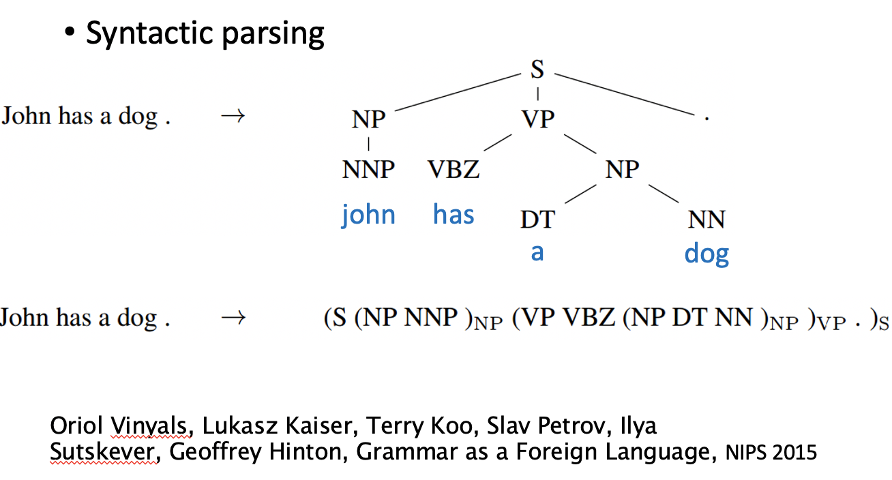

7. Sequence-to-Sequence Auto-encoder（Text） 

   - Bag of Word的缺陷：在理解一个Word Sequence的含义时，需要讲该Word Sequence转换为Vector，如果使用Bag of Vector的方法会失去Words的顺序信息，比如以下两句话的词袋表示是完全相同的，但两句话的意义却截然不同。

     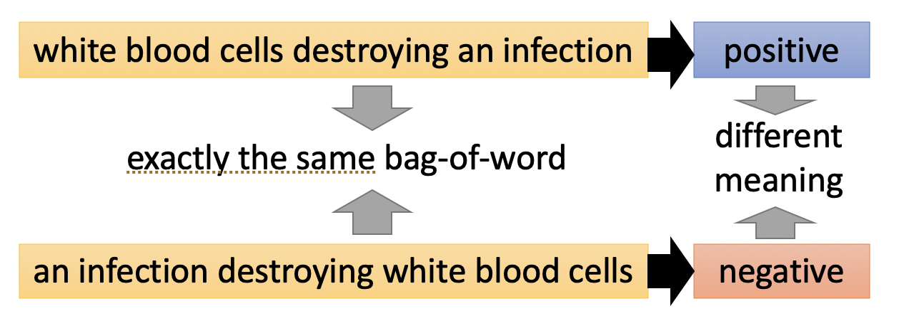

   - Sequence-to-Sequence Auto-encoder：将Words Sequence送入一个Encoder RNN，最后一个神经元的输出就是该序列的embedding vector，再将该Embedding Vector作为输入送入一个Decoder RNN，通过训练两个网络使得Decoder RNN能够输出最初的Words Sequence。那么，Encoder RNN输出的embedding vector就可以视为Words Sequence的编码结果。该模型的训练不需要label，只需要大量的文本文章即可

     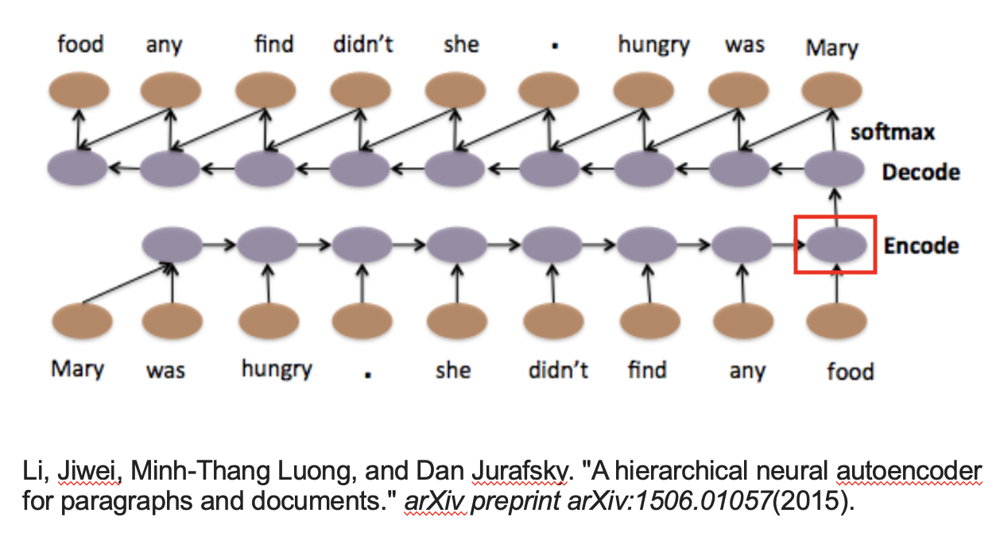

   - Hierarchy Sequence-to-Sequence Auto-encoder：Word 送入Ecode-Word，得到Word的表示。再送入Encode-Sequence，得到句子的表示；再送入Decode-Setence，得到Sentence的解码；再送入Decode-Word，得到Word的解码

     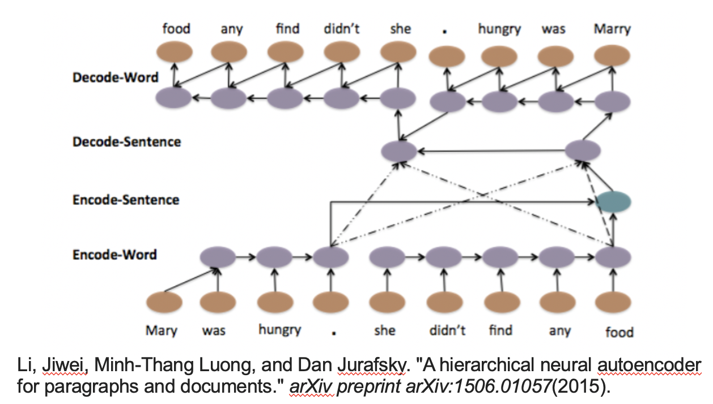

8. Sequence-to-Sequence Auto-encoder（Speech） 

   - 将audio segments（Word level）转换为Fixed-length Vector，dog和dogs较为接近，never和ever较为接近

     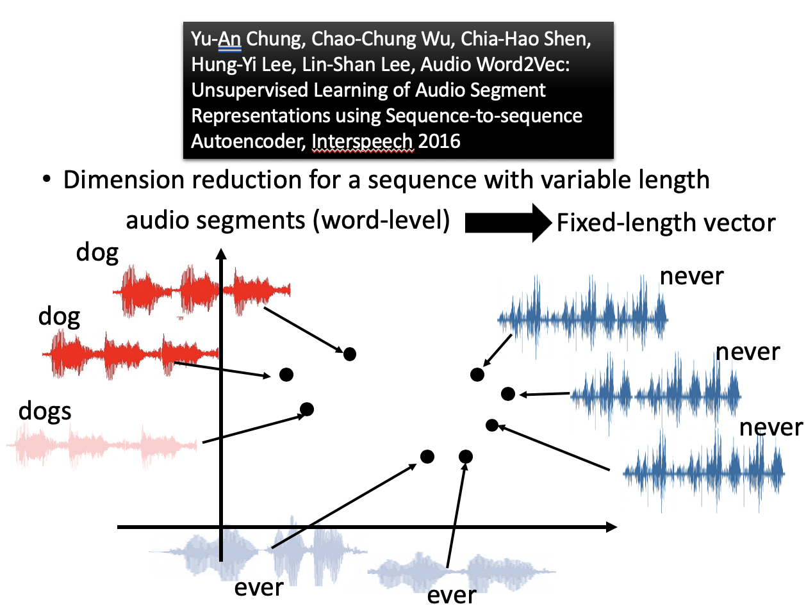

   - 该模型可以运用在语音搜索上，在off-line阶段将语音库内的所有音频通过Audio Segment to Vector技术转换为Vectors；在on-line阶段，拿到一个Spoken Query后，同样使用Audio Segment to Vector技术将其转换为Vectors。然后计算两个Vector的相似度，就可以得到搜索的结果

     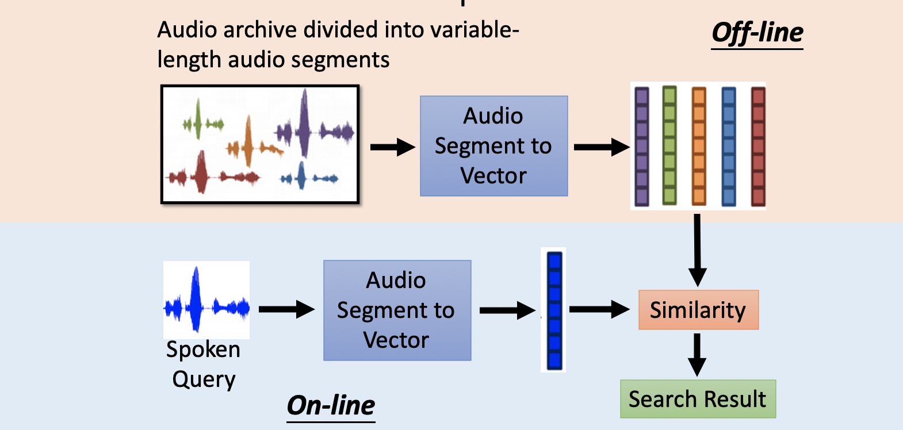

   - Audio Segment to Vector的大概流程为：抽取audio segment中的acoustic features，将其作为RNN Encoder的输入，RNN Encoder最后一个时间点的输出就可以代表该声音讯号。然后，将该输出送入RNN Decoder，得到输出$y_i$，目标是使得$y_i$和$x_i$尽可能的相同。需要补充的是，RNN Encoder和RNN Decoder是Joint Training的
   
     
   
   - Audio Segment to Vector的实验结果如下图所示，“fear”到“near”的vector和“fame”到“name”的vector是平行的
   
     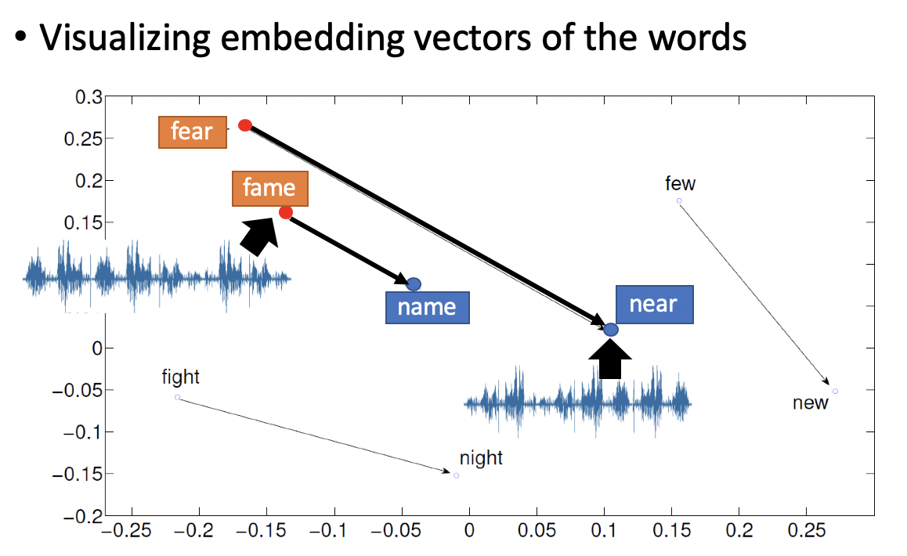
   
9. Chat-bot 

   - 收集电影台词和美国总统大选辩论作为数据集，利用Seq2Seq的技术训练聊天机器人
   
     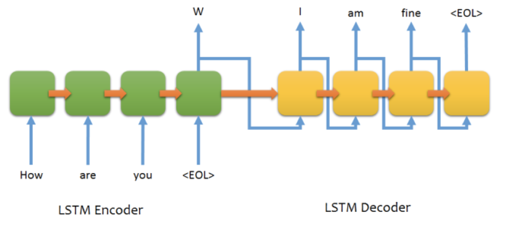
   
     

#### 5.Attention-based Model（Chapter 11会展开讲解Self-Attention的原理） 

1. Attention-based Model基本原理 

   - Attention-based Model的提出起源于人脑，因为人脑能够记忆很久很久以前的事情。在得到一条搜索指令时，大脑能够在众多记忆中快速的搜索，忽略其他无关的东西，将有用的东西组织起来并返回。Attention即为注意力，人脑在对于的不同部分的注意力是不同的。需要attention的原因是非常直观的，比如，我们期末考试的时候，我们需要老师划重点，划重点的目的就是为了尽量将我们的attention放在这部分的内容上，以期用最少的付出获取尽可能高的分数；再比如我们到一个新的班级，吸引我们attention的是颜值比较高的人。普通的模型可以看成所有部分的attention都是一样的，而这里的attention-based model对于不同的部分，重要的程度则不同。Attention-based Model其实就是一个相似性的度量，当前的输入与目标状态越相似，那么在当前的输入的权重就会越大，说明当前的输出越依赖于当前的输入。严格来说，Attention并算不上是一种新的model，而仅仅是在以往的模型中加入attention的思想，所以Attention-based Model或者Attention Mechanism是比较合理的叫法，而非Attention Model

     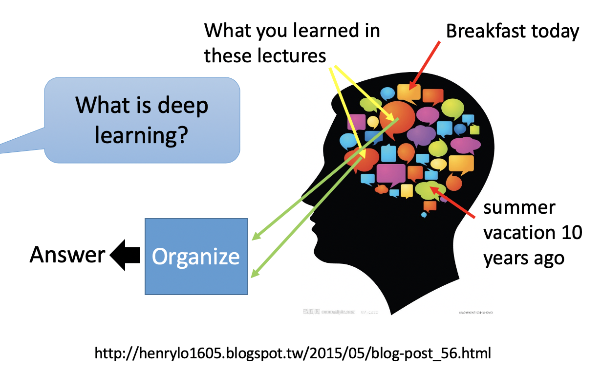

   - Computer也可以做到同样的效果，首先Computer可以拥有足够大的Memory容量。当输入一个Input时，被送入一个DNN/RNN。网络会操控一个Reading Head Controller，找到相应的Reading Head，从Reading Head处读取一些数据与Input进行联合运算，最终得到Output。

     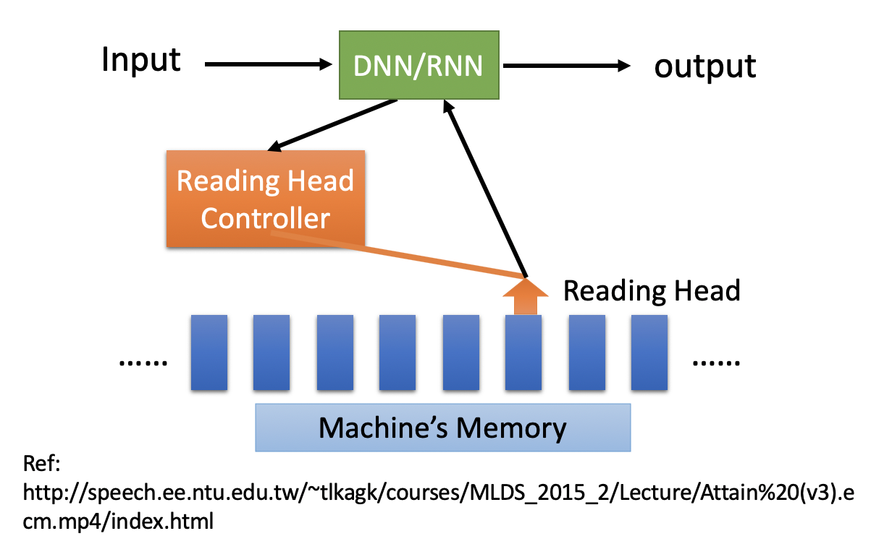

   - Attention-based Model（Version 2）不但可以从存储介质中读取，还可以通过Writing Head Controller将学习到的Knowledge写入存储介质中。该模型被称为Neural Turing Machine

     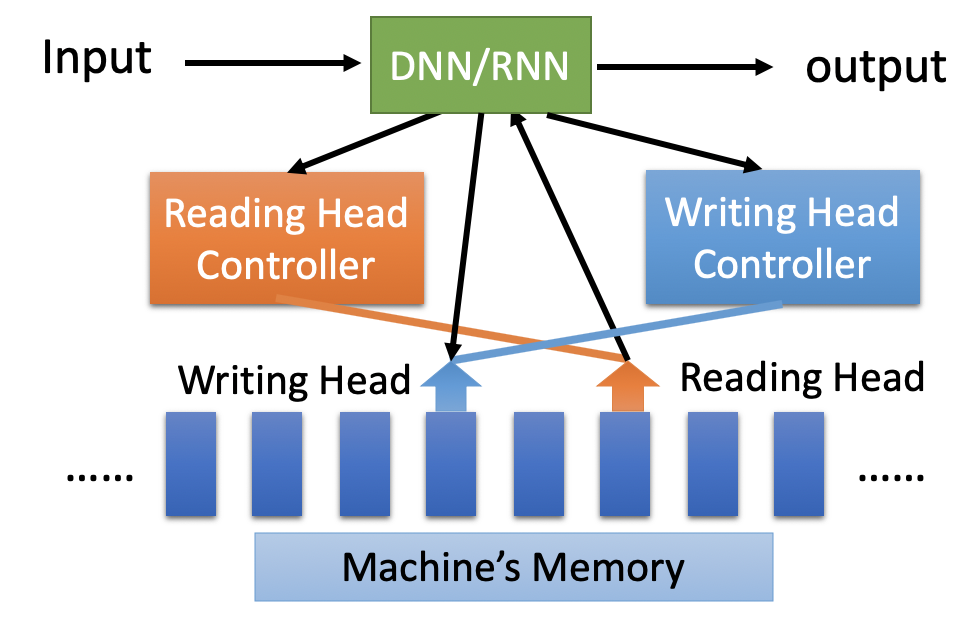

     

2. Attention-based Model Application 

   - Reading Comprehension：首先需要Computer读取大量的文档数据集，做Semantic Analysis，将文档中的每一个句子转换为一个Vector（代表该句话的语义），形成一个语义数据库。当开始一个query时，DNN/RNN就会通过Reading Head Controller在语义数据库搜索相关的数据，并将其读入DNN/RNN中参与运算（读取过程可以重复多次）

     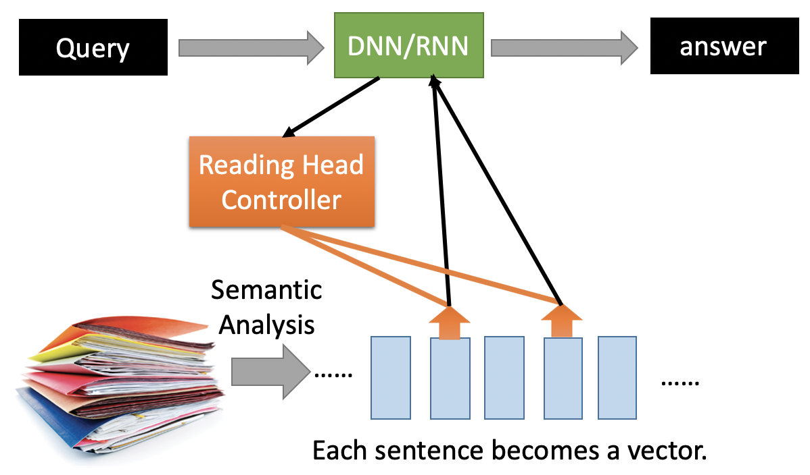

   - 下图是FaceBook关于Reading Comprehension的实验结果，实验的主要功能是一个Q&A系统。Hop表示时间轴，蓝色的标注表示Reading Head Controller所在的位置。右下图可知，当有一个问题 “What color is Greg？”时，机器通过学习，首先从大量的数据中先找到了“Greg is a forg.”，然后是“Brain is a frog.”，最后是“Brain is yellow.”，然后给出答案“Yellow”。

     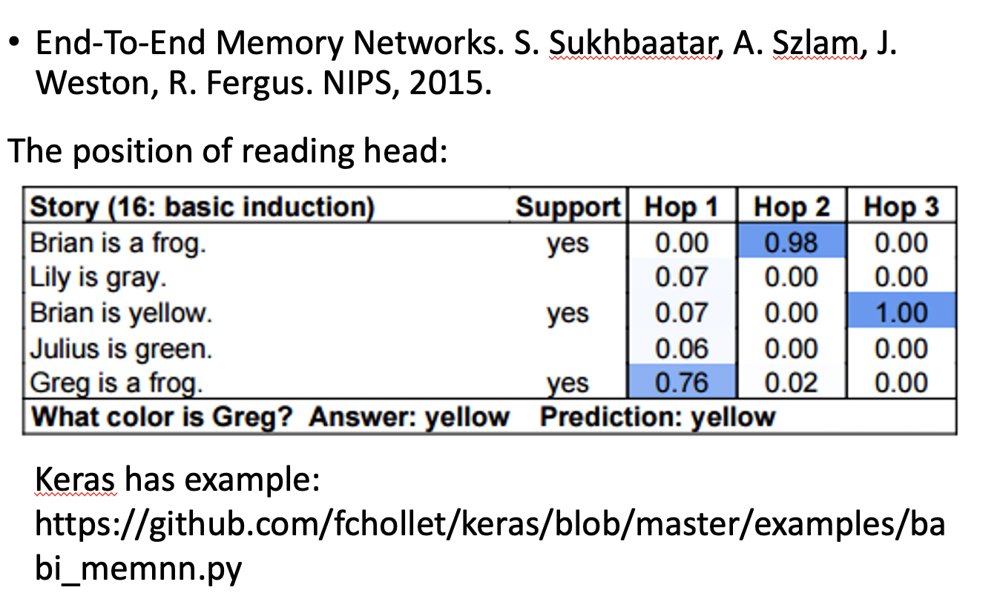

   - Visual Question Answering：识别一张图上的内容。首先将图片数据集通过CNN提取出大量的Region Representation Vector（用来表示图片的一部分）。当开始一个Query时，DNN/RNN通过Reading Head Controller读取相应的数据进行计算，得到Answer。

     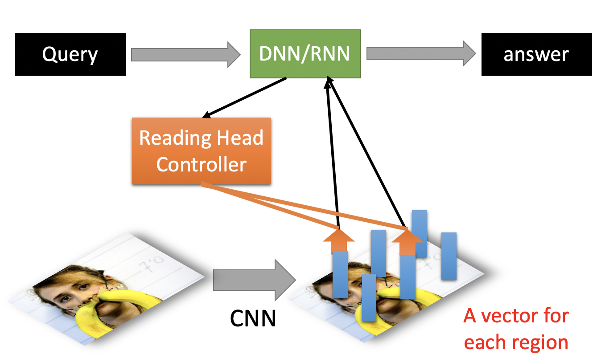

   - Speech Question Answering：模型架构如下图所示

     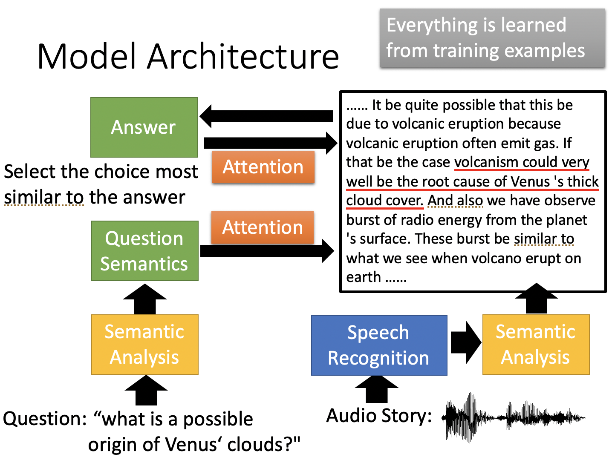

     

#### 6.Deep Learning VS. Structured Learning 

1. Deep Learning与Structured Learning的比较 

   - Undirectional RNN无法观察整个句子，Viterbi algorithm能够观察整个句子，但是该部分不足可以由Bidirectional RNN解决；

   - Viterbi algorithm可以显示的将label之间的依赖关系加入算法中，而RNN不可以；

   - 在RNN中Cost Function和Error往往是无关的，在Structured Learning中Cost一般是Error的上界

   - RNN可以是Deep的，但是Structured Learning一般是Linear的，做Deep的方式比较困难

     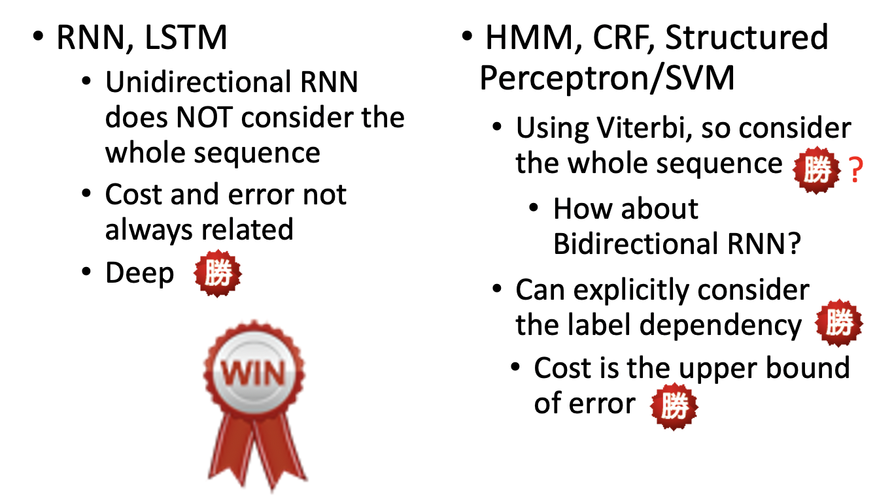

     

2. Integrating Deep Learning and Structured Learning 

   - Input Feature送入RNN/LSTM，得到其输出后再作为输入送入Structured Learning Model。这样可以兼具Deep和Structured Learning的优点

     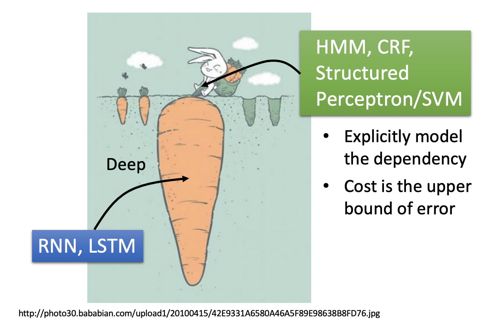

   - CNN/LSTM/DNN + HMM（Hybrid System）在Speech Recognition领域有着广泛的应用，而且能够达到state of art的效果。单独使用RNN解决Speech Recognition常常会出现一些问题，因为RNN产生每一个label时是Independent，所以识别结果中可能会出现一段连续的字符中突兀的出现一个其他字符的现象，HMM和RNN结合起来，可以解决这个问题。因为在传统HMM中，$x_l$表示语音讯号，$y_l$表示语音辨识的结果，需要计算的是两者的Joint Probability $P(x,y)=P(y_1|start) \prod_{l=1}^{l-1}P(y_{l+1}|y_l)P(end|y_L)\prod_{l=1}^L P(x_l|y_l)$。HMM中有transition和emission两个部分，该方法就是用DNN取代了emission的部分。传统的emission部分就是统计Gaussion Model，即$\prod_{l=1}^L P(x_l|y_l)$。使用RNN可以得到一个acoustic feature $x_l$属于每一个state的概率，即$P(a|x_l)、P(b|x_l)、P(c|x_l)$等等，经过转换$P(x_l|y_l)=\frac{P(x_l,y_l)}{P(y_l)}=\frac{P(y_l,x_l)P(x_l)}{P(y_l)}$，其中$P(y_l,x_l)$由RNN计算得出；$P(x_l)$可以忽略，因为最终需要在所有$y$中寻找一个特定的值，使得$P(x,y)$的最大值，此时$x$作为输出，不产生任何影响；$P(y_l)$可以通过统计得出。

     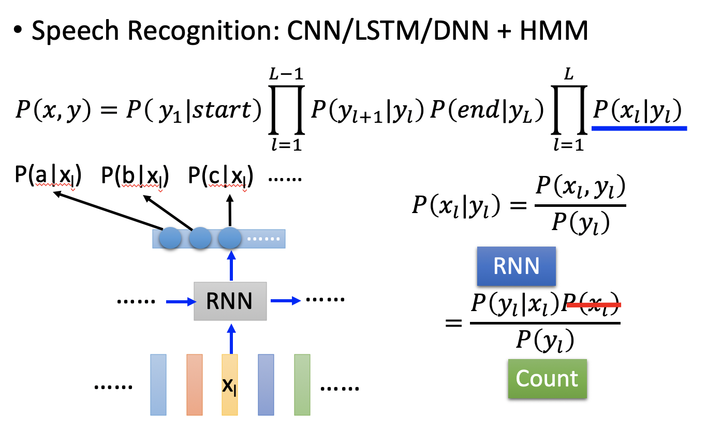

   - Bi-directional LSTM + CRF/Structured SVM在Semantic Tagging领域可以做到较好的效果。

     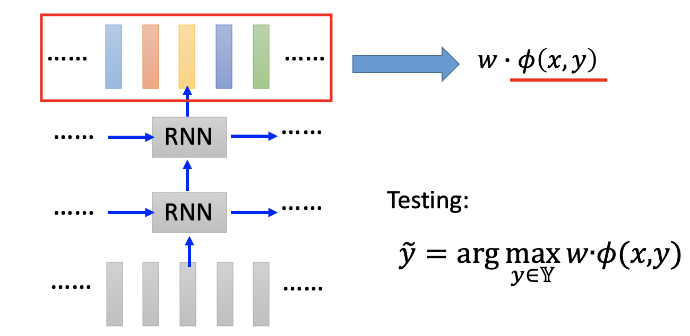

     

3. Structured Learning的本质 

   - Structured Learning与GAN的相似之处，GAN中的Discriminator相当于Evaluation Function，Generator相当于Inference。

     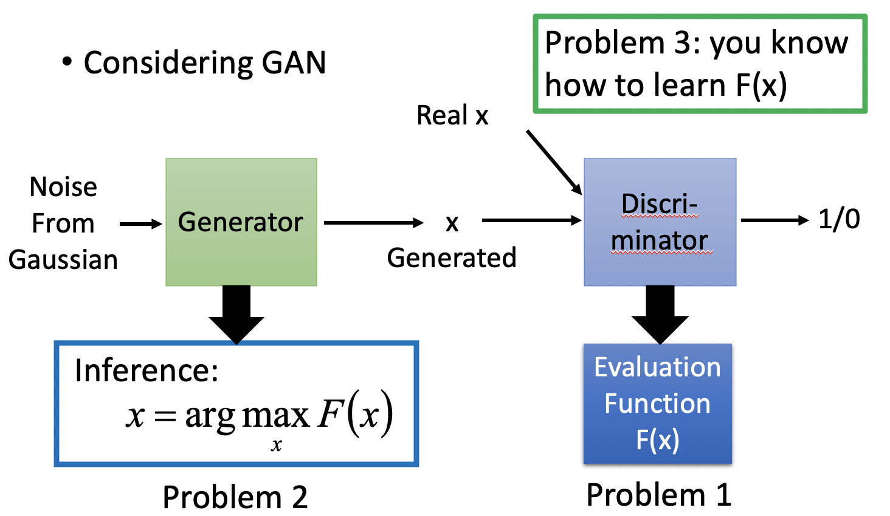

   - Deep and Structured will be the future.