# Chapter 10 - Unsupervised Learning (Word Embedding)

[1.Word Encoding的基本方法](#1)

​		[1.1 1-of-N Encoding](#1.1)

​		[1.2 Context在Embedding中的作用](#1.2)

​		[1.3 Count-based Embedding（Glove Vector）](#1.3)

​		[1.4 Prediction-based Embedding（基本原理、CBOW变式、Skip gram变式）](#1.4)

[2.Word Embedding Demo](#2)

​		[2.1 Word Embedding Vector蕴含的信息](#2.1)

​		[2.2 Multi-domain Embedding](#2.2)

​		[2.3 Document Embedding](#2.3)

#### 1.Word Encoding的基本方法

1. 1-of-N Encoding

   - Word Encoding是计算机理解人类语言的第一步，如何对文字进行编码决定了最后Performance的好与坏。Word Embedding最基本的方法就是 “1-of-N Encoding”，假设存在一个有序字典集合，其大小为N，则每一个单词对应一个长度为N的Vector，该词所在字典位置对应的值为1，其余均为0。这种编码方式导致每个词的编码都是独立的，无法包含词与词之间的关联信息。例如，无法表示单词所属的类别。解决该问题的方法就是Word Embedding（将Word映射到一个High Dimensions Space进行表示），映射后的高维向量表示能够蕴含一些额外的信息，比如“动作”和“生物”之间存在差异，且该差异大于“动物”和“植物”之间的差异。

     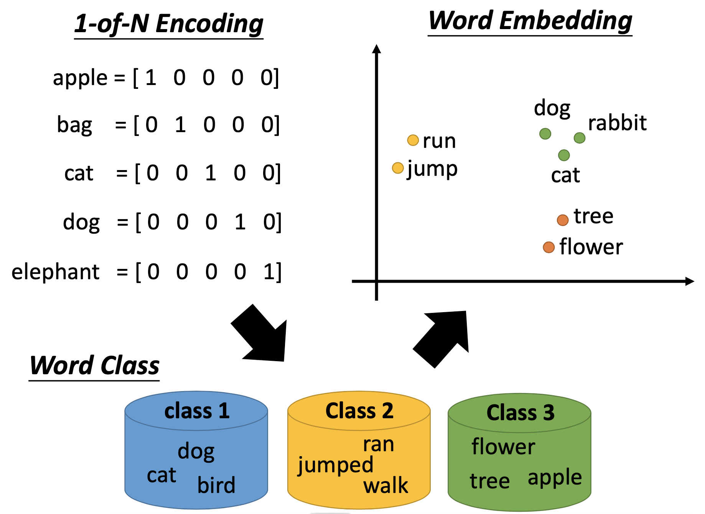

   - 将文字编码为Vector是Unspuervised Learning。该问题是没办法用上一节RNN Auto-encoder解决，因为Word Embedding过程中Word之间是独立的，没有任何联系，而RNN Auto-Encoder的输入是一个Sentence Sequence，打破了Word之间的独立限制。

     

2. Context在Embedding中的作用

   - 每一个词汇的含义可以从该词所在的上下文得出。例如，机器通过大量的阅读“马英九宣誓就职”和“蔡英文宣誓就职”两句话，虽然机器无法理解马英九和蔡英文是谁，但是机器可以学习到“马英九”和“蔡英文”两个词汇有一定的相似性，且可能代表着有地位的人物。

     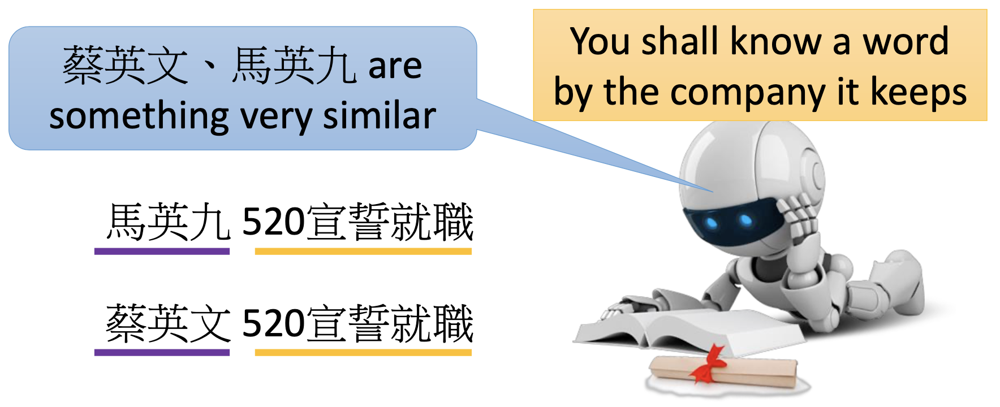

     

3. Count-based Embedding（Glove Vector）

   - 如果两个词汇$w_i$和$w_j$共同出现的频率很高，那么其embedding vector $V(w_i)$和$V(w_j)$应该比较相似。此时，两个向量的內积$V(w_i)·V(w_j)$应该与$w_i$和$w_j$在一篇文档中共同出现的次数$N_{i,j}$越接近越好。

     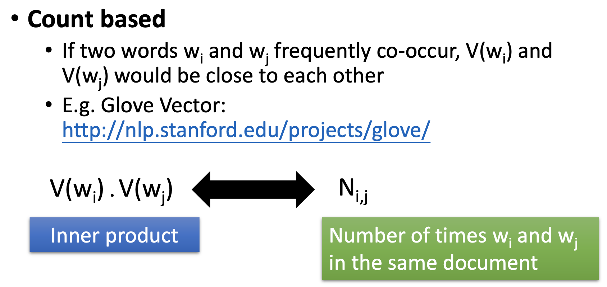

     

4. Prediction-based Embedding（基本原理、CBOW变式、Skip gram变式）

   - 首先需要训练一个神经网络，其目标是在已知Word $w_{i-1}$时，预测下一个可能出现的Word $w_i$是谁。神经网络的输入是$w_{i-1}$的1-of-N Encoding，输出是每一个单词作为$w_i$出现的概率，输入和输出的大小都是字典长度。使用第一层Hidden Layer的输入$Z_i$表示词汇$w_{i-1}$的embedding vector，不同词汇的1-of-N Encoding编码作为输入，也会得到不同的隐层输入$Z_i$

     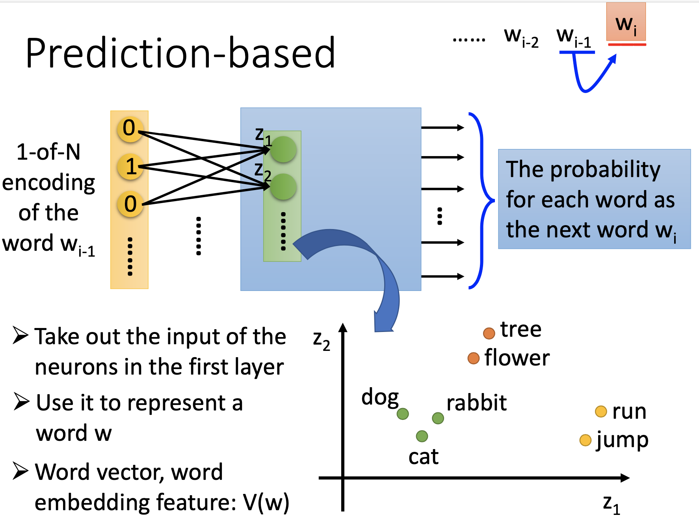

   - 假设Training text包括“蔡英文宣誓就职”和“马英九宣誓就职”，Prediction-based Embedding能够生效的原因在于，将“蔡英文”或“马英九”作为网络的输入，训练过的网络都希望“宣誓就职”是接下来最高概率出现的词汇。虽然是两个不同的词汇，但是为了得到同样的输出，需要在输入进入Hidden Layer之前，需要将二者转换到近似的向量，所以Hidden Layer的表示可以做为词汇的embedding vector。

     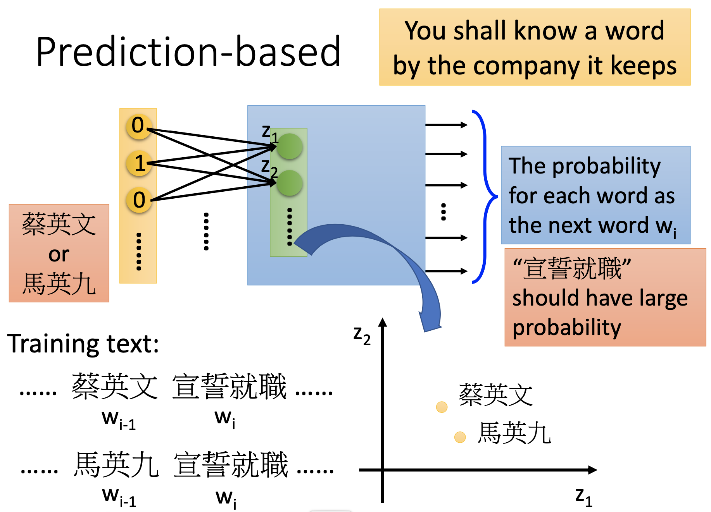

   - Prediction-based Embedding - Sharing Parameters：基于上述方法，基于一个词汇预测下一个词汇的方法可能蕴含的信息不够多。因此可以扩展该模型，基于更多的词汇预测下一个出现的词汇，本节以两个词汇为例。第一种方法是，将$w_{i-2}$和$w_{i-1}$两个词汇的独热编码连接起来组成一个更长的向量作为输入，即输入到隐层共有$(2N)^2$个权重。第二种方法是，让$w_{i-2}$和$w_{i-1}$独热编码对应维度的两个权重绑定在一起，即图中颜色相同的两条线，输入到隐层共有$(N)^2$个权重。采用第二种方法的原因有①直观上理解，如果上下两组权重不相同，将同一个Word放在$w_{i-2}$和$w_{i-1}$两个位置得到的Embedding vector是不同的；②可以减少参数的数量。

     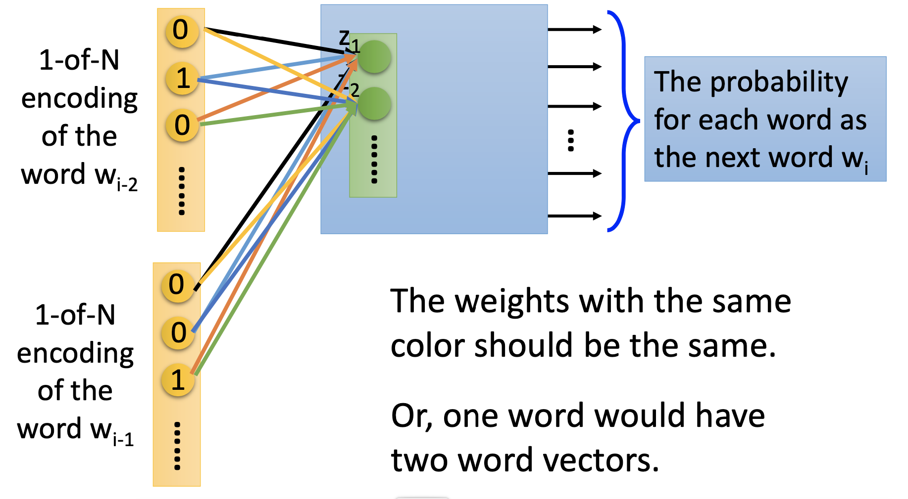

   - 假设$w_{i-2}$和$w_{i-1}$对应的独热编码为$x_{i-2}$和$x_{i-1}$，其长度均为$|V|$。Hidden Layer的输入为$Z$，长度为$|Z|$。则$Z=w_1x_{i-1}+w_2x_{i-2}$，其中weight matrix $w_1$和$w_2$的大小均为$|Z|\times|V|$。上述参数绑定的方法实际上是$w_1=w_2=w$，则$z=w(x_{i-2}+x_{i-1})$。在实际的训练过程中，为了保证$w_{i-2}$和$w_{i-1}$完全一致，需要给$w_{i-2}$和$w_{i-1}$相同的初始化值。然后计算$w_1 \leftarrow w_1- \eta \frac{\partial C}{\partial w_1}- \eta \frac{\partial C}{\partial w_2}$和$w_2 \leftarrow w_2- \eta \frac{\partial C}{\partial w_2}- \eta \frac{\partial C}{\partial w_1}$，这样进行梯度下降就可以确保在训练过程中$w_{i-2}$和$w_{i-1}$始终相同

     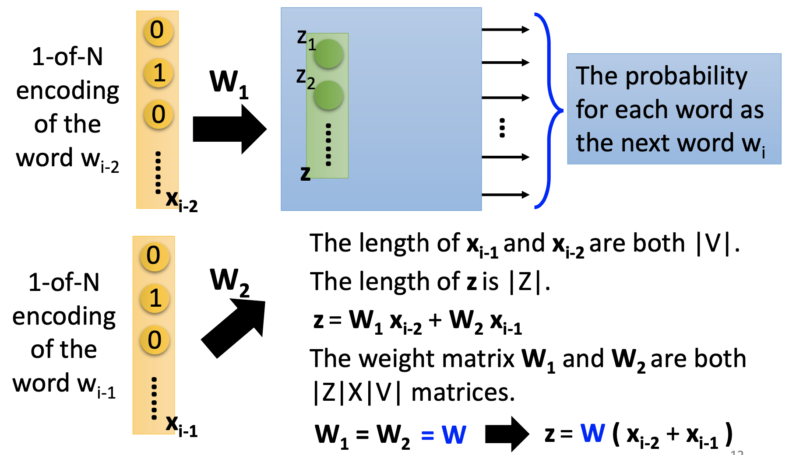

   - 训练过程中使用Minimizing Cross Entropy

     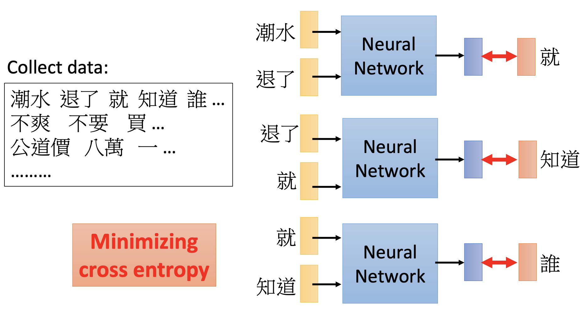

   - Prediction-based Embedding变种 - Continuous bag of word (CBOW) model：利用前后两个词预测中间的词，即predicting the word given its context

     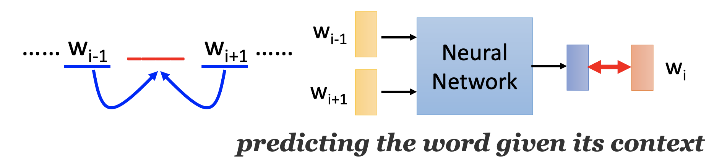

   - Prediction-based Embedding变种 - Skip-gram：利用中间词预测上下文，即predicting the context given a word

     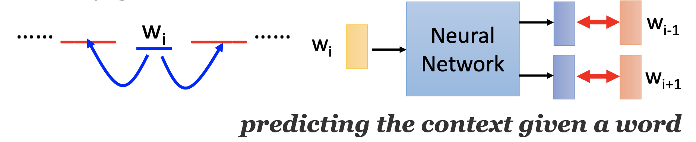

     

#### 2.Word Embedding Demo

1. Word Embedding Vector蕴含的信息

   - Word Embedding Vector能够蕴含语义之间的信息，左图可以表示出国家和首都之间的关系，右图可以表示一个单词时态之间的关系。

     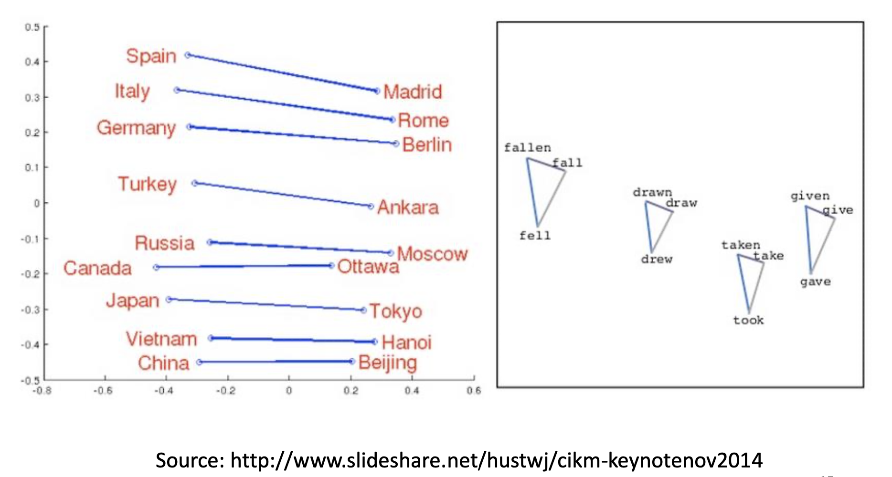

   - 通过Word Embedding Vector发现两个词汇之间的关系，对两个Word Vector做减法，如果减法结果落在指定区域，则表示两个Word之间存在包含关系。

     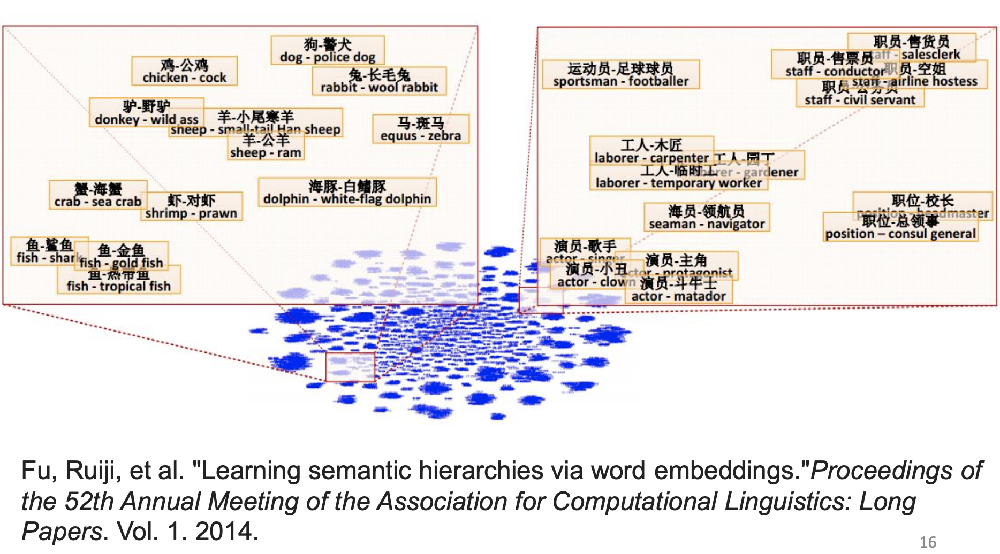

   - 通过Word Embedding Vector做推演

     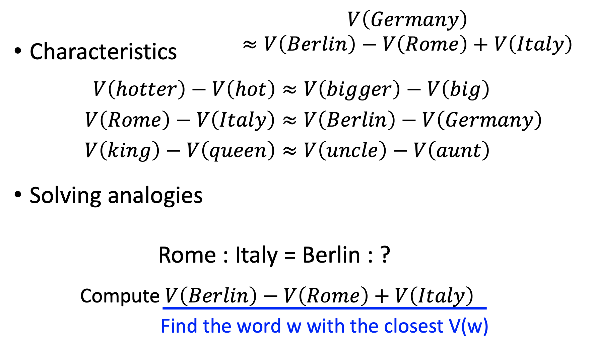

   - 让机器学习大量的PPT文章后，可以发现中文和英文之间词汇的关系

     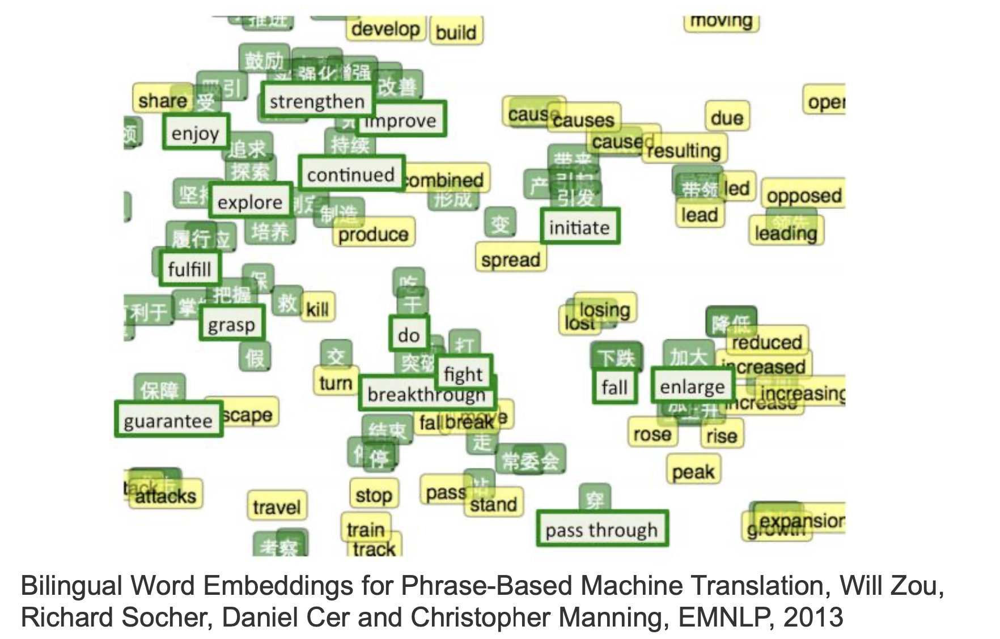

     

2. Multi-domain Embedding

   - 首先学习到一组词汇的vector，然后训练一个网络，输入是一张image，输出是和对应的Word相似的vector，即马作为输入后得到的输出落在”dog“的Vector附近。可以用于即便一些图像在训练过程中没有遇到过（不在数据集中），也可以进行图像识别。

     

3. Document Embedding

   - 基础的方法是，首先利用bag  of word表示一篇文章，然后使用RNN Auto-Encoder就可以学习出这篇文章的Semantic Embedding。

     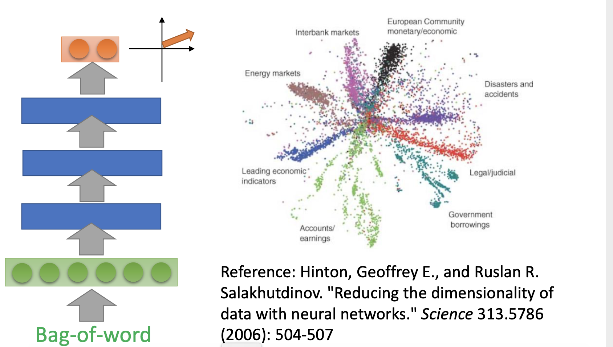

   - bag  of word + RNN Auto-Encoder的方法忽略了文章中词语的顺序。改进方法如下

     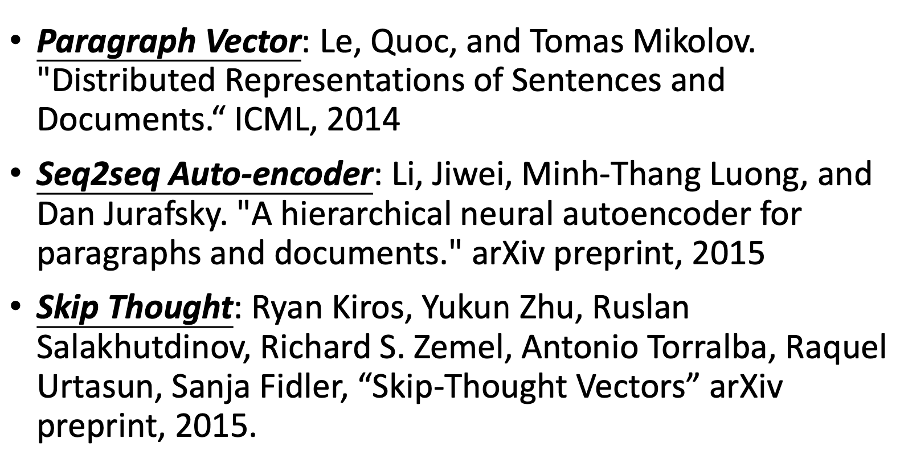

   

