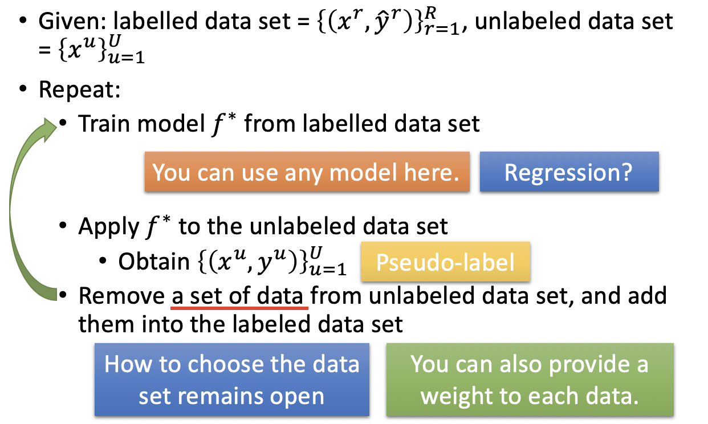

# Chapter 11 - Semi-supervised Learning

[1.Introduction](#1)

​		[1.1 Semi-supervised Learning定义](#1.1)

​		[1.2 可行性分析](#1.2)

[2.Semi-supervised Learning for Generative Model](#2)

​		[2.1 Supervised Generative Model](#2.1)

​		[2.2 Semi-supervised Generative Model](#2.2)

[3.Low-density Separation（非黑即白）](#3)

​		[3.1 Low-density Separation假设](#3.1)

​		[3.2 Self-training](#3.2)

​		[3.3 Self-training与Semi-supervised Generative Model对比](#3.3)

​		[3.4 Entropy-based Regularization](#3.4)

​		[3.5 Outlook: Semi-supervised SVM](#3.5)

[4.Smoothness Assumption（近朱者赤，近墨者黑）](#4)

​		[4.1 Smoothness Assumption定义](#4.1)

​		[4.2 基于平滑理论的半监督学习算法（Cluster and then Label & Graph-based Approach）](#4.2)

​		[4.3 Self-training与Semi-supervised Generative Model对比](#3.3)

​		[4.4 Entropy-based Regularization](#3.4)

​		[4.5 Outlook: Semi-supervised SVM](#3.5)

[5.Better Representation（去芜存菁，化繁为简）](#5)

#### 1.Introduction

1. Semi-supervised Learning定义

   - Supervised Learning指的是在满足$\{(x^r,y^r)\}^{R}_{r=1}$的数据集上的训练过程，即input与label一一对应。E.g. $x^r$表示图像，$y^r$表示图像所属分类
   - Semi-supervised Learning的数据集满足$\{(x^r,y^r)\}^{R}_{r=1}，\{x^u\}^{R+U}_{u=R}$，前者表示Labelled Data，后者表示Unlabelled Data。在半监督学习中，通常有$U>>R$。半监督学习可以分为：①Transductive Learning（Unlabelled data is the testing data，即训练过程中使用的testing set的Feature）；②Inductive Learning（unlabelled data is not the testing data，即训练过程中并不知道testing set的具体情况）
   - Semi-supervised Learning用于收集数据容易，但打标签的数据很少的情况

2. 可行性分析

   - 假设数据包括猫和狗的图片以及对应的标签，此时做二分类时，分界面应该为红色的线。如果存在一些Unlabelled Data，如图中灰色的点，其分布可能会影响决策面的位置。

     

   - Semi-supervised Learning一般会在一定的假设下使用Unlabelled Data，其效果好坏取决于假设的合理性

     

#### 2.Semi-supervised Learning for Generative Model

1. Supervised Generative Model

   - Supervised Generative Model指：已知Labelled Training Data $x^r \in C_1,C_2$，估算Prior Probability $P(C_i)$和Class-Dependent Probability $P(x|C_i)$。$P(x|C_i)$服从于$(\mu^i,\Sigma)$的高斯分布，可以通过“Share Gaussian Parameters”方法减少参数。

     

   - 基于上述变量，可以求出$P(C_1|x)=\frac{P(x|C_1)P(C_1)}{P(x)}=\frac{P(x|C_1)P(C_1)}{P(x|C_1)P(C_1)+P(x|C_2)P(C_2)}$ 和 $P(C_2|x)$，比较后即可完成分类过程

   - 如果存在Unlabelled Data（绿色圆形）的情况下，会影响生成模型对于参数的估计。对于左边一组数据，$\Sigma$应该更大使得整个分布为蓝色虚线的圆圈状；对于右边的一组数据，$\Sigma$应该更大使得整个分布为黄色虚线的圆圈状，$\mu^2$应该在偏下，接近圆心的位置。**Unlabelled Data $x^u$ 有利于$P(C_1),P(C_2),\mu^1,\mu^2,\Sigma$的正确估计。**

     

     

2. Semi-supervised Generative Model

   - 半监督生成模型的算法在理论上是可以收敛的，但是$\theta$的初始值会影响最终的收敛结果。对比EM算法，Step 1属于"E"，Step 2属于“M“。
     
   - 算法流程为：
     
     - Initialization：$\theta=\{P(C_1 ),P(C_2 ),μ^1,μ^2,\Sigma \}$，可以通过随机或估算labelled data得出
     
     - Step 1：计算unlabeled data的posterior probability $P_\theta (C_1|x^u)$，该值取决于模型的参数$\theta$
     
     - Step 2：Update model。
     
       ​				$P(C_1 )=\frac{N_1+\sum_{x^u}P(C_1 |x^u )}{N}$，（在supervised learning中不考虑unlabeled data时为$P(C_1 )=\frac{N_1}{N}$）。其中$N$表示所有样本的数量；$N_1$表示被标注为$C_1$的样本数量；$\sum_{x^u}P(C_1 |x^u )$表示所有Unlabeled Data属于$C_1$的后验概率之和，该部分意为Unlabeled Data部分有多少是属于$C_1$类别的。
     
       ​				$\mu^1=\frac{1}{N_1}  \sum \limits _{x^r \in C_1}x^r +\frac{1}{\sum  _{x^u}P(C_1 |x^u )} \sum \limits_{x^u}P(C_1 |x^u ) x^u$，（在supervised learning中不考虑unlabeled data时为$\mu^1=\frac{1}{N_1}  \sum \limits _{x^r \in C_1}x^r$。其中$表\frac{1}{\sum  _{x^u}P(C_1 |x^u )} \sum \limits_{x^u}P(C_1 |x^u ) x^u$表示所有Unlabelled Data按照后验概率做Weighted Sum，然后正则化。
     
     - Step 3：Back to step 1。
     
     
     
   - 算法原理为：

     - 在有监督的生成模型中，模型的目标是Maximum likelihood with labelled data，即为$\begin{align} logL(θ)&=\sum\limits_{x^r,y^r}logP_θ (x^r ,\hat{y}^r) \\ &=    \sum\limits_{x^r,y^r}logP_θ (x^r |\hat{y}^r)P(\hat{y}^r) \end{align}$

       

     - 在半监督的生成模型中，模型的目标是Maximum likelihood with labelled and unlabelled data，即为$\begin{align} logL(θ)&=\sum\limits_{x^r,\hat{y}^r}logP_θ (x^r ,\hat{y}^r) + \sum\limits_{x^u}logP_θ (x^u)\\ &=    \sum\limits_{x^r,\hat{y}^r}logP_θ (x^r ,\hat{y}^r) + \sum\limits_{x^u}log\{P_θ (x^u|C_1)P(C_1)+P_θ (x^u|C_2)P(C_2) \}\end{align}$，其中因为unlabeled data不知道其属于哪一个类别，所以$P_θ (x^u)$部分包含了属于各个类别的概率之和。该问题需要迭代的去求解

     

#### 3.Low-density Separation（非黑即白）

1. Low-density Separation假设

   - Low-density Separation假设指存在Labeled Data和Unlabeled Data，但是在两个类别之间有着明显的分界面（“Black-or-White”，非黑即白），且在分界面附近存在少量或不存在样本点。

     

     

2. Self-training

   - 已知：Labeled Data Set  $\{(x^r,y^r)\}^{R}_{r=1}$，Unlabeled Data Set  $\{x^u\}^{R+U}_{u=R}$

   - 算法流程为：

     - Step 1：通过Labeled Data训练模型$f^*$（训练方法不受限制，NN/ML等等均可）
     - Step 2：根据模型$f^*$对Unlabeled Data Set进行标记，得到 $\{x^u，y^u\}^{R+U}_{u=R}$，称为Pseudo-Label
     - Step 3：从Unlabeled Data Set中取出一部分加入Labeled Data中，相应的规则可以自己定义，比如根据得到label的自信度等等
     - Step 4：Back to Step 1

     

   - Self-training对于Regression是无效的，因为Regression的标签是一个数值。对于Unlabeled Data Set的标签是根据$f^*$计算出来的，将其再加入Labeled Data中重新计算$f^*$，不会对$f^*$产生影响。类似于根据一条直线方程和一个横坐标算出了对应的纵坐标，将这个新的坐标点代入方程组解系数，得到的系数是不变的。

     

3. Self-training与Semi-supervised Generative Model对比

   - Self-training和Semi-supervised Generative Model有相似之处，都是通过迭代运用Unlabeled Data Set去更新模型提高精确度。但是Self-training使用的是Hard Label，对于Unlabeled Data Set的每一笔数据都要求其必须属于某一类，而Semi-supervised Generative Model使用的是Soft Label，对于Unlabeled Data Set的每一笔数据都有可能来自于任何一个类别，通过概率加权的方式进行更新。

   - 假设训练模型使用神经网络，则Soft Label是无效的，只能使用Hard Label。假设对于一笔Unlabeled Data数据$x^u$经过模型$f^*_{\theta^*}$得到的结果是70%属于class 1，30%属于class2。那么将这个概率标签重新加入到模型中并不能起到任何作用，因为现有的模型$f^*_{\theta^*}$已经可以做到输出70%属于class 1，30%属于class2。只能使用Hard Label（基于Low-density Separation假设）。

     

4. Entropy-based Regularization

   - 假设使用神经网络模型时，其输出为一个Distribution。不再使用Hard Label的方式将其归为某一类，而是要求output distribution必须是一个较为集中的分布，例如该分布可以断定输出值$y^u$有极大的概率处在某一个值，而不是在很多值处都有一定的概率。

   - 该方法使用Entropy的概念衡量一个output distribution的集中与否，$E(y^u )=-\sum \limits _{m=1}^{5}y_m^u ln(y_m^u)$。分布的信息熵越小，说明分布越集中。根据分布的信息熵可以重新定义模型的损失函数，$L=\sum \limits_{x^r}C(y^r,y ̂^r )+\lambda\sum\limits_{x^u}E(y^u)$，前半部分要求Labeled Data Set的输出与其标签一致，后半部分要求Unlabeled Data Set部分的输出分布越集中越好。

     

     

5. Outlook: Semi-supervised SVM

   - 使用Labeled Data训练完模型后，对Unlabeled Data所属的类别进行穷举，并分别更新模型计算新的分界面，找到使得Margin最大，Loss最小的一个SVM。

     

     

#### 4.Smoothness Assumption（近朱者赤，近墨者黑）

1. Smoothness Assumption定义

   - 概括地讲：相似的样本$x$拥有相似的标签$\hat{y}$

   - 精确的讲：样本$x$的分布式是uniform（不平均的，有些地方集中，有些地方分散）的，如果样本$x^1$和$x^2$在high density的区域中很接近，那么$\hat{y}^1$和$\hat{y}^2$也会很相似。例如$x^1$和$x^2$都处于一个high density region，所以二者有相同的标签。

     

   - 例如在数字识别中，中间的2可能在形态上与3更相似。但实际上，两个2之间有着连续的变化形态。

     

     

   - 例如人的左脸和右脸并不像，但是左侧面和右侧面之间有着很多的连续变化

   - 例如在文件分类中，两篇文章虽然没有共同词汇，但是两篇文章可以通过递近的方式存在相似关系

     

     

2. 基于平滑理论的半监督学习算法（Cluster and then Label & Graph-based Approach）

   - Cluster and then Label：先对样本进行聚类，然后Unlabeled Data的类别就是其所在Cluster的Labeled Data的标签

     

   - Graph-based Approach

     - 将所有的样本点都构建在一张图中，形成一个Graph Representation。有些时候，Graph Representation是一件很自然的事情，例如网页或者论文之间的链接引用关系，就是天然的图结构。

     - Graph Construction：①定义$x^i$和$x^j$之间的相似度$s(x^i,x^j)$，常用方法为Gaussian Radial Basis Function $s(x^i,x^j )=exp(-\gamma‖x^i-x^j ‖^2 )$。RBF相似度通过取对数的方式增加了相似度对于两点距离的敏感性，即当二者很近时$s(x^i,x^j)$很大，二者距离稍远时$s(x^i,x^j)$会迅速下降变成一个很小的值。因此RBF similarity可以构造一个很近的点连在一起，稍远的点无边相连的图；②通过K Nearest Neighbor或者e-Neighborhood的方法构建边；③根据$s(x^i,x^j)$对边赋予权重

     - 算法思想（定性）：

       ​		①Labeled Data会影响其邻居节点，即图中两个蓝色圈样本点属于Class 1，那么其邻居属于Class 1的几率会大大增加；

       ​		②Labeled Data的影响会通过图结构传播，例如橙色点虽然没有和Labeled Data相连，但是其受到了属于Class 1的Labeled Data的影响，所以其属于Class 1的概率也会变大。如右图所示，黑色为构建的图结构，给定红色和蓝色的labeled data各一个，其传播结果如下图。

       

     - 算法步骤（定量）：定义图中节点的smoothness of the labels，代表该label对于smoothness assumption的符合程度；下图中有两个相同的网络结构，边的权重也相同，但是节点的标签不同。直观的来讲，左边的图结构和标签会更平滑。定量表示方法为$S=\frac{1}{2} \sum\limits_{i,j}w_{i,j} (y^i-y^j )^2$，其中$i，j$表示相邻的节点（包含Labeled Data和Unlabeled Data），$S$越小代表越Smoothness

       ​		

     - 上述平滑度的定义$S=\frac{1}{2} \sum\limits_{i,j}w_{i,j} (y^i-y^j )^2$可以整理为$S=\frac{1}{2} \sum\limits_{i,j}w_{i,j} (y^i-y^j )^2=y^TLy$。其中$y=[⋯y^i⋯y^j⋯]^T$，为$(R+U)$维的向量；$L=D-W$，$L$称为Graph Laplacian，是一个$(R+U)\times(R+U)$维度的矩阵；$W$为图中边的权重矩阵，$D$为$W$矩阵加和运算的转换

       

     - 可以根据$S=y^TLy$来衡量目前得到的Label有多Smoothness，$y$值取决于神经网络的参数。因此可以对损失函数进行调整，$L=\sum \limits_{x^r}C(y^r,y ̂^r )+\lambda S$，将$S$作为一个正则项加入损失函数，不但要求模型准确，而且要求生成的Label尽可能的平滑

     - 不但可以对神经网络的输出层有Smoothness的要求，还可以对隐层增加Smoothness的要求（J. Weston, F. Ratle, and R. Collobert, “Deep learning via semi-supervised embedding,” ICML, 2008）

       

       

#### 5.Better Representation（去芜存菁，化繁为简）

1. 核心思想
   - 寻找隐含在表象背后的影响因素，隐含影响因素往往是更简单、更有效的Representation。具体会在Unsupervised Learning中讲解。

