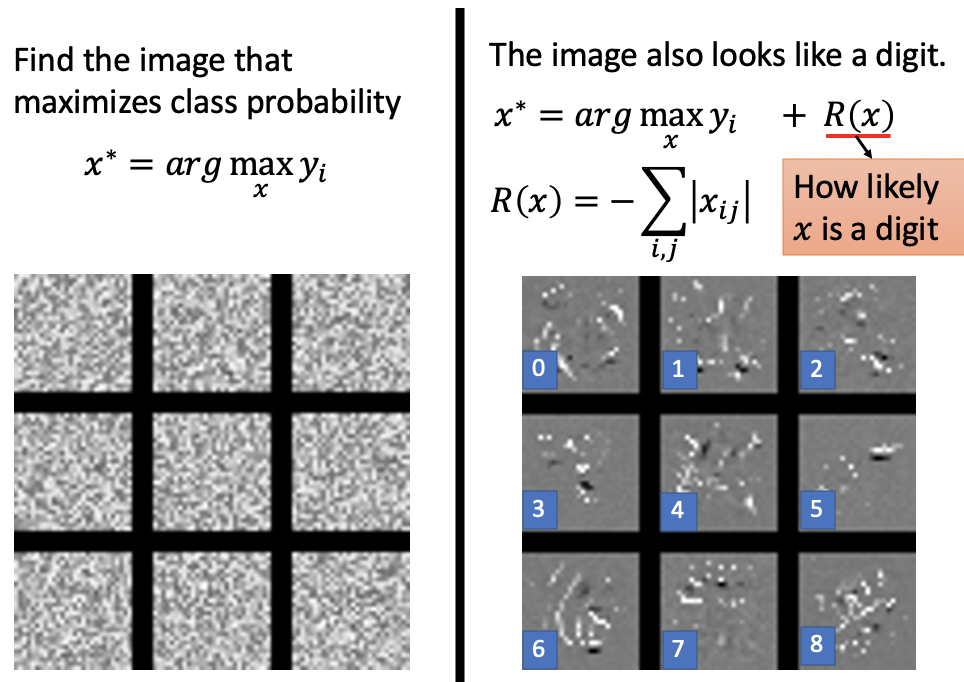
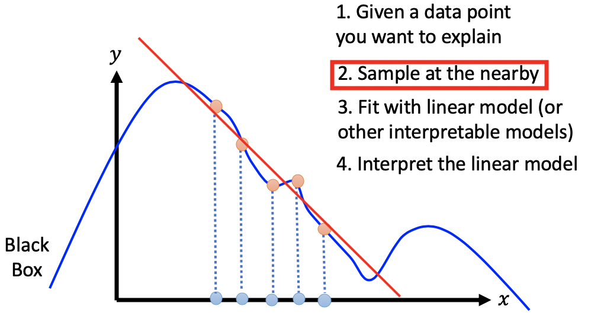

# Chapter 12 - Explainable Machine Learning（Part 1）

[1.Introduction](#1)

​		[1.1 Explainable ML的基本概念](#1.1)

​		[1.2 Interpretable v.s. Powerful](#1.2)

[2.Local Explanation：Explain the Decision（Questions: Why do you think this image is a cat?）](#2)

​		[2.1 Important Component与Gradient-based Method](#2.1)

​		[2.2 Limitation of Gradient based Approaches](#2.2)

​		[2.3 Attack Interpretation](#2.3)

​		[2.4 Saliency Map Case Study](#2.4)

[3.Global Explanation：Explain the whole Model（Questions: What do you think a “cat” looks like?）](#3)

​		[3.1 Activation Maximization Review](#3.1)

​		[3.2 “Regularization” from Generator](#3.2)

​		[3.3 Self-training与Semi-supervised Generative Model对比](#3.3)

​		[3.4 Entropy-based Regularization](#3.4)

​		[3.5 Outlook: Semi-supervised SVM](#3.5)

[4.Using A Model to Explain Another Model](#4)

​		[4.1 基本原理](#4.1)

​		[4.2 Local Interpretable Model - Agnostic Explanations（LIME - 基于Linear Model）](#4.2)

​		[4.3 Local Interpretable Model - Agnostic Explanations（LIME - 基于Decision Tree）](#4.3)

#### 1.Introduction

1. Explainable ML的基本概念

   - 定义：Explainable ML关注的问题是，机器学习算法为什么可以得到预期的结果。比如机器阅读简历时，到底是看具体能力，还是根据性别进行筛选

      

   - 分类：Explainable ML分为Local Explaination和Global Explaintion。以图片识别为例，Local Explaination指 “Why do you think this image is a cat?”，Global Explaintion指 “What do you think a “cat” looks like?”

   - 目标：Explainable ML的目的并不是完全的了解整个ML Model，其目的是让人们从可解释性中得到满足与认同感。ML的可解释性没有完全正确的标准答案，Personalized Explaination有可能是未来发展的方向

      

2. Interpretable v.s. Powerful

   - 有一些模型本身就是Interpretable。例如Linear Model，其权重至关的解释了模型是如何运作的，但是其不够Powerful。Neural Network虽然足够Powerful，但是NN是一个黑盒，不具有可解释性。Explainable ML需要做的是在保证Neural Network足够Powerful的同时，还具有可解释性。例如，夜晚车钥匙掉在黑暗的角落里，一个人就在路灯下找，而拿手电筒去角落里找。路灯下就像Linear Model，可解释性强，就一直被青睐，而不愿用黑盒的神经网络模型。Explainable ML就是拿着手电去黑暗的角落里找钥匙。

   - 一般来说在比赛中，使用Decision Tree或者Boost的方法能够提高正确率。Decision Tree在一定程度上兼备Interpretable和Powerful，但是一些复杂的Decision Tree或Forest是难以解释的

                             

     

#### 2.Local Explanation：Explain the Decision（Questions: Why do you think this image is a cat?）

1. Important Component与Gradient-based Method

   - 已知一个Object $x$，包含很多Components $\{x_1,x_2,···，x_N\}$。以图像为例，其包含的components肯能为pixel、segment等等；以文本为例，其包含的components肯能为单词等等。

   - Local Explaination的目标是找出每一个Components对于making Decision的重要性。实现方法是删除或修改某个component，观察Decision的变化情况。Larger Decision Change, More Important Component

   - 例如，给定一只博美狗的图片，机器可以识别出其类别。但是使用一个灰色方块遮盖住狗的头部，机器将无法识别；使用灰色方块遮盖住狗的身子或北京，机器仍然可以识别。这就是不同的Segment有着不同的重要性

     

     

   - 对于输入$\{x_1,···，x_n,···,x_N\}$，经过模型后会得到该输入属于每一个类别的概率，其中最大的概率$y_k$就是代表着其所属的类别。因此可以给输入增加一个小的变化量$\{x_1,···，x_n+\triangle x,···,x_N\}$，观察输出概率的变化量$y_k+\triangle y$，那么$|\frac{\triangle y}{\triangle x}|$越大表示component $x$越重要，$|\frac{\triangle y}{\triangle x}|$等价于$|\frac{\partial y_k}{\partial x_n}|$，可以根据$|\frac{\partial y_k}{\partial x_n}|$画出Slaiency Map（下图中的灰色图像，亮度越高表示$|\frac{\partial y_k}{\partial x_n}|$越大，越亮表示越重要）（Karen Simonyan, Andrea Vedaldi, Andrew Zisserman, “Deep Inside Convolutional Networks: Visualising Image Classification Models and Saliency Maps”, ICLR, 2014）

     

     

   - 其他相关文献如下：

     

     

2. Limitation of Gradient based Approaches 

   - Gradient Saturation带来的问题：例如在动物界，易得一只动物是大象的概率随着其鼻子的长度的增加而增加，鼻子长度达到一个阈值后概率趋于稳定，即$|\frac{\partial 大象}{\partial 壁纸长度}| \approx0$。这与上一节所说的越大偏微分代表越重要的影响因素相矛盾，鼻子很重要，其偏导却为0。

   - 解决办法详见：Integrated gradient (https://arxiv.org/abs/1611.02639)、DeepLIFT (https://arxiv.org/abs/1704.02685)

     

4. Attack Interpretation

   - 模型的可解释性也可以被用来恶意攻击。如下图所示，使用Vanilla Gradient和Deep LIFT的方法都找到了重要的影响因素是卡车的侧面。但是可以在图片中加入一些很小的噪声，就可以将最重要的影响因素转移到云朵上去。（https://arxiv.org/abs/1710.10547）

     

5. Saliency Map Case Study

   - Task：根据图片对宝可梦和数码宝贝进行分类（Pokémon images：https://www.Kaggle.com/kvpratama/pokemon-images-dataset/data、Digimon images：https://github.com/DeathReaper0965/Digimon-Generator-GAN）

     

   - 使用CNN解决该问题的实验结果：Training Accuracy - 98.9%，Testing Accuracy - 98.4%。根据该模型研究Saliency Map，观察到模型的侧重点并没有在动物身体上，而是在动物的周围。真正原因是数码宝贝的格式是JPEG，读入电脑后的背景是黑色的。机器通过背景就可以分辨两个物种。

     

     

     

#### 3.Global Explanation：Explain the whole Model（Questions: What do you think a “cat” looks like?）
1. Activation Maximization Review

   - 在数字辨识中，假设判定某张图片为数字“5”的输出为$y_i$，那么$x^*=arg \ \max \limits _{x}\{y_i\}$ 对应的就是就是机器认为的数字"5"应该具备的样子。实验发现每个数字对应的$x^*$并不具备可解释性，就像是图像中加了某些噪声帮助图像可以进行数字识别

     

   - 上述的改进方式为$x^*=arg \ \max \limits _{x}\{y_i\}+R(x)，R(x)=-\sum\limits_{i,j}|x_{i,j}|$ 。其中$R(x)$作为正则项约束了图片所有像素点的绝对值之和，因为真正的数字图像大多都是白色，只有少数为黑色笔迹。这样就会减少左图中的白色雪花点。

     

   - 为了得到能够易于人类理解的$x^*$，需要增加很多正则项，而且需要大量的调整模型的超参数。（https://arxiv.org/abs/1506.06579）

     

     

2. “Regularization” from Generator

   - 在上一小节中，需要在Activation Maximization过程中加入一些正则化项才可以得到想要的结果。另一种方法就是通过GAN、VAE（Generator）等进行正则化。GAN、VAE模型大量学习一些low-dim vector（一般从特定的分布中采样出来），模型可以输出其对应的图片。

   - 将Image Generator的输出作为Image Classifier的输入，两个模型联合起来。此时Activation Maximization的目标就从$x^*=arg \ \max \limits _{x}\{y_i\}$ 转换为$z^*=arg \ \max \limits _{z}\{y_i\}$ ，然后将$z^*$作为Generator的输入产生$x^*$。$x^*$就是模型认为$y_i$对应的输入的样子，同时还能够便于人类理解。（https://arxiv.org/abs/1612.00005）

     

     

#### 4.Using A Model to Explain Another Model

1. 基本原理

   - 核心思想：利用一个Intrinsic Interpretable Model去解释一个Uninterpretable Model

   - 算法原理：首先将多组输入$x^1,x^2,···,x^N$送入黑盒模型（Neural Network等等）中，得到输出$y^1,y^2,···,y^N$。然后再将同样的输入$x^1,x^2,···,x^N$送入Intrinsic Interpretable Model得到输入$\hat{y}^1,\hat{y}^2,···,\hat{y}^N$。最终的目标是让两次输出$y^i$和$\hat{y}^i$尽可能的相同，然后分析蓝色的Intrinsic Interpretable Model即可

     

   - 问题：Intrinsic Interpretable Model（Linear Model等等）一般比较简单，模型的Capacity不够强，难以做到和Neural Network产生类似的输出。但是Linear Model可以用来解释黑盒模型的一部分（Local region）

     

2. Local Interpretable Model - Agnostic Explanations（LIME - 基于Linear Model）

   - 已知一个黑盒模型，输入为一维的$x$，输出为一维的$y$，输入和输出之间存在着比较复杂的关系。

   - 算法步骤：

     ​		①决定需要解释的数据点

     ​		②在该数据点附近采样更多的点（蓝色）

     ​		③将采样的所有点送入黑盒模型，得到相应的输出（红色）

     ​		④训练一个Intrinsic Interpretable Model（Linear Model等），拟合上述数据点，找出局部的规律

     

   - 在算法的第二部，数据点周围的采样范围会影响最终的结果

     

   - Case Study：LIME - Image（https://medium.com/@kstseng/lime-local-interpretable-model-agnostic-explanation-%E6%8A%80%E8%A1%93%E4%BB%8B%E7%B4%B9-a67b6c34c3f8）

     ​		①给定一张树蛙的图片，决定需要解释的数据点

     ​		②将一张图片分割成许多superpixel set（segment），采样过程为随机的删除一些Segment。将采样后的图片送入黑盒得出该图片是树蛙的概率

     ​		③对采样后的图片进行Feature Exact，将图像表示成低维的向量（向量的长度与Segment的数量相同），若segment已删除则为0，反之为1

     ​		④训练一个Intrinsic Interpretable Model（Linear Model等），$y=w_1 x_1+⋯+w_m x_m+⋯+w_M x_M$。如果$w_m \approx 0$，表示其对应的segment对于辨别树蛙是无影响的；如果$w_m > 0$，表示其对应的segment对于辨别树蛙有正向影响的；如果$w_m < 0$，表示其对应的segment对于辨别树蛙有负向影响。

               

     

     

     

3. Local Interpretable Model - Agnostic Explanations（LIME - 基于Decision Tree）

   - 对于Intrinsic Interpretable Model部分，可以使用Linear Model，也可以使用Decision Tree。使用Decision Tree时，只要树足够深，就可以产生和黑盒一样的输出，但是这是无意义的。我们希望训练处的Decision Tree不要过深过大。一般使用**树的平均深度**表示树$T_\theta$的复杂度$O(T_\theta)$

     

   - Tree Regularization：在训练神经网络时，就考虑到后续需要使用Decision Tree去解释这个黑盒模型，即模型的参数易于被Decision Tree分析。所以在黑盒模型的损失函数中加入一个正则项$\theta^*=arg \ \max \limits _{\theta}L(\theta)+\lambda O(T_\theta)$，通过正则的方式约束对应的Decision Tree的复杂度。但是因为$O(T_\theta)$是不可以微分的，所以目前该损失函数不可以通过梯度下降求解。模型的提出者又训练了一个神经网络，该网络可以根据一个神经网络的相关参数预测出其对应的Decision Tree的复杂度。（[https://arxiv.](https://arxiv.org/pdf/1711.06178.pdf)[org](https://arxiv.org/pdf/1711.06178.pdf)[/pdf/1711.06178.pdf](https://arxiv.org/pdf/1711.06178.pdf)）
   
     
