# Chapter 12 - Explainable Machine Learning（Part 2）

[1.Explain a trained model - Attribution（Local v.s. Global attribution / Completeness / Evaluation）](#1)

​		[1.1 Local Gradient-based](#1.1)

​		[1.2 Global Attribution](#1.2)

​		[1.3 Evaluation](#1.3)

​		[1.4 Summary](#1.4)

[2.Explain a trained model - Probing（BERT / Good Probing Model）](#2)

​		[2.1 BERT基本原理](#2.1)

​		[2.2 What does BERT learn?（BERT Rediscovers the Classical NLP Pipeline ）](#2.2)

​		[2.3 What does BERT might not learn?](#2.3)

​		[2.4 What is a good prob?](#2.4)

[3.Explain a trained model - HeatMap（Activation map \ Attention map）](#3)

​		[3.1 Activation Map：CNN Dissection](#3.1)

​		[3.2 Attention map as explanation](#3.2)

[4.Create an explainable model](#4)

​		[4.1 CNN Explainable Model的难点](#4.1)

​		[4.2 Constraining activation map](#4.2)

​		[4.3 Encoding Prior](#4.3)

#### 1.Explain a trained model - Attribution（Local v.s. Global attribution / Completeness / Evaluation）

1. Local Gradient-based

   - 使用基于局部的梯度值进行component importance analysis时，会出现两个问题。第一个是Gradient Saturation（大象鼻子问题），其解决办法是Global Attribution；第二个问题是Noisy Gradient问题，许多人眼无法分辨的图像之间可能存在很多的噪声点，其解决办法是SmoothGrad

   - SmoothGard基本原理：假设图片中可能存在一些噪声，导致梯度的计算不准确。那么就使用多张图片，计算多个梯度值，平均后进行衡量。

      - 模型公式：$\hat{M}_c(x)=\frac{1}{n}\sum\limits_{1}^{n}(M_c(x)+N(0,\delta^2))$，
      - 其中$x$表示一张图片，模型的输出对$x$的每个pixel做微分就可以得到$M_c$，表示解释模型，$M_c(x)$表示一个图片的Saliency Map
      - 因为一些图片中可能存在噪声，因此对每张图片将$x$和一个高斯的噪声相加，构成一个含有噪声的图片。先Feedforward到输出，再BackPropagation求Saliency Map，最后求和取平均即可。

      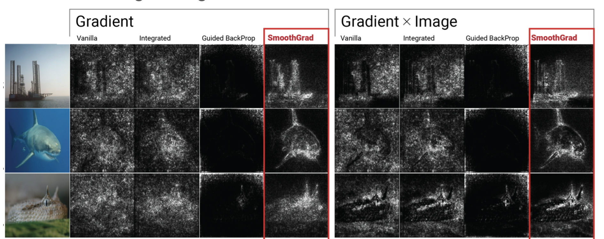

      

2. Global Attribution

   - 假设训练完成的模型的数学表达为$100x_1+20x_2=y$。如果从Local的角度出发，则component $x_1$是比较重要的，整个模型也是Feature Sensibility。如果从Global的角度出发，关注的是对于当下的输入，每个component的贡献有多少，如果$x_1=1,x_2=20$，那么前一部分贡献了100，后一部分贡献了200，则后一部分component $x_2$更重要。

   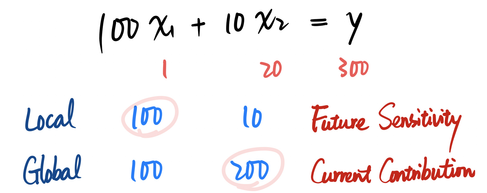

   - 基本思想：对于一个输出300，对应的5个输入一共产生了300的贡献度。需要做的是找出每个输出独自的贡献度。

      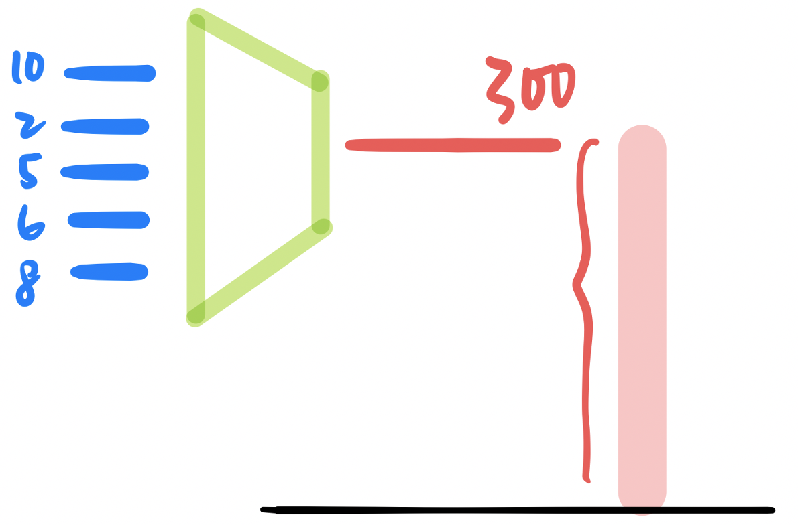

   - 具体算法（Layer-wise relevance propagation，LRP）：逐层从后向前的不断计算前一层产生的贡献度。$Attribution=activation\ output \times weight$。假设倒数第一层的输出是$(3 \ 10 \ 3 \ 50)$，对应的连接权重是$(10\ 25\ 5\ 1)$，则倒数第一层对应的贡献度是$(30\ 250\ 15\ 5)$，以此类推不断地反向传播直到输入层。

      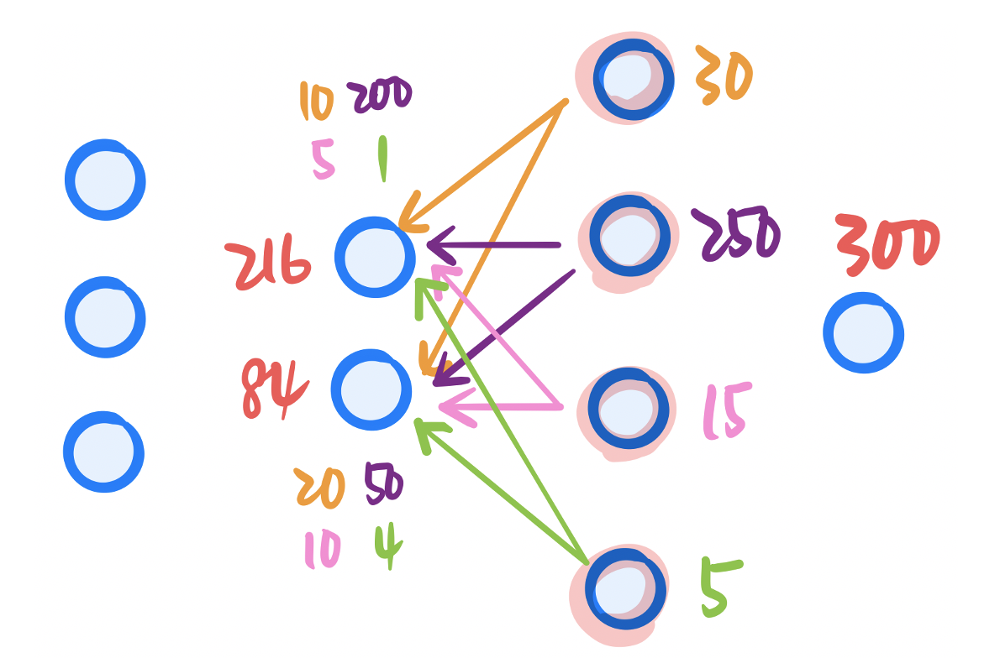

      - LRP是一种基于规则的方法，对于不同的链接、不同的网络都可以设计出不同的规则
      - Completeness：通过上述方法可以获得对于一个输出，找到输出层的贡献度方法，贡献度即代表着重要程度。同时还可以分析随着图片的不同（即pixel的变化），贡献度是如何变化的，就可以画出如下的曲线。横纵轴代表两个pixel，曲线就能看出随着图片的变化，两个像素的贡献度是如何变化的。

      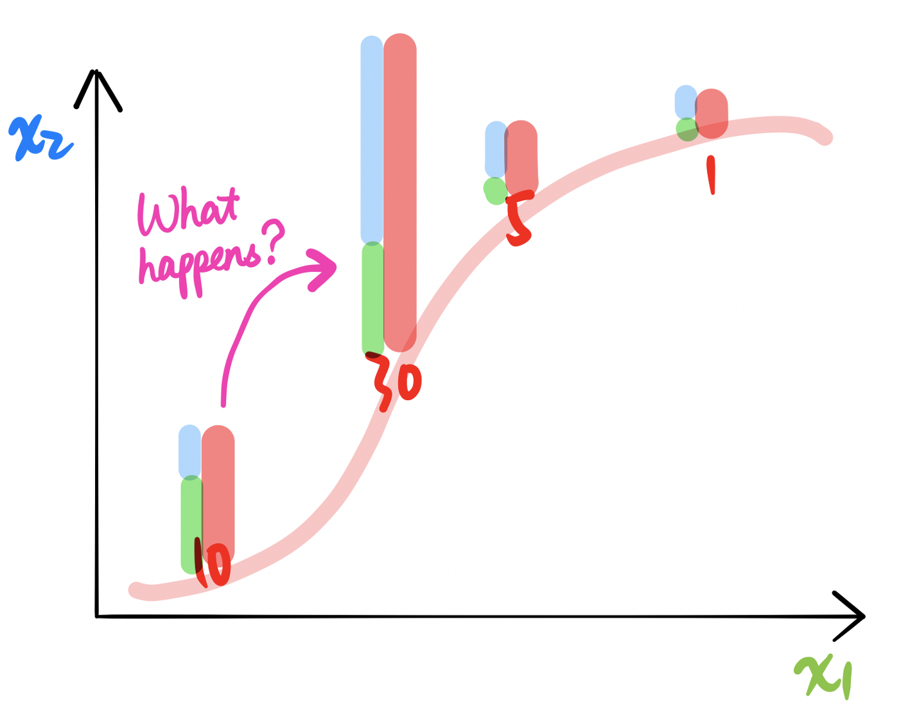

      - 上图默认的起点是$(0,0)$，即输入是从什么都没有开始的，称为Fixed-0 baseline，由LRP with no bias产生的。我们也可以认为的设置baseline

        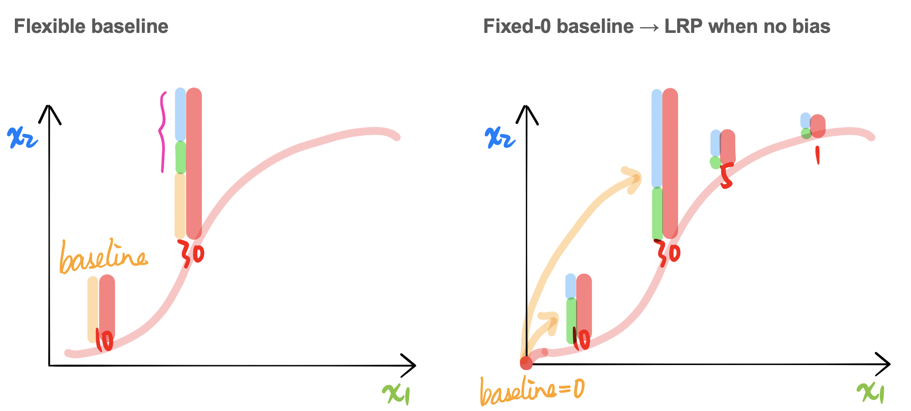

      - 设置baseline的方法有DeepLIFT（左）、Integrated Gradient（右）

        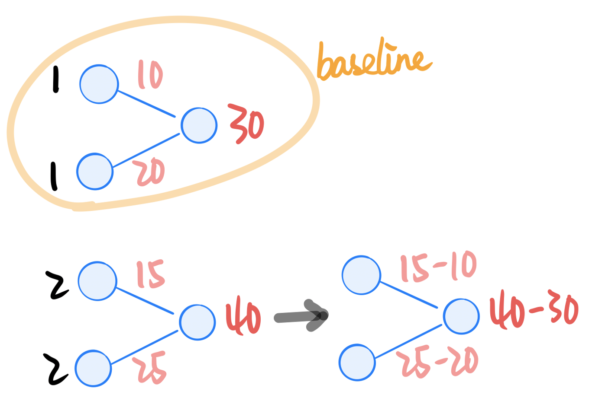          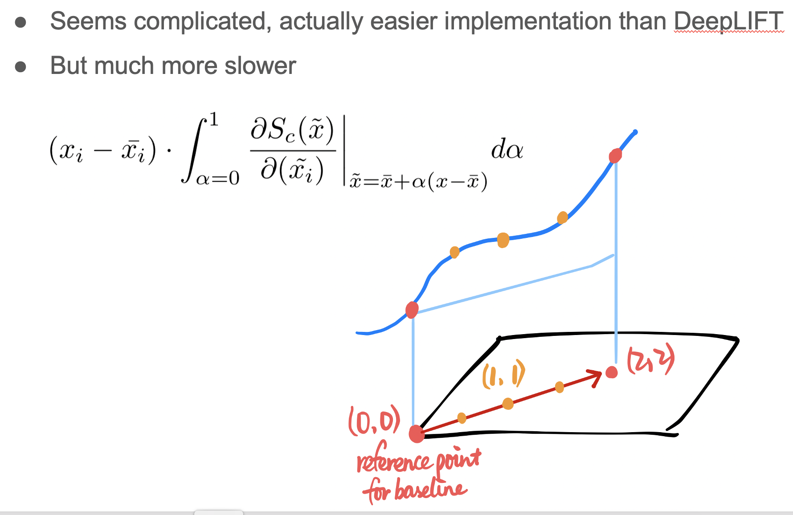

3. Evaluation

   - 因为Attribution Method的解释方法没有通用的测评方式，所以有人基于Attribution的概念提出了"Sensitivity-n"（n可以为任何数字）作为一种基本的方法，其基本思想为每次在所有components中移除n个，比较每次移除后结果的变化情况。

      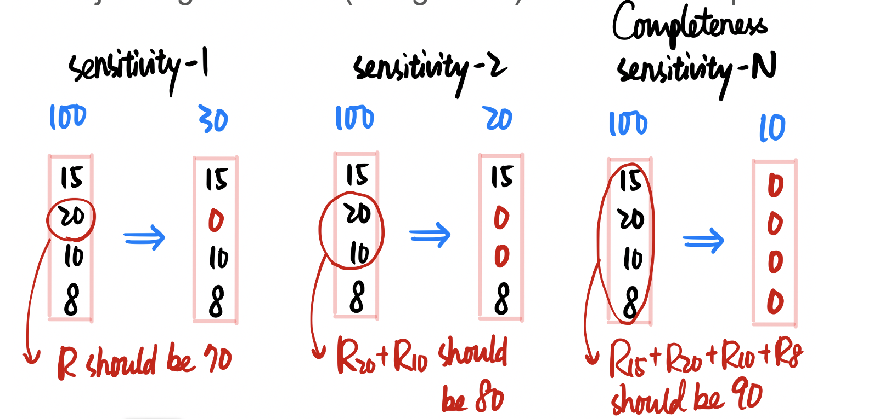

   - 利用“Sensitivity-n”的方法对Occlusion-1（类似于Sensitivity-1，遮住一个pixel观察输出变化）、Gradient*Input、Integrated Gradient、DeepLIft、LRP进行测评，发现效果比较好的是Occlusion-1

      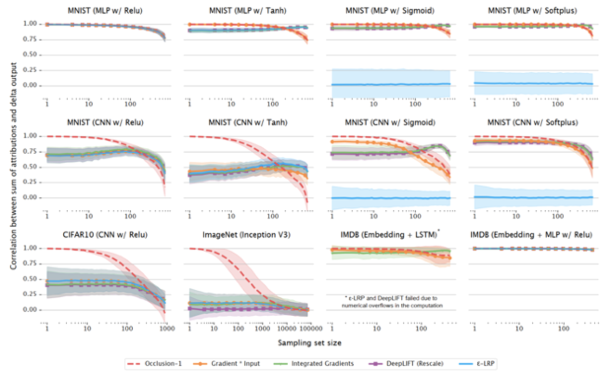

4. Summary

   - Attribution-based Method都是End-to-End的方法，即component和最后的输出都是一对一的影响关系，不受其他component限制。

   

#### 2.Explain a trained model - Probing（BERT / Good Probing Model）

1. BERT基本原理

   - BERT Architecture：以下图为例，对应着BERT的一层。四根蓝线代表四个输入，分别会产生对应的四个输出，其中第二个输入对应的输出为绿色箭头。将第二个输入经过一定的Transform，然后将其他人的信息融合进来，产生对应的绿色箭头输出。

     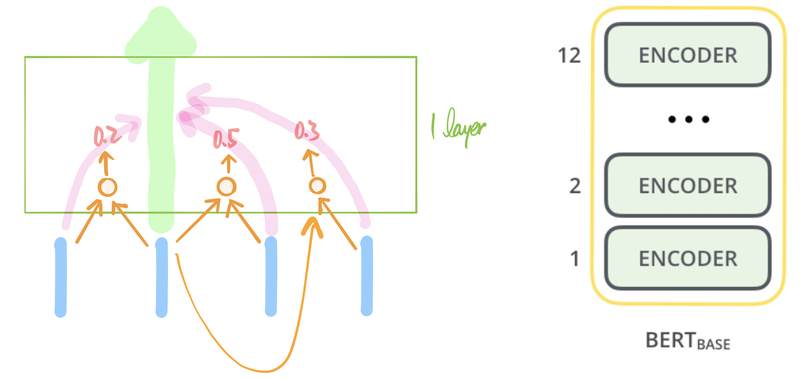

   - BERT Training：该模型训练的目标是Masked language model和Next sentence prediction。去掉一句话中的某一个词，将其MASK掉，模型能够对该位置的词汇进行预测。

     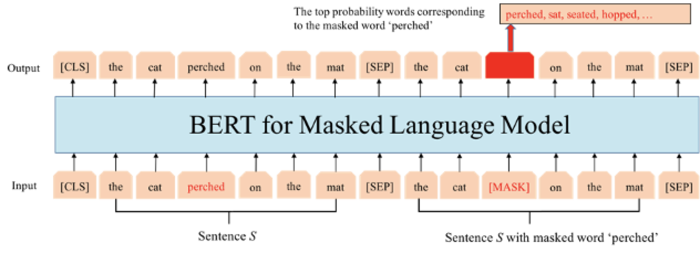

   - BERT的成功之处在于，将BERT产生的Representation和一些比较基础的模型结合起来，能够在一些问题上表现的比complex & well-designed model更好。于是学者开始研究BERT模型的Representation为什么可以做的更好，研究其可解释性。首先，使用BERT Representation做一些简单的分类、词性标注、特征间距离的比较等等，确保BERT Representation确实学习到了自然语言中的大量信息

     

2. What does BERT learn?（BERT Rediscovers the Classical NLP Pipeline ）

   - 该文章使用BERT Representation进行了从简单到复杂（语义要求越来越高）的多项任务，包括Part-of-speech, constituents, dependencies, entities, semantic role labeling, Coreference, semantic proto-roles, relation classification

   - Edge - Probing Rechniique：以词性标注任务为例，BERT共有12层，现在将每层的Representation取出乘以一个权重加和起来，作为词性标注分类器的输入。训练模型，观察12层对应的权重大小，发现第四层到第十二层的权重更大一下，即使用4-12层的Representation可以很好地完成词性标注任务

     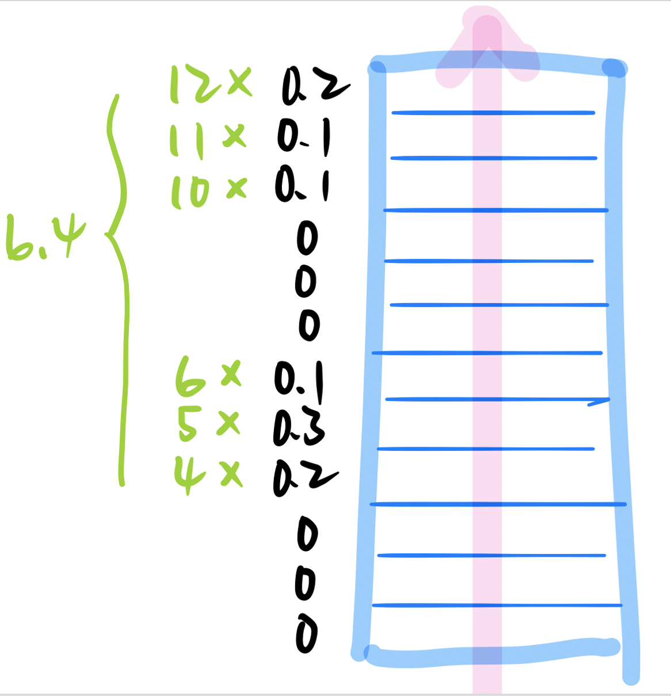

   - 因为网络从输入到输出是自下而上的，越高层的Representation会蕴含更多的信息，所以4-12层有较好的performance是可以理解的。但是信息在哪一层被大量的学习和累积却不得而知，此时需要使用cumulative score的标准去测评，自下而上每次多使用一层，观察Performance的变化情况。实验结果显示确实在较低的层只完成了简单的信息（词性等）抽取，高层才会抽取更多的信息（语义等）

     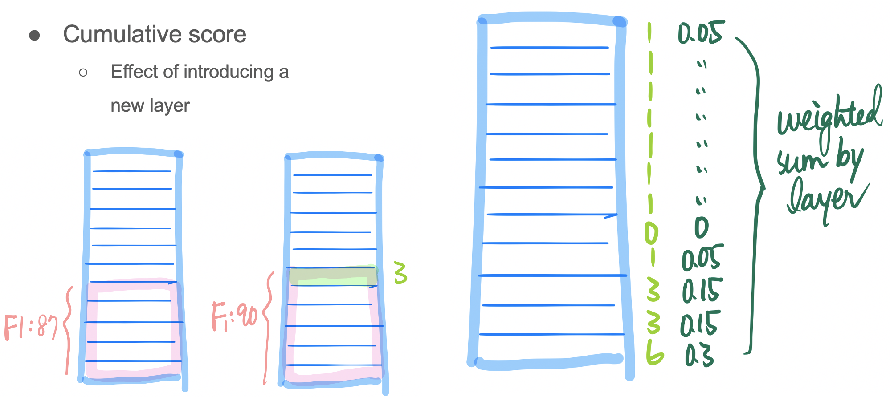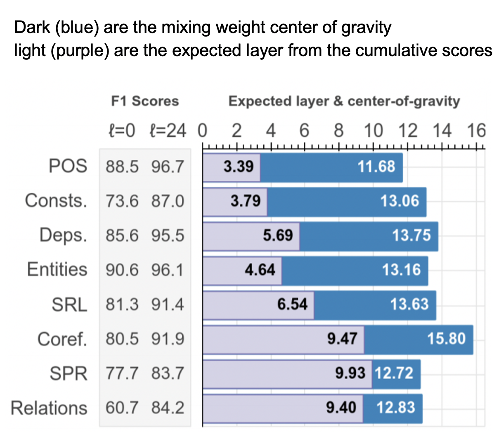

     

3. What does BERT might not learn?

   - 使用Unsupervised constituency parsing的Probing task。对于英文而言，有着“right-branching（右展）”的特性，如下图，即习惯使用后置的词汇进行修饰和补充说明。本节就是研究BERT是否学习到了这一点。

     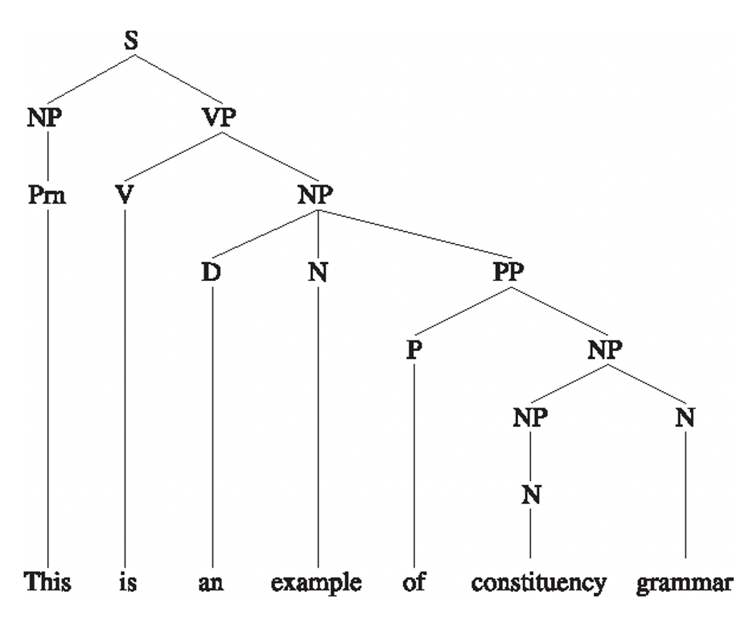
     
   - 使用BERT Representation，通过计算词汇两两之间的相似度（红色），找到相似度差异最大的地方进行分割。有些图可知在“example”和“of”之间的差异最大，应该在此处分割，但是这种分割方法是错误的。于是给相似度加上一个“right-branching bias”，即越靠左的相似度将会加上一个比较大的bias（橙色），这样就可以进行一些纠正。即便如次，BERT Representation + “right-branching bias”的效果仍然不如一些简单的模型。由此得出，BERT Representation可能没有学到英文“right-branching“的特性，或是该特性经过BERT后很难被检测到。

     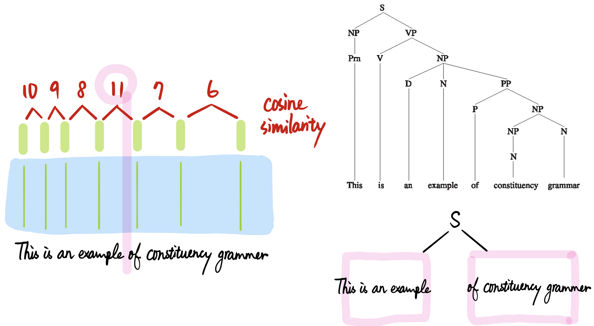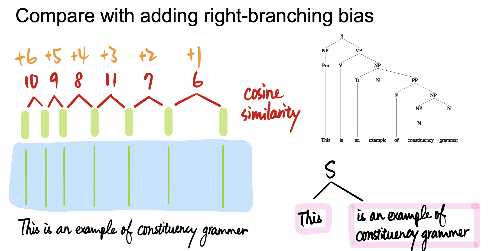
     
     

4. What is a good prob?

   - Probing Model需要足够简单，因为将BERT Representation接到Probing Model后，如果达到不错的效果且Probing Model足够小，才能充分的说明BERT Representation蕴含了很多有价值的信息。如果Probing Model比较复杂的话，那可能并不是BERT Representation好，只是Probing Model的能力比较强

   - 如果Probing Model采用Linear Classifier，能够达到不错的效果，可以说明BERT Representation蕴含了很多有价值的信息。但是如果效果不好，不能说明BERT Representation没有学到东西，有可能学到的是线性不可分的信息

   - 如果Probing Model采用Multi-layer perceptrons，一层或两层是可行的，层数太多的话模型的capacity就会过高

   - 一些学者认为，BERT每一层的输出包含两部分（混杂在一起）。一部分与其相应的输入对应，代表该输出是由哪一个输入主要生成的，称为Identity；另一部分是其他输入经过Self-Attention融合进来的，称为Extra-info。

     - 首先定义”什么是不好的Probing Model“，即满足可以从Representation中分辨出Identity且可以将任何一个词对应到预先定义的其他label上。比如”I study at NTU“，在语料库里建立规则，将其对应到”主 动 介 名“。如果Probing Model看到study时，能够认出其动词的inentity，并且可以将其识别为其他词性，都认为其实不好的Probing Model

       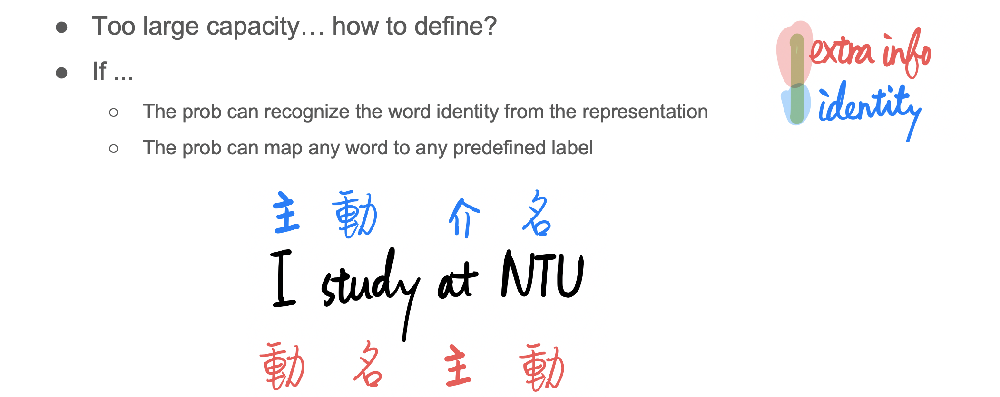

     - 定义了Selectivity指标进行测评

       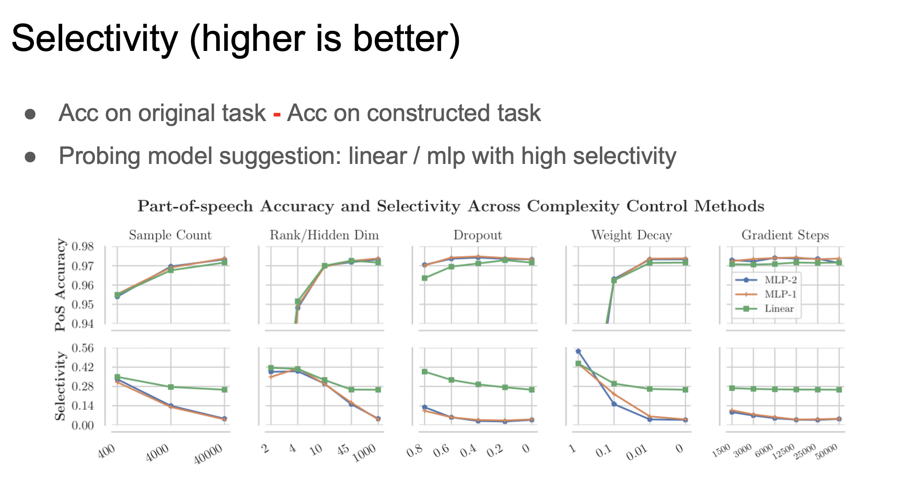

   

#### 3.Explain a trained model - HeatMap（Activation map \ Attention map）
1. Activation Map：CNN Dissection

   - 具体细节参照提出Broden Dataset的文章

2. Attention map as explanation

   - 假设有一个Query “How is the movie？”，使用Attention的方法会和每个词的Representation进行比较，最后得出结果。如下图，Query和“good”的Attention Score较高，所以最后的输出更加依靠于“good”

     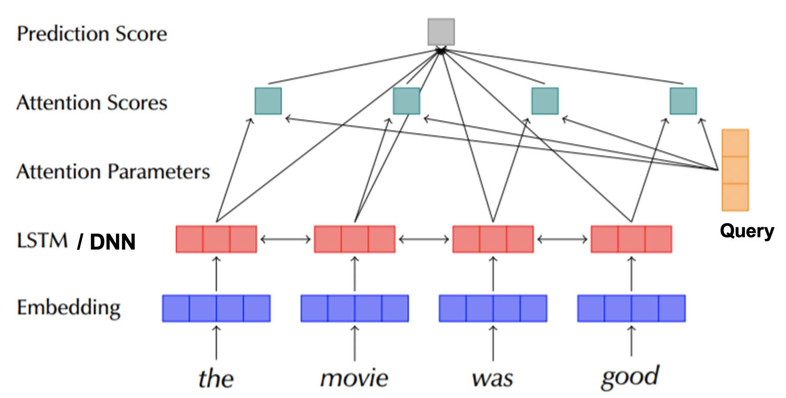

   - 因为比较复杂的LSTM/DNN过程（Encoder）将自身的信息和邻居的信息进行了融合，所以如何判断最后的输出确实是依赖于输入词“Good”，而不是依赖于其他词汇融合进来的部分也是一个研究课题，验证方法就是计算attention score和Attribution之间的相关性。（Paper：Attention is not Explaination）

     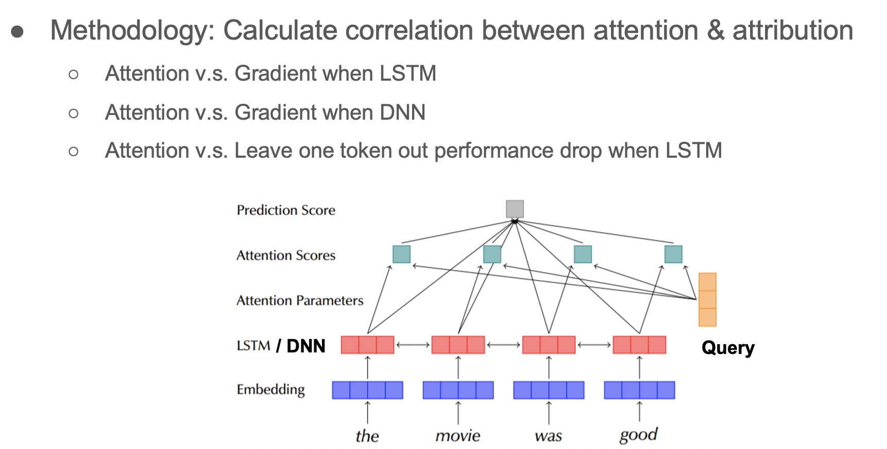
   
   - 实验结果显示使用LSTM时，要比DNN的相关性更低。当Encoder使用的是DNN时，Attention是可解释的；当Encoder是contextualized（上下文关联的、语境化的）时，Attention不一定是可解释的，可以使用Guided-DNN framework进行验证。
   
   - Further Reading：[On Identifiability in Transformers](https://arxiv.org/abs/1908.04211)、TLDR
   
     

#### 4.Create an explainable model

1. CNN Explainable Model的难点

   - Activation map is complicated in final layers

   - Visualize a category meaningfully is not easy（解释机器认为猫长什么样子）

     

2. Constraining activation map

   - At some final layer, regularize the activation map as some templates

   - The paper design the loss with complicated information theory...

   - The idea is in fact quite intuitive已

     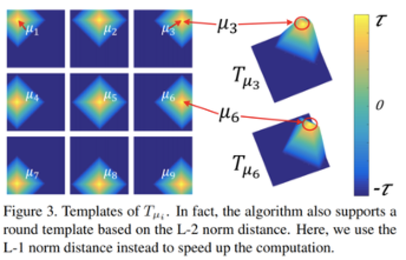

     

3. Encoding Prior

   - 如何根据图片找到对应的类别和描述一个类别具体的特征是两个不对等的事情。

   - Encoding prior就是GAN或Generative CNN（[Your ](https://arxiv.org/abs/1912.03263)[Classifier ](https://arxiv.org/abs/1912.03263)[is Secretly an Energy Based Model and You Should Treat it Like One](https://arxiv.org/abs/1912.03263)）

     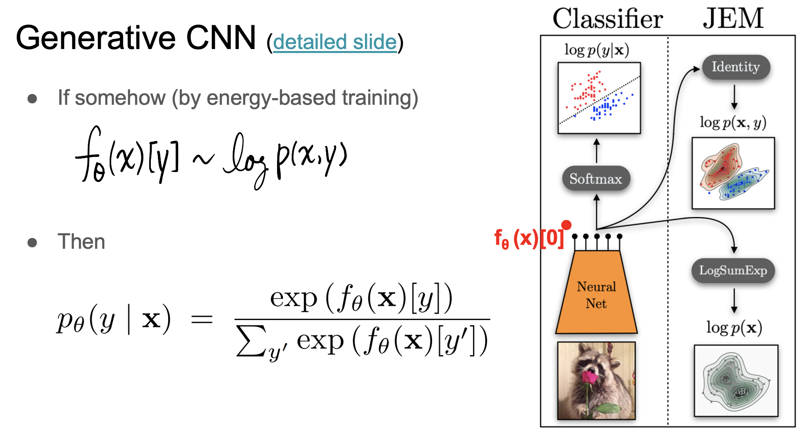
   
   - Adversarial training 也可以做出不错的 encoding prior效果（[Image Synthesis with a Single (Robust) Classifier](https://arxiv.org/abs/1906.09453)）
   
     

