# Chapter 13 - Attck and Defense（Part 1）

[Abstract](#Abstract)

[1.Introduction](#1)

​		[1.1 Attack Model基本原理](#1.1)

​		[1.2 如何求解Attack Model](#1.2)

​		[1.3 Example](#1.3)

[2.Attack Approaches](#2)

​		[2.1 Related References](#2.1)

​		[2.2 Fast Gradient Sign Method (FGSM)](#2.2)

​		[2.3 White Box v.s. Black Box](#2.3)

​		[2.4 Universal Adversarial Attack](#2.4)

​		[2.5 Adversarial Reprogramming](#2.5)

​		[2.6 Audio Attack & Text Attack](#2.6)

[3.Defense](#3)

​		[3.1 Passive Defense](#3.1)

​		[3.2 Proactive Defense](#3.2)

#### Abstract：机器学习虽然有很强的能力，但是也需要考虑恶意攻击的可能性，提高模型的鲁棒性。俗话说，“知彼知己，百战不殆”，首先需要了解怎么攻击一个机器学习模型，然后才能研究如何防范

#### 1.Attack Model

1. Attack Model基本原理

   - 假设有一个图片识别系统。给定一张图片，网络识别出是Tiger Cat的概率是0.64。在原始图片$\begin{pmatrix} x_1 \\ x_2 \\ x_3 \\ x_4 \end{pmatrix}$的基础上，增加一个特殊的噪声$x'=\begin{pmatrix} \Delta x_1 \\ \Delta x_2 \\ \Delta x_3 \\ \Delta x_4 \end{pmatrix}$，得到与原始输入似的Attacked Image  $x'=x^0+\Delta x$。将Attacked Image作为输入会得到截然不同的答案。

      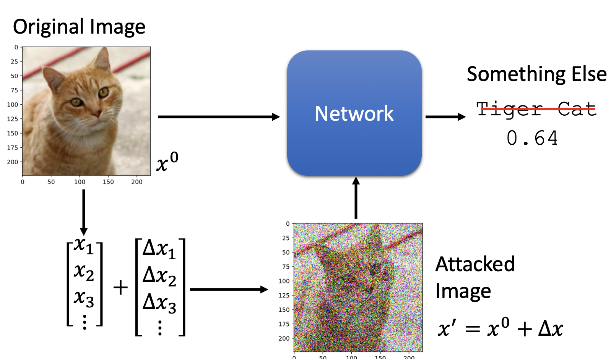

   - 对于正常的NN Model，$x^0$经过模型$f_\theta$得到输出$y^0=f_\theta（x）$，模型的目标是最小化$y^0$和$y^{true}$之间的差异，即损失函数为：$L_{train} (θ)=C(y^0,y^{true})$。训练过程输入是固定的，调整的是模型的参数$\theta$。对于这种模型的攻击，分为Non-targeted Attack和Targeted Attack。

      - Non-targeted Attack指给输入加上一个噪声$x'$后，让输出与$y^{true}$的差异尽可能的大，损失函数可以表示为$L(x^′)=-C(y^′,y^{true})$，即与模型的损失函数恰好相反。攻击模型的训练方法是，网络的参数已知并固定，调整输入。

      - Targeted Attack指给输入加上一个噪声$x'$后，让输出与$y^{true}$的差异尽可能的大，同时与$y^{false}$尽可能接近，$y^{false}$是攻击者预先设计好的错误结果，损失函数可以表示为$L(x^′ )=-C(y^′,y^{true})+C(y^′,y^{false} )$，即与模型的损失函数恰好相反。攻击模型的训练方法是，网络的参数已知并固定，调整输入。

      - 再进行上述两者的攻击时，都需要加入一个约束$d(x^0,x')\le \varepsilon$，表示恶意输入和正常输入的差距足够的小，才能保证不被发现。

         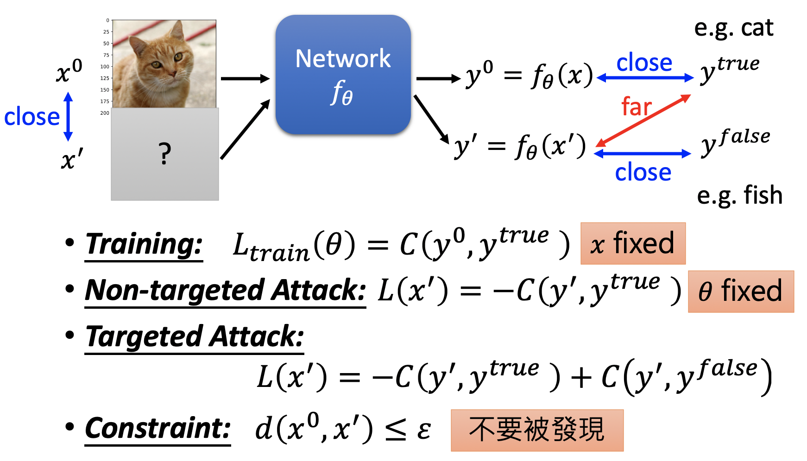

   - 关于$x^0$和$x'$的差异 $d(x^0,x')$有两种定义方式，L2-Norm和L-Infinity。已知$\Delta x=x'-x^0$，展开表示为$\begin{pmatrix} \Delta x_1 \\ \Delta x_2 \\ \Delta x_3 \\ \Delta x_4 \end{pmatrix}=\begin{pmatrix} x_1' \\ x_2' \\ x_3' \\ x_4'\end{pmatrix}-\begin{pmatrix} x_1 \\ x_2 \\ x_3 \\ x_4 \end{pmatrix}$。

      - L2-Norm指$d(x^0,x')=||x^0-x'||_2=(\Delta x_1)^2+(\Delta x_2)^2+(\Delta x_3)^2+···$

      - L-Infinity指$d(x^0,x')=||x^0-x'||_\infty=max\{\Delta x_1,\Delta x_2,\Delta x_3,···\}$

      - 假设一个图片有4个pixel，共有12个数值。一种方式是对每个pixel做小小的改动，另一种是只对其中一个pixel做稍大的改动。两种改动的L2-Norm值是相同的，但是后者的L-Infinity值更大。此时L2-Norm已经无法描述肉眼可以观察出的差异，所以一般在影响攻击时会使用L-Infinity

         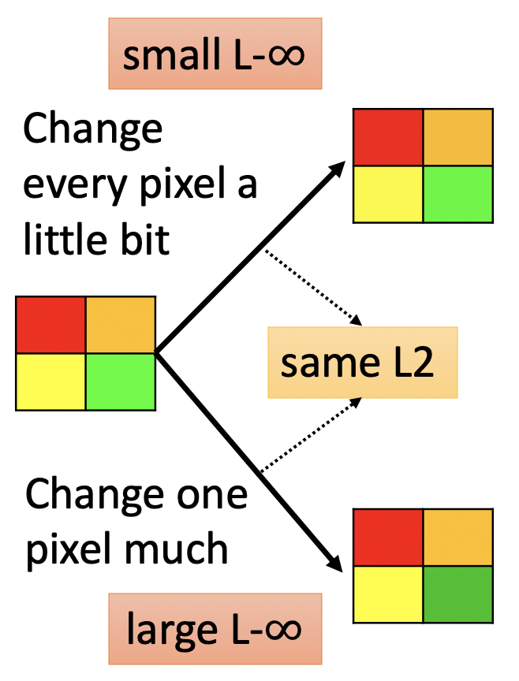

      

2. 如何求解Attack Model

   - 在第一小节描述的攻击模型的最终目标可以描述为找到一个$x^*=arg \max \limits_{d(x^0,x')\le \varepsilon}L(x')$，寻找$x^*$的过程类似于训练神经网络的梯度下降过程。网络的训练是不断调整模型参数$\theta$最小化损失函数，此处是不断调整$x'$最小化损失函数，在梯度下降的同时使用$\varepsilon$对更新过程进行限制。

   - Attack Model的训练方法如下：

      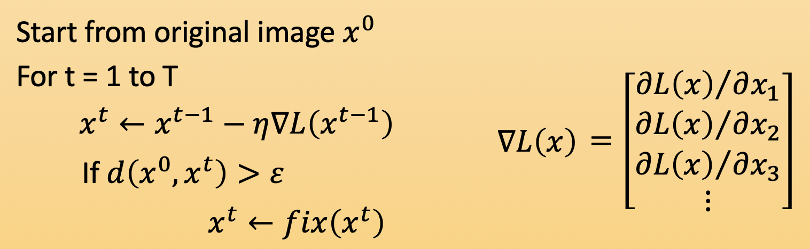

   - 函数$fix(x^t)$的功能是，假设$t$时刻更新至$x^t$，但$x^t$不满足$d(x^0,x')\le \varepsilon$限制，$fix(x^t)$会在$x^0$（金黄色点）周围$\varepsilon$的距离内进行穷举，寻找一个距离$x^t$最近的$x$（橙色点）来代替$x^t$（蓝色点）。其中L-Infinity的边界是正方形的原因是因为橙色点的横坐标和纵坐标与金黄色点的差值均等于$\varepsilon$，符合其定义。

      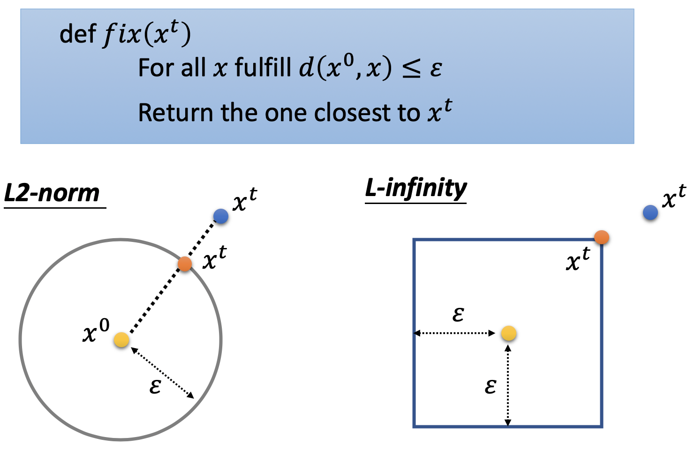

   

3. Example

   - 神经网络模型采用ResNet-50。给定一张图片，其标签为Tiger cat，希望攻击后给出的标签是Star fish。实验结果显示攻击前Tiger cat的概率是0.64，攻击后给出Star fish的概率是1.00

     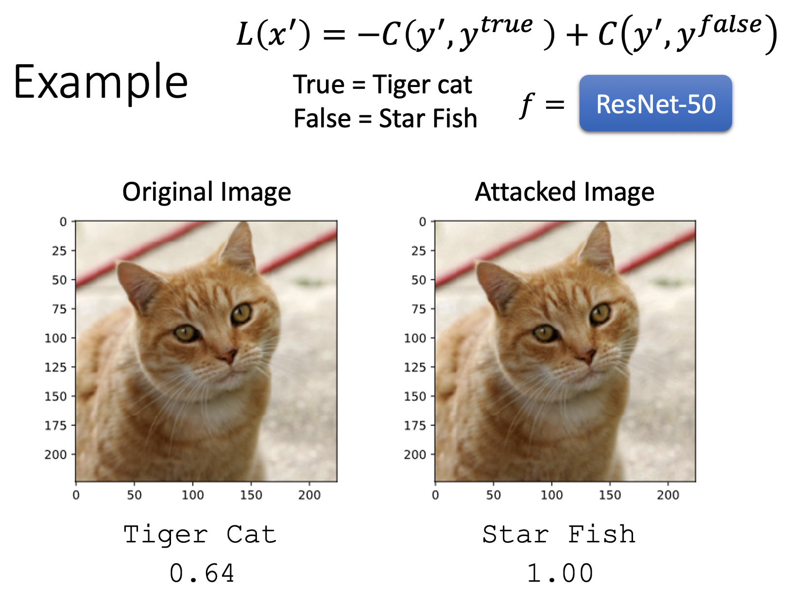

   - 将两张图片相减放大50倍，可以得到两张图片的结果

     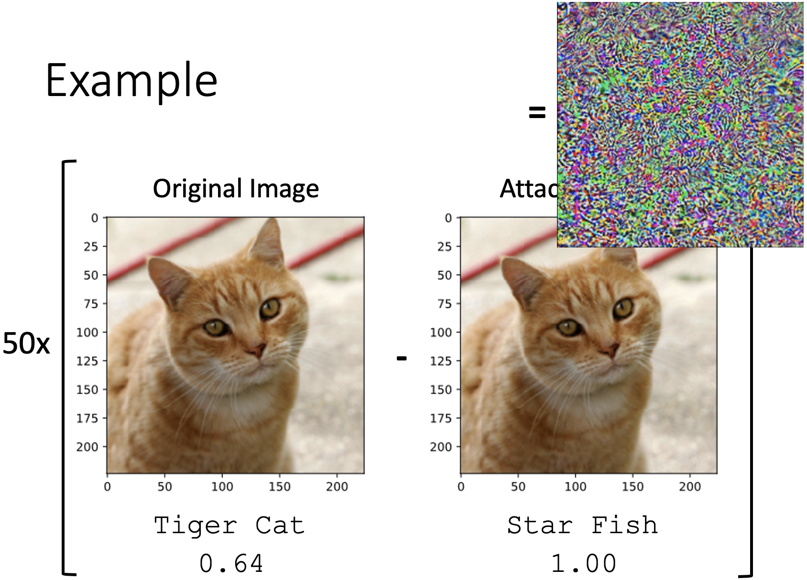

   - 攻击模型时，对原始图片增加的噪声是经过梯度下降计算出来的。如果随意的增加噪声，并不能有效地对模型攻击。如下图所示，随机的增加噪声，只要到噪声达到一定程度时，才会扰乱机器的判断

     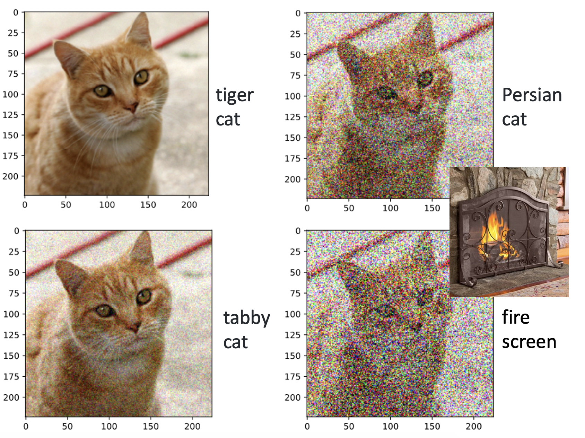

   - 假设原始图片$x^0$是某个高维空间中的一个点，红色线表示判断为Tiger cat的信心值，蓝色线表示判断为Egyptian cat的信心值，绿色线表示判断为Persian cat的信心值。如果将这个点随机的小范围移动，将其判断为Tiger cat的信心值始终会维持一个较高的水平。但是在高维空间中，存在一些特殊的方向（右图），只要沿着这个特殊的方向移动一点点，将其判断为Tiger cat的信心值会快速下降，将其判断为其他无关实物的信心值会快速上升。

     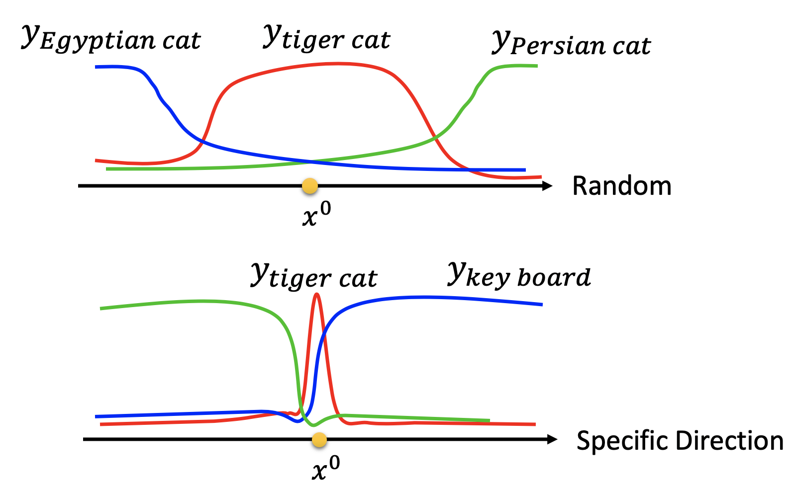

     

#### 2.Attack Approaches

1. Related References

   - 虽然各种攻击方法层出不穷，但其实质就是使用不同的constrain进行距离约束和使用不同的最优化算法求解。以下列出了一些典型案例：

     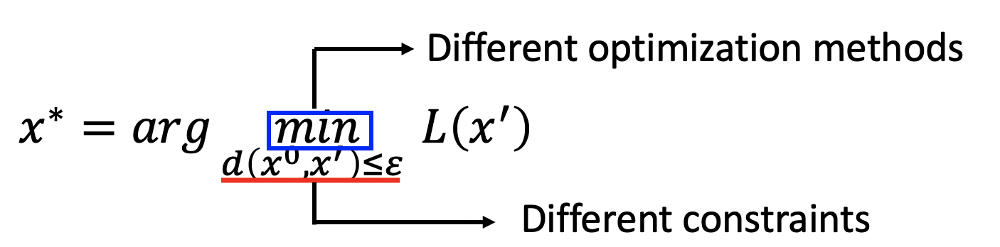

     

     - FGSM (https://arxiv.org/abs/1412.6572)
     - Basic iterative method (https://arxiv.org/abs/1607.02533)
     - L-BFGS (https://arxiv.org/abs/1312.6199)
     - Deepfool (https://arxiv.org/abs/1511.04599)
     - JSMA (https://arxiv.org/abs/1511.07528)
     - C&W (https://arxiv.org/abs/1608.04644)
     - Elastic net attack (https://arxiv.org/abs/1709.04114)
     - Spatially Transformed (https://arxiv.org/abs/1801.02612)
     - One Pixel Attack (https://arxiv.org/abs/1710.08864)

     

2. Fast Gradient Sign Method (FGSM)

   - FGSM虽然不是最强大的方法，但是确实一种比较简单的方法。思路为求解损失函数对于每个维度输入的偏微分，作为符号函数的输入，$\Delta x=\begin{pmatrix} sign(\partial L/ \partial x_1) \\ sign(\partial L/ \partial x_2) \\ sign(\partial L/ \partial x_3) \\ ·  \\ · \end{pmatrix}$。即如果某个维度的微分为正，则为1；反之则为-1。寻找最优解$x^*$的方法是$x^* \leftarrow x^0 - \varepsilon\Delta x$，其实际含义为对初始输入的每一个维度增加或减少一个$\varepsilon$的量。

   - 假设FGSM使用的是L-Infinity距离，在$x^0$处算出的梯度为蓝色箭头。如果使用梯度下降的方法求解，会将$x^0$更新到$x^1$处；如果使用FGSM的方法，会将$x^0$更新到$x^*$处。由此可以看出FGSM方法看中的不是梯度的大小，而是梯度的方向。相较于梯度下降，FGSM相当于设置了一个较大的learning rate。如果learning rate过大，导致结果落在了方形之外，也会根据约束将其拉回到顶角的位置

     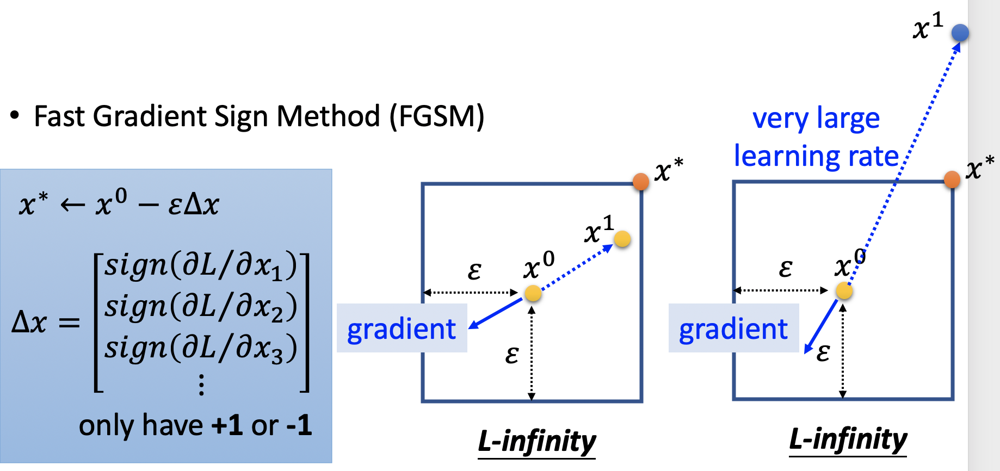

     

     

3. White Box v.s. Black Box

   - White Box：在已知神经网络的参数$\theta$时，固定参数$\theta$调整输入$x$的攻击方式称为White Box Attack

   - Black Box：在不知道神经网络参数时进行的攻击。（https://arxiv.org/pdf/1611.02770.pdf）

     - 如果我们可以获得目标神经网络的训练数据时，可以使用该数据集自行训练一个Network Proxy。在Network Proxy上训练white box attack，得到的攻击样本一般也可以对目标神经网路进行有效攻击
     - 如果我们无法获得目标神经网络的训练数据时，可以利用神经网络的API接口，通过输入数据，获得输出，自行构建input-output pairs
     
     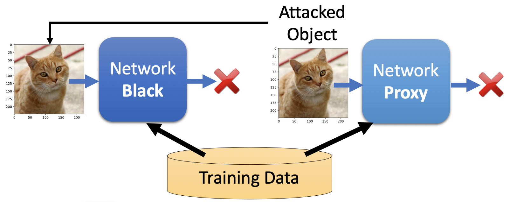
     
     

5. Universal Adversarial Attack

   - 上述章节的攻击方式都是针对于特定的输入求解出特定的噪声，将二者加和在一起进行攻击。有学者提出一种Universal Adversarial Attack的攻击方式，旨在寻找具有一定通用性的噪声进行攻击，具体参见论文https://arxiv.org/abs/1610.08401。

5. Adversarial Reprogramming 

  - 通过给输入增加噪声的方式，改变神经网络的现有功能，比如从动物识别转换到矩形识别（*Gamaleldin* *F.* Elsayed, Ian Goodfellow, Jascha Sohl-Dickstein, “*Adversarial Reprogramming of Neural Networks*”, ICLR, 2019）

6. Audio Attack & Text Attack

  - https://nicholas.carlini.com/code/audio_adversarial_examples/

  - [https://adversarial-attacks.net](https://adversarial-attacks.net/)

  - https://arxiv.org/pdf/1707.07328.pdf

    

#### 3.Defense
1. Passive Defense

   - Passive Defense指的是在不改变神经网络模型的前提下，想办法去发现那些被恶意篡改的输入。如下图所示在神经网络前增加一个Filter，过滤输入图片中的噪声。Filter的常见方法为对图像的像素进行平滑化，可以降低一些恶意噪声的作用，同时不妨碍正常图片的识别。

     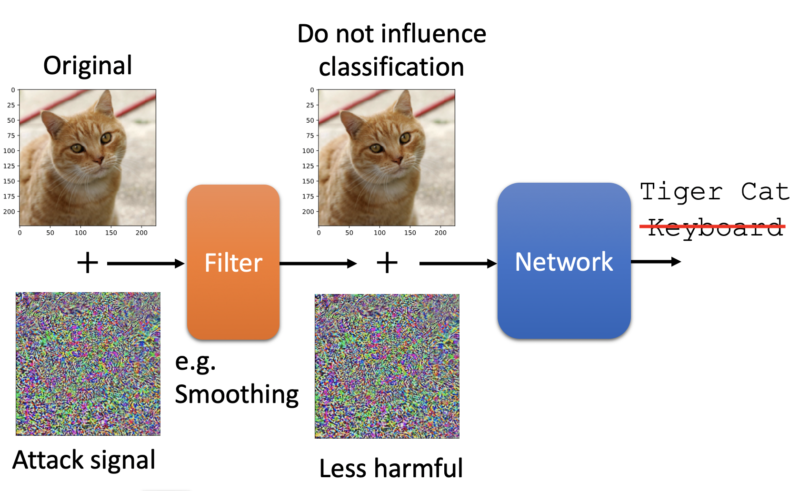

     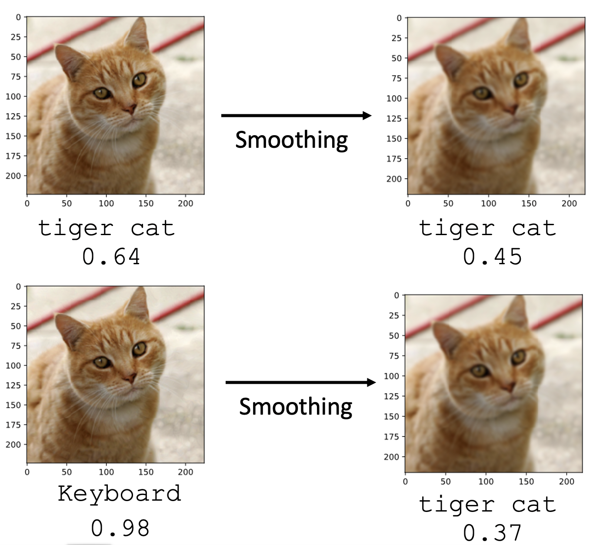

   - 图中的squeezer就是Filter。Feature Squeeze的想法是将图像的原始输入，经过不同squeezer的输入都送入网络进行预测，对三种预测结果进行综合判断。（https://arxiv.org/abs/1704.01155）

     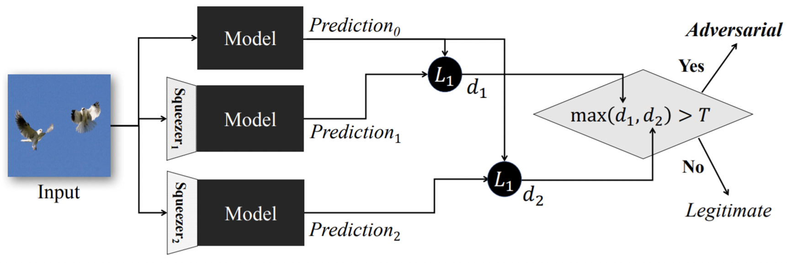

   - Randomization at Inference Phase指对输入进行随机的缩放、阴影重叠等，然后进行预测（https://arxiv.org/abs/1711.01991）

     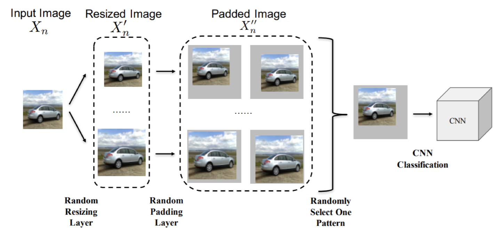

   - 假设Passive Defense的Filter的防御机制被泄露的话，那么Passive Defense同样是可以被攻击的。相当于可以把Filter看做神经网络的一层，就可以用传统的方法进行攻击

     

2. Proactive Defense

   - Proactive Defense的基本原理就是找出神经网络的漏洞，并进行补丁。通过在数据集中增加恶意输入的方式增强模型的鲁棒性

   - 基本算法如下：每一次内循环遍历一次恶意输入$\widetilde{x}^1，\widetilde{x}^2，···，\widetilde{x}^N$，一次内循环结束后可能弥补了一些漏洞，但是可能会引入新的漏洞，所以需要外循环$T$次。如果恶意输入$\widetilde{x}^1，\widetilde{x}^2，···，\widetilde{x}^N$是通过A方法生成的，那么该模型还是会被B方法进行攻击。所以目前Machine Learning Attack是比较被难防御的

     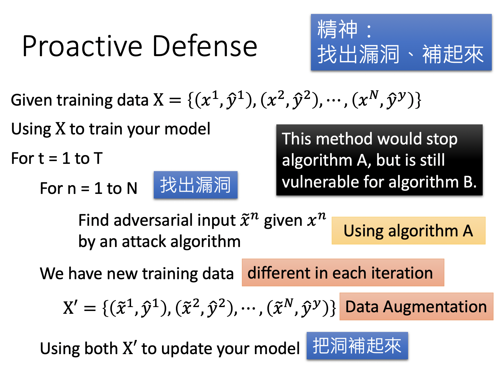

     
