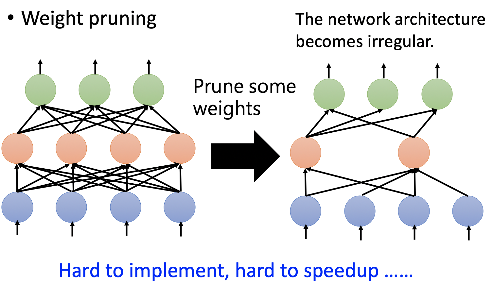

# Chapter 14 - Network Compression（Part 1）

[Abstract](#Abstract)

[1.Network Purning](#1)

​		[1.1 神经网络修剪的基本原理](#1.1)

​		[1.2 Network Pruning - Practical Issue](#1.2)

[2.Knowledge Distillation（知识蒸馏）](#2)

​		[2.1 Knowledge Distillation基本原理](#2.1)

​		[2.2 训练技巧](#2.2)

[3.Parameter Quantization](#3)

​		[3.1 Parameter Quantization的三种解决方案](#3.1)

​		[3.2 Binary Connect Network](#3.2)

[4.Architecture Design](#3.2)

​	[4.1 隐层的增加与参数的减少](#4.1)

​	[4.2 Depthwise Separable Convolution](#4.2)

​	[4.3 More Related Paper](#4.3)

[5.Dynamic Computation](#5)

​	[5.1 计算资源与计算目标的动态调整](#5.1)

#### Abstract：由于一些智能家居或移动设备的资源有限性，比如有限的存储空间、有限的计算能力等等，这些设备上搭载的神经网络不能够太大太复杂，否则设备可能会过载运转。因此需要研究网络压缩技术降低神经网络的规模。

#### 1.Network Purning

1. 神经网络修剪的基本原理

   - Network Purning可行的原理是神经网络通常是over-parameterized，许多的链接权重和神经元都是冗余的，所以有效地进行修剪并不会有影响网络的功能。

   - Network Purning的一般步骤为：

      - 具备一个Large Pre-trained Network；

      - 评价权重的重要性（观察数值的大小，越接近0越不重要。或L1、L2范式）；

      - 评价Neuron的重要性（观察神经元的输出分布，频繁输出接近0的值代表越不重要）；

      - 移除不需要的链接和神经元，得到一个比较小的网络；

      - 移除后，网络的准确性可能会稍稍的下降，因为移除的大多是没有用的链接和神经元

      - 为了弥补准确性，在数据集上重新训练一次，进行Fine-tune

      - 如果得到了满意的网络，就可以结束；通常一次不会删除过多的链接和神经元，因为删除过多的话没有办法通过Fine-tune进行恢复。所以此时可能网络的规模没有小到满意的程度，可以回到step 2重复进行即可

         

   - 使用Network Purning，而不是直接研究如何训练一个小的神经网络的原因是：①小型的神经网络难以训练，大的神经网络容易做到最优化，不会被局部最优等问题困扰（https://www.youtube.com/watch?v=_VuWvQUMQVk ）；②Lottery Ticket Hypothesis（https://arxiv.org/abs/1803.03635）研究说明直接将修剪后神经网络结构重新随机初始化，无法训练出有效地模型。将大网络训练时随机初始化的权重（红线）直接拷贝过来，Sub-NN是可以有效训练的。这项研究提出的大乐透假设指出，对于一个小的神经网络，有的初始值是可以得出结果的，有的初始值是无法得出结果的。大的神经网络容易训练的原因是，其包含着很多小的神经网络，通过随机初始化权重，总能碰到一个可以成功训练的小网络。

      

   - 在与Lottery Ticket Hypothesis同年的ICLR‘2019的会议上，其他学者提出小网络是可以训练的。（https://arxiv.org/abs/1810.05270）

      

2. Network Pruning - Practical Issue 

   - Weight pruning会导致网络结构的不均衡，有的神经元有2个输入，有的神经元却有三个输入。这样的网络在代码实现上比困难，难以用CPU加速（无法进行矩阵运算）。一种解决方案将修剪掉的链接权重设为0，这样虽然可以进行矩阵运算，但实际上只是“鸵鸟策略”，网络的大小并没有改变。（https://arxiv.org/pdf/1608.03665.pdf）

      

   - Neuron Purning是比较容易实现并使用GPU加速的。

      

   

#### 2.Knowledge Distillation（知识蒸馏）

1. Knowledge Distillation基本原理

   - 先训练一个Large Neural Network，大的神经网络也不一定会百分之百的正确。然后在训练一个Small Neural Network去模仿Large Neural Network的行为，如Large Neural Network得出的预测结果是“1”: 0.7, “7”: 0.2. “9”: 0.1。那么就是用交叉熵最小化的方式去让Small Neural Network产生同样的输出。（https://arxiv.org/pdf/1503.02531.pdf；Do Deep Nets Really Need to be Deep? ；https://arxiv.org/pdf/1312.6184.pdf）

     

   - Student Network模仿Teacher Network的可行性来源于，Teacher Network能够提供比data和label更丰富的信息。如上图所示，Teacher Network不但会知道当前输入是“1”的可能性最大，还会知道"1"、"7"、"9"之间具有一定的相似性。Knowledge Distillation的提出论文中指出，在Student Network的训练过程中，即便数据集中剔除所有与“7”相关的数据，但是训练完成后其仍然可以辨识出数字“7”，该过程就是从Teacher Network中学习到的。

   - Knowledge Distillation的应用场景为：参加机器学习竞赛的常用手段是Ensembel技术，虽然该技术在比赛中可以略微的提高正确率。但是在实际应用中，不可能在设备上同时跑成百个模型，然后去Ensemble。此时，可以对训练处的各类模型做知识蒸馏，让Small Neural Network去学习Ensemble的过程。

   - 知识蒸馏在实践过程中的使用价值还有待验证，LHY老师的课题组初步使用知识蒸馏并没有得到很好的结果

     

2. 训练技巧

   - 在最后的输出层，需要对输出做Softmax。假设$x_i$表示最后一层的输出，$y_i$表示Softmax后的值。通常的Softmax指的是$y_i=\frac{exp(x_i)}{\sum_j exp(x_j)}$，此时为了让Teacher Network的输出保留更多的信息，而不是尽可能的与标签相似，需要在Softmax中加入“Temperature”的概念，即$y_i=\frac{exp(x_i/T)}{\sum_j exp(x_j/T)}$

     
     
     

#### 3.Parameter Quantization
1. Parameter Quantization的三种解决方案

   - Parameter Quantization的两种解决方式是：①使用更少的bits去存储每一个变量；②Weight Clustering；③对于常出现的参数利用Huffman encoding等方式进行压缩

   - Weight Clustering指的是，利用聚簇手段对参数进行分类，在参数存储时，存储参数所属的类别和类别对应表即可。

     
     
     

2. Binary Connect Network

   - Binary Connect指的是只是用+1或-1标记网络的权重，即网络权重二值化。下图表示一个参数空间，每一个灰色的点都代表一组二值化的权重。Binary Connect Network的训练与普通神经网络的训练很相似，蓝色的点表示正常网络的梯度下降方向，Binary Connect Network每次都会选取距离蓝色点最近的灰色点进行参数的更新

     
   
   - Binary Connect： https://arxiv.org/abs/1511.00363 
   
   - Binary Network：https://arxiv.org/abs/1602.02830
   
   - XNOR-net：https://arxiv.org/abs/1603.05279
   
   - Binary Connect的实验结果表明，一定程度上还要优于正常网络。原因是，Binary Weight相当于对网络增加了一下正则化的条件。（https://arxiv.org/abs/1511.00363）
   
     
   
     
   

#### 4.Architecture Design

1. 隐层的增加与参数的减少

   - 对于Fully Connected Network，前一层有$N$个神经元，后一层有$M$个神经元，两层之间的权重为$W$，参数量为$N\times M$。通过结构重新设计的方法减少权重数量，会在两层之家增加$K$个Linear Hidden Neuron，参数量为$N\times K+K\times M$，如果保证$K$的值不要太大，则可以保证$(N+M)\times K<N\times M$。但是增加一个隐藏层会使得$U\times V$的秩小于$W$，即降低了模型Capacity

     

     

2. Depthwise Separable Convolution

   - Standard CNN Review：假设Input Feature Map为$6\times 6$的矩阵，有两个channels。共有四组Filter，每个Filter与输入对应也有两层。参数量为72。

     

   - Depthwise Separable Convolution：将卷积操作拆分成两个操作。参数量为26。

     - Depthwise Convolution：Filter的数量等于Input Channel的数量，每个Filter只关心一个channel。

       

     - Pointwise Convolution：因为上一步不同的channel之间没有关联，所以此时使用$1\times 1$的两层Filter处理不同channel之间的关系。

       

   - Standard CNN与Depthwise Separable Convolution对比：在Standard CNN中，相当于18个输入产生一个输出；Depthwise Separable Convolution的输出来自于中间产物，中间产物是由输入在不考虑channel时经过卷积得到的。相当于将18个输入拆解成2份，分别处理（参数共用达到减少参数量的目的）。处理完成后再综合起来得到输出。

     

   - 参数量的理论计算：$I$表示Input Channel的数量，$O$表示输出channel的数量，$k\times k$表示卷积核的大小。两种参数量的比值为$\frac{1}{O}+\frac{1}{k\times k}$，即参数量缩小$k^2$倍

     

     

3. More Related Paper

   - SqueezeNet：https://arxiv.org/abs/1602.07360

   - MobileNet：https://arxiv.org/abs/1704.04861

   - ShuffleNet：https://arxiv.org/abs/1707.01083

   - Xception：https://arxiv.org/abs/1610.02357

     

#### 5.Dynamic Computation

1. 计算资源与计算目标的动态调整

   - Dynamic Computation指根据计算资源的多少动态调整计算目标。如果计算资源充足，就算出最优的结果；如果计算资源匮乏，就降低计算标准，先求有再求好。

   - 实现策略：

     - 方案一为提前训练出各种计算能力的神经网络，根据实际情况选择相应的网络。该方案由于要存储大量的神经网络，不具有实践性。
     - 方案二为训练一个可以根据Hidden Layer的结果进行分类的神经网络。该方案的缺点在于，神经网络的前几层抽取的都是比较简单的Pattern，根据这些信息进行分类，效果可能不是很好。如下图所示，越深层的隐层输出会得到更好的结果。除此之外，研究发现在隐层增加Classifier会影响整个网络的性能。以CNN为例，正常的CNN前几层学习到的是比较简单的信息，但是在前几层加Classifier会要求前几层就学习更多的信息，这违背了CNN架构的初衷。

     

     