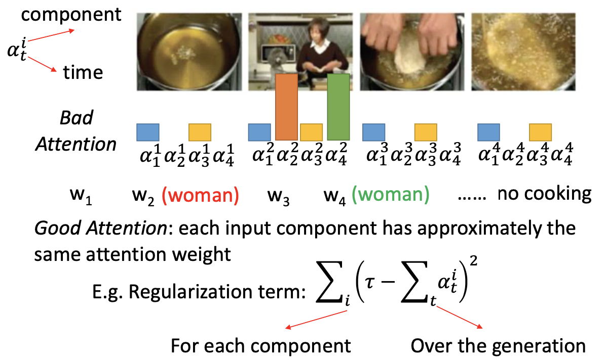

# Chapter 15 - Conditional Generation by RNN & Attention

[Abstract](#Abstract)

[1.Generation](#1)

​		[1.1 Structured Object Generation Model](#1.1)

​		[1.2 Conditional Generation](#1.2)

[2.Attention（Dynamic Conditional Generation）](#2)

​		[2.1 Attention-based Model](#2.1)

​		[2.2 Machine Translation with Attention-based Model](#2.2)

​		[2.3 Speech Recognition with Attention-based Model](#2.3)

​		[2.4 Image Caption with Attention-based Model](#2.4)

​		[2.5 Memory Network](#2.5)

​		[2.6 Neural Turing Machine](#2.6)

[3.Tips for Training Generation Model](#3)

​		[3.1 Attention Weight Regularization](#3.1)

​		[3.2 Mismatch between Train and Test](#3.2)

​		[3.3 Beam Search（束搜索）](#3.3)

​		[3.4 Object level v.s. Component level](#3.4)

[4.Pointer Network](#4)

​		[4.1 Pointer Network基本原理](#4.1)

[5.Recursive Structure](#5)

​		[5.1 Sentiment Analysis Application](#5.1)

​		[5.2 Function f 的内部细节](#5.2)

​		[5.3 More Application](#5.3)

#### 1.Generation

1. Structured Object Generation Model

   - Generation指的是Generating a structured object component-by-component。一个句子就是一个Structured Object，由Characters或Words组成的（英文中character指字母，word指空格分隔的单词；中文里word指一个有意义的单位，比如“葡萄”是一个Word，“葡”和“萄”是character）。

   - 以RNN为基础的Chinese Character-Generator如下图所示，输入一个起始符<BOS>，会得到一个分布输出，根据分布sample出相应的汉字。将这个汉字再次输入网络，就可以得到下一个汉字。以此类推。

     

   - 以RNN为基础的Image Generator，图片也可以被转换为一个描述像素的句子。

     

   - 上述的以RNN为基础的Image Generator会有一些弊端，比如黄色的pixel对灰色pixel的影响大于蓝色pixel的影响，这是不符合常规认识的。解决方法是使用Tri-dimensional Grade LSTM，增加模型的输入。

     

   - Related Paper：

     - Image
       - Aaron van den Oord, Nal Kalchbrenner, Koray Kavukcuoglu, Pixel Recurrent Neural Networks, arXiv preprint, 2016
       - Aaron van den Oord, Nal Kalchbrenner, Oriol Vinyals, Lasse Espeholt, Alex Graves, Koray Kavukcuoglu, Conditional Image Generation with PixelCNN Decoders, arXiv preprint, 2016
     - Video
       - Aaron van den Oord, Nal Kalchbrenner, Koray Kavukcuoglu, Pixel Recurrent Neural Networks, arXiv preprint, 2016
     - Handwriting
       - Alex Graves, Generating Sequences With Recurrent Neural Networks, arXiv preprint, 2013 • 
     - Speech
       - Aaron van den Oord, Sander Dieleman, Heiga Zen, Karen Simonyan, Oriol Vinyals, Alex Graves, Nal Kalchbrenner, Andrew Senior,Koray Kavukcuoglu, WaveNet: A Generative Model for Raw Audio, 2016

   

2. Conditional Generation

   - 在实际应用中，可能需要的不仅仅是单独的生成一个句子，而是根据当下的情景生成形影的句子。

     
   
   - Image Caption Generation：将Image Input送入CNN转换为一个Vector， 然后将该Vector送入RNN产生相应的句子。
   
     
   
   - Machine translation / Chat-bot：将Input Setence编码为一个Vector（Encoder），然后送入RNN（Decoder）。Encoder和Decoder是Jointly Train。
   
     
   
   - 在Long-term Chat-bot中，机器当前的对话需要考虑之前说过的所有内容，才能更具有逻辑性。一种实现方法是，将之前的内容都进行Encoder，然后统一送入Decoder去学习。（Serban, Iulian V., Alessandro Sordoni, Yoshua Bengio, Aaron Courville, and Joelle Pineau, 2015 "Building End-To-End Dialogue Systems Using Generative Hierarchical Neural Network Models.）
   
     
   
     
   

#### 2.Attention（Dynamic Conditional Generation）

1. Attention-based Model

   - 在Conditional Generator中为了让Decoder能够始终记住输入的内容，会将Encoder的输入在每一个时刻都送入Decoder，即Decoder每个时刻的输入都是相同的。Dynamic Conditional Generation的目标就是让Decoder的输入是动态的，每个时刻的输入都是不同的，即每个时刻会考虑更重要的内容。

     

2. Machine Translation with Attention-based Model

   - 已知一个Input Sentence，会经过RNN进行处理，每个character在每个时间点都可以使用Hidden Layer的输出进行表示。初始的Vector $z^0$作为模型的参数。首先使用Match函数对$z^0$和$h^1$进行比较，得出$\alpha^1_0$。Match函数可以自行设定，比如计算Cosine Similarity，或是一个small NN（输入是$z、h$，输出是一个scalar），或是包含参数$W$（输出为$\alpha=h^TWz$）。Match函数中的参数时和网络的其他部分共同训练得出的。

     
     
   - 以此类推，可以得到$\alpha^1_0、\alpha^2_0、\alpha^3_0、\alpha^4_0$，经过Softmax后为$\hat{\alpha}^1_0、\hat{\alpha}^2_0、\hat{\alpha}^3_0、\hat{\alpha}^4_0$。然后计算$c^0=\sum \hat{\alpha}^i_0 h^i$，图中的$c^0=0.5h^1 + 0.5h^2$，表示此时的输入由“机”和“器”两个字变换而来。

     

   - $c^0$作为Decoder的输入，输出为对应的英文翻译“machine”。$z^1$是Decoder中Hidden Layer的输出，使用$z^1$作为再做一次Match，得到$\alpha^1_1、\alpha^2_1、\alpha^3_1、\alpha^4_1$，经过Softmax后为$\hat{\alpha}^1_1、\hat{\alpha}^2_1、\hat{\alpha}^3_1、\hat{\alpha}^4_1$。然后计算$c^1=\sum \hat{\alpha}^i_1 h^i$，$c^1$就是Decoder下一个时刻的输入。图中的$c^1=0.5h^3 + 0.5h^3$，表示此时的输入由“学”和“习”两个字变换而来。于是产生的输出就是“Learning”。

     

   - 以此类推，就可以实现Dynamic Conditional Generation，每个时刻的输入都是不同的。

     

3. Speech Recognition with Attention-based Model

   - 在产生每一个character时会根据match score选取不同的讯号（红框）进行处理。（William Chan, Navdeep Jaitly, Quoc V. Le, Oriol Vinyals, “Listen, Attend and Spell”, ICASSP, 2016）

     

     

4. Image Caption with Attention-based Model

   - 在Text领域可以使用一个Vector代表一个句子，在Image领域需要使用一组Vector代表一张图片，每个Vector都是CNN中一个Filter的输出，表示一个Region。使用$z^0$对每个vector计算match score，根据Match Score进行Weight Sum，加权结果作为Decoder的输入。以此类推，再使用$z^1$对每个vector计算match score得到第二个输入。

     
     
   - 实验结果（Kelvin Xu, Jimmy Ba, Ryan Kiros, Kyunghyun Cho, Aaron Courville, Ruslan Salakhutdinov, Richard Zemel, Yoshua Bengio, “Show, Attend and Tell: Neural Image Caption Generation with Visual Attention”, ICML, 2015）：根据一张图片，产生一个描述。产生下划线的词语，就是根据高光的地方进行的。上图为正确的描述，下图为错误的描述。

     
     
     
     
   - 实验结果（Li Yao, Atousa Torabi, Kyunghyun Cho, Nicolas Ballas, Christopher Pal, Hugo
    Larochelle, Aaron Courville, “Describing Videos by Exploiting Temporal Structure”, ICCV, 2015）
     
     
     
     

5. Memory Network

   - Memory Network最常被用在Reading Comprehension中，给定一个问题进行作答。（Sainbayar Sukhbaatar, Arthur Szlam, Jason Weston, Rob Fergus, “End-To-End Memory Networks”, NIPS, 2015）。Document被描述为多个句子$x^1、x^2、···、x^N$，根据Query构造Vector $q$ ，并计算match score $\alpha^1、\alpha^2、···、\alpha^N$。然后对输入做weight sum得到$z = \sum\limits^N_{n=1}\alpha_n x^n$，输入DNN中得到Answer。图中Sentence to Vector的部分也可以进行联合训练。

     

   - Memory Network的更复杂版：计算Match Score的部分和抽取Information的部分使用不同的Representation，效果可能会更好。将Document里面的句子描述为两组Vector $x^1、x^2、···、x^N$和$h^1、h^2、···、h^N$。$x^i$计算Match Socre，$h^i$表示文本。Extracted Information可以表示为$\sum\limits^N_{n=1}\alpha_n h^n$，作为DNN的输入可以产生Answer，同时也可以和$q$进行加和得到新的$q$进行重复计算，不断思考。

     

   - 对于Hopping过程的，可以理解为利用不同的q多次进行Compute Attention和Extract Information，得到一个更复杂的Decoder输入。

     

   - Tree-structured LSTM + Attention（Wei Fang, Juei-Yang Hsu, Hung-yi Lee, Lin-Shan Lee, "Hierarchical Attention Model for Improved Machine Comprehension of Spoken Content", SLT, 2016）

     

     

6. Neural Turing Machine

   - Neural Turing Machine不但可以从memory中读取信息，而且还可以通过attention机制修改memory中的信息（https://www.quora.com/How-does-the-Von-Neumann-architecture-provide-flexibility-for-program-development）

   - 已知一组Long Term Memory $m^1_0、m^2_0、m^3_0、m^4_0$和一组初始权重$\hat{\alpha}^1_0、\hat{\alpha}^2_0、\hat{\alpha}^3_0、\hat{\alpha}^4_0$，二者进行weighted sum可以得到$r^0=\sum\hat{\alpha}^i_0 m^i_0$。将$r^0$送入另外一个Network $f$（实际上为一个Controller），$r^0$和第一个时间点的输入$x^1$作为输入，得到输出$k^1、e^1、a^1$，这三个向量用于操控Memory。

     

     - $k^1$：与$m_o^i$计算余弦相似度，在经过Softmax得到新的权重$\hat{\alpha}^1_1、\hat{\alpha}^2_1、\hat{\alpha}^3_1、\hat{\alpha}^4_1$，该过程是简化版本，实际的过程如下图所示

       

     - $e^1$与$a^1$：$e^1$介于0~1之间，用于清除Memory中的值；$a^1$用于向Memory中写入数据。$m_1^i=m_0^i-\hat{\alpha}^i_1e^1 \otimes m^i_0+\hat{\alpha}^i_1a^1$，如果某一个attention值比较大（$\hat{\alpha}_1^2$），则会对其进行较大的改动。

       

   - 根据新的Memory值就可以计算$r^1$，得到新的输出$y^2$。以此类推。

     

     

   

#### 3.Tips for Training Generation Model
1. Attention Weight Regularization

   - 在Video Caption中，模型会给视频的每一帧计算一个Attention值 $\alpha_t^i$，上标表示component，下标表示time，$\alpha_1^i$对应输出$word_i$。有时候会产生不好的Attention，如下图所示，在产生$word_2$和$word_4$的过程中，第二帧图像的attention都比较好，则或产生“X woman X woman”的输出。（Kelvin Xu, Jimmy Ba, Ryan Kiros, Kyunghyun Cho, Aaron Courville, Ruslan Salakhutdinov, Richard Zemel, Yoshua Bengio, “Show, Attend and Tell: Neural Image Caption Generation with Visual Attention”, ICML, 2015）

     
     
   - Good Attentin需要满足每一个component都有着大概相同的Attention Weight。实现方法有很多种，以正则化为例：$\sum_i(\tau -\sum_t\alpha^i_t)^2$，其中$\tau$为一个超参，表示components在所有时间点的attention值之和。

     

2. Mismatch between Train and Test

   - Attention-based Model在训练和测试中会出现mismatch的问题。假设已知句子“ABB”为目标Sentence，粉红色方块表示condition。训练过程中，输出是从Output Distribution中Sample出一个值，同时该时间点的Reference值会作为下一个时间点的输入，用于指导下一个输出的形成。训练目标为Minimizing cross-entropy of each component。

     
   
   - 在测试过程中，由于没有参照目标 Reference的存在，每一次从Output Distribution中Sample出的值，会作为下一时刻的输入。假设第一个值的输出与Reference不同，那么其会误导后续的生成过程。这种现象叫做Exposure Bias。
   
     
   
   - Exposure Bias会导致“一步错，步步错”的问题。上面的树的左枝代表的训练过程，下面的树代表测试的过程。假设在测试过程，第一次选择了“B”分支，那么此时神经网络在训练中并没有学习过“B”分支应该怎么走，那么之后的决定都可能是错误的。
   
     
   
   - 解决方案一：在Training过程中，不再把Reference的值作为下一个时刻的输入，而是将网络当前时刻的输出作为下一时刻的输入。这种训练方法虽然可以保证训练和测试过程的一致性，但是在实践中，是很难训练的。在t时刻，梯度会指导网络增加A的概率，但是输出B作为t+1时刻的输入时，梯度会指导网路增加B的概率。但是t时刻增加A的概率，如果输出变成了A。网络就会不知所措，因为之前t+1时刻，输入为B，会增加B。现在输入为A，还是增加A。两次学习到的知识就是相反的，所以训练效果不好。
   
     
   
   - 解决方案二（Scheduled Sampling）：按照一定的几率，将Reference或Network Output作为下一时刻的输入。概率的的设计方式如下图，三种方式没有明显的差异，纵轴表示Reference作为输入，横轴表示output作为输入。初始阶段都是完全将Reference作为下一时刻的输入，随着时间的增加，Model Output作为下一时刻输入的概率逐渐增加。（Samy Bengio, Oriol Vinyals, Navdeep Jaitly, Noam Shazeer, Scheduled Sampling for Sequence Prediction with Recurrent Neural Networks, arXiv preprint, 2015）
   
     
   
     
   
     
   
3. Beam Search（束搜索）

   - Testing过程中，$t_0$时刻的输出为{A：0.6；B:0.4}，因此将“A”作为下一个时刻输入；$t_1$时刻的输出为{A：0.4；B:0.6}，因此将“B”作为下一个时刻输入；$t_3$时刻的输出为{A：0.4；B:0.6}，因此将“B”作为下一个时刻输入。经过上述过程，产生的输出为“A B B”，概率为$0.6*0.6*0.6$，这是一种Greedy Search的过程。但是贪心搜索的方式并不一定能够得到最优结果。因为可能存在“B B B”的输出，概率为$0.4*0.9*0.9$。

     

   - 在实际过程中，这颗搜索树的规模是非常大的，每一个分支的数量都是英文单词库的大小，所以不可能遍历所有的可能性。于是提出一种介于贪心和暴力之间的解决方案，称为Beam Search。Beam Search的核心思想为在每一层都保留概率比较高的几个输出，最后计算概率最高的一条路径。以Beam Size=2为例

     

   - 一个Beam Size为3的例子（https://github.com/tensorflow/tensorflow/issues/654#issuecomment-169009989）

     

   - 在训练过程中，在得到一个输出的分布后，需要sample出一个值作为下一个时刻的输入。而不直接把整个分布作为下一个时刻输入的原因是：假设一个”Query：你觉得如何？“，一个“Answer：高兴想笑 or 难过想哭”。在左图的结构中，给定初始字符<BOS>后，产生的输出分布中，高兴和难过的概率大概应该是相等的。如果sample出“高兴”，那么下一个时刻的输出中，“想笑”的概率就要大一些；如果sample出“难过”，那么下一个时刻的输出中，“想哭”的概率就要大一些。在右图的结构中，给定初始字符<BOS>后，产生的输出分布中，高兴和难过的概率大概应该是相等的。将这个分布直接作为下一时刻的输入，那么下一时刻产生“想笑”和“想哭”的概率也大致相同，所以会产生“高兴想哭”和“难过想笑”之类的输出。所以右图的结构是不好的。

     

     

4. Object level v.s. Component level

   - 以Image Caption为例，模型的主要任务产生一个Sentence，而不是一个Word。因此在评判输出的好坏时，不能局限于每个Word。在训练中，Sunshine函数一般使用的是每个时刻产生Word的Cross Entropy之和，即$C=\sum\limits_tC_t$。下图中纵轴为Cross Entropy之和，横轴为训练时间。在初始阶段，输出“A cat a a a”是一个不好的输出，对应的损失函数值也较高；经过一段训练后，输出“The dog is is fat”是一个不合文法的句子，但是其和目标输出“The dog is running fast.”比较接近，他的损失函数值和目标句子的损失函数值差异很小，之后的训练过程就比较慢。因此使用Cross Entropy之和作为损失函数，会出现最开始梯度下降的很快，但是经过一段时间后，就会进入梯度下降很慢的阶段，训练的成本会变高。

     

   - 解决上述问题的办法是，使用object-level criterion代替component-level cross-entropy作为损失函数。假设存在某种度量标准$R（y，\hat{y}）$可以判定输出句子的好与坏，其中$y$为generated utterance，$\hat{y}$为ground truth。但是object-level criterion $R$是无法微分的，假设输出为“A B”，调整模型的参数后，模型输出的分布可能会产生一些小的变化，但是输出仍为“A B”。输出为同一个句子没有变化，那么衡量标准$R$的值也是相同的，不会变化。这就以为着模型的参数变化了，但是损失函数的值却没有变化，即$R$关于模型参数的微分为零，所以这种方法是没有办法进行梯度下降求解的。

   - 针对于object-level criterion的问题，FaceBook提出一个解决办法，使用Reinforcement Learning训练Generation Model（Marc'Aurelio Ranzato, Sumit Chopra, Michael Auli, Wojciech Zaremba, “Sequence Level Training with Recurrent Neural Networks”, ICLR, 2016）。将每个时刻输出分布中的每个可选项都作为一个Action，Sample出的值作为Action taken。RL可以根据Reward Maximization找到最合适的输出。

     

     

#### 4.Pointer Network

1. Pointer Network基本原理

   - 已知一些列点的坐标，Pointer Network的目标是找出其中的一部分点，将其依次连接后能够将剩余的所有点包围起来。网络的输入是所有点的横纵坐标，目标输出是“4 2 7 6 5 3”。

     
     
   - 上述问题中，网络的输入输出都是Sequence，于是套用Seq2Seq模型进行求解。输入仍是所有点的横纵坐标，输出是“1 4 2 END”。这样的套用是存在问题的，就是模型的输入和输出的长度是不定的。训练过程网络的输出是定长的（即在指定范围内选取数字作为输出），那么在应用过程中产生的输出也是定长的（无论输入了多少个数据点，其输出范围都是训练时候的范围），不会随着坐标数量的变化为变化。

     

   - 针对于输入输出长度不定的问题，对Attention的机制进行改造。在输入的最开始增加一个$(x_0,y_0)$表示”END“。使用key $z_0$对每个输入做Attention Weight。在传统的Attention-based Model中会使用Attention Weight对输入做Weighted Sum。此处不做Weighted Sum，而是将其作为一个分布直接输出，在分布中Sample出概率最大的值，以下图为例Encoder会输出“1”。数据点$(x_1,y_1)$会作为下一时刻Decoder的输入，计算新的key $z_1$。以此类推，该过程会在Decoder接收到“END”时结束。通过将整个数据点的分布直接作为Decoder的输入，使得每个数据点都有可能被输出。

     
     
   - Pointer Network虽然可以求解包围问题，其更重要的是应用场景是Summarize。Seq2Seq模型虽然可以解决Summarize问题，但是做摘要时会包括很多人名地名，可能受到训练样本的有限性，一些在训练中没有出现的人名地名，在实际应用中就不会输出，会导致一些错误。Pointer Network会直接在Encoder的输出分布中选择词汇，所以训练中没有遇到过的名词也有可能会被输出。下图的架构使用$p_{gen}$的概率使用传统方法或Pointer Network，结合起来计算。

     
     
   - Pointer Network在Machine Translation和Chat-bot上也有一定的应用

     
     
     

#### 5.Recursive Structure

1. Sentiment Analysis Application

   - Recursive Network是Recurrent Network的更General的形式，也可以说Recurrent Network是Recursive Network的Special Case

   - Sentiment Analysis指给定一个Sentence，对其进行情感的分辨。

     - 如果使用Recurrent Network进行求解，将每个Word Vector送入网络，将最后一个隐层的输出送到另外一个Function $g$中进行情感判断。
     - 如果使用Recursive Network进行求解，需要先决定四个input Word中间有什么关系。假设输入从左至右存在两两对应厝，首先将$x^1、x^2$送入一个Function中得到$h^1$，将$x^3、x^4$送入一个Function中得到$h^2$，将$h^1、h^2$送入一个Function中得到$h^3$，将$h^3$送到另外一个Function $g$中进行情感判断。其中为了保证Function $f$的反复使用，需要保证$x^i$和$h^i$具有相同的维度。

     

   - Detailed Case

     - 假设Word sequence为“not very good”，已知其文法结构是“very”和“good”组合在一起，然后在和”very“组成更高一层的结构。在该结构上运用Recursive Network的方法是：每个Word使用Embedding Vector表示，其维度为$|Z|$。首先将“very”和“good”送入一个Function $f$中得到输出，大小为$|Z|$，这个输出代表的就是“very good”的意思。

       

     - 其中Function $f$是一个比较复杂的结构，可以是神经网络等等。因为两个词的词性不是通过单个词性的简单加和构成的，比如“not”是neutral的，“good”是positive的，但“not good”是negative的。；“棒”是positive的，“好棒”是positive的，但“好棒棒”是negative的。

                 

     - Function $f$ 的情感辨别功能也是通过数据训练出来的，在第二层的 $f$ 得到了“not very good”的向量表示后，输出一个分布，然后和Reference Label进行比较，通过误差的反向传播，更新模型中每个Function的参数。

       

       

2. Function f 的内部细节

   - Function $f$ 的实现方案一：将输入"a"和“b”拼接起来，组成联合向量再乘以权重矩阵 $W$。这种实现方法的缺点在于"a"和"b"之间的交互过少，两者的component之间没有相互影响。

     

   - Function $f$ 的实现方案二（Recursive Neural Tensor Network）：将输入"a"和“b”拼接起来，组成联合向量 $x$，计算 $x^TWx$ 得到一个 $scalar=\sum\limits_{i,j}W_{i,j} x_i x_j$。为了可以和后半部分求和，需要对该操作重复一次，构成维度相同的矩阵，重复过程中 $W$ 为新的权重矩阵。

     

   - Function $f$ 的实现方案三（Matrix-Vector Recursive Network）：对Word进行Embedding时，会考虑两个因素，使Embedding的结果既包含自己本身的含义，又包含如何影响其他词汇的信息（此处有一个哲学性的问题，就是我们如何能保证一个embedding vector的前部和后部分别代表这两种信息。其实并不是我们通过某种方法使得两个部分拥有不同的含义，而是我们将其定义成这样的含义，经过不断地学习，这两个部分会慢慢的拥有这样的含义）。$a、b$ 代表inherent meaning，$A$ 代表how it changes the others。$a$ 会被 $B$ 所影响。$b$ 会被 $A$ 所影响。假设输入的单词是“not”和“good”，“not”本身可能没有什么意思，所以 $a$ 是一个近似于零的向量， $b$ 代表一个positive的向量；“good”不会对其他词产生过多的影响，所以 $B$ 是一个近似单位阵的矩阵， $A$ 代表一个负的单位阵，具有否定含义。使用权重矩阵$W、W_M$分别乘以两个部分，然后组合起来，就可以得到最后的输出。

     

   - Function $f$ 的实现方案四（Tree LSTM）

     

     

3. More Application

   - Recursive Network更善于处理Structured Data，比如数学公式等等
   - Recursive Network可以用在Sentence Relatedness上（Tai, Kai Sheng, Richard Socher, and Christopher D. Manning. "Improved semantic representations from tree- structured long short-term memory networks." *arXiv preprint arXiv:1503.00075* (2015).）

   
