# Chapter 16 - Self-Attention & Transformer（Part 2）

[Abstract](#Abstract)

[1.Transformer Family](#1)

​		[1.1 Transformer Review](#1.1)

​		[1.2 Sandwich Transformers](#1.2)

​		[1.3 Universal Transformer](#1.3)

[2.Residual Shuffle Exchange Network](#2)

​		[2.1 Switch Unit 和 Residual Shuffle Exchange Network](#2.1)

[3.BERT Family](#3)

​		[3.1 BERT](#3.1)

​		[3.2 ALBERT](#3.2)

​		[3.3 Reformer](#3.3)

#### Abstract：之前的章节讲述了一些基本的模型架构，比如Fully Connected Network、Convolutional Neural Network（CNN、ResNet、DenseNet、Inception Network）、Recurrent Neural Network（RNN、Seq2seq、LSTM、Pointer Network ）。很多学者会将各种神经网络叠加起来，然后开始手段调参，发现网络训练不起来。实际上要解决一个任务时，首先应该追溯前人的步伐（follow up SOTA Structure），这样能更快更好的效果，也能产生更多的发现。此外我们也需要更新的架构，这样我们才能实现：①Increase Performance（更好的性能）；②Extract better feature from data（更好的特征）；③Generalization（更好的泛化能力）；④Reduce Parameters or explainable（更少的参数）

#### 1.Transformer Family

1. Transformer Review
- - Transformer最开始的应用是做机器翻译，假设输入为Input，经过Embedding和Embedding with time signal后，输入Encoder得到最后一层的输入，然后送入Decoder进行计算。
  
  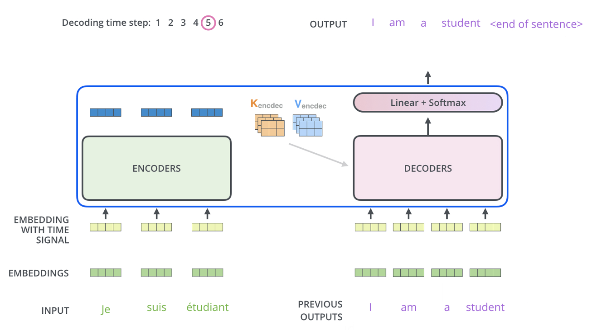
  
   - 其中Encoder和Decoder的具体结构为：
  
     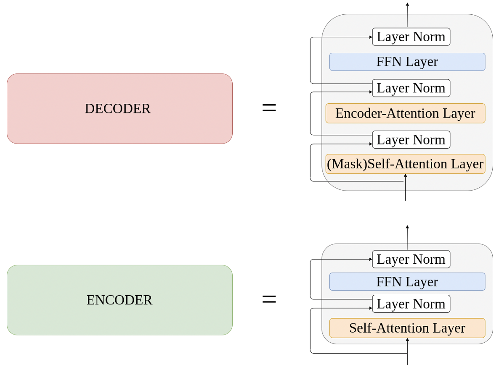
  
     
  
2. Sandwich Transformers

   - Sandwich Transformers提出的原因是为了设计一种更好的Transformer架构，其做法是交换Encoder和Decoder中Sublayer的顺序是否能够获得更好的效果。Sandwich Transformers的实验效果表明，更多的Self-Attention Layer靠近底层（输入），更多的Feedforward Layer更靠近顶层（输出），模型会获得更好的性能。与此同时，模型不需要额外的参数和存储空间。如下如，s表示Self-Attention Layer，f表示Feedforward Layer。

     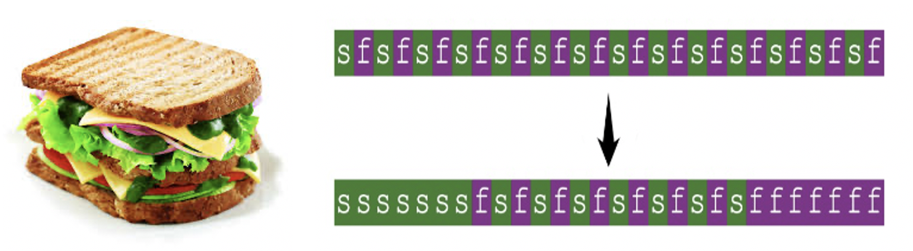

   - Sandwich Transformers的Paper中，在固定模型参数量的前提下，打乱Self-Attention Layer和Feedforward Layer的顺序，观察网络的性能变化。实验发现，网络性能对与层序的变化是比较随机的，有好有坏。

     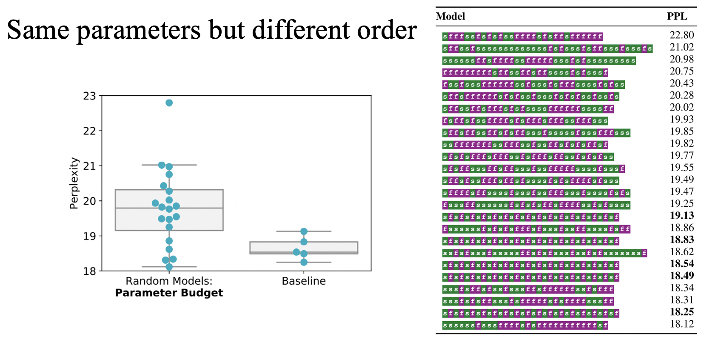

   - 实验同时发现，更多的Self-Attention Layer靠近底层（输入），更多的Feedforward Layer更靠近顶层（输出），模型会获得更好的性能。

     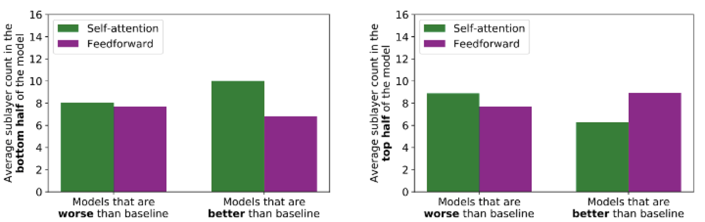

   - 至于，在靠近Input和Output的地方要叠多少层Self-Attention Layer和Feedforward Layer能够达到最好的效果，作者也进行了验证。发现6层的时候达到了最低的Perplexity。图中的两条虚线是普通Transformer的最好和最坏情况。

     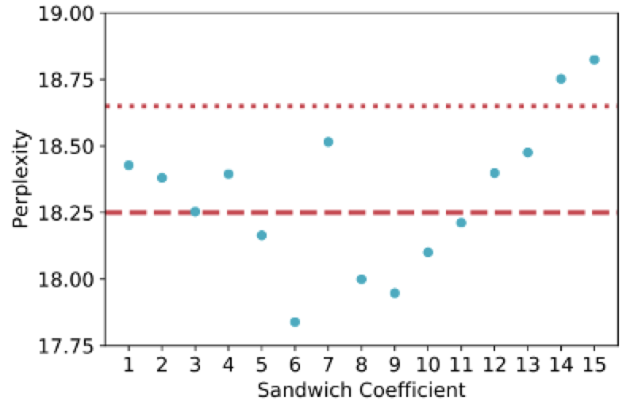

3. Universal Transformer

   - Transformer、Neural GPU、Neural Turing Machine三者提出时是为了解决不同的问题，Universal Transformer的提出是为了兼顾Translation和Algorithmic Task两种问题。在Universal Transformer中每个输入对应的参数都是相同的

     |                       | Translation | Algorithmic Task |
     | :-------------------: | :---------: | :--------------: |
     |      Transformer      |    Good     |       Bad        |
     |      Neural GPU       |     Bad     |       Good       |
     | Neural Turing Machine |     Bad     |       Good       |

     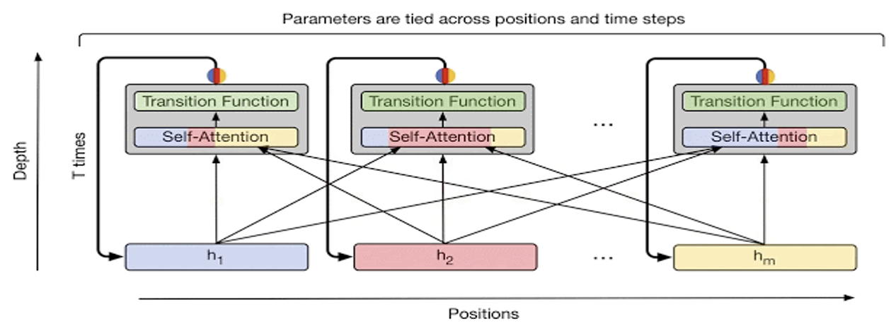

   - Universal Transformer中使用了Dynamic Halting，指每个输入对应的Encoder的层数是不一样的。Universal Transformer在足够的GPU资源下能够获得更好的表现。

     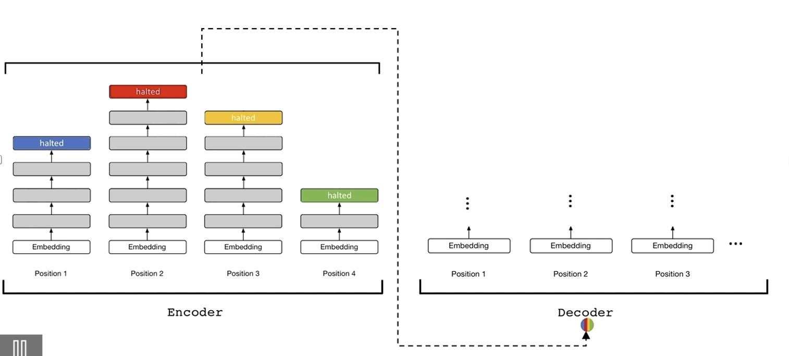

     

   

#### 2.Residual Shuffle Exchange Network

1. Switch Unit 和 Residual Shuffle Exchange Network

   - Residual Shuffle Exchange Network的特点为：①解决同一问题时，相比其他模型的参数量更少；②对于Sequence Processing问题的复杂度为 $O(nlogn)$，适合处理长序列问题；③Shuffle & Exchange operators可以获取较远上下文的信息，替代Attention过程。

   - Shuffle-Exchange Network：每个Switch Unit都会有两个Input。Shuffle-Exchange Network使用的是Perfect Shuffle，即将数据分为两队，然后将两队的元素依次交叉在一起。

     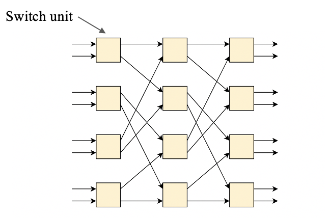                    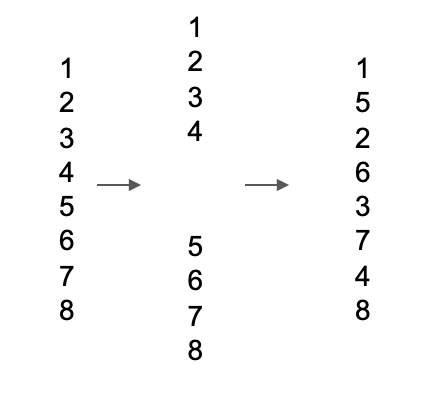
     
   - Perfect Shuffle在Shuffle-Exchange Network的具体使用方式为：

     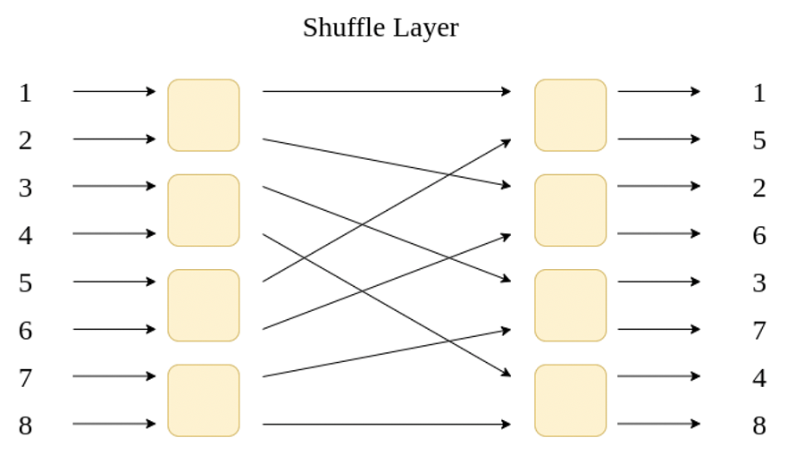
     
   - Perfect Shuffle在Exchange操作指，在Switch Unit中会进行SwapHalf操作

     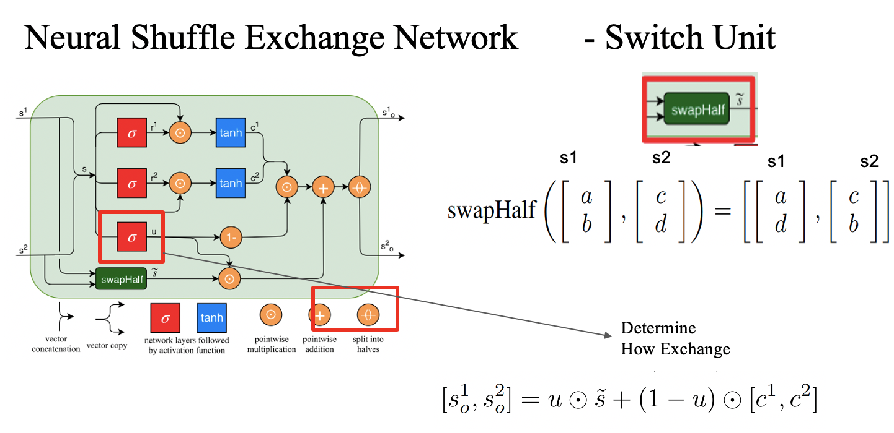
     
   - 在Switch Unit被提出后，作者在之后又提出了Residual Shuffle Exchange Network

     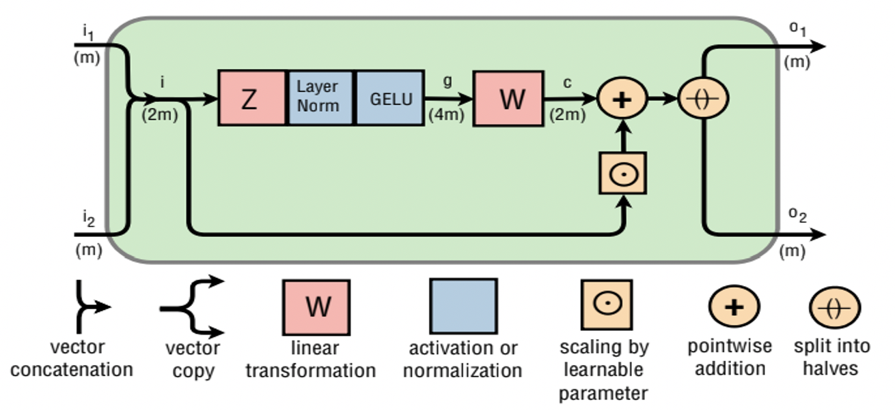
     
   - Residual Shuffle Exchange Network使用的并不是Shuffle Exchange Network，而是Bense Network。

     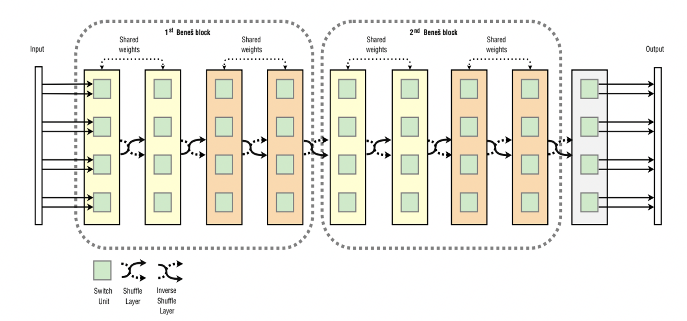
     
     

#### 3.BERT
1. BERT

   - BERT一共有12层，每一层都是一个Transformer Encoder。BERT的训练分为两部分，一个是Pre-Training（由Mask Language Model和Next Sentence Prediction组成），第二个是Fine-Tuning。

     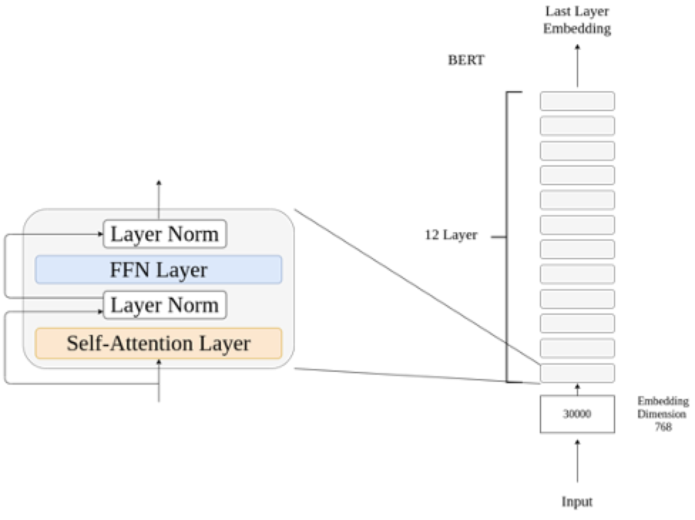

2. ALBERT（A Light BERT）

   - ALBERT相当于BERT的轻量级版，ALBERT将BERT中的12层不同参数的Transformer Encoder简化为一层Transformer Encoder重复12次，大大的减少参数量。
   
     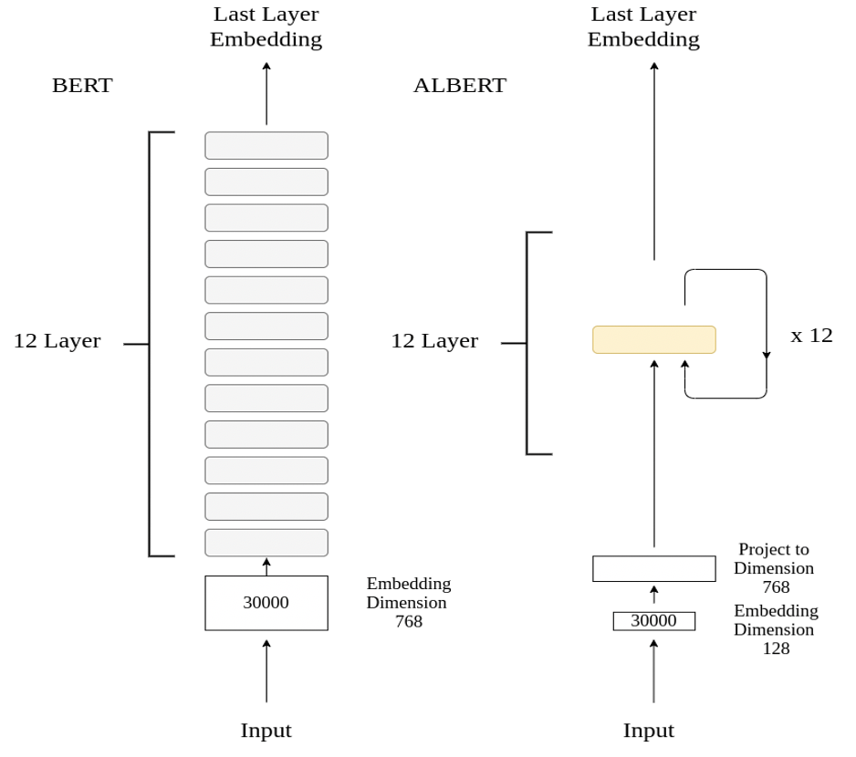
   
   - ALBERT和BERT的参数对比情况如下：
   
     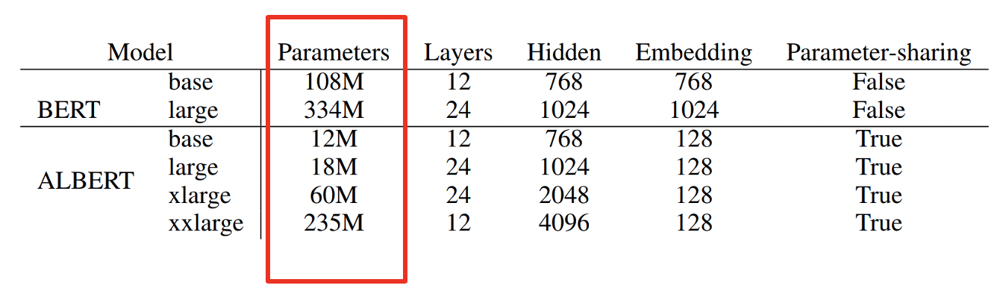
   
     
   
3. Reformer

   - 在Self-Attention计算时，复杂度为$O(n^2)$。Reformer的提出就是使用Hash FUnction解决复杂度过高的问题。
