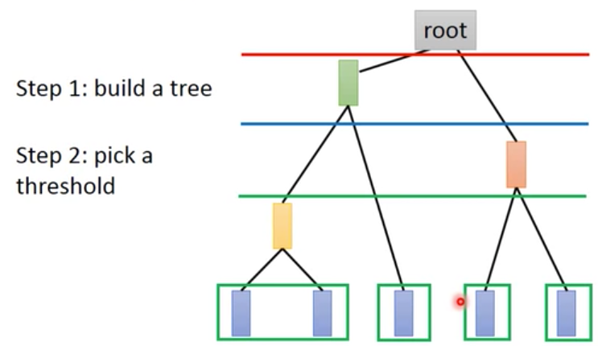
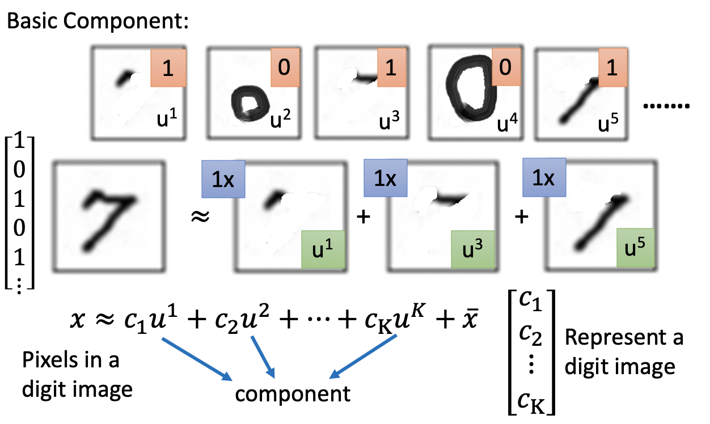

# Chapter 17 - Unsupervised Learning（Dimension Deduction）

[Abstract](#Abstract)

[1.Clustering Algorithm](#1)

​		[1.1 基本聚类算法](#1.1)

[2.Dimension Reduction](#2)

​		[2.1 Dimension Reduction的可行性分析](#2.1)

​		[2.2 Principle Component Analysis （PCA）](#2.2)

​		[2.3 PCA – Another Point of View（SVD）](#2.3)

​		[2.4 PCA与Auto Encoder](#2.4)

​		[2.5 Weakness of PCA](#2.5)

​		[2.6 PCA Application](#2.6)

​		[2.7 PCA与NMF](#2.7)

[3.Matrix Factorization](#3)

​		[3.1 矩阵分解的基本方法与在推荐系统中的应用](#3.1)

​		[3.2 矩阵分解在Topic Analysis中的应用](#3.2)

#### Abstract：Unspervised Learning可以分为两部分CLustering & Dimension Reduction（化繁为简）和Generation（无中生有）。本章节重点讲解Clustering和Linear Dimension Reduction

#### 1.Clustering Algorithm

1. 基本聚类算法

   - 聚类是一种无监督的学习的结果，聚类的结果就是产生一组集合，集合中的对象与同集合中的对象彼此相似，与其他集合的对象相异。

   - K-Means：先随机选取K个对象作为初始的聚类中心。然后计算每个对象与各个种子聚类中心之间的距离，把每个对象分配给距离它最近的聚类中心。聚类中心以及分配给它们的对象就代表一个聚类。一旦全部对象都被分配了，每个聚类的聚类中心会根据聚类中现有的对象被重新计算。这个过程将不断重复直到满足某个终止条件。终止条件可以是以下任何一个：①没有（或最小数目）对象被重新分配给不同的聚类；②没有（或最小数目）聚类中心再发生变化；③误差平方和局部最小。

   - Hierarchical Agglomerative Clustering（层次聚类，HAC）：不管是GMM，还是k-means，都面临一个问题，就是k的个数如何选取？为了不在这个参数的选取上花费太多时间，可以考虑层次聚类。假设有N个待聚类的样本，对于层次聚类来说，基本步骤就是：

     

     - （初始化）把每个样本归为一类，计算每两个类之间的距离，也就是样本与样本之间的相似度；
     - 寻找各个类之间最近的两个类，把他们归为一类（这样类的总数就少了一个）；
     - 重新计算新生成的这个类与各个旧类之间的相似度；
     - 重复2和3直到所有样本点都归为一类，结束。

   - 在Clustering中，每个对象都必须属于某一个类，但是这种表达方式是过于苛刻的，更好的表达方式是Distribution Representation。

     
     
     

#### 2.Dimension Reduction

1. Dimension Reduction的可行性分析

   - 以下图为例，在2-D的维度下问题更容易求解

     

   - 在MINIST中，一个数字需要用28\*28个维度进行表示。但是反过来，任意一个28\*28个维度的向量，将其转为图片格式，大多都不是数字，而是雪花状的。以不同形态的数字三为例，如果用28\*28个维度的向量的向量表示，那么数字三有很多种形态，如果用旋转角度表示，用一个维度就可以表示。

     

   - 实际上，Dimension Reduction就是寻找更简单更好的解释方法，去描述一个特征。将一个高维的特征转换为一个低维的特征。比如Feature Selection，将数据点绘制在二维的平面图上，发现$x_1$维度的数据没有太大作用，所以可以舍弃该维度，但是当任何一个维度的数据都有一些意义时，该方法就无法选取了。Principle component analysis （PCA）是通过线性变换的方法找出主要的影响因素。

     

     

2. Principle Component Analysis （PCA）

   - 假设需要将数据降到一个维度，即$z_1=w^1x$。令$||w^1||_2=1$，则$z^1$可以表示为$x$在$w^1$方向上的投影。如果希望将二维的数据降低到一维，那么目标就是选取一个$w^1$，使得投影后的$z_1$的Variance越大越好，即$Var(z_1)=\frac{1}{N}\sum\limits_{z_1}(z_1-\overline{z_1})^2$。最后的结果$z^1$可能是某一个隐藏的属性

     
     
   - 假设需要将数据降到两个维度，即$\left\{ \begin{eqnarray} z_1=w^1x \\ z_2=w^2x \end{eqnarray} \right.$  ，其中$z_1，z_2$需要满足方差尽可能的大，即$\left\{ \begin{align*} & Var(z_1)=\frac{1}{N}\sum\limits_{z_1}(z_1-\overline{z_1})^2 \quad ||w^1||_2=1 \\ & Var(z_2)=\frac{1}{N}\sum\limits_{z_2}(z_2-\overline{z_2})^2 \quad ||w^2||_2=1，w^1·w_2=0   \end{align*} \\ \right.$。矩阵形式表示为$z=Wx=\begin{pmatrix} {(w^1)}^T \\ {(w^2)}^T \\ · \\ · \end{pmatrix} x$，矩阵$W$为正交矩阵。

   - 使用拉格朗日乘数法解PCA：寻找$w^1$最大化$(w^1)^TSw^1$，$w^1$满足$‖w^1 ‖_2=(w^1 )^T w^1=1$。该问题的答案为$w_1$是协方差矩阵$S$最大特征对应的特征向量，$w_1$是协方差矩阵$S$第二大特征对应的特征向量。

     
     
     - 
     - 
     - 
     
   - PCA - decorrelation：经过PCA后的数据，维度之间会失去关联性。因为$z=Wx,cov(z)=D$。$D$是一个对角矩阵

     

3. PCA – Another Point of View（SVD）

   - 以手写数字为例，假设每个手写数字都是有一些Basic Component组成的。$x\approx c_1 u^1+c_2 u^2+⋯+c_K u^K+\overline{x}$，$u^i$代表各种Components，$\overline{x}$代表所有图片的平均。因此，在Component的数目远比PIxel的数目少的时候，就可以使用$\begin{pmatrix} c_1 \\ c_2 \\ \vdots \\c_K\end{pmatrix}$代表一张图片。

     

   - $x-\overline{x}≈c_1 u^1+c_2 u^2+\dots+c_K u^K=\hat{x}$，在不知道Component $u^1、u^2、\dots、u^K$是什么样子的时候。为了求解出$u^1、u^2、\dots、u^K$，需要定义Reconstruction Error $||(x-\overline{x})-\hat{x}||_2$，即两者越接近越好。此时，目标函数为寻找K个Component，使得误差最小，即$L=\min_{u^1,\dots,u^K}\sum||(x-\overline{x})-(\sum\limits_{k=1}^{K}c_k u^k)||_2 $。在PCA中，$z=Wx=\begin{pmatrix} {(w^1)}^T \\ {(w^2)}^T \\ · \\ · \end{pmatrix} x$，此处的$w^1、w^2、\dots、w^K$就是$u^1、u^2、\dots、u^K$。使用SVD对Matrix X进行拆解，$U$就是Component Matrix，$\Sigma V$就是$c_i^j$矩阵。$U$的$K$列向量就是$XX^T$的k个最大特征值对应的特征向量，与上一小节PCA求解过程中协方差矩阵的特征向量”不谋而合“。

     - 
     - 

     

4. PCA与Auto Encoder

   - PCA类似于只有一层Hidden Layer，激活函数为线性的神经网络。PCA求出的正交矩阵$\{w^1、w^2、\dots、w^K\}$和对数据矩阵$X$进行奇异值分解得到Component $u^1、u^2、\dots、u^K$是同一个东西。那么$\hat{x}=\sum\limits_{k=1}^{K}c_k u^k=\sum\limits_{k=1}^{K}c_k w^k$。因为$W$是正交矩阵，所以$c_k=(x-\overline{x})·w^k$。$c_i$的求解过程也可以表示为神经网络的方式，目标是最小化$x-\overline{x})$和$hat{x}$之间的误差，称为**Auto Encoder（Input经过网络后产生的输出要尽可能的和Input一样）**。

     

     

   - 上述的Auto Encoder使用Gradient Descent接触的参数$W$和使用协方差矩阵的特征向量解出的$W$是不相同的，前者的解不一定是正交的，后者的向量之间一定是正交的。原因是PCA的方式求解出的是最小化重构误差的解，而Auto Encoder的解只是一个近似。虽然PCA是准确的，但是Auto Encoder可以是Deep的。

     

5. Weakness of PCA

   - 因为PCA是Unsupervised，其会按照最大方差的方向上投影，这可能会破坏数据之间的分类信息。解决办法是Supervised LDA。

     

   - PCA是线性的，无法解决3-D折叠的情况。将3-D折叠的数据点使用PCA处理后，是比较混乱的。（http://www.astroml.org/book_figures/chapter7/fig_S_manifold_PCA.html）

     

     

6. PCA Application

   - Pokemons Data：800 Pokemons, 6 features for each（HP, Atk, Def, Sp Atk, Sp Def, Speed）。使用PCA进行降维时，目标维度可以使用$λ_i/(λ_1+λ_2+λ_3+λ_4+λ_5+λ_6 )$的比值决定。比值过小的话，代表即便投影到该维度上，也没有太多的信息。Principle Component 1的权重均为正值，说明该维度代表一只宝可梦的综合强度；Principle Component 2的防御力和速度是成反比的，即牺牲速度换取防御力；Principle Component 3的生命和攻击时负值，特殊防御力是正值，，即牺牲生命和攻击换取特殊防御力；Principle Component 更注重生命力。

     

     

     

     

   - MINIST DATA：使用PCA求出30个Components，又称为Eigen Digits。

     

   - FACE DATA：http://www.cs.unc.edu/~lazebnik/research/spring08/assignment3.html

     

     

7. PCA与NMF

   - 在PCA-MINIST的实验中发现，算出的30个Components都是比较完整的数字，而不是之前预想的笔画的一部分。原因是PCA在将Component进行组合时，权重可正可负，即在形成一个Component时，可以增加或剔除图片的一部分，所以component可能就不是原始图片的一部分了。如果还是想要得到类似于笔画的Component，需要使用Non-Negative Matrix Factorization（$a_i$），要求所有的权重和component（$w^i$）都为正值。

     

   - 使用NMF在MINIST和FACE上得到的效果如下：

     

     

     

#### 3.Matrix Factorization

1. 矩阵分解的基本方法与在推荐系统中的应用

   - Matrix Factorization用于挖掘矩阵之间收到同一Latent Factor影响的情况。以手办数量为例，以第四行为例，后两种手办共同出现的可能性会更高。

     

   - A更偏爱傲娇属性，C更偏爱天然呆属性。而每个手办也会有相应的属性，如果手办收集者和手办的属性相对应，那么表中的数值就会比较高。但是左右两边的属性都是不得而知的，这种属性之间的对应关系只能通过上表去计算。

     

   - 假设行数为$M$，列数为$N$，latent factor的数目为$K$。假设Matrix $X$中的每个数字都是对应的两个向量（属性）的內积。此时的目标是寻找$M\times K$的矩阵与$K\times N$的矩阵相乘后尽可能的与Matrix $X$相似。该问题可以使用SVD进行求解。

     

   - 在Matrix $X$中的一些信息丢失时，就没办法使用SVD进行求解。此时，需要使用Gradient Descent进行求解，损失函数为 $L=\sum\limits_{i,j}(r^i \cdot r^j-n_{i,j})$，在计算梯度时，可以避开那些信息丢失的点。假设$r$的维度为2，求解的结果如下。会发现A、B在某个维度上存在相似性，C、D、E在某个维度存在相似性。

     

   - 根据求解出的$r$值，进行內积计算，就可以得出丢失的值

     

   - 在考虑到个人因素时，可以将 $r^A \cdot r^1=5$ 更换为 $r^A \cdot r^1+b_A+b_1 \approx 5$ ，其中$b_A$表示一个人多喜欢买手办，$b_1$表示这个手办的流行度。损失函数变为$L=\sum\limits_{i,j}(r^i \cdot r^j +b_i+b_j -n_{i,j})$。（Ref：Matrix Factorization Techniques For Recommender Systems）

     

2. 矩阵分解在Topic Analysis中的应用

   - 矩阵分解在Topic Analysis中的应用称为Latent Semantic Analysis（LSA），行表示Word，列表示Document，矩阵数据为Term Frequency或TF-IDF。Latent Factor就是Topic（财经、政治等等）。

     

   - LSA的的其他变种有PLSA、LDA

     

     

