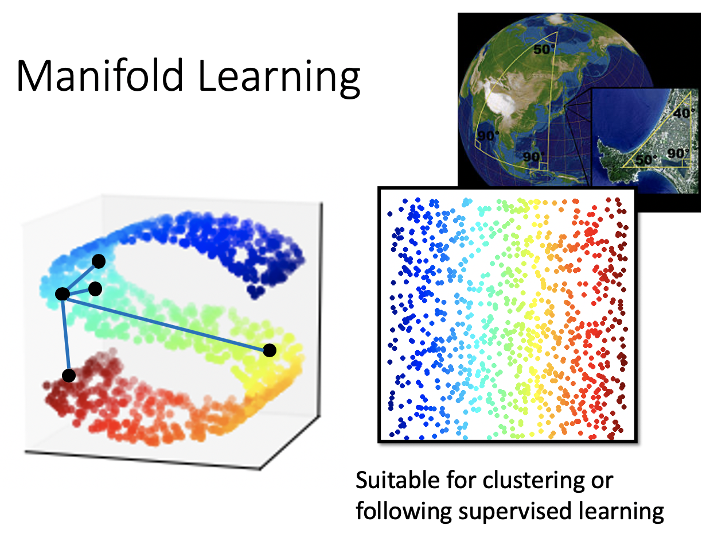
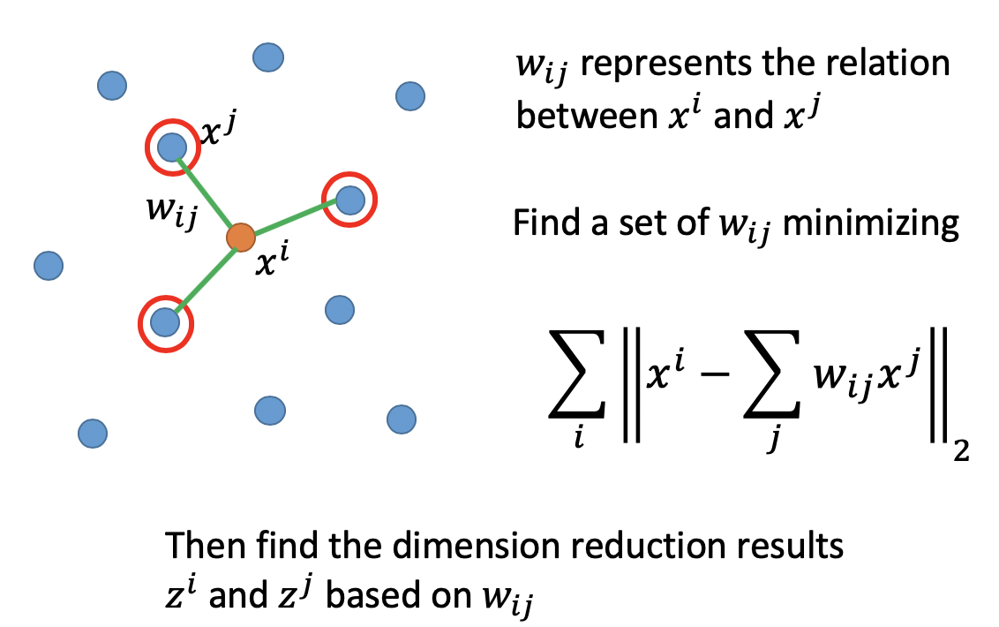
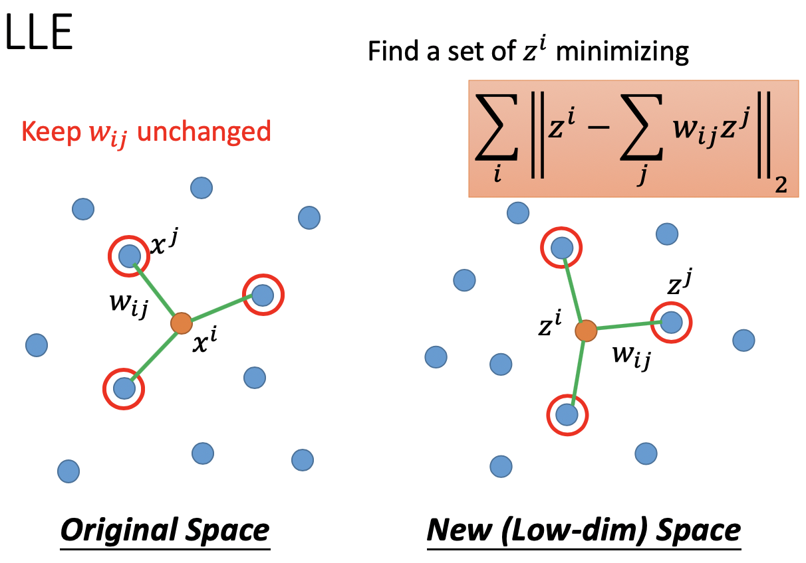
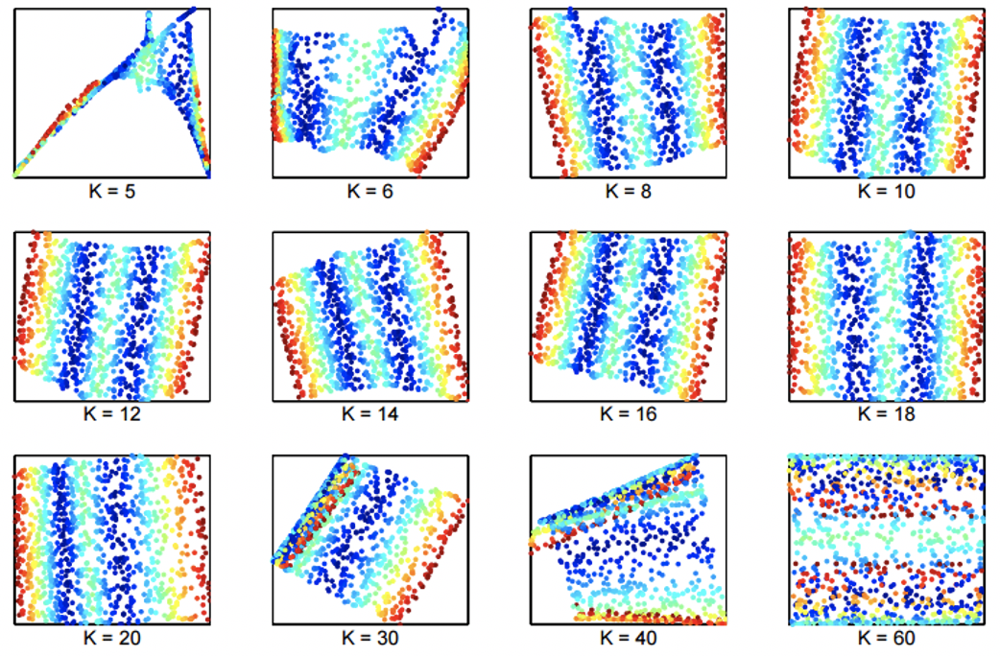
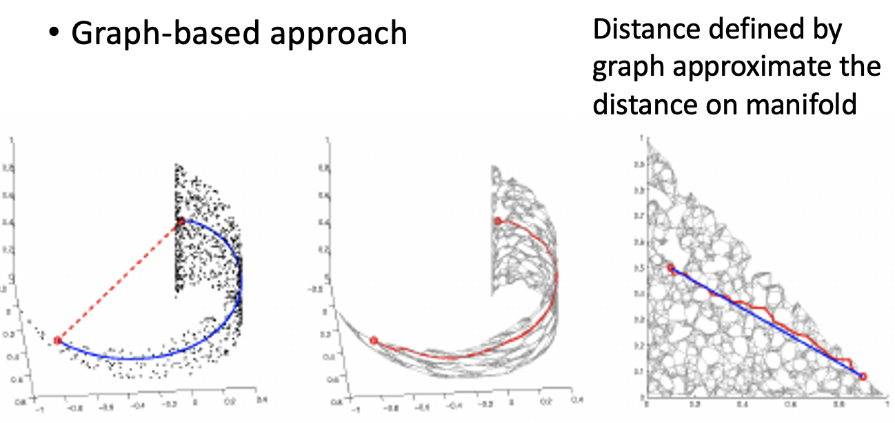
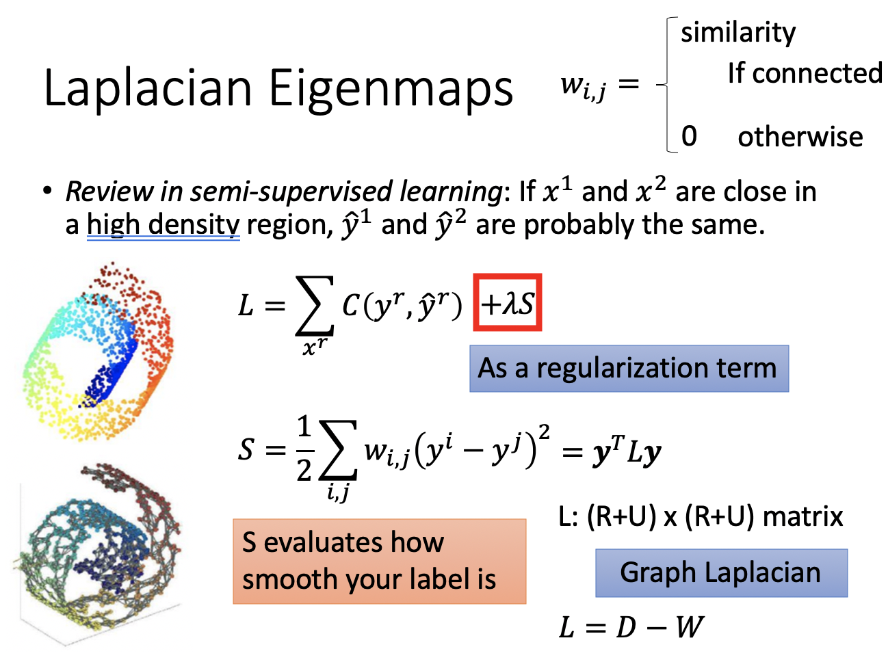
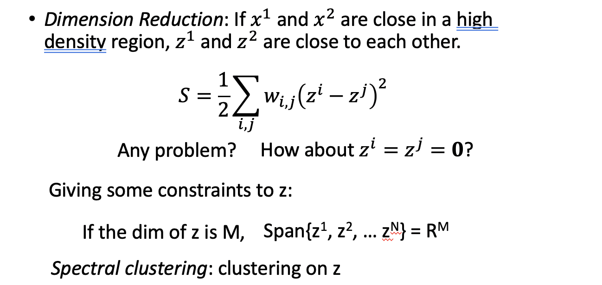
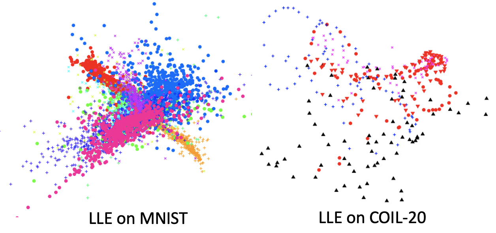
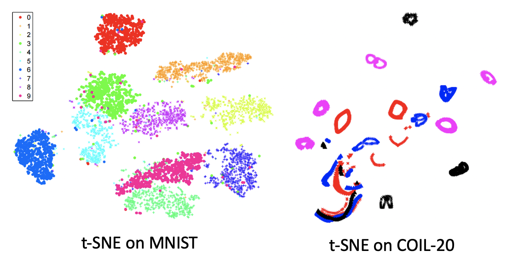

# Chapter 18 - Unsupervised Learning（Neighbor Embedding）

[Abstract](#Abstract)

[1.1.Locally Linear Embedding （LLE）](#1)

​		[1.1 LLE的基本原理](#1.1)

[2.Laplacian Eigenmaps](#2)

​		[2.1 Laplacian Eigenmaps的基本原理](#2.1)

[3.3.T-distributed Stochastic Neighbor Embedding（t-SNE）](#3)

​		[3.1 t-SNE的基本原理](#3.1)

#### Abstract：Mainfold Learning常用于地图计算中。地球上的点只有在足够近的情况下，欧式几何才成立。如果两个点的距离比较远，欧式几何就不成立了。比如在S型曲面中，红色点和蓝色点的欧式距离更近，红色点和黄色点的欧式距离更远，但是实际上红色点和黄色点更接近。解决办法是将其在低维空间中摊平，然后进行计算。

#### 1.Locally Linear Embedding （LLE）

1. LLE基本原理

   - 首先找到数据点$x^i$和其邻居$x^j$，两者的关系为$w_{i,j}$。此时的目标是用$x^i$的邻居经过加权去逼近$x^i$，所以目标任务就变成找到一组$w_{i,j}$最小化 $\sum\limits_{i}||x^i-\sum\limits_{j}w_{i,j}x^j||_2$。然后基于找到的$w_{i,j}$进行维度下降

     
     
   - LLE做的事情就是，高维空间中$x^i$可以由邻居$x_j$经过Linear Combination得到。在保证$w_{i,j}$不变时，在低位空间中，找出一组新的$z_i,z_j$，$z^i$也可以由邻居$z_j$经过同样的Linear Combination过程得到。即在已经解出$w_{i,j}$时，找到一组$z^i$最小化 $\sum\limits_{i}||z^i-\sum\limits_{j}w_{i,j}z^j||_2$。

     
     
   - 实验结果如下：Lawrence K. Saul, Sam T. Roweis, “Think Globally, Fit Locally: Unsupervised Learning of Low Dimensional Manifolds”, JMLR, 2013

     

#### 2.Laplacian Eigenmaps

1. Laplacian Eigenmaps基本原理

   - 在一个高维空间中，计算两个点的距离。如果使用欧式距离（红线）是不合理的，需要使用在High Density Region中的距离。经过距离较近的点之间的不断相连，找到两个目标点之间的Smoothness Distance。

     

   - 在Semi-supervised Learning的Smoothness Assumption中，数据点的平滑程度由$S=\frac{1}{2} \sum\limits_{i,j}w_{i,j} (y^i-y^j )^2=y^TLy$衡量，其中$L=D-W$，$L$称为Graph Laplacian，是一个$(R+U)\times(R+U)$维度的矩阵；$W$为图中边的权重矩阵，$D$为$W$矩阵列加和运算的转换。因此损失函数可以定义为$L=\sum \limits_{x^r}C(y^r,\hat{y}^r )+\lambda S$，不但要求模型准确，而且要求生成的Label尽可能的平滑。

     

   - 借鉴Semi-supervised Learning的Smoothness Assumption，在Unsupervised Learning中，如果样本$x^1$和$x^2$在high density的区域中很接近，那么$z^1$和$z^2$也会很相似。即寻找一组$z$最小化$S=\frac{1}{2} \sum\limits_{i,j}w_{i,j} (z^i-z^j )^2$，该公式存在的问题是当$z^i=z^j=0$就是最优解，是没有意义的。所以对$z$进行约束，如果$z$的维度为M，则找到的所有数据点$z^i$展开后会占据整个$R^M$空间，而不是存在于一个小于M维的的空间中。该问题的解是Laplacian Matrix 的特征值。（Belkin, M., Niyogi, P. Laplacian eigenmaps and spectral techniques for embedding and clustering. *Advances in neural information processing systems* . 2002）

     

     

#### 3.T-distributed Stochastic Neighbor Embedding（t-SNE）
1. t-SNE的基本原理

   - 在Laplacian Eigenmaps中只假设了相近的点在低维中也是相近的，但是没有假设不相近的点在低维空间中也是不相近的。使用LLE在MINIST中会出现虽然同一类别的点都聚集在了一起，但是不同类别的点没有分散开，而是重叠在一起的。

     
     
   - t-SNE的基本过程为：

     - 在原始空间中，计算两两的相似度，然后进行Normalization。$P(x^j |x^i )=\frac{S(x^i,x^j )}{\sum\limits_{k≠i}S(x^i,x^k))}$
     - 假设已经找到了low dimension Representation，计算两两之间的相似度，然后进行Normalization。$Q(z^j |z^i )=\frac{S'(z^i,z^j )}{\sum\limits_{k≠i}S'(z^i,z^k))}$
     - 上述两步中，进行Normalization是必要的，因为即便点与点之间的相似性是一致的，但是相似性的scale不同，也是不好计算的。
     - 寻找一组 $z$ 使得两组分布$P$和$Q$尽可能的相似，即$L=\sum\limits_{i}KL(P(∗|x^i )||Q(∗|z^i ))=\sum\limits_{i}\sum\limits_{j}P(x^j|x^i)log\frac{P(x^j|x^i)}{Q(x^j|x^i)} $
     
   - t-SNE需要计算所有点之间的相似度，计算量比较大。所以常见的做法是先用简单的降维方法（PCA），然后在进行t-SNE。因为t-SNE无法应对新数据的加入，只能够重新跑一边算法。所以相比单纯的通过训练进行降维，t-SNE更常用检查一个数据的分布情况。

   - 在Semi-supervised Learning的Smoothness Assumption中相似度使用的是RBF $s(x^i,x^j )=exp(-\gamma‖x^i-x^j ‖_2 )$；在SNE中相似度使用同样是RBF $s’(z^i,z^j )=exp(-\gamma‖z^i-z^j ‖_2 )$；在t-SNE中相似度使用的是 $s’(z^i,z^j )=\frac{1}{1+‖z^i-z^j ‖_2 }$；因为$s’(z^i,z^j )$更加“长尾”，当两个数据点在原始维度比较近时，$RBF s(x^i,x^j )$和$s’(z^i,z^j )$的差异比较小，当两个数据点在原始维度比较远时，$RBF s(x^i,x^j )$和$s’(z^i,z^j )$的差异会迅速增大。这就提高了模型对于降维后相似度保持一致的要求。而且还会使得降维后不同类别的数据点之间存在明显的差异，强化在高维中数据点的差异。

     
     
     

