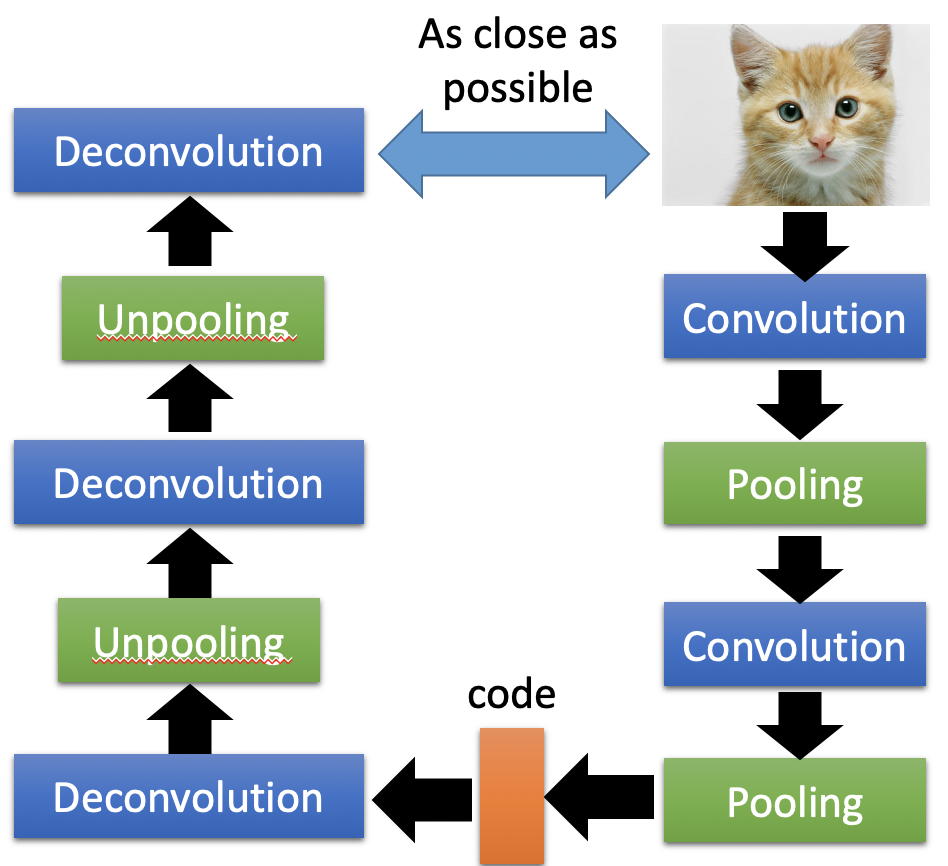

# Chapter 19 - Unsupervised Learning（Auto-Encoder）

[Abstract](#Abstract)

[1.Auto Encoder](#1)

​		[1.1 Auto Encoder与PCA的相同之处](#1.1)

​		[1.2 Auto-encoder – Text Retrieval](#1.2)

​		[1.3 Auto-encoder – Similar Image Search](#1.3)

​		[1.4 Auto-encoder – Pre-training DNN](#1.4)

​		[1.5 Auto-encoder for CNN](#1.5)

​		[1.6 De-noising Auto-encoder](#1.6)

[2.Decoder](#2)

​		[2.1 Auto-encoder与Generation](#2.1)

[3.More Non-Linear Dimension Reduction Model](#3)

​		[3.1 Restricted Boltzmann Machine](#3.1)

​		[3.2 Deep Belief Network](#3.2)

[4.Auto-Encoder的改进与思考](#4)

​		[4.1 More than minimizing reconstruction error](#4.1)

​		[4.2 More Interpretable Embedding（Voice Conversion）](#4.2)

​		[4.3 Discrete Representation](#4.3)

​		[4.4 Sequence as Embedding](#4.4)

​		[4.5 Tree as Embedding](#4.5)

#### Abstract：之前学习的PCA降维方式是Linear的，本节的Auto Encoder是Non-Linear的。以数字识别为例，Auto Encoder指将原有数据转换成远小于原始维度的数据，并且蕴含着输入数据的compact Representation。因为转换的过程是没有目标Label的，所以再建立一个Decoder，用于重构原始输入。两个模型联合起来训练，就可以得到将Encoder训练出来

#### 1.Auto Encoder

1. Auto Encoder与PCA的相同之处

   - 以数字识别为例，Auto Encoder指将原有数据转换成远小于原始维度的数据，并且蕴含着输入数据的compact Representation。因为转换的过程是没有目标Label的，所以再建立一个Decoder，用于重构原始输入。两个模型联合起来训练，就可以得到将Encoder训练出来。

     
     
   - 在PCA中，首先将输入减去均值，得到$x-\overline{x}$，类似于神经网络中的输入正则化。$(x-\overline{x})W$就可以的到 Component Weight $C$，Component Weight $C$再乘以$W^T$就可以得到重构输入$\hat{x}$，PCA的目标是最小化$(x-\overline{x})-\hat{x}$。其中$(x-\overline{x})$相当于Input layer，$C$相当于Hidden Layer，$\hat{x}$相当于Output Layer。Hidden Layer又称为Bottleneck Layer，因为只有隐层比输入层更窄才能达到降维的效果。隐层的输出就是Auto-Encoder想要得到的“code”。

     
     
   - Auto-Encoder也可以是Deep的，目标仍然是输入和输出尽可能的相似。在众多隐层之中，需要有一个最小的Bottleneck Layer，其输出就是想要求的“Code”。Bottleneck Layer之前和之后的参数矩阵可以互为转置，这样就可以减少一半的参数量。当然这样的对称结构也不是必须的。（Hinton, Geoffrey E., and Ruslan R. Salakhutdinov. "Reducing the dimensionality of data with neural networks." *Science* 313.5786 (2006): 504-507）

     
     
   - 上述Reference中的实验结果如下

     - 一种是使用PCA降到30维，然后重构；另一种是Deep Auto-Encoder。

     

     - 在使用两种方式将输入降低到二维时，PCA的结果显得更混乱，类别之间重叠在一起；而Deep Auto Encoder的结果就显着更好一些，不同类别之间有一定的界限。

       

       

     

2. Auto-encoder – Text Retrieval

   - 在Text Retrieval中，最简单的方法就是Vector Space Model，即将所有的Word都表示成一个向量，根据词向量之间的余弦相似度进行匹配。将Word表示为Vector的方法一种方法是Bag of Word，这种表示方式每个Word之间都是Independent，无法把semantic Information包含在内，比如Apple和Pear更相似

     
   
   - 基于上述问题，可以将Bag of Word的向量表示方法作为Auto Encoder的输入，将其压缩为二维的数据。
   
     
   
     
   
3. Auto-encoder – Similar Image Search

   - 在Similar Image Search中，如果单纯的直接把Image转化成Pixel Vector进行相似度匹配，效果并不好（Reference: Krizhevsky, Alex, and Geoffrey E. Hinton. "Using very deep autoencoders for content-based image retrieval." *ESANN*. 2011.）

     

   - 改进方法是使用Auto-Encoder对Image进行压缩，因为是Unsupervised的方法，所以数据集相当容易获得。

     

     

4. Auto-encoder – Pre-training DNN

   - Auto Encoder在神经网络的预训练中可以发挥一定的作用。神经网络参数的初始化方式一直是一个需要去不断调试的问题，通过一些方式找到比较好的一些初始值的过程就成为Pre-training。假设需要训练的Target Network为左边所示（以MINIST作为输入），首先使用Auto Encoder训练一个输入和输出维度均为784维的网络，与之前的Auto Encoder不同的是中间层为1000维。这时需要注意，因为中间层维度更高，所以网络可能会直接把输入的784为记住，作为输出，这样Auto Encoder什么都没学习到。解决这样的问题，就需要对Hidden Layer的输出进行正则化约束。比如，可以利用零范数对隐层的输出进行约束，要求其输出是sparse的，这样网络就不会直接把输入记住直接输出了。此时，可以学到一个100维的参数$W^1$。

     

   - 然后把$W^1$固定住，将第一个隐层的1000为输出作为输入，送入另一个隐层为1000维，输出也为1000维的Auto Encoder中（$a^1 \rightarrow \hat{a}^1$），训练得到$W^2$

     

   - 然后把$W^2$固定住，将第二个隐层的1000维输出作为输入，送入另一个隐层为500维，输出为10维的Auto Encoder中，训练得到$W^3$

     

   - 此时，$W^1、W^2、W^3$都已经确定，对于500维到10维的参数，采用随机的方式进行初始化。这样整个网络的参数都大致确定了，然后使用反向传播对参数进行Fine-tune一下，就可以得到比较好的初始化参数。

     

   - 目前，随着网络训练技术的进步，大多数网络都不需要Pre-training的过程。但是在Labeled Data比较少的情况下，可以先用大量的Unlabeled Data进行Pre-training，可以得到比较好的效果。

     

5. Auto-encoder 
    for CNN

   - 在CNN中，需要通过不断地Convolution和Pooling去提取特征，将original image浓缩到更小的维度上。如果在CNN上适应Auto Encoder，不但需要Convolution和Pooling的过程，还需要Deconvolution和Unpooling。模型的目标是让输入和最终的输出尽可能的相似。

     

   - Pooling的过程是，先对Feature Map划分区域，对于每个区域保留最大的值。在做Unpooling时，需要提前记住，Pooling的最大值是从哪个位置选取的（黑色的零一矩阵）。Unpooling会将最大的值放回原位，其他的补零。Unpooling后，图片的Size会变大。在Keras中，Unpooling不会记录位置信息，而是直接将最大值复制四份。

     

   - Deconvolution过程其实就是Convolution。以一维的卷积为例，卷积过程就是每三个数值变为一个数值的过程，那么Deconvolution就应该是一个数值变为三个数值，然后重叠的地方相加的过程。这件事情等同于对蓝色的数值进行补零（灰色代表补零），然后进行卷积得到的结果。两者的权重顺序是相反的，Convolution是红蓝绿，Deconvolution是绿蓝红。

     

   

6. De-noising Auto-encoder

   - 在初始数据的基础上增加一定的噪声，然后进行encode和decode，使得输出尽可能的和原始输入相似。这样训练出的结果鲁棒性更强。网络学习到的不仅是编码，而且还能学习到如何过滤噪声。（Vincent, Pascal, et al. "Extracting and composing robust features with denoising autoencoders." *ICML,* 2008.）

     

   - 另一种变种是Contractive auto-encoder（Ref: Rifai, Salah, et al. "Contractive auto-encoders: Explicit invariance during feature extraction.“ *Proceedings of the 28th International Conference on Machine Learning (ICML-11)*. 2011.）

     

#### 2.Decoder

1. Auto-encoder与Generation

   - 在训练Auto-Encoder时，encode和decode部分需要作为一个网络同时训练。Encoder的部分可以进行降维，Decoder的部分可以进行Generation。以MINIST为例，将其压缩到二维图下图所示，在红色的区域内等间隔的选取一系列Vector，这些Vector不一定是Original Image压缩成的点，只是单纯的从指定区域选出Vector。将这些Vector送入Decoder可以生成一系列图像，如右图所示。左上角的数字不是很像的原因是其对应于红色框的左上角，该区域是没有Image可以压缩成的。

     

   - 对于一个Vector该如何选取的问题，可以再Encode部分加入L2范式进行约束，要求生成的“code”都在零点附近。那么选择Vector时，只要在零点附近选取，就可以的到比较好的Decoder输入。生成的数字具有一些规律，从左到右，从圈圈到竖线，从上到下，从竖直到右斜。

     

     

#### 3.More Non-Linear Dimension Reduction Model

1. Restricted Boltzmann Machine

   - Neural networks [5.1] : Restricted Boltzmann machine – definition
     https://www.youtube.com/watch?v=p4Vh_zMw-HQ&index=36&list=PL6Xpj9I5qXYEcOhn7TqghAJ6NAPrNmUBH

   - Neural networks [5.2] : Restricted Boltzmann machine – inference
     https://www.youtube.com/watch?v=lekCh_i32iE&list=PL6Xpj9I5qXYEcOhn7TqghAJ6NAPrNmUBH&index=37

   - Neural networks [5.3] : Restricted Boltzmann machine - free energy
     https://www.youtube.com/watch?v=e0Ts_7Y6hZU&list=PL6Xpj9I5qXYEcOhn7TqghAJ6NAPrNmUBH&index=38

     

2. Deep Belief Network

   - Neural networks [7.7] : Deep learning - deep belief network
https://www.youtube.com/watch?v=vkb6AWYXZ5I&list=PL6Xpj9I5qXYEcOhn7TqghAJ6NAPrNmUBH&index=57
     
   - Neural networks [7.8] : Deep learning - variational bound
   https://www.youtube.com/watch?v=pStDscJh2Wo&list=PL6Xpj9I5qXYEcOhn7TqghAJ6NAPrNmUBH&index=58
     
   - Neural networks [7.9] : Deep learning - DBN pre-training
   https://www.youtube.com/watch?v=35MUlYCColk&list=PL6Xpj9I5qXYEcOhn7TqghAJ6NAPrNmUBH&index=59
     
     
     

#### 4.Auto-Encoder的改进与思考

1. More than minimizing reconstruction error

   - 在Auto-Encoder中，中间的产物可以成为Latent Code、Embedding或者Latent Representation，那么什么是更好的Embedding呢？一种答案是，Embedding可以很好的代表original object。于是可以训练一个Discriminator（参数为$\phi$），输入是一张Original Image，一个Embedding。如果两者是匹配的，则输出“Yes”；反之输出“No”。定义损失函数为Binary Corss Entropy $L_D$，则$L^*_D=\min\limits_{\phi}L_D$。越小的$L^*_D$代表着Embedding更具有代表性，越大的$L^*_D$代表着Embedding不具有代表性。

     
     
   - 在Auto-Encoder中，一种训练方法是最小化重构误差。基于上述Discriminator的作用，我们可以重新定义一种训练方式，即调整 $\theta$ 去minimizing $L^*_D$，找到最优的解 $\theta^*=arg\ \min\limits_\theta \ \min\limits_\phi \ L_D$。于是整个过程被抽象为调整调整 $\theta$ 和 $\phi$ 去minimizing $L^*_D$。（Ref：Deep InfoMax）

   - 基于最小化重构误差的训练方法其实是基于DIscirminator训练的一种特例，在基于最小化重构误差的训练中只考虑positive的数据，在基于DIscirminator训练中考虑了negative和positive的数据。

     
     
   - 在Auto-Encoder中，要求Decoder的输出尽可能的和Encoder的输入相似。如果将Auto-Encoder应用在序列化的数据中（比如Document就是一组有序的Sentence）时，可以要求Decoder的输出尽可能的当前Sentence的Previous Sentence或Next Sentence。该想法类似于Word Embedding的思路，称为Skip Thought。

     

   - Skip Thought的改进版称为Quick Thought。在Skip Thought中需要同时训练Encoder和Decoder，但是在Quick Thought中只训练Encoder，不训练Decoder。将每一个Sentence都扔进Encoder，会得到对应的多个Vector，不使用Decoder，取而代之的方法是要求上下相近的Sentence产生Vector要尽可能的相似，而上下文不相关的句子尽可能的不相似。即将所有的Vector作为Classifier的输入，要求其输出与当前句子最相近的句子编号“2”。Encoder和Classifier一起训练，但是相较于Decoder，Classifier的功能简单，易于训练。

     

   - 与Skip Thought思路相似的方法还有Contrastive Predictive Coding（CPC）

     

     

2. More Interpretable Embedding（Voice Conversion）

   - 在Encoder输出的Latent Code中，会包含着各种各样的信息。以语音输入为例，code不仅会包含语义信息、文法信息，可能还会包含说话人的说话特征等等。但是不同的特征和具体维度之间的对应关系是不得而知的。

     

   - 比如Encoder输出的Vector的前半部分是Phonetic Information，后半部分是Speaker Information。也可以理解为有两个Encoder，第一个Encoder抽取的是Phonetic Information，第二个Encoder抽取的是Speaker Information。

     

   - 上述对Code Vector进行拆解的过程可以用于语音重构，即将一个具有语义的向量和一个具有声色信息的向量结合在一起，生成一个新的Audio，达到变声器的效果。

     

     

   - 实现变声器（Voice Conversion）的一种方法是使用GAN，通过Speaker Classifier对Phonetic Information Vector进行判断，如果Speaker Classifier能够判断出语者的信息，说明该向量中还混杂着Speaker Information，需要对Encoder继续训练，直到Speaker Classifier无法根据Phonetic Information Vector判断出语者的信息，即遇着信息都被包含在后半部分中。Speaker Classifier和Encoder是采用GAN的方式交替训练的。

     

   - 实现变声器（Voice Conversion）的另一种方法是直接将两种信息分离开来，使用instance normalization抹掉Global Information。在Decoder中使用Adaptive Instance Normalization处理后半部分的Speaker Information。

     

     

3. Discrete Representation

   - 在之前的Encoder输出中都是一个向量（Continuous Vector），向量的内容具体代表了什么也不得而知。那么有学者尝试将Encoder输出的Vector转为Discrete Embedding Vector，例如要求其实One-hot的形式，通过比较不同的One-hot Code就可以发现每个维度代表的含义。实现方法可以将Vector的最大值改为1，其余置零的方式转换为One-hot形式，也可以通过阈值的方式转换为Binary的方式。但是转换的过程是没有办法微分的，具体的训练方式见参考文献（Ref：https://arxiv.org/pdf/1611.01144.pdf）。相较来说，Binary方式会比One-hot方式更好一些，因为如果原始数据有1000个种类，那么One-hot就需要1000个维度来表示，参数量比较大，Binary方式只需要10维就可以解决，参数量较小；同时Binary可以处理原始数据中没有的情况，因为二值化可以表示更多的种类。

     
     
   - 上述思路用于语音中的方法叫作Vector Quantized Variational Auto-Encoder（VQVAE），结构包括Encoder、Decoder、CodeBook（CodeBook中的一系列向量都是学出来的）。给定一个输入，Encoder会生成一个Vector（红色），然后会比较该向量和CodeBook中所有向量的相似度，将相似度最高的向量（黄色）作为Decoder的输入。CodeBook中不同的向量代表着Phonetic Information，该过程相当于离散化的过程。
   
     
     
     
   
4. Sequence as Embedding

   - 在之前的Auto-Encoder中，code都是以向量的形式存在的，无论是连续的还是离散的。于是有学者提出可以生成Sequence形式的code，即Seq2Seq2Seq auto-encoder。例如将Document作为输入，code就是这篇文章的摘要，Dencoder根据摘要重新还原这篇文章。

     

   - 上述方法存在一定的问题，因为Encoder和Decoder对于理解code存在着一定的共识，二者知道如何理解code，但是人们却不一定能理解。例如将“台湾大学”作为输入，code可能不是“台大”，而是“湾学”，但是Decoder照样可以还原出“台湾大学”。解决办法是采用GAN的方法加入一个Discriminator用于判断code是否符合人类的认知行为，从而不断地修正code。

   - 该过程依旧不能够进行微分，对于这种情况，通用的训练方法可以使用Reinforce Learning辅助训练。

     

5. Tree as Embedding

   - 将code的形式变为树状结构，用于文法分析等等

     

   

