# Chapter 20 - Unsupervised Learning（Generative Model）

[Abstract](#Abstract)

[1.Pixel RNN](#1)

​		[1.1 Pixel RNN的基本原理与应用场景](#1.1)

​		[1.2 Practicing Generation Models：Pokémon Creation](#1.2)

[2.Variational Autoencoder（VAE）](#2)

​		[2.1 VAE的基本过程](#2.1)

​		[2.2 VAE与Auto Encoder的区别](#2.2)

​		[2.3 VAE的数学解释（Gaussian Mixture Model）](#2.3)

[3.Generative Adversarial Network (GAN)](#3)

​		[3.1 GAN的基本原理](#3.1)

#### Abstract：https://openai.com/blog/generative-models/是一篇关于Generative Model的概述文章，其中引用了Richard Feynman的一句话“What I cannot create, I do not understand”。意为如果一个机器不知道如何产生一个Object，那么就不能称其理解这个Object。例如CNN在与Image Classification中，机器虽然可以辨别，但是并不知道每一个类别到底是什么。

#### 1.Pixel RNN

1. Pixel RNN的基本原理与应用场景

   - 以生成$3\times3$的Image为例。假设第一个Pixel为红色的（RGB三维Vector），将其输入NN，要求目标输出为蓝色的。然后再将红色和蓝色作为输入，要求输出为浅蓝色。以此类推。这种训练方法是Unspuervised，不需要标签，只需要大量的Image即可。

     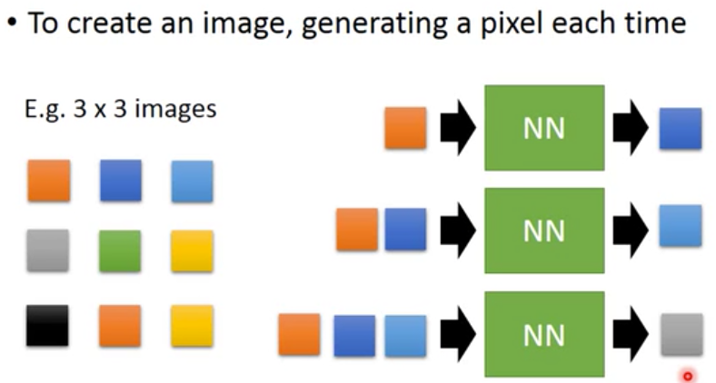
     
   - Pixel RNN的实验结果，在遮住图片的下半部分时，可以生成下半部分。

     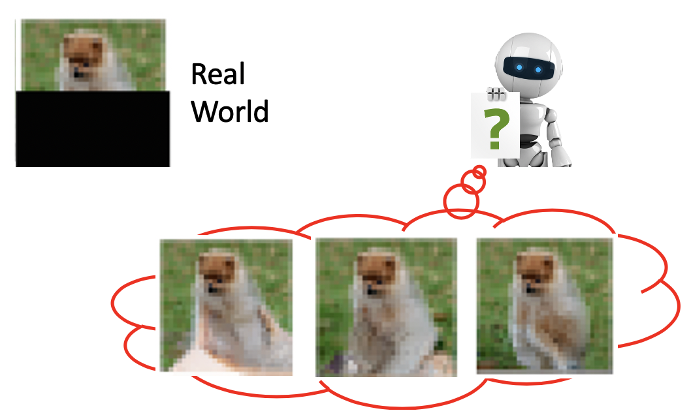
     
   - Pixel RNN不仅可以用于Image，还可以用于Audio，以WaveNet为例（Audio: Aaron van den Oord, Sander Dieleman, Heiga Zen, Karen Simonyan, Oriol Vinyals, Alex Graves, Nal Kalchbrenner, Andrew Senior, Koray Kavukcuoglu, WaveNet: A Generative Model for Raw Audio, arXiv preprint, 2016）

   - Pixel RNN还可以用于Video（Video: Nal Kalchbrenner, Aaron van den Oord, Karen Simonyan, Ivo Danihelka, Oriol Vinyals, Alex Graves, Koray Kavukcuoglu, Video Pixel Networks , arXiv preprint, 2016）

     

2. Practicing Generation Models：Pokémon Creation

   - 根据192张宝可梦的Image，创造新的宝可梦。

   - Tips 1：每一个像素使用三个RGB数字进行表示，实验效果会比较灰。因为比较鲜明的颜色，一般只有一个数值比较大，另外两个比较小。在Sigmoid激活函数中，一般输出都落在0.5附近，将其还原到0-255后，三原色的值都比较相似，所以比较灰。另一种表示方式是利用one-hot编码进行颜色表示，那么需要$256^3$个数值，因为该数值过大。所以先对相近颜色进行聚类，然后在进行独热编码。
   
     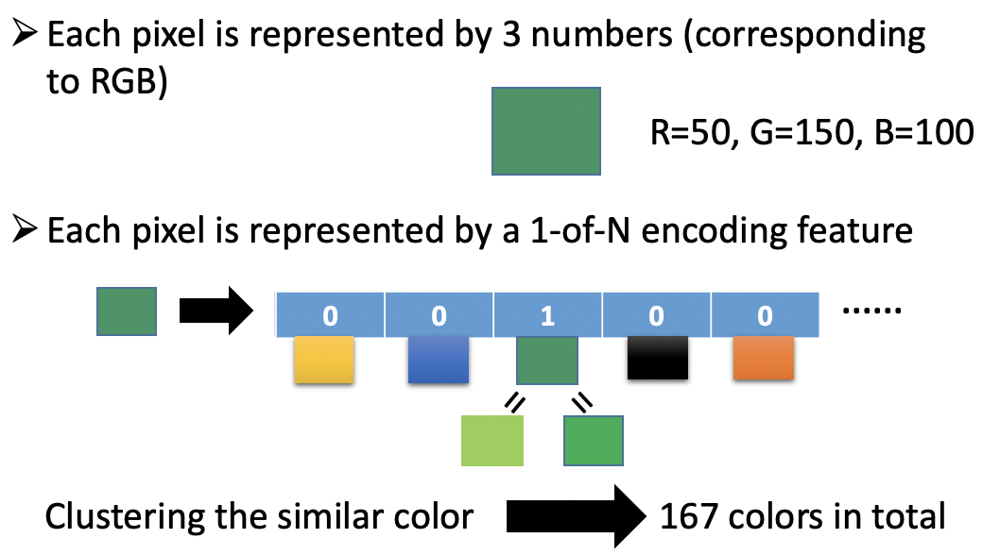
   
   - 实验结果如下，Cover 50%表示遮挡住下半部分，让Pixel RNN进行生成。但是在这种实验中没有标准对实验结果进行评价
   
     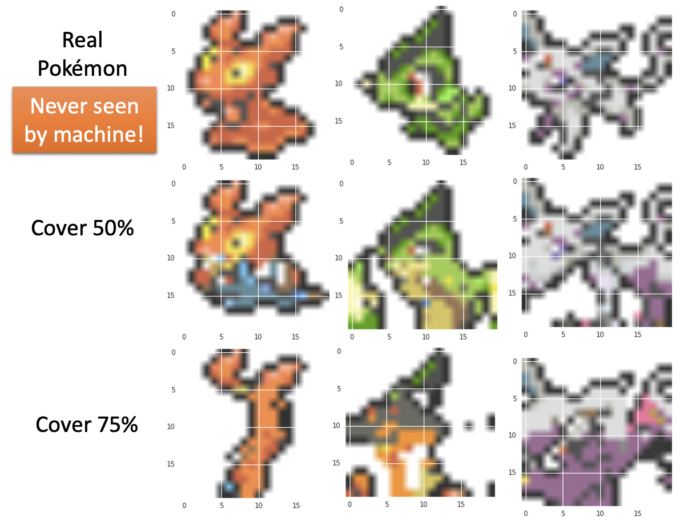
   
   - 不给机器任何提示，通过一些随机的方法让Pixel RNN进行生成。
   
     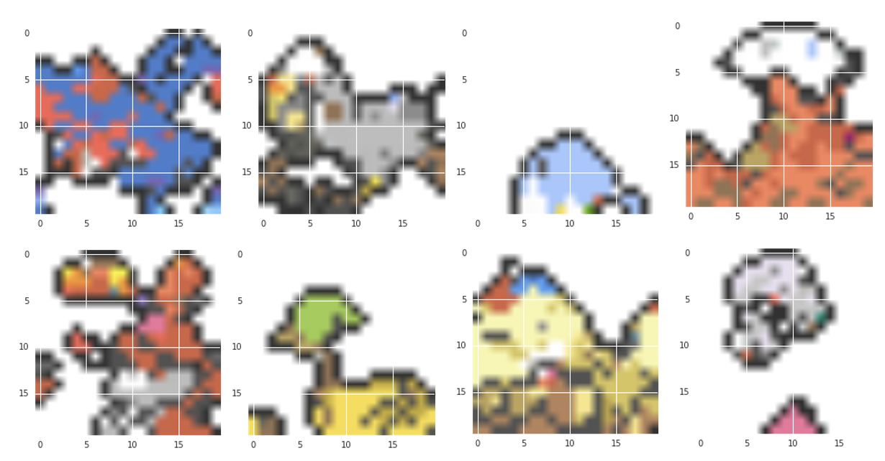
   
     
   

#### 2.Variational Autoencoder（VAE）

1. VAE的基本过程

   - Variational Autoencoder（VAE）是在论文Auto-Encoding Variational Bayes中提出的的。在Auto Encoder中，整体结构为“Input - NN Encoder - code - NN Decoder - Ouput”。将Decoder单独出来，输入一个随机的code，会得到一个Image。但是这么做的效果不一定很好，改进方式就是VAE。

   - VAE的具体过程是，“Input - NN Encoder - 2 Vectors- code - NN Decoder - Ouput”。Input经过NN Encoder生成两个Vector $\begin{pmatrix} m_1 \\ m_2 \\ m_3 \end{pmatrix}\begin{pmatrix} \sigma_1 \\ \sigma_2 \\ \sigma_3 \end{pmatrix}$，然后从一个Normal Distribution中采样出$\begin{pmatrix} e_1 \\ e_2 \\ e_3 \end{pmatrix}$。然后计算code $c_i=exp(\sigma_i)\times e_i+m_i$，然后在送入Decoder得到输出。与此同时，在最小化Reconstruction Error的同时还需要最小化$\sum\limits_{i=1}^3(exp(\sigma_i)-(1+\sigma_i )+(m_i )^2 ) $

   - VAE在Pokémon Creation中的实验结果，假设code是10维的，固定8个维度，让两个维度的值进行变化，得到的图像如下。

     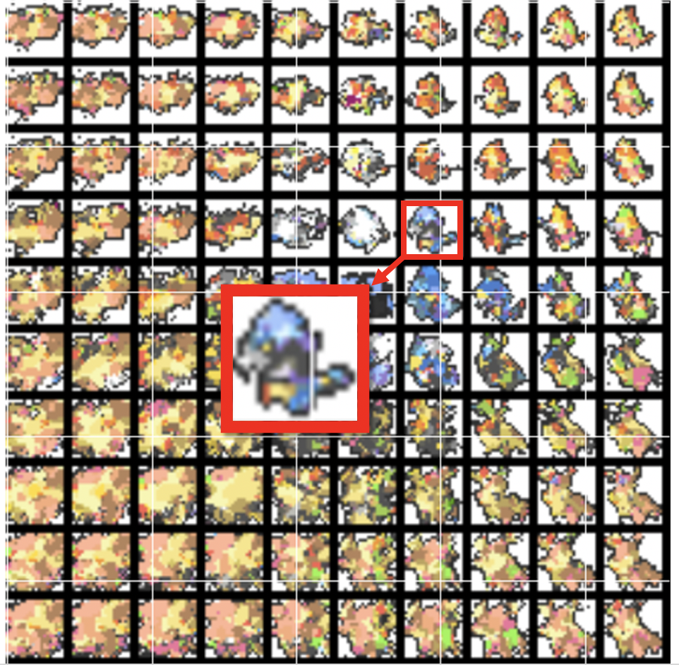

   - VAE在Poetry Writing中的实验结果，假设已知两句话“i went to the store to buy some groceries.”和“don’t worry about it," she said”。将两句话编码后表示在Code Space中，在二者的连线上等距离的去一些点，将其作为code输入Decoder，就可以得到连续的语句。（Ref: http://www.wired.co.uk/article/google-artificial-intelligence-poetry Samuel R. Bowman, Luke Vilnis, Oriol Vinyals, Andrew M. Dai, Rafal Jozefowicz, Samy Bengio, Generating Sentences from a Continuous Space, arXiv prepring, 2015）

     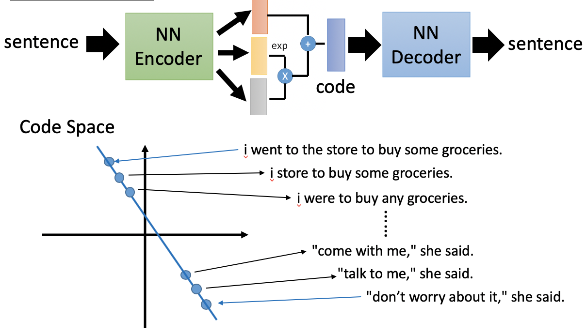

     

2. VAE与Auto Encoder的区别

   - Intuitive Reason

     - 对于Auto Encoder，将满月和弦月两张图片经过Encoder计算的到Code，再送入Decoder就可以的到与原来相似的图片。在两个code之间选取一个code输入Docoder，我们希望其输出满月和弦月之间的月亮，但实际是什么输出可能都不是月亮。
     
     - 对于VAE，将满月的图片经过Encoder计算的到Code，实际上是增加了噪声的code，在噪声范围的code都会生成满月的图片。对于弦月也是类似。那么对于满月和弦月中间的节点，既要求其像满月，又要求其像弦月。那么最终的输出就是满月和弦月之间的月亮（红色箭头）。
     
       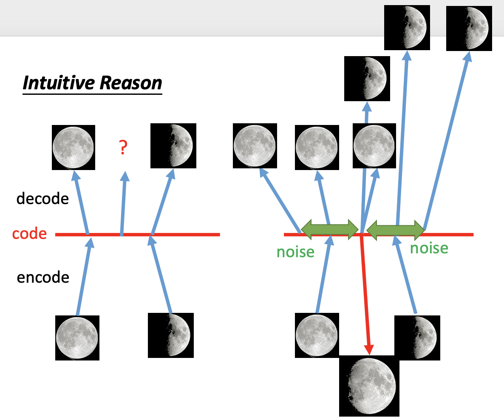
     
   - 在VAE中，$\begin{pmatrix} m_1 \\ m_2 \\ m_3 \end{pmatrix}$相当于Original Code，$\begin{pmatrix} c_1 \\ c_2 \\ c_3 \end{pmatrix}$相当于Code with Noise。$\begin{pmatrix} \sigma_1 \\ \sigma_2 \\ \sigma_3 \end{pmatrix}$代表了Variance of Noise，因为网络在没有激活函数的情况下输出是可正可负，所以取自然指数确保一定是正的，才可以作为方法。$\begin{pmatrix} e_1 \\ e_2 \\ e_3 \end{pmatrix}$是从Normal DIstribution中采样出来的，其Varicance是固定的，但是乘上$\begin{pmatrix} \sigma_1 \\ \sigma_2 \\ \sigma_3 \end{pmatrix}$就不固定了。
   
     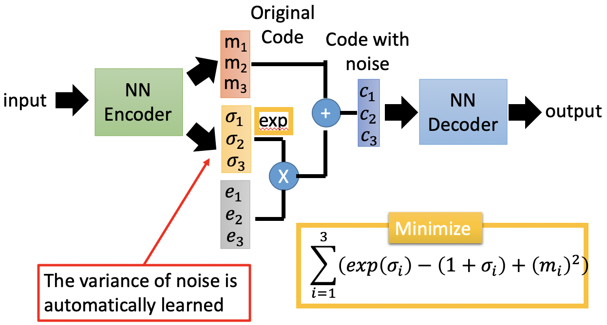
     
   - $\begin{pmatrix} \sigma_1 \\ \sigma_2 \\ \sigma_3 \end{pmatrix}$是网络自己学出来的，网络更倾向于Variance $exp(\sigma)=0$，因为没有噪声的时候重构误差会比有噪声是小一些。当Variance $exp(\sigma)=0$时，VAE就变成了Auto Encoder。所以需要多$\begin{pmatrix} \sigma_1 \\ \sigma_2 \\ \sigma_3 \end{pmatrix}$进行限制，即通过最小化$\sum\limits_{i=1}^3(exp(\sigma_i)-(1+\sigma_i )+(m_i )^2 ) $对Variance进行限制。下图中$exp(\sigma_i)$为蓝色的曲线，$1+\sigma_i$为红色的直线，二者相减得到绿色的曲线，绿色曲线的最低点在$\sigma=0$处。当$\sigma=0$时，经过指数函数$exp(\sigma)=1$，即Variance为1。$(m_i)^2$相当于L2正则化，要求code不要过拟合，要Sparse。
   
     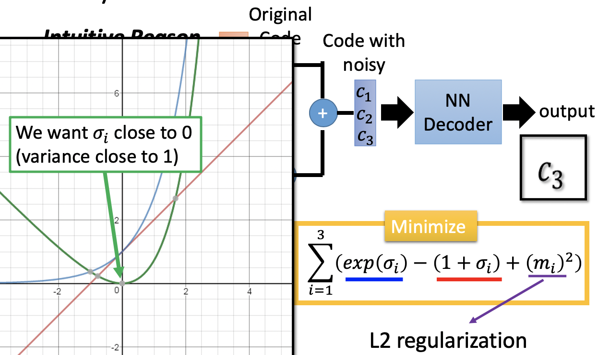
     
     
   
3. VAE的数学解释（Gaussian Mixture Model）

   - 以Pokémon Creation为例，每一个宝可梦都是高维空间中的一个点，我们想要做的就是估计这些数据点的概率分布，即在这个数据点很有可能是宝可梦时，概率就大一些，反之就小一些。

     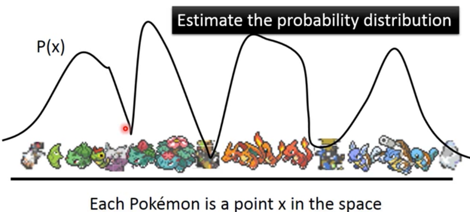

   - Gaussian Mixture Model指的就是存在一个比较复杂的目标分布（黑线），但是其可以由多个高斯模型（蓝线）进行加权和得到。假设有m个高斯分布，每个分布有自己对应的权重。假设要从目标分布中采样出 $x$，相当于先选择从m个分布中的哪一个分布进行采样（该过程为一个二项分布，即$m\sim P(m)(multinomial)$），然后再在该分布中进行采样（$x|m\sim N(\mu^m,\Sigma^m )$）。整个过程可以表达为$P(x)=\sum P(m)P(x|m)$

     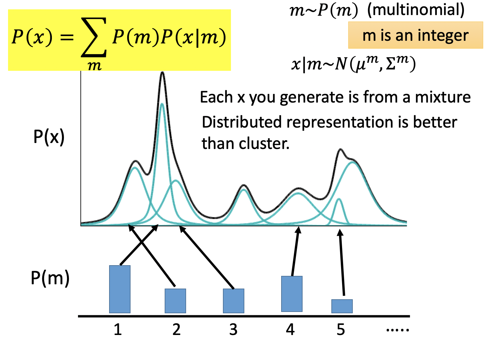

   - 已知$z \sim N(0,I)$是从一个Normal Distribution中采样出的Vector，$z$ 的每一个维度都代表着一个需要从Gaussian Mixture Model中采样得到的属性，即上图中的 $x$。假设$z$是一维的，因为$z$是Continuous的，所以 $z$ 的均值和方差有无数种可能性，所以$x|z \sim N(\mu(z),\sigma(z))$，其中$\mu(z),\sigma(z)$可以通过神经网络求出。每一个从 $z$ 中采样出的 $x$ 都对应这一个特定的高斯分布，$P(x)=\int\limits_z P(z)P(x|z)dz$。注：$z$可以符合任何一种分布，但是一般情况下是高斯分布。因为数据的特征是从很多不同的高斯分布中采样出来的，但是具体到每一个特征应该从哪一个高斯分布中采样，这个选择的过程就是上图中的$P(m)$，将其变为连续情况就是$P(x)$。因为大多数数据特征的分布都还是比较相似的，只要少数特殊分布的极端情况，所以$P(x)$通常是高斯分布，即数据所属高斯分布的分布也是高斯分布。即便$z \sim N(0,I)$比较简单，但是$P(x)$可以很复杂。

     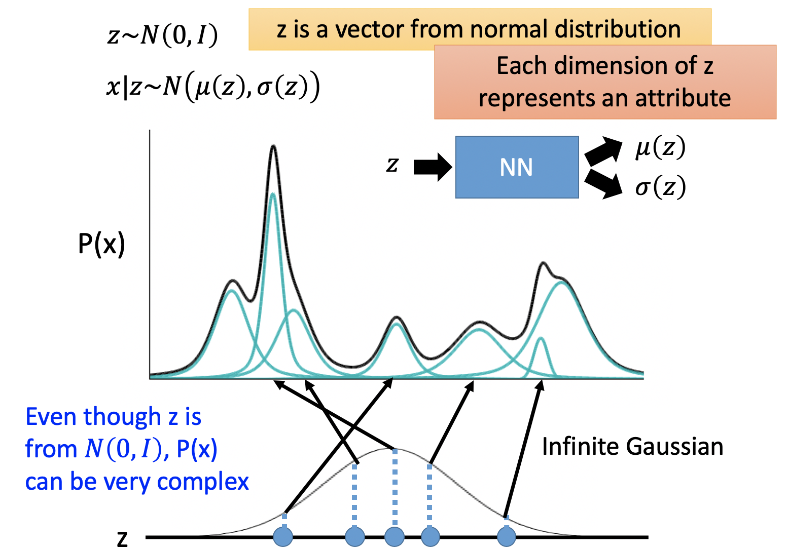

   - 已知$P(x)=\int\limits_z P(z)P(x|z)dz$，其中$z \sim N(0,I)，x|z \sim N(\mu(z),\sigma(z))$。接下来需要做的就是已知一组数据，估计$\mu(z),\sigma(z)$，即调整NN的参数，最大化observed data x的似然估计 $L = \sum\limits_x logP(x)$。在此，我们还要引入另一个分布$q(z|x)$，$z|x \sim N(\mu'(x),\sigma'(x))$。前者神经网络为VAE中的Decoder NN，后者为Encoder NN。
   
     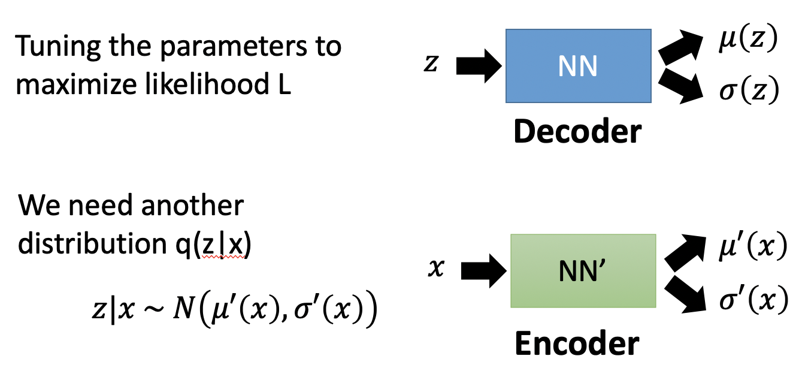
     
   - 在Decoder NN部分，需要最大化observed data x的似然估计 $L = \sum\limits_x logP(x)$。其中$logP(x)$可以写为$\int \limits_zq(z|x)logP(x)dz$（注：该步骤仅仅是数学变换，$q(z|x)$可以是任何一个部分，$\int \limits_zq(z|x)dz=1$，所以等式成立）。图中红线的部分代表KL散度，代表$q(z|x)$和$P(z|x)$的相似度，是非负的，所以$logP(x)$的下界就是 $lower\ bound\ L_b= \int\limits_zq(z|x)log(\frac{P(x|z)P(z)}{q(z|x)} )dz$
   
     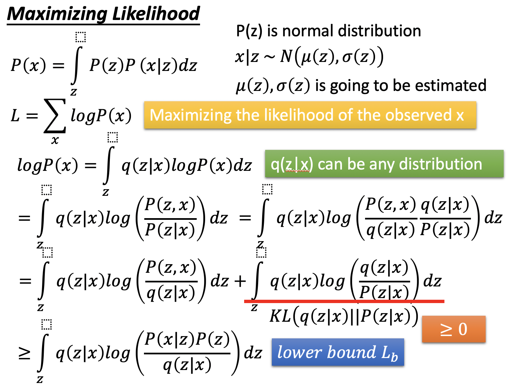
     
   - 寻找$P(x|z)$最大化$L = \sum\limits_x logP(x)$的目标就转换为了最大化其$lower\ bound\ L_b= \int\limits_zq(z|x)log(\frac{P(x|z)P(z)}{q(z|x)} )dz$，但是此时还存在一种情况，就是即便下界$L_b$增大了，但是KL散度减小了，导致$L$不增反降。所以此时需要寻找$P(x|z)$和$q(z|x)$最大化$lower\ bound\ L_b$，因为$logP(x)$只与$P(x|z)$有关，与$q(z|x)$无关，所以$q(z|x)$的变化都不会导致$logP(x)$变化。但是$lower\ bound\ L_b$与$q(z|x)$有关，调整$q(z|x)$使得$lower\ bound\ L_b$最大化，KL散度会变小，那么$lower\ bound\ L_b$会和$logP(x)$越来越接近，则$lower\ bound\ L_b$最大就代表着$logP(x)$最大。与此同时，还可以发现，随着$lower\ bound\ L_b$增大，KL散度减小，就以为这$q(z|x)$和$P(z|x)$越来越相似，即可以使用$q(z|x)$估计$P(z|x)$。
   
     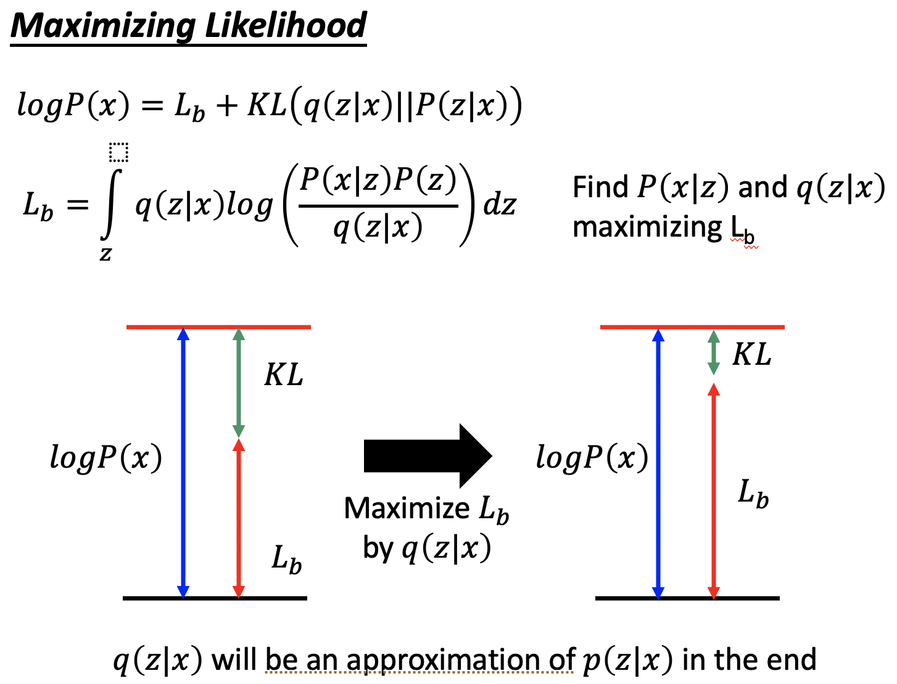
     
   - 对$lower\ bound\ L_b$进行化简，又可以得到另一个KL散度 $-KL(q(z|x)||P(z))$
   
     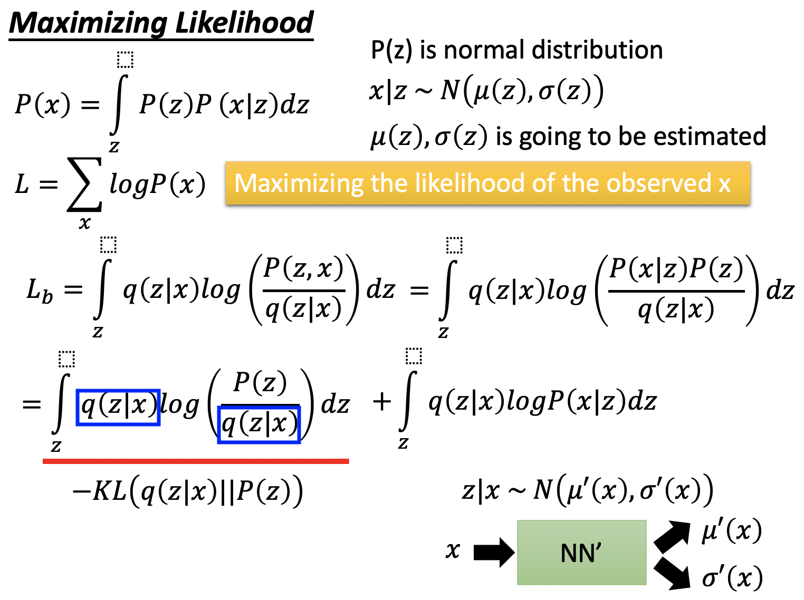
     
   - 最大化$lower\ bound\ L_b$，一是最小化$KL(q(z|x)||P(z))$。$q(z|x)$相当于输入$x$，输出这个$x$对应的$\mu'(x),\sigma'(x)$，最小化$KL(q(z|x)||P(z))$就是使得输出尽可能的与一个自然分布$P(z)$相似。该步骤相当于VAE中的最小化$\sum\limits_{i=1}^3(exp(\sigma_i)-(1+\sigma_i )+(m_i )^2 ) $
   
   - 最大化$lower\ bound\ L_b$，二是最大化$\int\limits_zq(z|x)logP(x|z)dz$。$\int\limits_zq(z|x)logP(x|z)dz$相当于使用$q(z|x)$对$logP(x|z)dz$进行Weighted Sum。该过程相当于Auto-encoder，根据$x$产生$z$，再产生$\mu(x),\sigma(x)$。
   
   - a
   
4. Problem of VAE

   - VAE在训练过程中并没有真正的学习如何生成一张真的Image，它只是去让生成的图片尽可能的与数据集中的图片更相似。所以假设生成的图片与数据集中的original pixel有一个像素的差异，左图“7”的差异可能不会产生影响，但是右图“7”的差异会让人一眼看出这是机器生成的图片。

     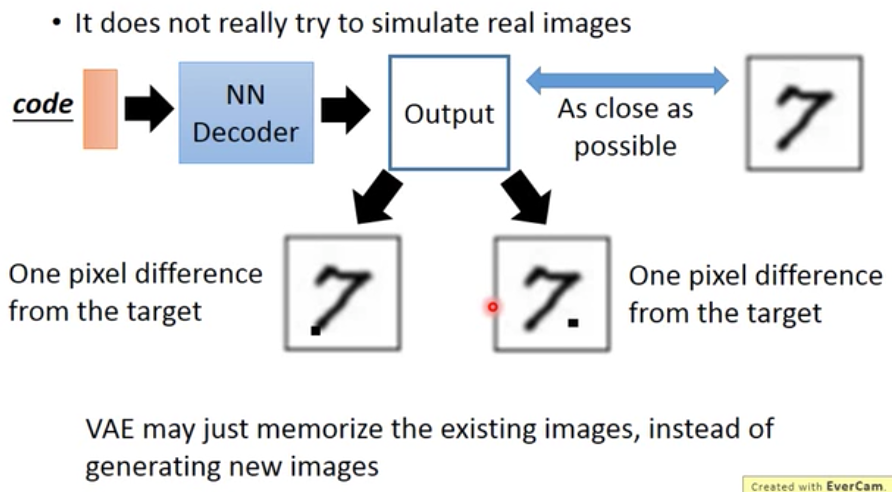

     

   

#### 3.Generative Adversarial Network (GAN)
1. GAN的基本原理

   - GAN的思想是The evolution of generation，意为首先使用 NN Generator v1生成图片，然后使用Discriminator v1比较生成图片和目标图片；然后基于Discrimator v1的比较结果和意见，对NN Generator v1进行改进得到NN Generator v2，然后使用NN Generator v2生成图片，这时就可以让Discriminator v1无法分辨真假；以此类推，知道Generator和Discriminator性能变得都很好。

     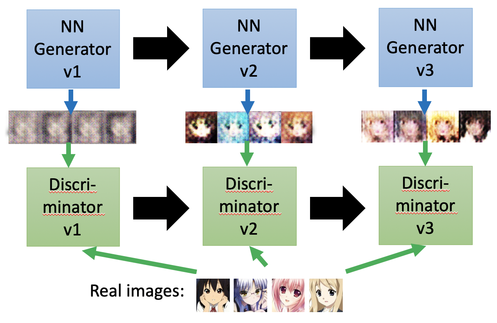
     
   - 对于Generator，相当于VAE中的Decoder，输入是从一个分布中采样出的Vector，输出是一张图片。对于Discirminator，输入是一张图片，输出是1或0，代表这张图片的真与假，Discirminator需要将Generator输出的图片都标记为假，将Real Image都标记为真。

     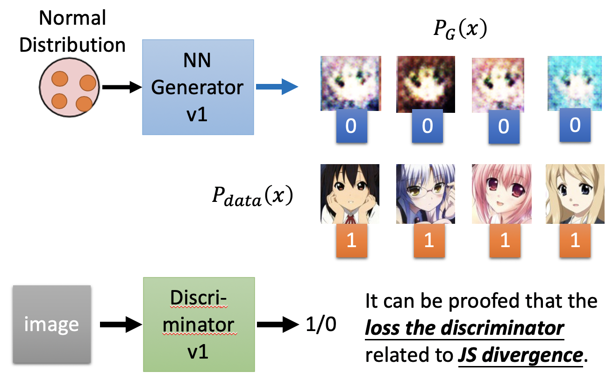
     
   - 已知NN Generator v1，其输出的图片被Discriminator判别为假，需要做的就是修改NN Generator的参数，使得产生的输出能够骗过Discriminator，被判别为真。Generator和Discriminator相当于一个大的神经网络，但是在修改Generator的参数时，需要固定住Discriminator的参数，否则修改就变得没有意义了。

     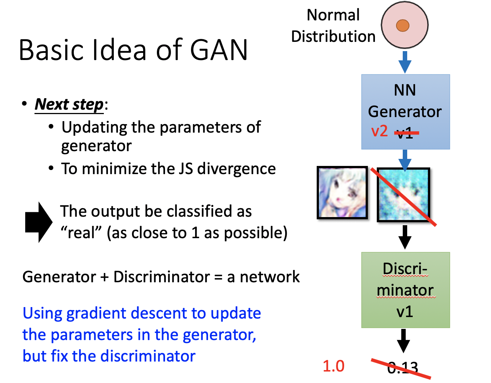

