# Chapter 21 - BERT

[Abstract](#Abstract)

[1.Embeddings from Language Model（ELMO）](#1)

​		[1.1 Contextualized Word Embedding](#1.1)

​		[1.2 Embeddings from Language Model（ELMO）](#1.2)

[2.Bidirectional Encoder Representations from Transformers （BERT）](#2)

​		[2.1 BERT的网络结构](#2.1)

​		[2.2 BERT的训练技巧](#2.2)

​		[2.3 BERT的使用方法](#2.3)

​		[2.4 What does BERT learn?](#2.4)

​		[2.5 Multilingual BERT](#2.5)

[3.Enhanced Representation through Knowledge Integration （ERNIE）](#3)

​		[3.1 ERNIE的基本思想](#3.1)

[4.Generative Pre-Training（GPT）](#4)

​		[4.1 GPT的基本思想](#4.1)

​		[4.2 GPT的神奇之处（Zero-shot Learning）](#4.2)

#### Abstract：该章节介绍的是ELMO、BERT以及GPT，主要的作用是让机器能够理解人类自然语言的意义。之前在对词汇进行编码的时候经常使用One-hot编码，这种编码方式词汇词汇之间都是独立的，没有任何关联。之后又产生了Word Class的概念，根据词汇的分类进行编码，但是这种方式的分类过于单一，无法理解词汇的综合含义，如下图无法区别哺乳类和非哺乳类动物。再之后产生了Word Embedding的概念，根据词汇的上下文将词汇转换成向量，也可以称为一种Soft Word Class。

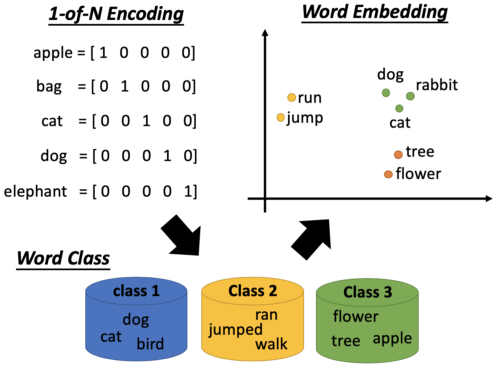

#### 1.Embeddings from Language Model（ELMO）

1. Contextualized Word Embedding

   - 如下图所示，四个“bank”代表着四个Word token，但是都属于一个Word type。在过去经典的Word Embedding中，每一个Word type会有一个Embedding表示，及时两个词type相同，token不同，embedding也相同。在自然语言中，一个词可能具有很多种意思，所以按照type进行编码是存在问题的。（https://www.zhihu.com/question/264967683/answer/584858822）

     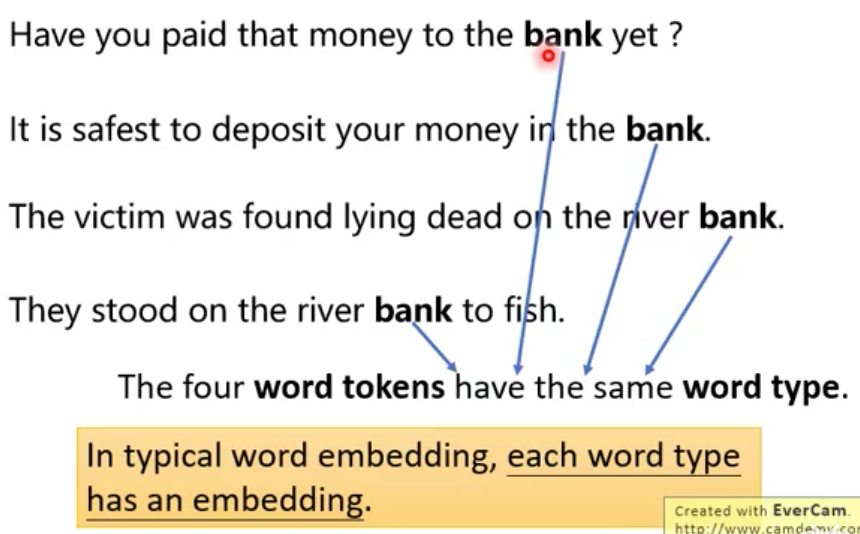
     
     
     
     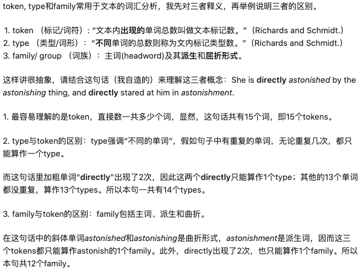
     
   - 一种解决办法是按照字典的解释，如果有多种意思，就进行多种编码。但是自然语言是微妙的，例如“bank“在词组”blood bank“中还有血库的意思。如下图所示，很多事物也有重名的可能性。

     
     
   - 基于上述Typical Word Embedding的问题，Contextualized Word Embedding被提出。要求每一个Token都有一个Embedding，其Embedding取决于该Token的上下文。如下图中每一个”bank“都有自己的Embedding Vector，被翻译为银行的Embedding Vector虽然不一样，但是比较相似，而被翻译为银行和堤坝之间的差异就会比较大。

     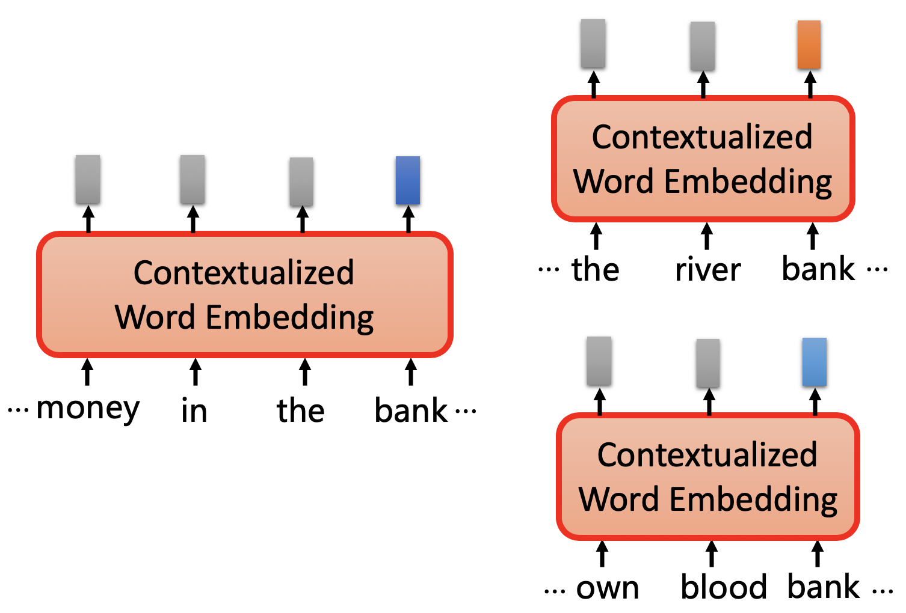
     
       

2. Embeddings from Language Model（ELMO）

   - ELMO是一个RNN-based Language Model，训练数据有一系列Sentence组成，不需要label。（https://arxiv.org/abs/1802.05365） ，基于上下文的方式如下如所示

     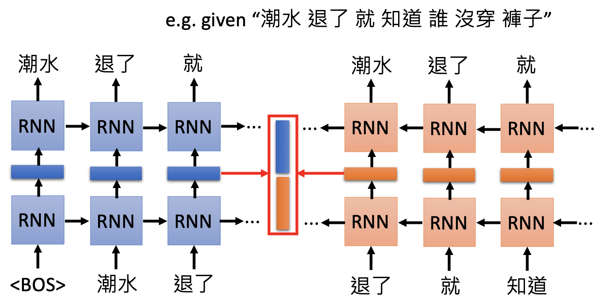
   
   - 上图的架构可以的Deep的，但是变成深度网络之后，选取哪一层的Embedding作为最终结果就需要考量。
   
     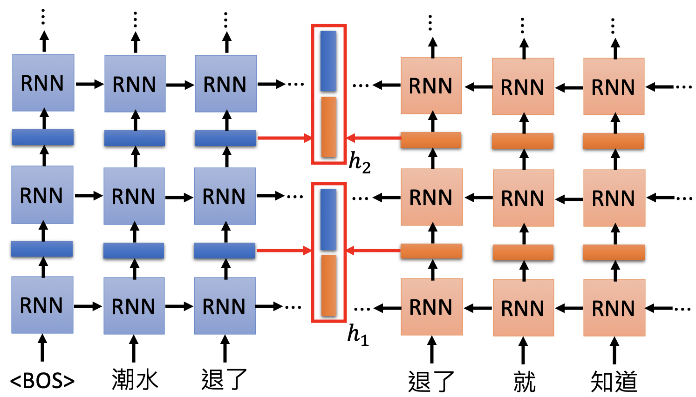
   
   - 对于如何选取Embedding的问题，ELMO的解决方案是”全都要“，通过Weighted Sum的方式将每层RNN生成的Embedding加和起来，生成最终的Embedding Vector。其中的权重$\alpha_1,\alpha_2$等等都是学习出来的，在学习之前先要确定downstream task是什么，即生成的Embedding Vector要用于什么。权重$\alpha_1,\alpha_2$是跟随downstream task一起训练出来的。作者在原文中指出，coref和squad两个任务更偏向使用第一层的表示。
   
     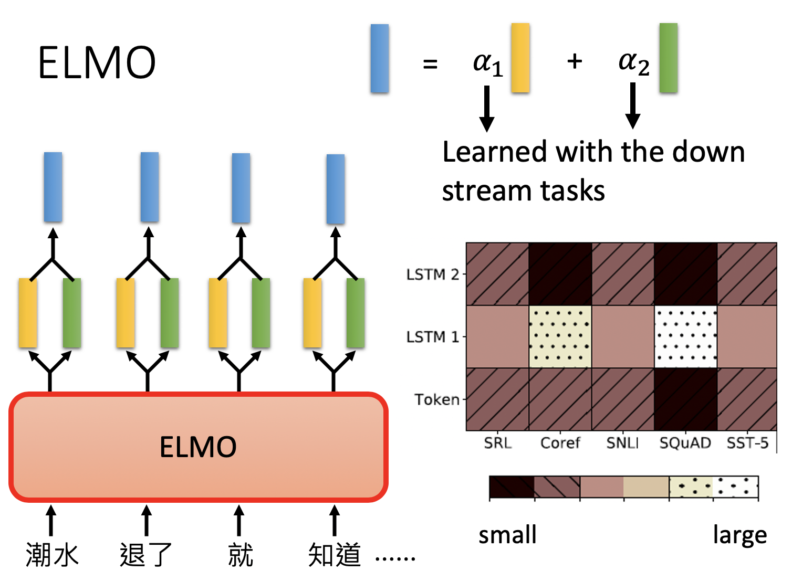
   
     
   

#### 2.Bidirectional Encoder Representations from Transformers （BERT）

1. BERT的网络结构

   - BERT相当于Transformer的Encoder，通过训练Encoder部分学习大量的文本得到，但是相较于Transformer需要Label而言，该训练过程不需要Annotation。BERT做的事情就是就是将一个句子作为输入，输出每个词汇对应的Embedding。对于中文而言，BERT的数据集使用字（character）作为基本单位更好。因为BERT的输入也是要编码为One-hot形式，如果用词的话，那么需要的维度几乎是无穷大。

     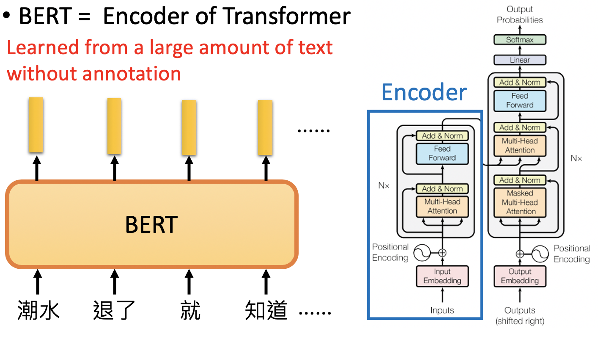

     

2. BERT的训练技巧

   - BERT的第一种训练方法是Masked LM，以一定的几率，随机的抹掉一些输入，将其变为”[MASK]“。假设第二个输入被置为”[MASK]“，那么在BERT输出对应的Embedding Vector后，将第二个词汇的Embedding Vector送入一个Linear Multi-class Classifier，要求这个Classifier可以根据Embedding Vector辨别出对应的是哪一个中文字符。因为Linear Multi-class Classifier的识别能力是很有限的，所以需要要求BERT生成的Embedding Vector要足够好。在BERT的结果中，如果两个词填在同一个位置没有违和感，那么二者就具有类似的Embedding Vector，比如图中的”[MASK]“可以是”退了“，也可以是”落了“，二者的Embedding Vector会比较相似。

     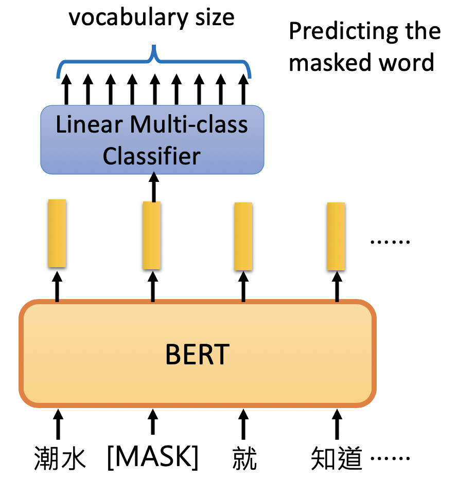
     
   - BERT的第一种训练方法是Next Sentence Prediction，给BERT输入两个句子，BERT需要判断两个句子是否是连接在一起的。其中有两个特殊字符，”[SEP]“最为两个句子的boundary，”[CLS]“对应的输出会送入Linear Binary Classifier，用于判断是否为上下文。”[CLS]“放在最开始的原因是，BERT的内部是Self-Attention，即任何位置都会受到其他位置的词汇的影响，无论远近。假设BERT内部用到的是RNN，那么”[CLS]“更应该放在末尾。
   
     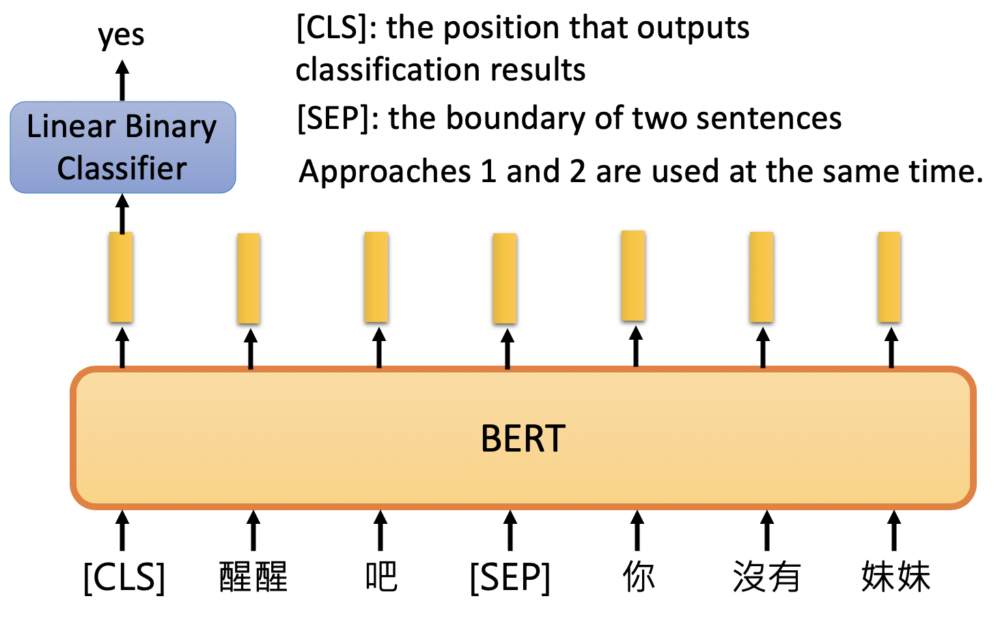
     
   - Masked LM和Next Sentence Prediction同时作为训练方法，共同训练BERT时能够达到最好的效果。
   
     
   
3. BERT的使用方法

   - 作者在文章中提出的使用方法为，不是单独的将BERT的输出作为某个任务输出的一种Embedding，而是将BERT的输出作为另一个任务的输入，然后将BERT和另外一个任务的网络共同进行训练。

   - Case 1：Input - Single sentence，Output - class（Example：Sentiment analysis，Document Classification）。在首位加上一个"[CLS]"，代表这个这个句子或文章的分类结果。其中Linear Classifier是Trained from Scratch（白手起家，不进行预训练），而BERT只进行FIne-tune就可以了。

     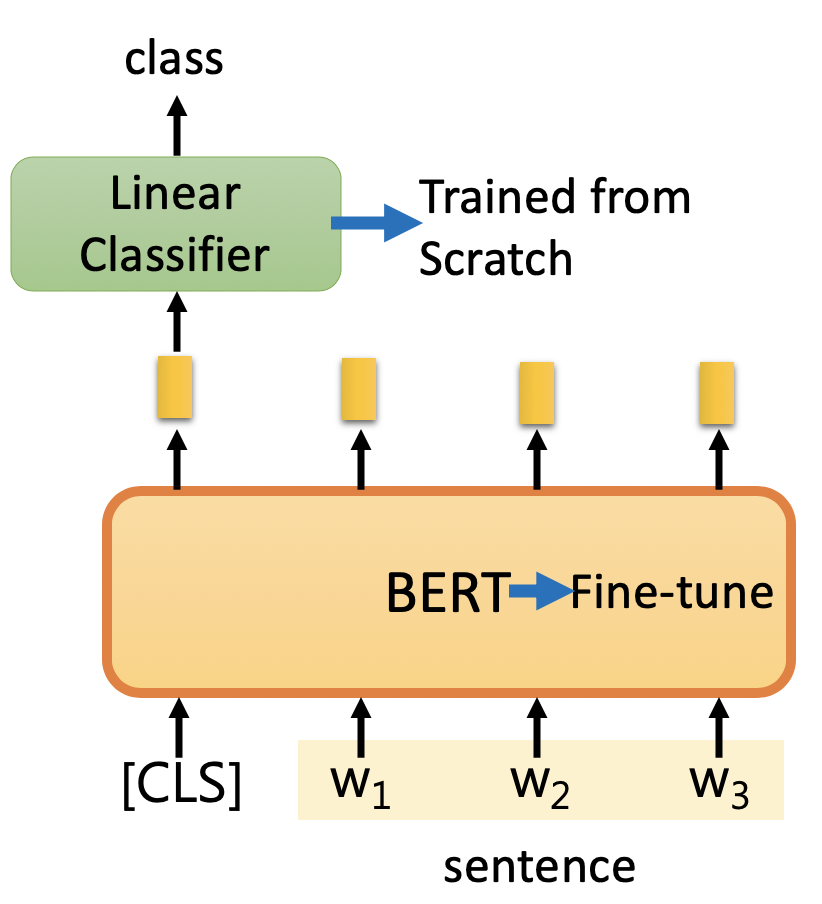

   - Case 2：Input - Single sentence，Output - class of each word（Example：Slot Filling）。使用对个Linear Classifier对每个词进行分类。其中Linear Classifier是Trained from Scratch（白手起家，不进行预训练），而BERT只进行FIne-tune就可以了。

     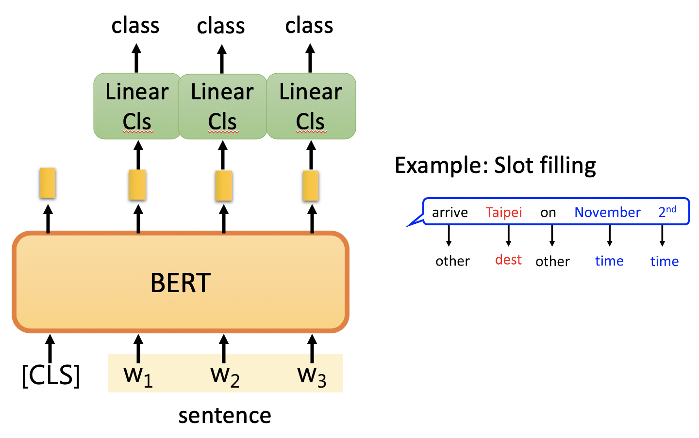

   - Case 3：Input - Two sentence，Output - class（Example：Natural Language Inference，Given a “premise”, determining whether a “hypothesis” is T/F/ unknown.）

     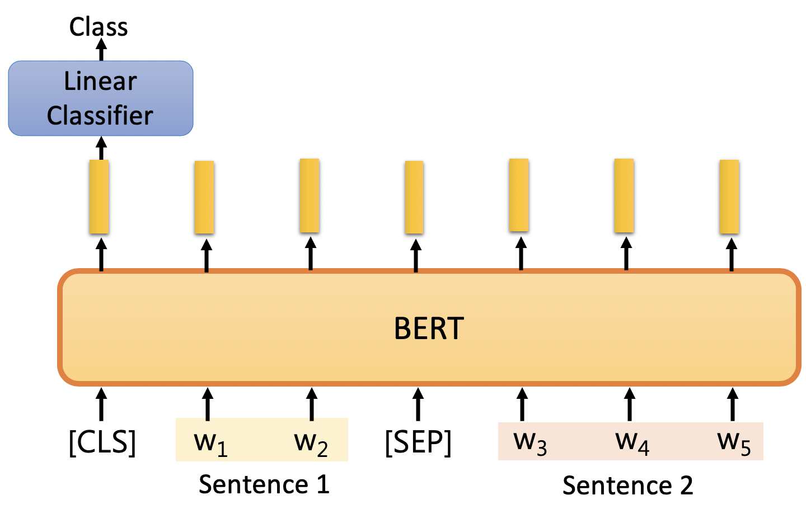

   - Case 4：Input - Two sentence，Output - class（Example：Extraction-based Question Answering (QA) (E.g. SQuAD)，给定一组Document、Query，输出两个整数，代表答案的起止位置）。将问题和文章使用”[SEQ]“连接后作为输入。然后在通过一个新的网络，学习图中红蓝两个向量（维度与黄色的相同），红色决定”s“，蓝色决定”e“。分别计算红色Vector和BERT Embedding Vectors（黄色）的內积，然后进行SoftMax，最大的位置就是”s“的值；同理，分别计算蓝色Vector和BERT Embedding Vectors（黄色）的內积，然后进行SoftMax，最大的位置就是”e“的值。如果"s"和"e"冲突了，即前者大于后者，则代表此题无解。图中红蓝两个向量是根据Document、Query、Answer学出来的。

     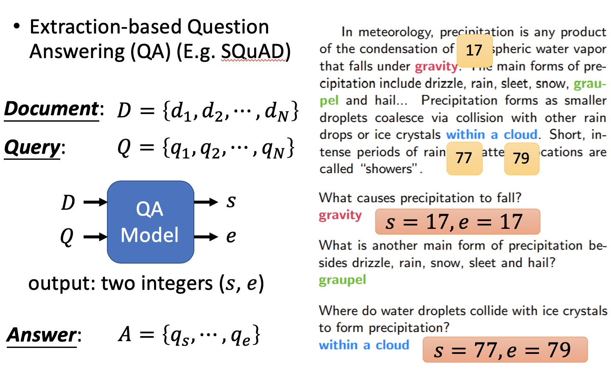

     

     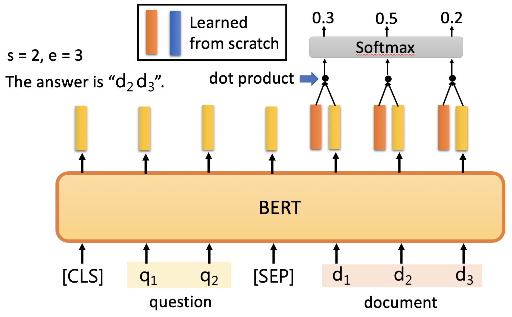

     

     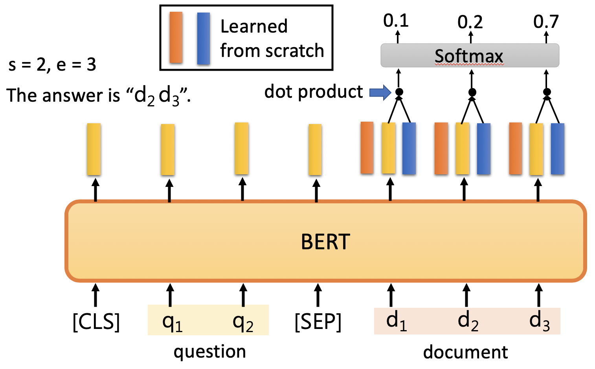

4. What does BERT learn?

   - BERT的每一层相当于NLP从简单到复杂的整个过程，词性 - 词义 - 句法 -句意 - 文法等等。右图中蓝色方块越大表示这几层越符合该任务。

     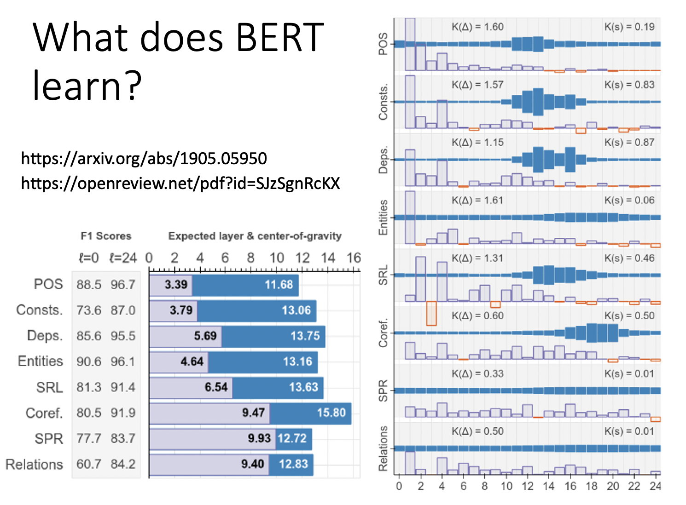

   - https://arxiv.org/abs/1905.05950

   - https://openreview.net/pdf?id=SJzSgnRcKX

     

5. Multilingual BERT

   - https://arxiv.org/abs/1904.09077

     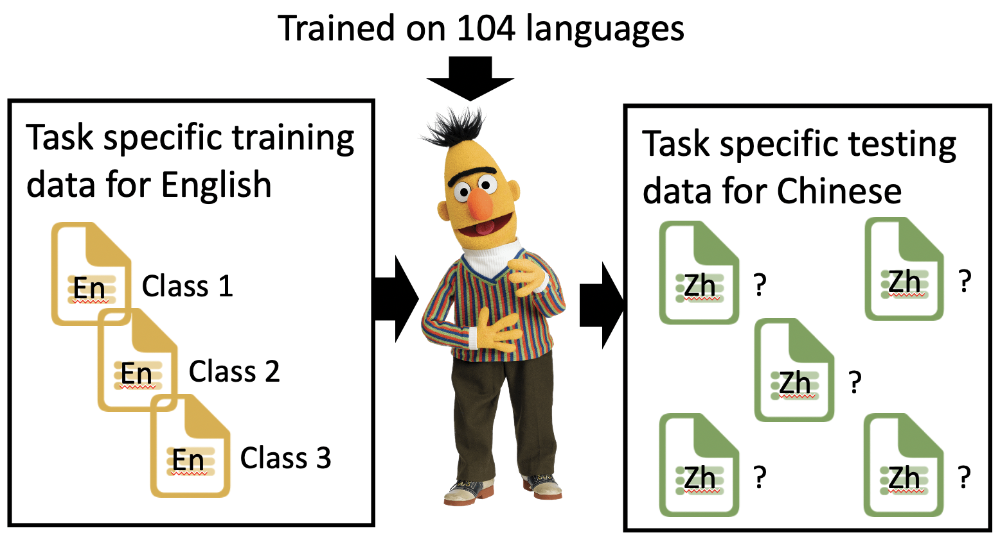

   

#### 3.Enhanced Representation through Knowledge Integration （ERNIE）
1. ERNIE的基本思想

   - ERNIE是专门为中文设计的，因为用BERT处理中文时，将一些输入转换为”[MASK]"。但是在中文的语境下，只掩盖一个词的话是非常容易被猜中的，所以在MASK时需要以词汇为基本单位。（https://zhuanlan.zhihu.com/p/59436589，https://arxiv.org/abs/1904.09223）

     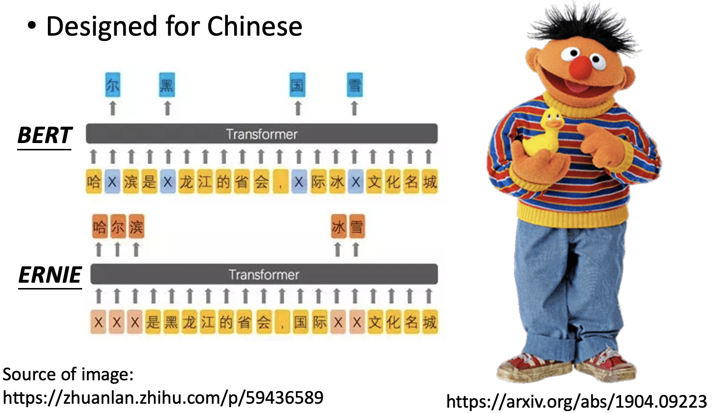
     
     

#### 4.Generative Pre-Training（GPT） 

1. GPT的基本思想

   - GPT相当于一个硕大无比的Language Model，不同之间的参数量如下图所示。与BERT不同的是，GPT相当于Transfomer的Deocder。（https://d4mucfpksywv.cloudfront.net/better-language-models/language_models_are_unsupervised_multitask_learners.pdf）

     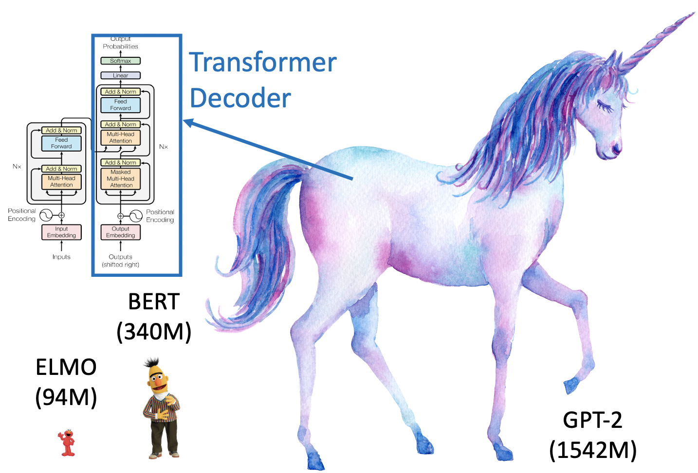
     
   - GPT的目标也是对Next Word进行预测。GPT的核心也是Self-Attention，根据当前的词汇进行Self-Attention，得到下一个词可能是什么，然后将其作为输入继续进行预测。

     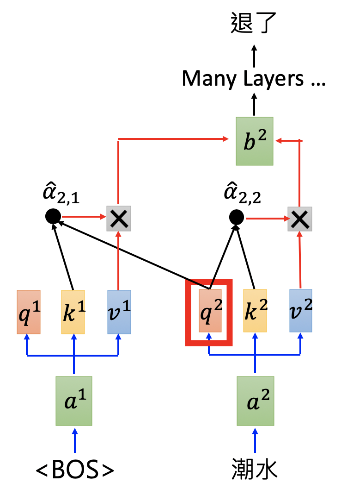
     
     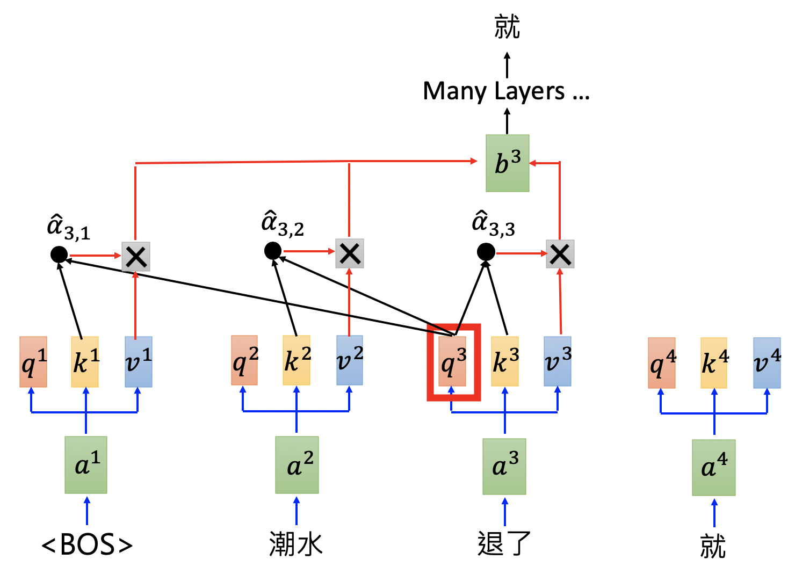
     
     

2. GPT的神奇之处（Zero-shot Learning）

   - GPT可以在没有训练资料的情况下就完成一些任务，例如Reading Comprehension（效果不错）、Summarization（效果不好）、Translation（效果不好）等等。直接给一个输入，GPT就可以输出相应的答案。

   - GPT中Attention的可视化研究可以参考 https://arxiv.org/abs/1904.02679。比如很多Head都Attention到第一个词上。

     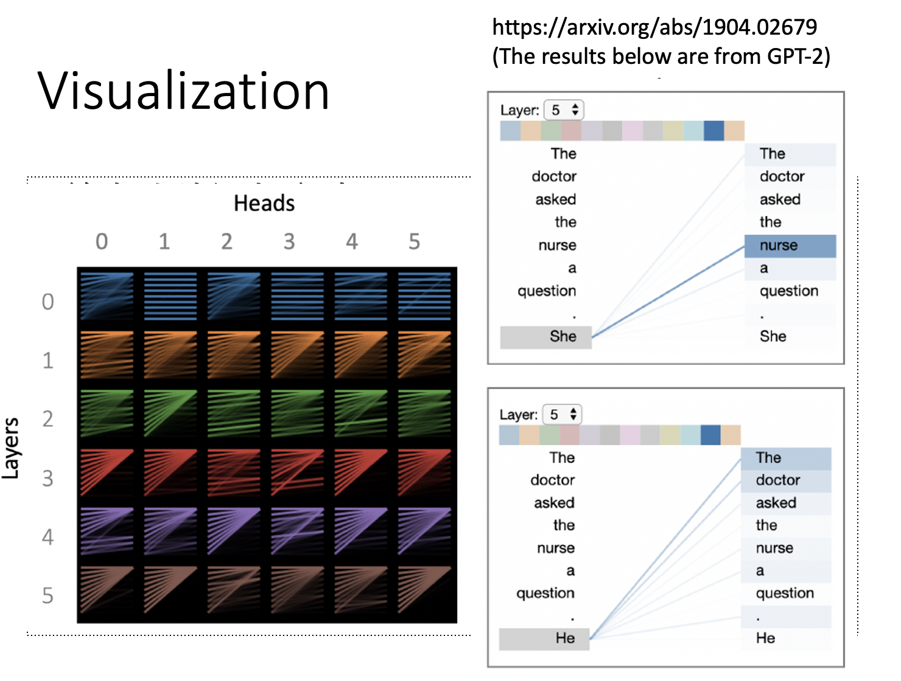

