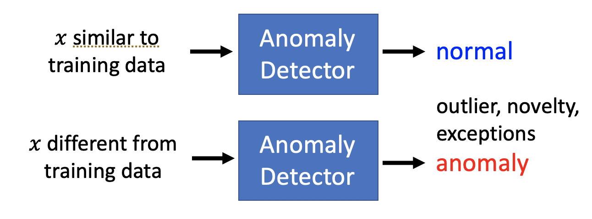
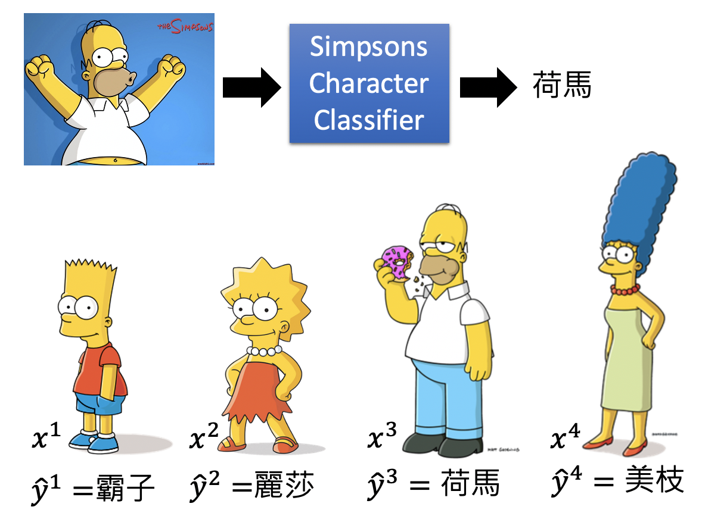
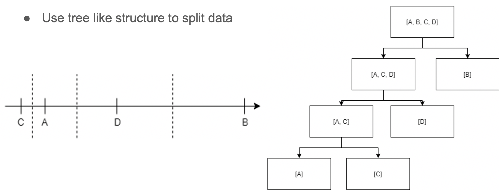

# Chapter 23 - Anomaly Detection

[1.Anomaly Detection](#1)

​		[1.1 Anomaly Detection的基本原理](#1.1)

​		[1.2 Anomaly Detection按照数据类型的分类](#1.2)

[2.Case 1 - With Label（Classifier）](#2)

​		[2.1 用分类器的输出分布进行异常检测](#2.1)

​		[2.2 模型的评价](#2.2)

​		[2.3 使用Classifier进行异常检测的问题](#2.3)

[3.Case 2 - Without Label（Classifier）](#3)

​		[3.1 最大似然估计实现异常检测](#3.1)

[4.更多实现异常检测的方法](#4)

​		[4.1 Auto-Encoder](#4.1)

​		[4.2 One-class SVM](#4.2)

​		[4.3 Isolated Forest](#4.3)

[5.More About Anomaly Detection](#5)

​		[5.1 Classic Method](#5.1)

​		[5.2 Anomaly detection on Image](#5.2)

​		[5.3 Anomaly detection on Audio](#5.3)

#### 1.Anomaly Detection

1. Anomaly Detection的基本原理

   - Anomaly Detection做的事情就是让机器知道我们不知道这件事情，可以被抽象为：已知训练数据集 $\{x^1,x^2,\dots,x^N\}$，寻找一个Function去判断 input $x$是否和训练数据类似。Anomaly Detection检测的就是和训练资料不同的东西，不光是检测“坏”的东西，也会检测“好”的东西。所以Anomaly Detection可以用来检测outlier, novelty, exceptions（异常消息的传播）。

     
     
   - Anomaly的定义其实是取决于训练数据的内容，比如训练资料都是雷丘，那比卡丘就是Anomaly；如果训练资料都是比卡丘，那么雷丘就是Anomaly。

     
     
   - Anomaly Detection有很多的应用案例，比如：

     - Fraud Detection：Training data为正常刷卡行为, $x$为盗刷行为（Ref: https://www.kaggle.com/ntnu-testimon/paysim1/home，Ref: https://www.kaggle.com/mlg-ulb/creditcardfraud/home）
     - Network Intrusion Detection：Training data为正常网络请求，$x$为异常攻击行为（Ref: http://kdd.ics.uci.edu/databases/kddcup99/kddcup99.html）
     - Cancer Detection ：Training data为正常細胞，$x$为癌細胞（Ref: https://www.kaggle.com/uciml/breast-cancer-wisconsin-data/home）
     
   - 最简单实现Anomaly Detection的方式就是Binary Classifier，正常数据为一类，异常数据为另一类。但实际上，将Anomaly Detection当做Binary Classifier问题是有问题的。问题一是，比如宝可梦属于正常数据，数码宝贝属于异常数据，但其实奥特曼、武林外传都属于异常数据。异常数据的范畴几乎是无穷无尽的。问题二是，对于一些场景，正常数据比较容易收集，但异常数据是比较难收集的，比如诈骗交易记录。

     
     
       

2. Anomaly Detection按照数据类型的分类

   - 假设已知Training data $\{x^1,x^2,\dots,x^N\}$和对应的标签 $\{\hat{y}^1,\hat{y}^2,\dots,\hat{y}^N\}$。然后可以使用Generative Model、SVM、Deep Learnning作为分类器进行训练。需要注意的是在所有数据的标签中，没有“unknown”的类型，但是我们想要我们的分类器在遇到没有学习过的输入后将其判定为“unknown”，这种方式成为Open-set Recognition。

     
   
   - 如果只有Training data $\{x^1,x^2,\dots,x^N\}$，但是没有Label的情况下。又分类两种情况，一种是所有training data都是正常的，另一种是training data中含有一少部分异常的数据。
   
   

#### 2.Case 1 - With Label（Classifier）

1. 用分类器的输出分布进行异常检测

   - 任务的基本描述为给定一张图片，判断这个人物是否来自Simpsons家庭。Kaggle上有一个训练好的模型，可以判断一张图片是否来自辛普森家庭。（https://www.kaggle.com/alexattia/the-simpsons-characters-dataset/）

     

   - 基于上述模型，我们不仅仅想要知道一张图片的任务是否来自于辛普森家庭，我们还想让模型给出一个Confidence Score，然后根据Confidence Score与阈值的大小关系，进行Anomaly Detection。

     
     
   - 实际上一个Classifier的输出其实是一个分布，我们只需要在这个分布中选择最大的那个值作为信心分数即可。也可以使用信息熵的大小进行判断。

     
     
   - 在下图中，如果输入的图片是辛普森家庭的一员，那么机器会以比较高的置信度给出判断，反之置信度会比较低。

     
     
   - 在经过大量数据的训练后，模型对辛普森家庭任务的判断会有非常高的信息，而对于Anomaly的判断信心分数是比较低的。

     
     
   - 除了以分类器的输出分布作为信心分数的参考之外，也可以在训练时直接要求模型对信心分数进行学习，具体可以参考 Network for Confidence Estimation（Terrance DeVries, Graham W. Taylor, Learning Confidence for Out-of-Distribution Detection in Neural Networks, arXiv, 2018）

     

     

2. 模型的评价

   - 在上一小节，已知Simpsons Image $x$，每个都有对应的角色名称标签$\hat{y}$，然后可以训练一个分类器，其输出为一个分布，根据分布得到Confidence Score。然后我们可以应用Dev Set的数据（Image $x$和是否属于辛普森家族的标签）对模型的performance进行计算，并使用Dev Set决定阈值 $\lambda$ 和其他超参数。然后使用Testing Set进行评价。

     
     
   - 通过实验对不同的图片进行测试可知，对于辛普森家族的图片大多数都会以高置信度得到结果（最右边的蓝色，大多数都超过0.998），不是辛普森家族的图片为红色。应用Dev Set的数据评估模型的performance。一种方法是使用Accuracy，假设阈值 $\lambda$设置为0.2，那么系统的正确率为95.2%，但其实系统并没有识别出五个异常数据。由此可知正确率高的系统不一定就是一个好的异常检测系统，因为正常数据和异常数据的数量分布过于悬殊。
   
     
     
   - 在异常检测系统中，错误分类两种，一种是正常判断为异常，另一种是异常判断为正常。假设将阈值 $\lambda$设定在某个值，那么上述两种错误的数量如下所示。对于上下两个阈值并没有绝对的好坏，而是看应用场景更看重False alarm还是更看重Miss case。
   
          
     
   - 于是需要一个Cost Tabel设置一定的权重去衡量到底哪一个因素更重要，不同的Cost Tabel会得到不同的结果。比如在癌症检测中，可能更偏向于右边的Cost tabel，宁可误判，也不漏判。
   
     
     
   - 除了Cost Tabel，还有其他一些评价手段，比如AUC等等。
   
     
   
3. 使用Classifier进行异常检测的问题

   - 用分类器进行异常检测可能会出现一个问题。比如训练数据为猫和狗的Image，该分类器可以很好的区分猫和狗。如果将马来貘或羊驼作为输入，机器不知道这是什么东西，可能就会将其判断为模棱两可的东西，即在分类面附近，这样给出的置信度就不会很高，可以成功的检测出是非猫非狗的动物。但是有一些其他动物比如豺狼比狗更像狗，虎豹比猫更像猫。那么机器就会以更高的置信度判断为猫或者狗。

     

   - 再比如Case 1中辛普森的案例，假设取一个非辛普森家族的任务，将其背景或者局部涂黄，机器就会以很高的置信度将其判断为辛普森家族的一员。

     

   - 解决上述为题的办法是，在训练资料中加入异常资料，要求极其不但能够以高置信分数对正常资料进行分类，还能给异常资料比较低的置信分数（Kimin Lee, Honglak Lee, Kibok Lee, Jinwoo Shin, Training Confidence-calibrated Classifiers for Detecting Out-of-Distribution Samples, ICLR 2018）。在异常资料难以收集时，又可以用GAN的方式生成Anomaly Data（Mark Kliger, Shachar Fleishman, Novelty Detection with GAN, arXiv, 2018）。

   

#### 3.Case 2 - Without Label（Classifier）
1. 最大似然估计实现异常检测

   - 以多人共同游戏为例，存在一些网络小白或者攻击者扰乱游戏规则和进度。Anomaly Detection就可以完成网络小白的检测，维持游戏的正常进行。这个场景可以被抽象为已知Training data $\{x^1,x^2,\dots,x^N\}$，代表每一个玩家（由说垃圾话、无政府状态发言等等）。Anomaly Detection的目标是判断输入是否与训练数据相似。

     
     
   - 因为不能使用Classifier生成信心分数，所以需要学习一个概率分布 $P(x)$作为新的信心分数。

     
     
   - 假设每个玩家仅由两个维度进行表示，说垃圾话和无政府状态发言。发现少量垃圾发言的人是最多的，多数人都是无政府状态发言。所以如图所示不同位置的数据点，被作为正常玩家的概率也是不同的。

     
     
   - 对上图中的概率进行定量分析的方法就是最大似然估计，假设所有数据点都是从Probability Density Function $f_\theta(x)$中采样的，参数$\theta$决定了概率密度函数的形状，是从数据中学习到的。因为所有数据点都是从 $f_\theta(x)$中采样的，所以$L(\theta)=f_\theta(x^1 ) f_\theta(x^2 ) \cdots f_\theta(x^N )$，参数的最优解$\theta^∗=arg \ \max\limits_\theta ⁡L(θ)$

     
     
   - 最常用的概率密度函数为高斯分布，如下图所示。根据训练数据求解出参数后，阈值就相当于图中的一条等高线。

     
     
     
     
     
     
     
     
   - 也可以使用Auto-Encoder实现Anomaly Detection

     

#### 4.更多实现异常检测的方法

1. Auto-Encoder

   - 使用Auto-Encoder实现Anomaly Detection，先用正常数据对网络进行训练。训练完成后，给定一个输入，如果输入类似于正常图片，那么模型能够轻易的将其编码并进行重构；如果模型重构的误差比较大，那么说明该数据可能是异常数据。

     
     
     

2. One-class SVM

   - Ref: https://papers.nips.cc/paper/1723-support-vector-method-for-novelty-detection.pdf

     

     

3. Isolated Forest

   - Ref: https://cs.nju.edu.cn/zhouzh/zhouzh.files/publication/icdm08b.pdf

     
     
     

#### 5.More About Anomaly Detection

1. Classic Method

   - Anomaly Detection中的经典方法有基于Classifier的、基于Gaussian Mixture Model的、基于Auto-Encoder的、基于PCA的、基于Isolation Forest的。前三个在上述章节已经介绍过了，本节对后两种方法进行介绍。

   - 基于PCA的Anomaly Detection中，将原始数据将降到一定的维度之后异常数据和正常数据之间会产生比较明显的间隔。（[https](https://www.oreilly.com/library/view/hands-on-unsupervised-learning/9781492035633/ch04.html)[://www.oreilly.com/library/view/hands-on-unsupervised-learning/9781492035633/ch04.html](https://www.oreilly.com/library/view/hands-on-unsupervised-learning/9781492035633/ch04.html)）
   
   - 基于Isolation Forest的Anomaly Detection中，将原始数据将降到一定的维度之后异常数据和正常数据之间会产生比较明显的间隔。（https://towardsdatascience.com/outlier-detection-with-isolation-forest-3d190448d45e）
   
     
     
     
     
     
   
2. Anomaly detection on Image

   - AnoGAN（https://arxiv.org/pdf/1906.11632.pdf）

     

   - EGBAD（Efficient GAN-Based Anomaly Detection）：https://arxiv.org/pdf/1906.11632.pdf

   - GANomaly

     

   - Summary（https://arxiv.org/pdf/1711.09325.pdf、https://arxiv.org/pdf/1809.10816.pdf、https://arxiv.org/pdf/1812.02288.pdf、https://arxiv.org/pdf/1901.08954.pdf、https://arxiv.org/pdf/1905.13147.pdf）

     

     

     

3. Anomaly detection on Audio

   - GMGAN（Gaussian Mixture GAN）：https://arxiv.org/pdf/2002.01107.pdf

     

     

   

   
