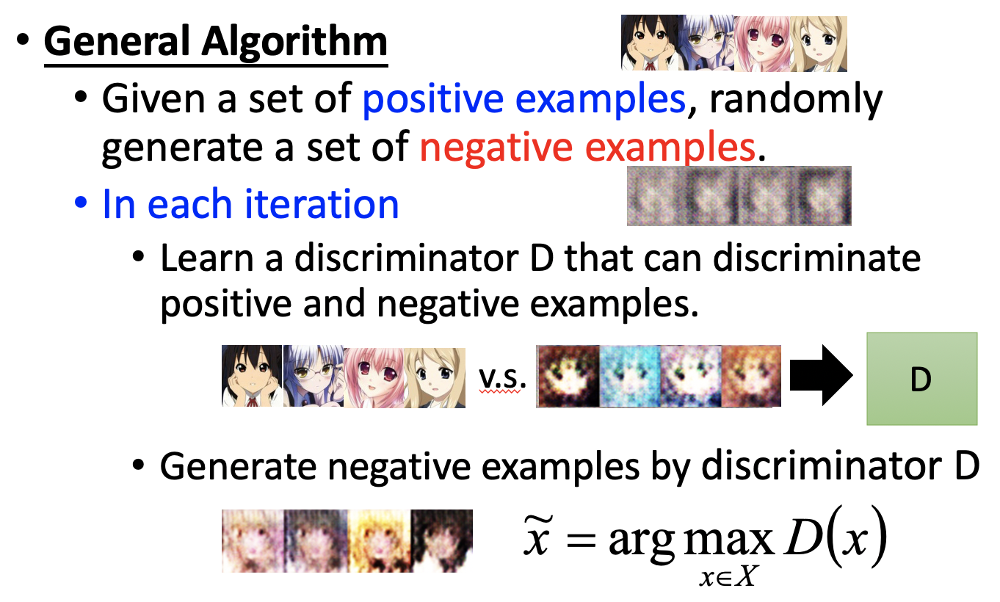
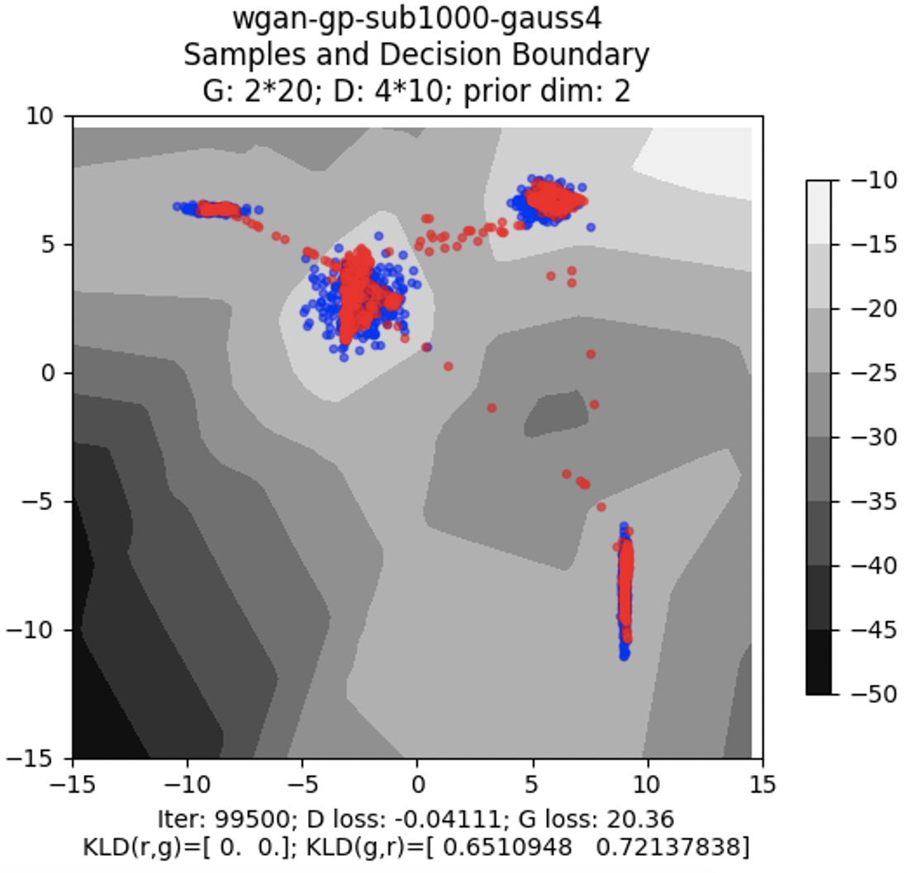

# Chapter 24 - Generative Adversarial Network（Part 1 - Introduction）

[1.Basic Idea of GAN](#1)

​		[1.1 Generator与Discriminator](#1.1)

​		[1.2 GAN Algorithm](#1.2)

[2.GAN as structured learning](#2)

​		[2.1 Structured Learning的难点与解决方案](#2.1)

[3.Can Generator learn by itself? YES！](#3)

​		[3.1 使用Auto-Encoder实现Generator的独自学习](#3.1)

[4.Can Discriminator generate? YES, but diffiuclt!](#4)

​		[4.1 使用Discriminator完成Generative Task的基本方法](#4.1)

​		[4.2 具体算法描述与可视化分析](#4.2)

[5.GAN = Generator + Discriminator](#5)

​		[5.1 Generator与Discriminator的相辅相成](#5.1)

#### Abstract：GAN有很多的变种，本章节会逐个介绍一些典型的GAN-based Model。

#### 1.Basic Idea of GAN

1. Generator与Discriminator

   - 在Generative Model中，就是给定一个Vector，会产生相应的文字或图片。

     
     
   - GAN - Generator，类似于Generative Model，给定一个输入，生成一个High Dimensional Vector。输入中的每一个维度都代表着一个特征。

     
     
   - GAN - Discriminator，输入就是Generator的输出，输出为一个标量，代表着输入的真假。

     
     
   - GAN中Generator和Discriminator的关系是对抗的，Generator的目标是生成一个让Discriminator无法辨别真假的Object，Discriminator的目标是尽可能的将Generator生成的Object和Real Object分开。两者不断地演进，最后达到最好的效果。

     
     
   - GAN可以生成从未见过的东西，比如去两个图片的中间值，就会生成一些新的图片。

     

       

2. GAN Algorithm

   - GAN的算法大致流程如下：

     - 初始化Generator和Discriminator；

     - 在每次迭代中，进行如下操作：

       ​	Step 1：固定Generator G，更新DIscriminator的参数。首先Randomly Sample出一些Vector，将其作为Generator的输入，得到输出Generated Object（最会开始生成的效果不会很好）。然后在Database中抽取一些Image作为Real Object。将Real Object和Generated Object作为Discriminator的输入进行训练，目标是将二者区分开。

       

       ​	Step 2：定DIscriminator D，更新Generator G的参数。Generator的目标是生成更好的Generated Object，进而使DIscriminator给一个高的分数（更真实）。此时将Generator和Discriminator视作一个整体，比如Generator和Discriminator都是五层的网络，然后中间有一个很宽的Hidden Layer，其输出就是Generated Object。需要做的就是固定住DIscriminator网络中的参数，调整Generator网络中的参数，使得DIscriminator给出的分数越高越好。

       

       

   - GAN的算法的伪代码如下：

     

#### 2.GAN as structured learning

1. Structured Learning的难点与解决方案

   - 普通的Regression的输出是一个scalar，Classification的输出是一个Vector，更复杂的任务可能要求输出一个序列（Machine Translation、Speech Recognition、Chat-bot）、矩阵（Image to Image、Text to Image）、图像、树等等，这种任务就称为Structured Learning。例如。

               

   - Structured Learning的难点在于One-shot或Zero-shot Learning的本质（Zero-shot learning 指的是我们之前没有这个类别的训练样本。但是我们可以学习到一个映射X->Y。如果这个映射足够好的话，我们就可以处理没有看到的类别；One-shot learning 指的是我们在训练样本很少，甚至只有一个的情况下，依旧能做预测）。因为Structured Learning中输出都是比较复杂的，如果将每个输出都看作一个独立的类别，那么Structured Learning就是一种比较极端的One-shot learning。机器需要做到看到一次后就做到泛华，或者没看过就会生成是比较困难的。解决这种问题，机器就需要有大局观。例如在图片生成中，生成的每一个像素点，之间需要存在一定的联系，机器在生成每一个Component时需要考虑Component之间的依赖关系。

   - 传统Structured Learning中的解决方案分为两种Bottom Up和Top Down。Bottom Up指一个一个生成Component，然后组合起来，这样比较容易失去大局观；Top Down指在产生一个Object之后，从整体的角度去评估好与坏，找到最好的一个。使用这种方法比较难做Generator。两个方法结合起来，其实就是GAN。

     
     
     

#### 3.Can Generator learn by itself? YES！
1. 使用Auto-Encoder实现Generator的独自学习

   - 以图像生成为例，Generator的输入是Vector，输出是一张Image。通过收集图片和其对应的Vector，将其作为网络的输入和输出就可以像之前一样得到一个生成图片的NN（与分类器的输入输出恰好相反）。这样Generator就可以独担大任，不再需要Discriminator的辅助。

     
     
   - 上述方案的困难之处在于，code - Image的成对的数据是比较难收集的，也很难保证不同形态的“1”对应的Code也能够具有相同的特征。解决方案是，先将图片作为Auto-Encoder的输入，生成相应的Code。但是在Auto-Encoder中Encoder和Decoder是需要一起训练的，其中的Decoder就相当于GAN中的Generator。

     
     
   - Auto-Encoder实现Generator的问题在于，其只能重构之前训练时见过的输入，对于没见过的输入，产生的东西很有可能是人类无法理解的（具体可以参考Auto-Encoder章节月亮的例子）。该问题的解决办法就是Variational Auto-encoder（VAE）。

     
     
     
     
   - 因为Generator的Capacity没有大到可以完全正确的生成Target，错误是在所难免的。所以在什么地方犯错误是可容忍的才是问题的关键。如下图所示，6个pixel errors的图片其实是要比1个pixel error的图片更理想的。

     
     
   - 实际上一个Pixel的异常本质上是没有错误的，只是因为其附近的Pixel没有和其呼应起来，构成更完整的图像，所以显得该pixel是比较突兀的。但是一个模型是很难考虑到component之间的依赖关系，做到相互呼应的。假设Hidden Layer L-1的输出和之后的权重已经确定，那么Layer L的输出也是确定的，无法考虑相互之前的依赖关系。这种问题的解决办法就是让网络的层数变深，增加相邻神经元之间的关系。即通过Auto-Encoder训练出来的Generator只要在足够深的情况下才能和用GAN训练出来的Generator相媲美。

     
     
   - 蓝色的点是Generator产生点，绿色的点是训练时候的学习目标。使用VAE方法得到的结果显示，可能无法学习到$x_1$和$x_2$之间的关系，即$x_1$比较大时，$x_2$要么很大要么很小。

     
     
     

#### 4.Can Discriminator generate? YES, but diffiuclt!

1. 使用Discriminator完成Generative Task的基本方法

   - Discriminator在不同的领域也有一些不同的称呼，例如Evaluation function，Potential Function，Energy Function等等。输入是一个Object，输出是一个scalar，代表着object的好与坏。

   - Discriminator也可以独立的完成Generative Task。Generator在生成Component时很难考虑到组件之间的关系，但是Discriminator可以利用CNN卷积池化等方式，轻松的获取相邻组件之间的关系。

   - 假设已经有一个很好的Discriminator，那么最好的Generated Object将会获得最高的评分，即 $\widetilde{x}=arg\ \max\limits_{x \in X}D(x)$。于是穷举所有像素的组合，就可以求解出最好的Generated Object。整个过程虽然可以进行下去，但是是比较困难的，因为Discriminator擅长的是“批评”而不是提出一些好的东西。

   - 假设上述方式确实能够进行下去，那么具体的训练方式应该是Real Object作为输入时，期望输出1；Generated Object作为输入时，期望输出0。但实际上，我们手上只有Real Object，这样的数据训练出来的Discriminator对于任何输入都会产生1。

     
     
   - 在缺少Generated Object的情况下，如果生成一些噪声作为Generated Object，模型会学习到Real Object作为输入时，输出1；Noise Object作为输入时，输出0。那么在此之后，如果给一些比噪声好一些的输入，但又远远达不到Real Object时，机器依旧会给比较高的分数。所以，Realistic Negative Example（Generated Object）的产生和收集对于Discriminator的训练是至关重要的。至此，我们的目标是使用Discriminato产生Image，但是又受困于不知道怎么产生Realistic Negative Image，变成了一个死循环。

     
     
     

2. 具体算法描述与可视化分析

   - Discriminator完成Generative Task的算法描述如下：

     - 已知一组Positive Examples，一组随机生成的Negative Example；

     - 在每一轮迭代（通过不断地迭代完善Negative Example，然后更好的训练 D），完成如下操作：

       ​	Step 1 - 训练Discriminator D，对Positive Examples和Negative Example进行区分；

       ​	Step 2 - 使用$\widetilde{x}=arg\ \max\limits_{x \in X}D(x)$生成一组新的Negative Examples。

       

       

   - Discriminator的训练过程可以表示为下图。实际上Object应该是一个高维的数据，在此处将其简化为一维。Discriminator需要给Positive Examples高分，给Negative Example低分。

     
     
   - 但是实际上整个数据空间是非常庞大的，Discriminator无法给不存在Example的部分很低的分数（即仅保证Positive Examples是高分），例如下图中第一个红色曲线real object的右边部分。但是在我们的算法中，每次进行完Step 1的评分后，都会重新生成Negative Example。在下一轮评分中，Negative Example的分数会比较低。

               
     
     
     
   - 实际上，有很多使用Discriminator进行Generative Task。上述Discriminator的训练方法其实类似于Graphical Model的训练方法。

     
     
     

#### 5.GAN = Generator + Discriminator

1. Generator与Discriminator的相辅相成

   - Generator的优点是容易做成Deep，缺点是模仿了目标的表象，但是难以有大局观，无法掌握组件之间的细节；Discriminator的优点是有大局观，缺点是做生成任务非常困难，$arg\ max$问题比较难解。

     
     
   - 综合Generator和Discriminator就得到了GAN，利用Generator生成的Object作为Discriminator的Negative Example。相当于使用Generator求解$arg\ max$问题。Discriminator的结果又能很好的帮助Generator建立大局观。
   
     
     
     
     
   - 对比VAE方法实现Generator的结果，GAN的结果如下。红色的点是生成的，在簇与簇之间的点变得更少了。
   
     
     
     
     
   - VAE和GAN的人脸产生上，VAE的结果比较模糊。（https://arxiv.org/abs/1512.09300）
   
     
     
     
     
   - VAE和GAN的对比（FID[Martin Heusel, et al., NIPS, 2017]: Smaller is better）。纵轴FID Score越小表示结果越像真实图片。GAN对参数是比较敏感的，所以结果跨度比较大。VAE虽然比较稳定，但是Performance比较差。
   
     
     
     
