# Chapter 24 - Generative Adversarial Network（Part 3 - Theory behind GAN [Divergence & FGAN]）

[1.Theory behind GAN](#1)

​		[1.1 Generator与最大似然估计（KL Divergence）](#1.1)

​		[1.2 Discriminator与如何就算KL Divergence](#1.2)

​		[1.3 GAN的目标函数](#1.3)

​		[1.4 GAN的求解算法](#1.4)

​		[1.5 Intuition GAN](#1.5)

[2.FGAN：General Framework of GAN](#2)

​		[2.1 FGAN提出的原因](#2.1)

​		[2.2 F-Divergence](#2.2)

​		[2.3 F-Divergence与GAN的结合](#2.3)

#### 1.Theory behind GAN

1. Generator与最大似然估计（KL Divergence）

   - 用 $x$ 代表一张图片，是一个高维空间的向量，我们想要找的就是其数据分布 $P_{data}(x)$。在整个高维空间中，只有一少部分地方Sample出来的接近已有数据，大部分空间的数据都是无效的。 $P_{data}(x)$的分布式很难用数学公式去刻画的，GAN只能够尽可能描述出大致的分布。

     

     

   - 在GAN未提出之前，描述 $P_{data}(x)$的方式就是Maximum Likelihood Estimation。具体步骤为：

     - 存在一个数据分布 $P_{data}(x)$，虽然不知道其数学描述，但是可以从该分布中进行采样
     - 定义一个分布 $P_G(x;\theta)$，其中$\theta$为参数。目标是找到一个$\theta^*$使得 $P_G(x;\theta)$尽可能得劲接近 $P_{data}(x)$
     -  从$P_{data}(x)$中采样出$\{x^1,x^2,\cdots,x^m\}$，计算每个样本的$P_G(x^i;\theta)$，则total likelihood $L=\prod \limits_{i=1}^m P_G(x^i;\theta)$
     - 找到一个最优的 $\theta^*$ 最大化 $L$ 

     

   - Maximum Likelihood Estimation相当于Minimize KL Divergence。下图中第二行的$\sum \limits_{i=1}^m log P_G(x^i;\theta)$就是从$P_{data}(x)$的分布中抽样出$\{x^1,x^2,\cdots,x^m\}$，该过程可以改写为第三行的$E_{x \sim P_{data}}[log P_G(x;\theta)]$。第三行到第四行相当于加了一个积分为1的部分，为了凑成KL Divergence。至此，如何定义一个泛化能力强$P_G(x)$是需要解决的问题。在传统的方法中，很多学者使用高斯分布作为 $P_G(x;\theta)$进行问题求解，因为过于复杂的分布一方面无法刻画，另一方面参数很难定义。

     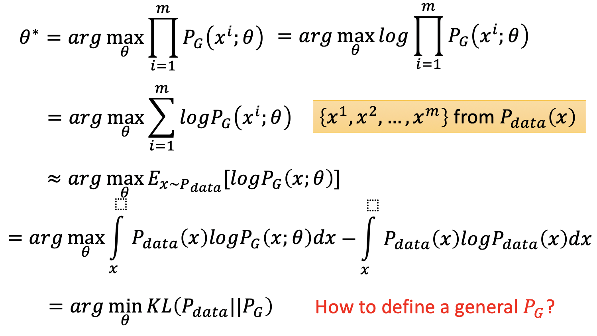

     

   - 在GAN中，Generator G是一个神经网络，这个网络实际上就定义了一个概率分布$P_G$。假设样本 $z$是从一个Normal Distribution中选取的，那么神经网络会将其转换到另一个维度 $x=G(z)$，$x$ 符合另外一个分布$P_G(x)$。GAN中Generator的事情，就是将一个简单的高斯分布，转换成一个更为复杂的分布区拟合实际的数据分布。最终的目标就是让$P_G(x)$和$P_{data}(x)$尽可能的接近，即找到一组神经网络参数，$G^*=arg \ \min \limits_{G}Div(P_G,P_{data})$。至此，因为$P_(G)、P_{data}$的数学表达式不知道的，所以在不知道公式的情况下，如何计算KL散度是需要解决的问题。

     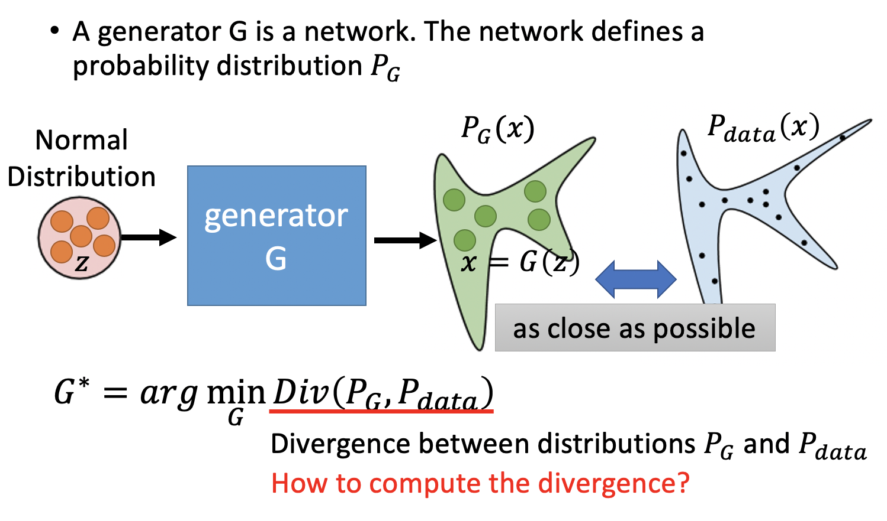

     

2. Discriminator与如何就算KL Divergence

   - 在第一小节中，模型的数学描述可以写为找到一个最优的网络结构，最小化KL散度，即$G^*=arg \ \min \limits_{G}Div(P_G,P_{data})$。其中$P_G,P_{data}$是不知道的，但是我们可以从中进行采样。从$P_{data}$中采样相当于从Database中选取一些训练样本。从$P_{G}$中采样，就相当于将从自然分布中抽取的向量作为输入，得到对应的Generated Object。

     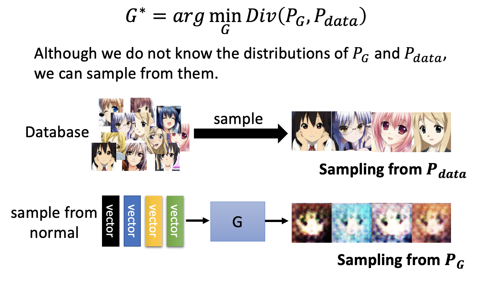

   - DIscriminator的作用可以理解为求解$Div(P_G,P_{data})$，DIscriminator要尽可能的区分出从$P_{data}$中采样的数据和从$P_{G}$中采样的数据。其目标函数可以写成$V(G,D)=E_{x\sim P_{data}} [log(D(x)]+E_{x\sim P_{G}} [log(1-D(x)]$。其中$E_{x\sim P_{data}} [log(D(x))]$表示如果样本是从$P_{data}$中采样的，那么$log(D(x))$越大越好；反之,$E_{x\sim P_{G}} [log(1-D(x))]$表示如果样本是从$P_{G}$中采样的，那么$log(D(x))$越小越好。DIscriminator所做的事情相当于一个Binary Classifier。在固定住Generator，训练出最好的$D^*$是和JS Divergence有关的。

     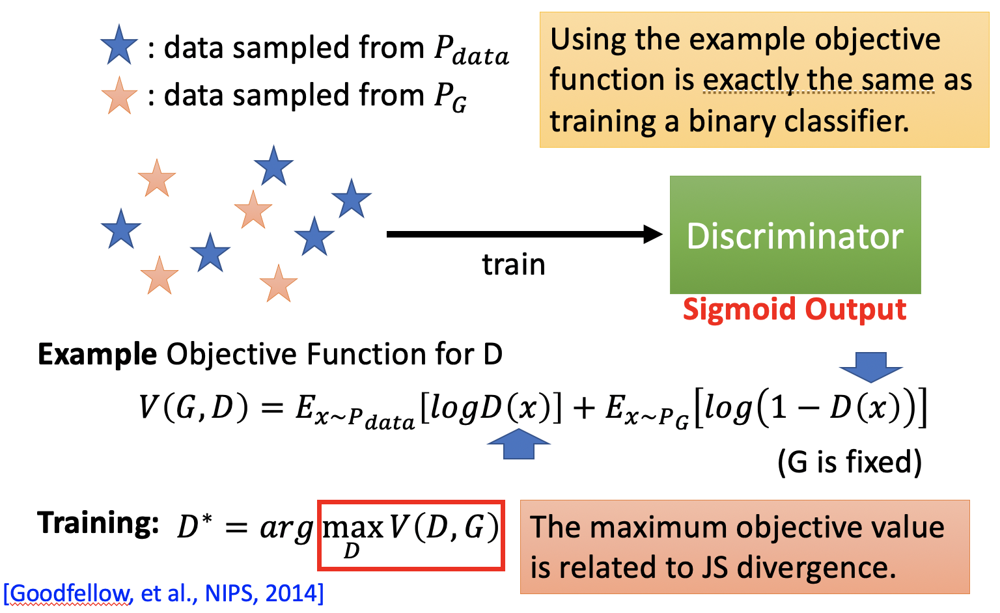

     

   - $D^*$和Jensen-Shannon divergence关系可以见如下证明：

     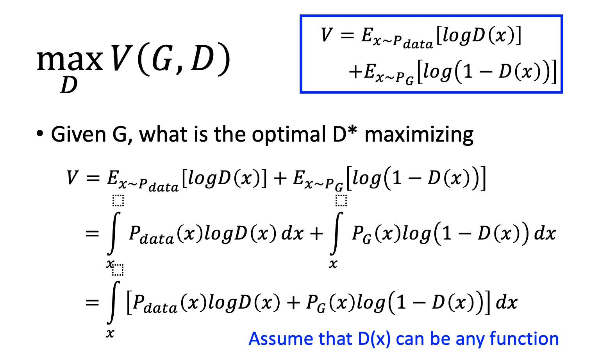

     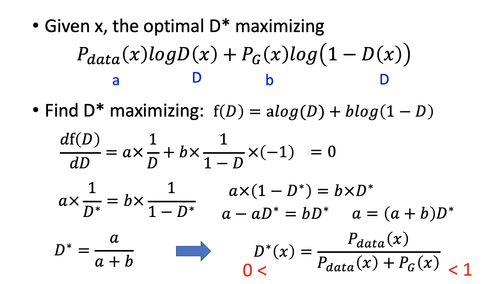

     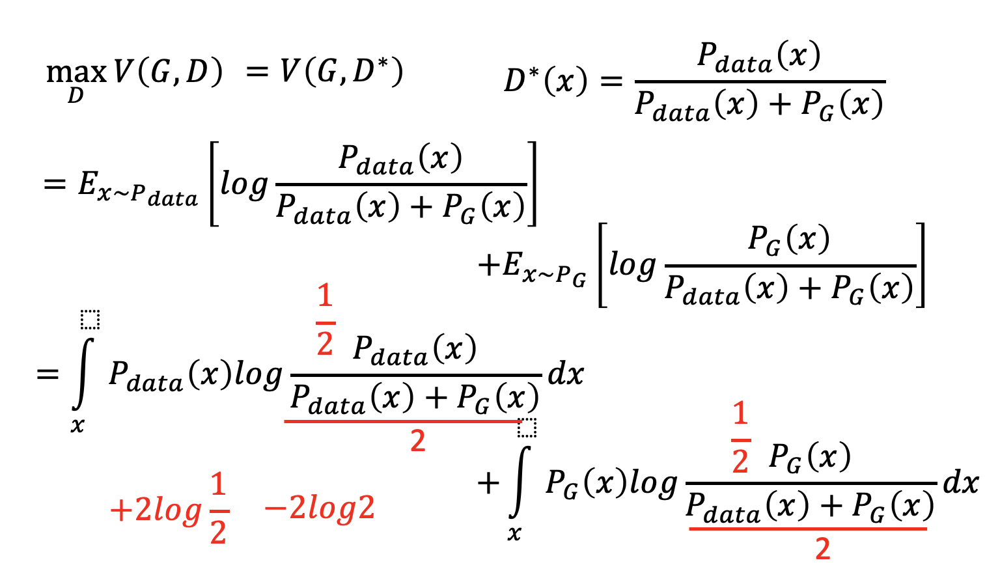

     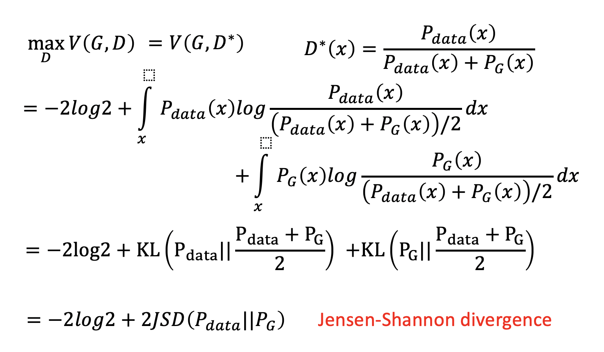
   
     
   
3. GAN的目标函数

     - 在第一小节中，Generator的最优解 $G^*=arg \ \min \limits_{G}Div(P_G,P_{data})$。第二小节中证明了散度和DIscriminator是有关系的，$D^*=arg \ \max \limits_{D}V(G,D)$。使用$D^*$代替散度后，GAN的目标函数可以写成 $G^*=arg \ \min \limits_{G} \max \limits_{D}V(G,D)$

     - 假设世界上只有3个Generator，三个红点表示对应每一个G，可以使$V(G,D)$最大，代表着$P(G_i)$与$P_{data}$之间的距离。三个红点中，只有绿色框的，使$\max \limits_{D}V(G,D)$最小。

   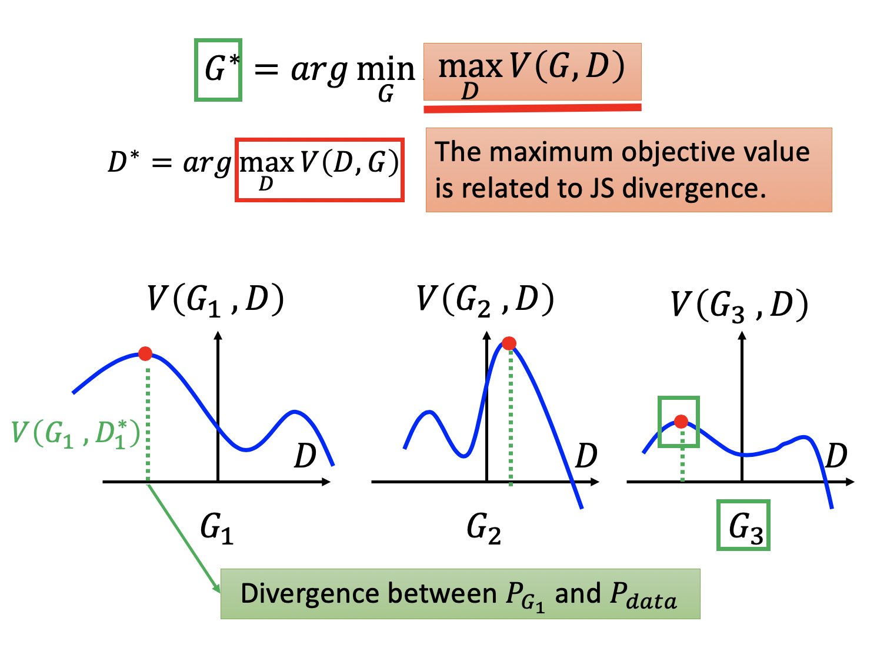

   

4. GAN的求解算法

   - GAN的求解算法就是求解最小最大问题 $G^*=arg \ \min \limits_{G} \max \limits_{D}V(G,D)$。迭代进行：固定G，更新D；然后固定D，更新G。

     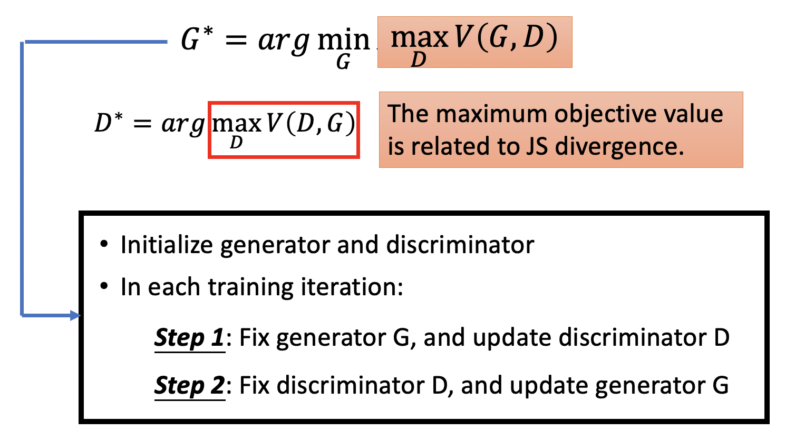

   - 为了描述方便，令$L(G)=\max \limits_{D}V(G,D)$。$G^*=arg \ \min \limits_{G} L(G)$，即要找到一个最好的G最小化$L(G)$。因为$L(G)$中有最大化的操作，所以对$L(G)$的微分需要稍微改进。假设$f(x)=max⁡\{f_1 (x),f_2 (x),f_3 (x)\}$，那么$f'(x)$的计算方式为，对于每个$x$，选择最大的$f_i(x)$的微分值作为$f'(x)$。

     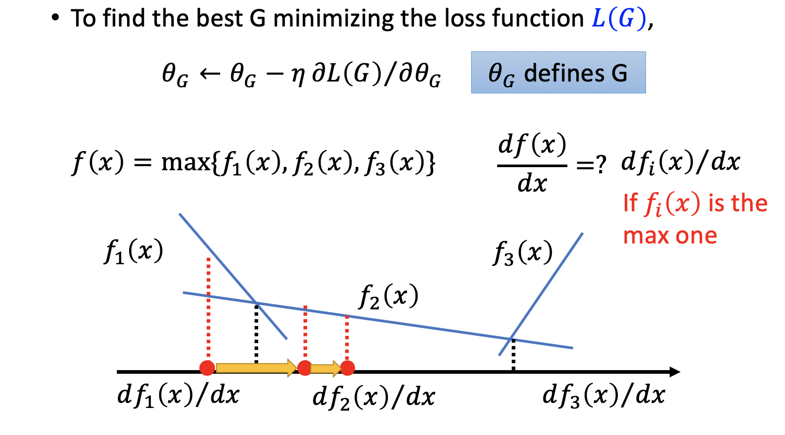

   - 最小化$L(G)$的算法如下：已知$G_0$，首先要寻找一个$D_0^*$构造初始的$L(G_0)$，即$V(G_0,D_0^*)$，相当于$P_{G_0}(x)$和$P_{data}(x)$之间的JS Divergence。得到$L(G_0)$后运用梯度下降进行更新，得到$G_1$。然后迭代进行，找一个$D_1^*$构造初始的$L(G_1)$，即$V(G_1,D_1^*)$，相当于$P_{G_1}(x)$和$P_{data}(x)$之间的JS Divergence。得到$L(G_1)$后运用梯度下降进行更新，得到$G_2$。

     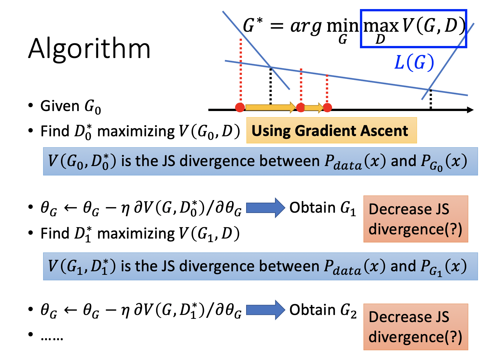

   - 每一步迭代相当于减少JS Divergence，但是存在特殊情况。比如从$G_0$更新到$G_1$后，$V(G_0,D)$和$V(G_1,D)$两条曲线的差异过大，可能导致$V(G_1,D_1^*)$大于$V(G_0,D_0^*)$。所以需要增加一个约束，就是不要对G更新的太多，当$G_0$和$G_1$比较相近时，$V(G_0,D)$和$V(G_1,D)$两条曲线也会比较相似。

     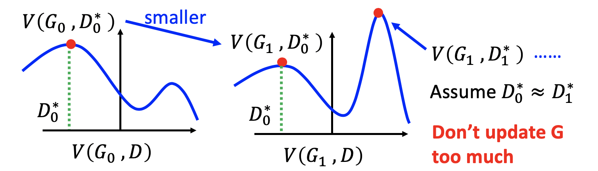

   - 在实际寻找最好的G构建$L(G)$的过程中，因为无法求解期望值，所以使用抽样求平均的进行代替。Discriminator的训练相当于训练一个binary classifier with sigmoid output，最小化交叉熵。

     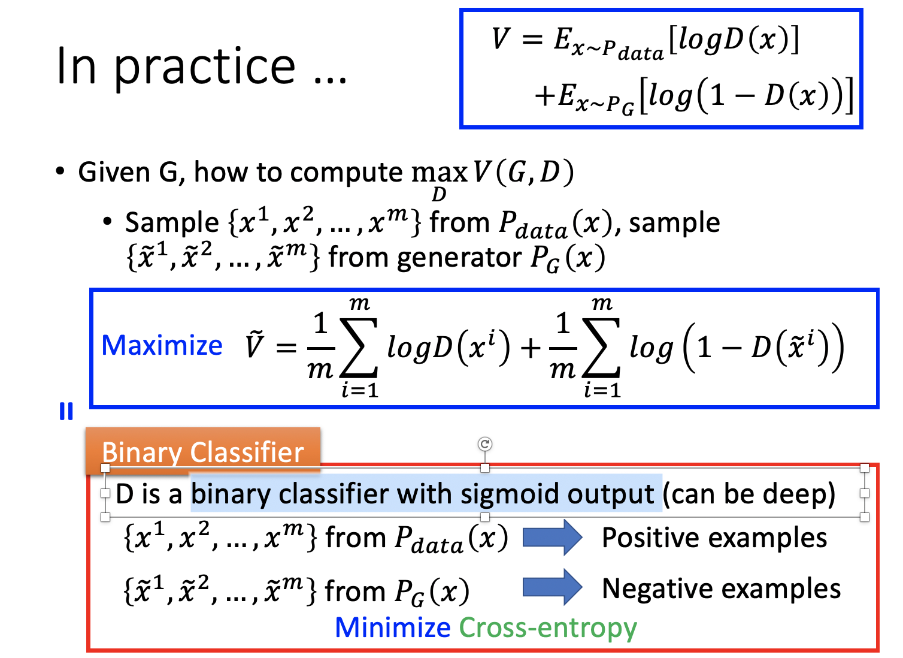

   - 综上所述，GAN的训练过程如下图所示。

     - D的更新相当于量出一个散度，G的更新相当于最小化散度。每一次迭代中，D的训练要重复k次。因为只有重复k次，才能找到最大的$V(G,D)$，只有最大的最大的$V(G,D)$才能用于近似两个分部之间的散度。理论上，需要一直更新D，直到D达到最大值。但是由于计算成本和Discriminator模型本身的能力受限，可能根本无法找到最大的D。所以只需要重复k次，找到一个较大的值即可。

     - 每一次迭代中，G只需要一次，少量更新防止散度上升。因为G的更新过程中$\widetilde V$的前一项是与G无关的，所以可以忽略。

       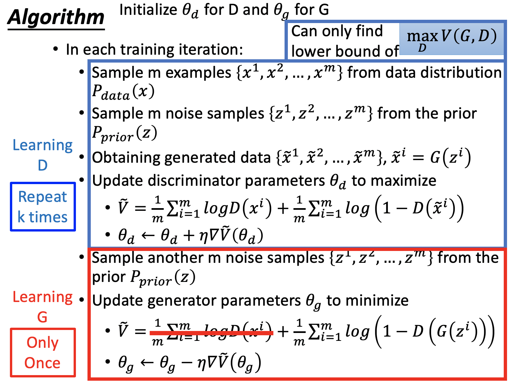

   - 在实际更新Generator的时候，相当于最小化$\widetilde V=E_{x\sim P_G}[log(1-D(x))]$。在初始阶段，$D(x)$一般比较小，因为Discriminator很容易判别出Generator的输入是假的，所以分数会比较低。此时对应的是红色线条的左上部分，因为此处梯度比较小，训练时容易出现问题。所以使用$\widetilde V=E_{x\sim P_G}[log(-D(x))]$代替原目标函数，二者的下降趋势相同。但是在$D(x)$比较小的时候，其梯度比较大，容易训练。另一个角度进行思考，使用$-D(x)$代替$D(x)$，相当于Discriminator中互换了两类数据的标签，这样就可以复用更新Discriminator的代码。在之后的研究中，学者发现两者都是可以训练的起来的。

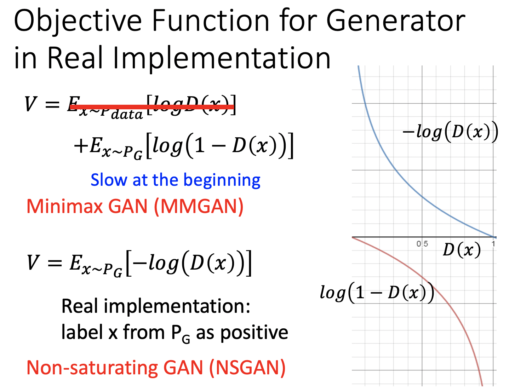

5. Intuition GAN

   - Discriminator要区分两类点，给Data Distribution比较高的分数，给Generated Distribution比较低的分数。Discriminator的Objective Value就是两堆数据的JS Divergence。Generator的目标是使Generated Distribution获得比较高的分数，所以蓝色的点会向右移。重新更新$D(x)$后，两者的JS Divergence也会变小。以此类推

     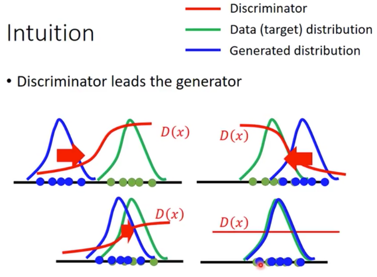

   - Discriminator是否可以被视为一个Evaluation Function？答案是开放的，可以参考Yann Lecun's talk和https://arxiv/pdf/1406.2661.pdf

#### 2.FGAN：General Framework of GAN

1. FGAN提出的原因

   - GAN模型的实质就是衡量两个分布的JS Divergence，FGAN的提出实际上就是讨论是否可以使用其他Divergence去实现。实验结果结果显示，可以使用其他Divergence计算，但是效果与传统的GAN类似。不过FGAN的数学推导过程是值得学习的。

     

2. F - Divergence

   - 已知$P,Q$两个分布，$p(x),q(x)$表示从相应的分布中采样$x$的概率。F - Divergence的定义为 $D_f(P||Q)=\int\limits_x q(x)f(\frac{p(x)}{q(x)})dx$，其中函数 $f$ 必须是凸函数和满足$f(1)=0$。每一个符合条件的函数就对应一种F-Divergence。如果对于每一个$x$，都有$p(x)=q(x)$，那么$D_f(P||Q)=0$。有因为函数$f$是凸函数，所以函数的最小值也是0。

     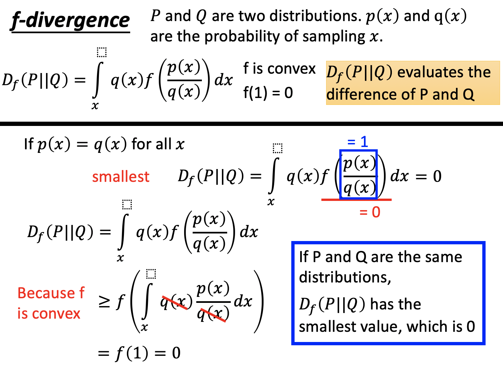

   - 如果$f=xlogx$，则$D_f(P||Q)$表示KL Divergence；如果$f=-xlogx$，则$D_f(P||Q)$表示Reverse KL Divergence；如果$f=(x-1)^2$，则$D_f(P||Q)$表示Chi Square Divergence。

     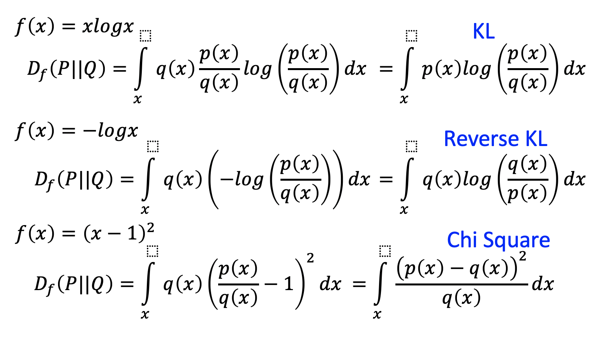

   - 每一个Convex Function $f$都有一个对应的共轭函数（Conjugate Function）$f^*$，二者的关系为$f^∗ (t)=\max\limits _{x \in dom(f)}{xt-f(x)}$。对于一个$t$，$f^*(t)$值为穷举所有$x$使得$xt-f(t)$最大的值。共轭函数是相互的，$f$的共轭函数为$f^*$，$f^*$的共轭函数为$f$。

     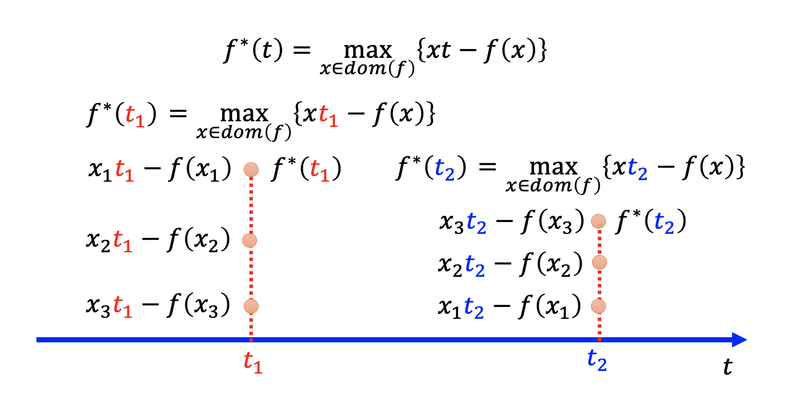

   - 共轭函数$f^*(t)$也可以描述为直线$x_it-f(x_i)$集合中，每一个区间函数值较大的直线组合而成的（或是所有函数值$x_it-f(x_i)$中的Upper Bound组成的），即图中的红色部分。假设$f(x)=log(x)$，那么所有$x$对应的无穷条直线的Upper Bound部分组成的就是$f^*(x)$，实际上也是指数函数$f^*(x)=exp(t-1)$。

     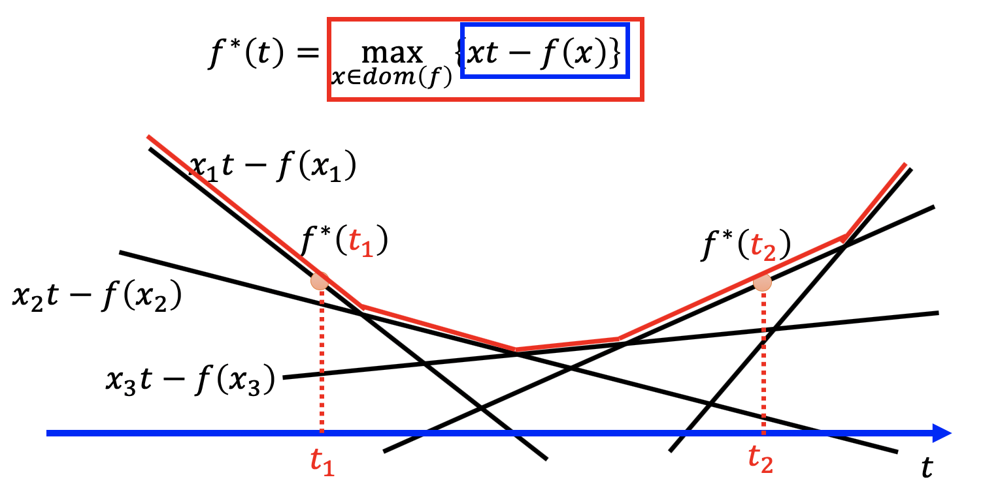

     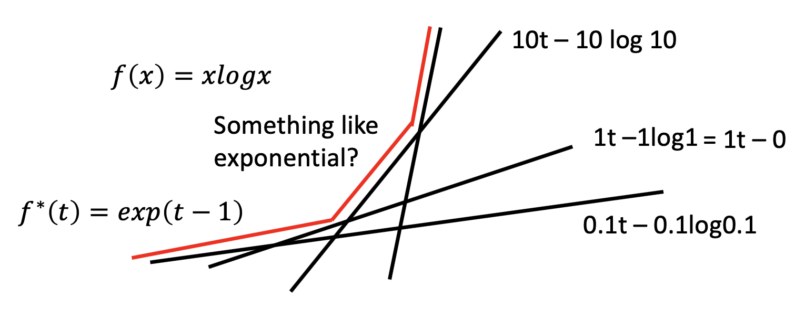

     

3. F-Divergence与GAN的结合

   - 首先使用$f$的共轭函数$f^*$代替$f$，则F-Divergence可以描述为如下。

     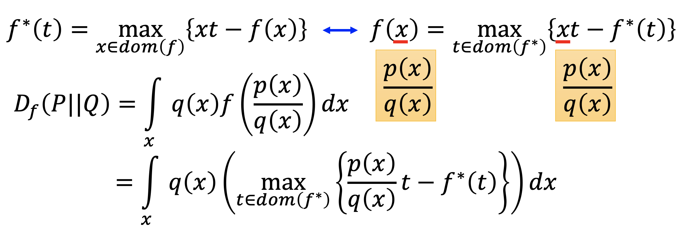

   - 接下来需要训练一个Discriminator D，其输入为$x$，输出为scalar $t=D(x)$。也可以理解为使用Discriminator求解$\max\limits _{t \in dom(f^*)}{\frac{p(x)}{q(x)}t-f^*(x)}$，因为不一定能求出最优的解，所以可以由如下不等式。

     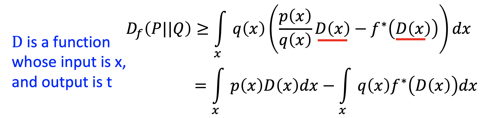

   - 于是F-Divergence可以用如下方法近似

     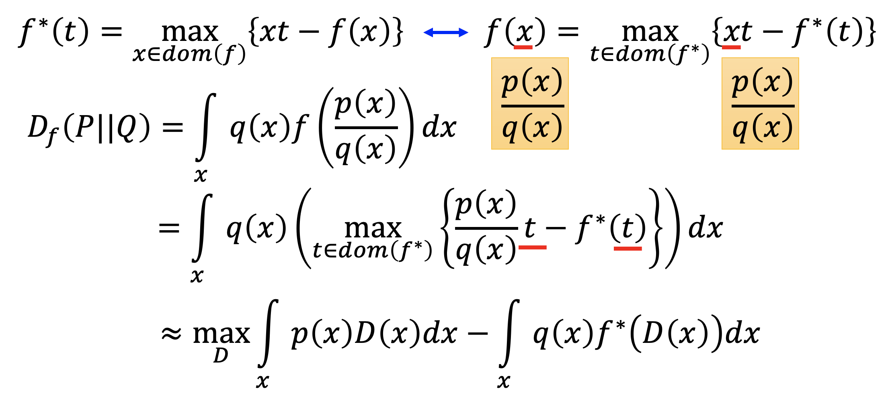

   - F-Divergence可以进一步改写为$D_f(P_{data}||Q_G)$，这其实是各种散度的一个综合写法，不同的$f$就对应了不同的散度。

     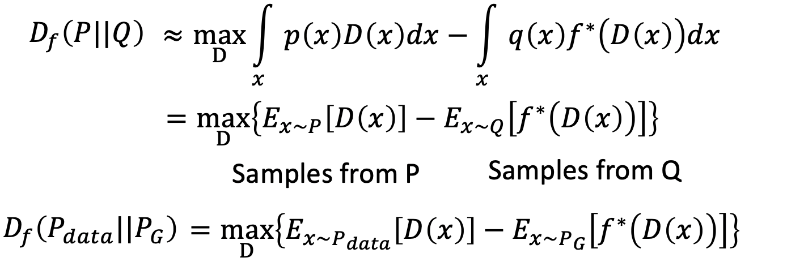

     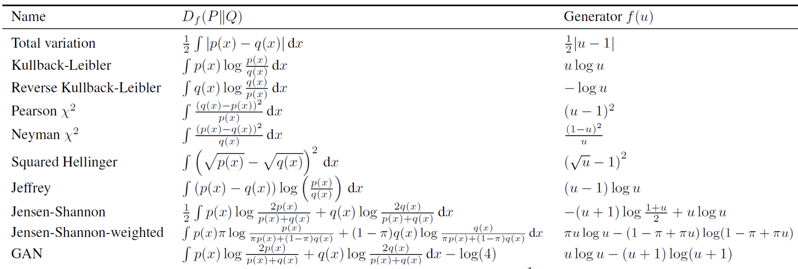

     

   - 在传统的GAN中，最终的目标为最小化两个分布之间的散度，将F-Divergence代入后就得到更泛华的目标函数。

     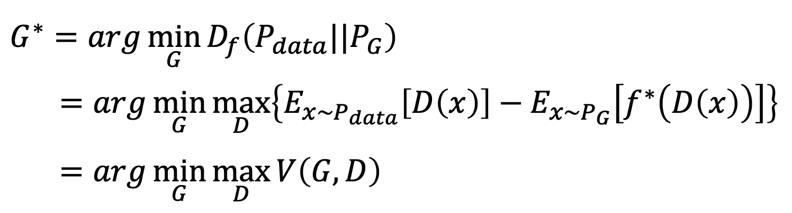

   - FGAN可以解决Mode Collapse的问题。Mode Collapse是由于Real Data的分布是比较大的，但是Generated Data的分布是比较小的。以动画人物生成为例，mode collapse的结果就是某一张人物的图片开始大肆蔓延。因为Generated Data的分布 $P_G$ 越学越小，最后会产生重复的东西。

     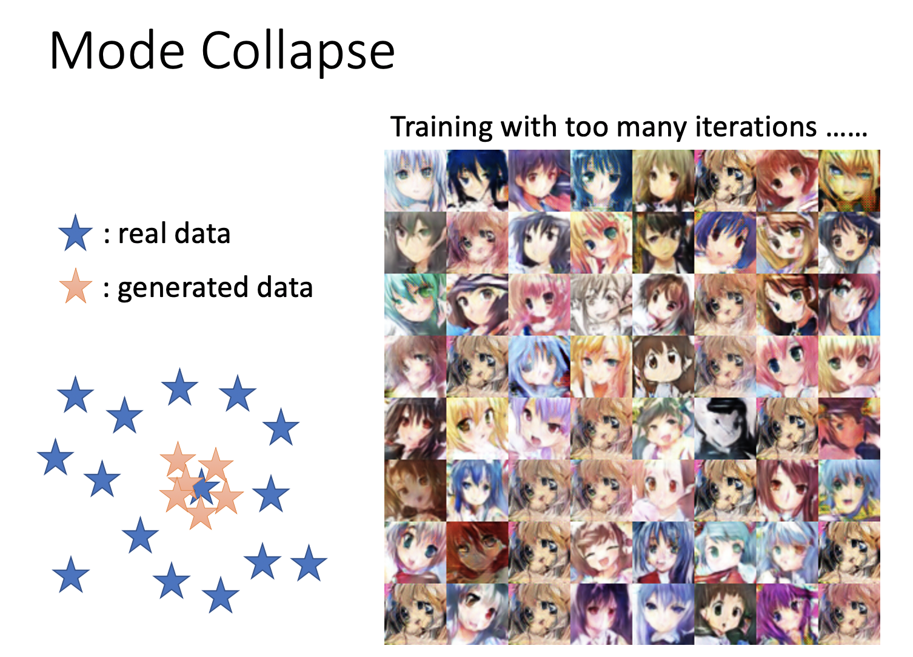

   - 除了Mode Collapse之外，还有Mode Dropping问题。即Real Data有多个簇，但是Generated Data的分布只有一个。以人脸生成为例，在每一次迭代中，都只会产生一种肤色的人脸。

     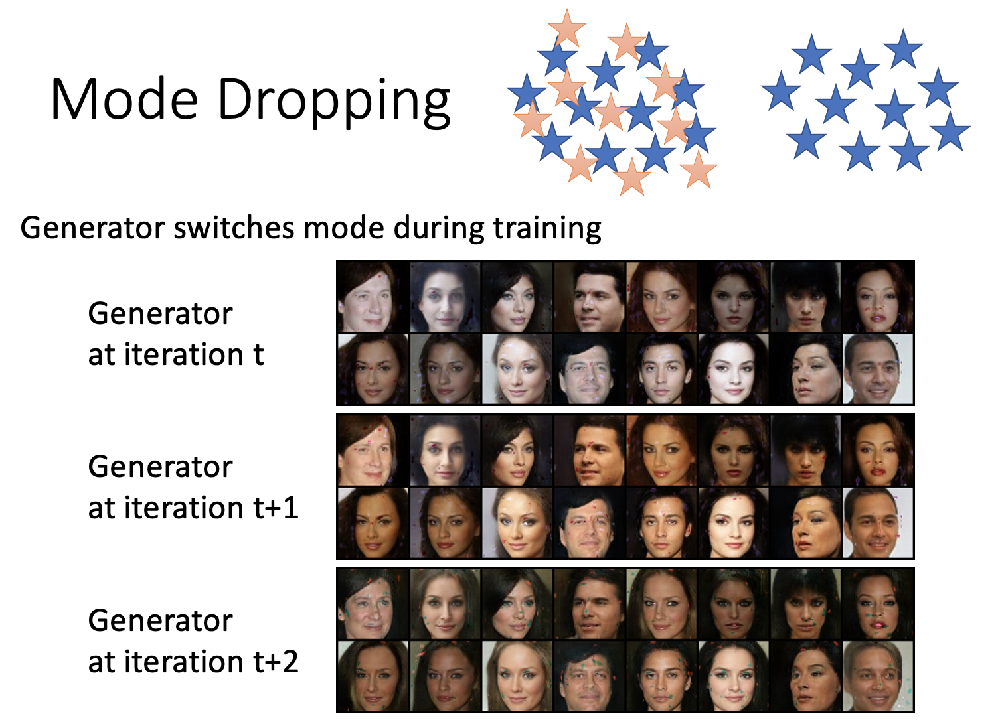

   - 产生Mode Dropping问题的原因是，不同的Divergence认为的最优的$P_G$是不同的，如下图所示。KL Divergence认为更平均的在$P_G$是更好的，这就是原来没有GAN的情况，人们用最大似然估计求解（等同于KL Divergence）的结果会比较模糊。而GAN的JS Divergence更接近于 Reverse KL Divergence，认为接近某一个簇的$P_G$是更好的。因此在不同的迭代过程，可能会接近不同的簇。实验证明，使用FGAN，代入不同的$f$都会有Mode Collapse或Mode Dropping的问题。

     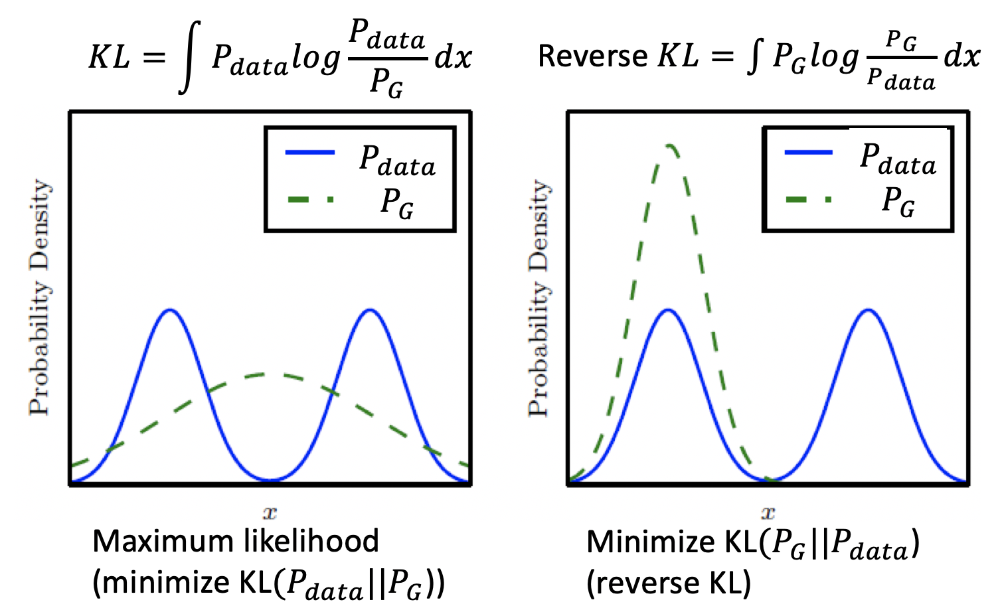

   - 解决Mode Collapse或Mode Dropping的问题，可以使用Ensemble。训练多个不同结果的Generator，即便一个Generator的结果都是比较相似的，但是不同的Generator的结果是不相似的，使用Ensemble进行选择就可以增加结果的多样性。

     