# Chapter 24 - Generative Adversarial Network（Part 4 - Tips for Improving GAN [WGAN]）

[1.WGAN解决的问题及原理](#1)

​		[1.1 JS Divergence与分布无重叠之间的矛盾](#1.1)

​		[1.2 Wasserstein Distance（Earth Mover’s Distance）](#1.2)

​		[1.3 WGAN的训练算法](#1.3)

​		[1.4 Energy-based GAN（EBGAN）](#1.4)

​		[1.5 Loss-sensitive GAN（LSGAN）](#1.5)

[2.Reference](#2)

#### Abstract：本章节主要介绍WGAN，主要参考[Martin Arjovsky, Soumith Chintala, Léon Bottou, Wasserstein GAN, arXiv prepring, 2017]和[Ishaan Gulrajani, Faruk Ahmed, Martin Arjovsky, Vincent Dumoulin, Aaron Courville, “Improved Training of Wasserstein GANs”, arXiv prepring, 2017]

#### 1.WGAN解决的问题及原理

1. JS Divergence与分布无重叠之间的矛盾

   - 最传统的GAN使用的是JS Divergence，但是JS Divergence存在一定的问题，因为在大多数情况下，$P_G$和$P_{data}$是不重叠的。产生这个现象主要有两个原因，第一个就是数据本身的原因，以Image为例，因为$P_G$和$P_{data}$可以被认为是low-dim manifold in high-dim space，在低维空间中二者像是两条曲线一样，重复的地方基本可以忽略不计；如果第一个原因没有说服力的话，第二个原因就是即便二者有重叠，但是因为我们训练的时候都是从两个分布中sample出一些样本，样本的数量不会太多。因此抽样出的两组数据也可以近似的被视为没有重叠的两堆数据。

     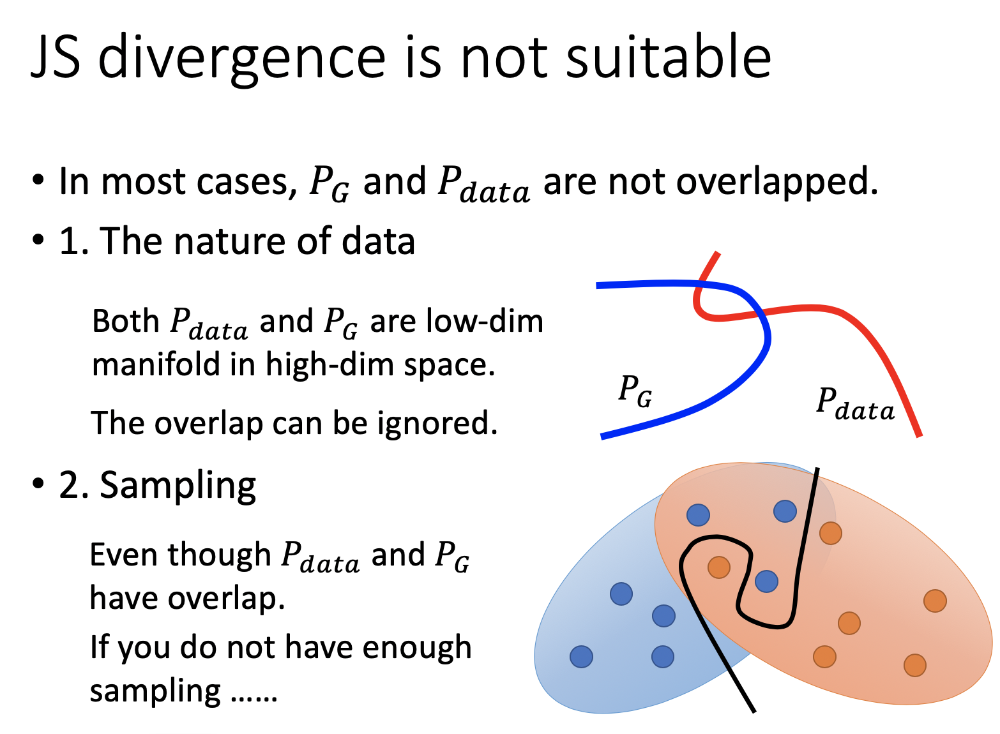
     
   - 对于两个分布没有重叠的情况，使用 JS Divergence是有问题的。如果两个分布没有重叠，那么JS Divergence等于$log2$。如下图所示，从左向右$P_G$应该是越来越好的。但是如果使用JS Divergence衡量，除了最右边的重合情况，其他的都是一样的差。因此模型的训练在$P_{G_0}$就卡住了。更直观的来讲，如果两个分布没有重叠，那么使用Binary Classifier的正确率始终可以达到100%，就意味着两堆数据之间的Divergence已知没有变化。

     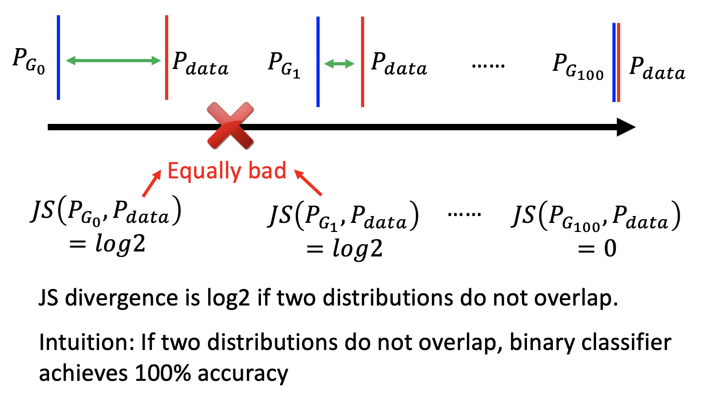
     
   - 假设绿色的点是Real Data Distribution，蓝色的点是Generated data Distribution。$P_G$和$P_{data}$是不重叠的，使用Binary Classifier with Sigmoid Output时很容易进行区分，会给蓝色点接近零的分数，给绿色点接近1的分数。接下来Generator想要顺着红色的线的梯度将蓝色的点向右移，但是实际上Generator做不到。因为在蓝色点的位置梯度都接近零（Discriminator认为蓝色的点很假，故分数都很低），没有梯度就无法更新。一种解决方法是保持Binary Classifier with Sigmoid Output不要训练的太好，保证梯度的存在。但是这种方法很难控制，Binary Classifier训练的太差就无法区分，训练的太好又会梯度消失。后来又提出一种新的解决方法Least Square GAN （LSGAN），基本思想是将Sigmoid Output换成Linear Output。

     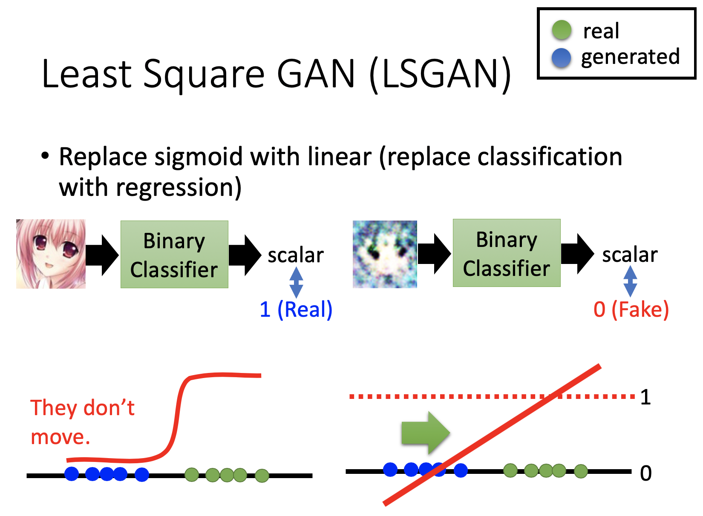
     
     

2. Wasserstein Distance（Earth Mover’s Distance）

   - 第一小节介绍了JS Divergence与分布无重叠之间的矛盾，以及LSGAN的解决方案。本小节介绍WGAN的解决方案，使用Earth Mover’s Distance代替JS Divergence衡量两个分布之间的差异。Earth Mover’s Distance的基本思想是，假象有一台推土机，将P的土堆铲到Q的位置去所需要的走的average distance就是Earth Mover’s Distance。假设P和Q都是一维空间中的点，那么两者的Earth Mover’s Distance 就是一维空间的距离，$W(P,Q)=d$。

     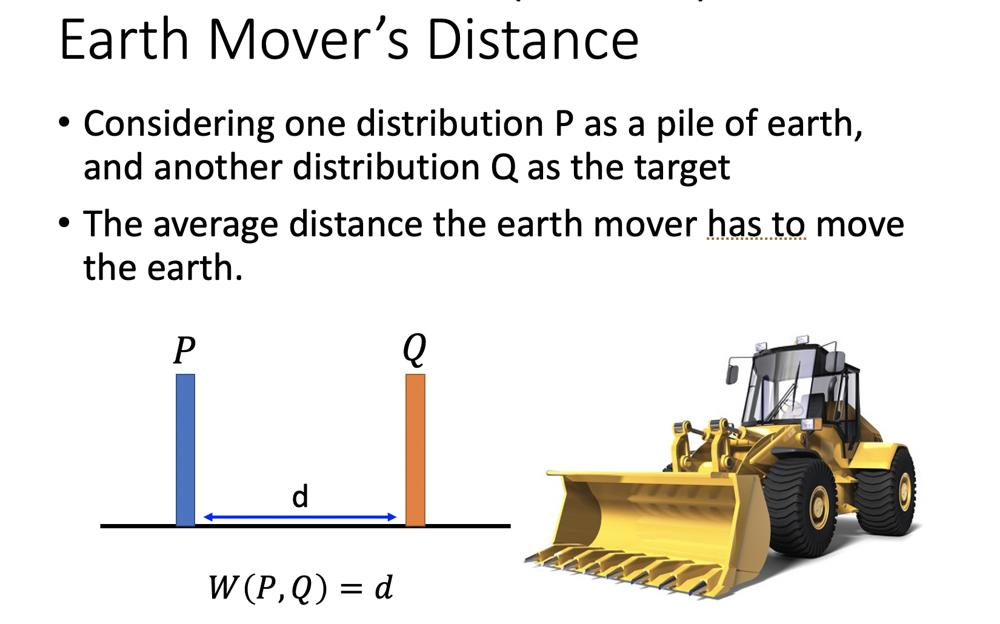

   - 如果P和Q是两个分布，那么将P的土堆铲到Q处其实有很多种方法（moving plan），每种方法都有着不同的Distance，比如就近铲土，舍近求远铲土等等，如下图所示。Earth Mover’s Distance其实就是所有moving plan中Average Distance最小的值，比如下图中最右边的例子。

     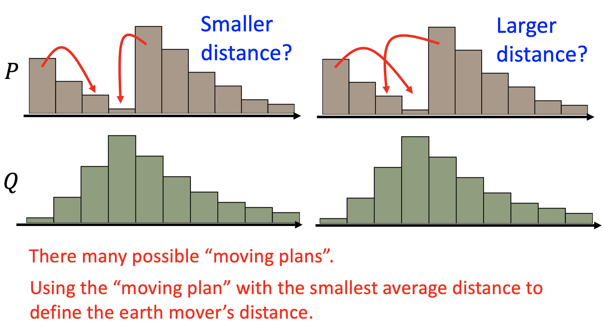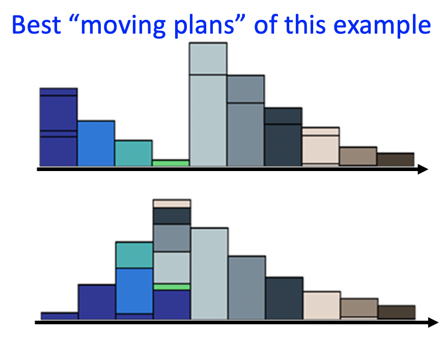
     
   - Earth Mover’s Distance最正规的定义为：先定义一个moving plan matrix $\gamma$。矩阵中的每一个数字存储的是将P的某一行移到Q的某一行所需要的移土量。那么一个moving plan matrix $\gamma$的Average Distance为每一次移土量乘以距离再求和，即 $B(\gamma)=\sum\limits_{x_p,x_q}\gamma(x_p,x_q )‖x_p-x_q‖$，Earth Mover’s Distance就是Average Distance的最小值，即$W(P,Q)=\min B(γ)$

     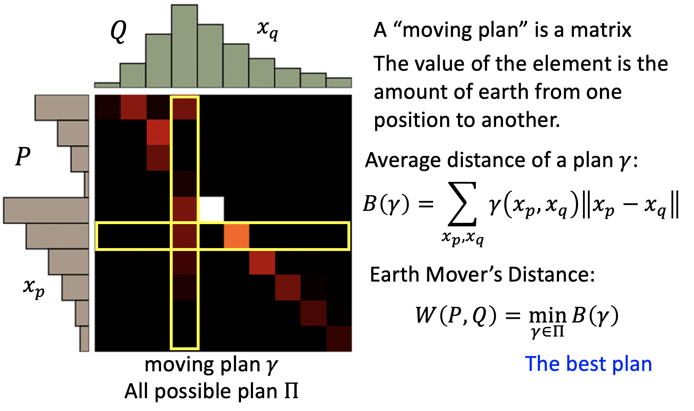
     
   - 使用Earth Mover’s Distance的好处是，对于没有重叠的$P_G$和$P_{data}$，Earth Mover’s Distance可以随着二者距离的变化而变化（$d_{50}<d_0$），不像JS Divergence一样一直为$log2$。

     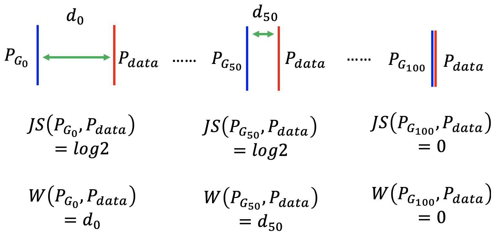
     
   - 那么如何设计一个Discriminator，其目标函数恰好可以衡量两个分布Wasserstein Disrance是需要解决的问题。因为推导过程比较复杂，此处直接给出结论。如果数据是从$P_{data}$中采样出来的，那么Discriminator的输出越大越好；如果数据是从$P_{G}$中采样出来的，那么Discriminator的输出越小越好。除此之外，还有一个约束是Discriminator必须是$1-Lipschitz\ Function$（即DIscriminator是足够平滑的）。一种直观的解释是，如果不考虑$1-Lipschitz\ Function$的约束，对于Generated Data的输出值越小越好，对于Real Data的输出越大越好。那么通过训练，前者会小到负无穷，后者会大到正无穷，训练过程是无法收敛的。只有在加上Discriminator是平滑的情况下（即不会到无穷的情况），训练过程才可能收敛。[Martin Arjovsky, et al., arXiv, 2017]

     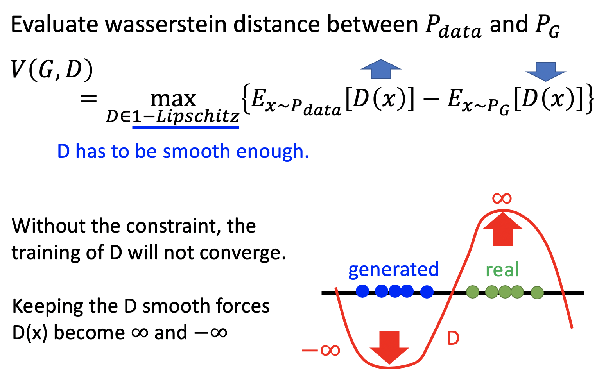
     
   - $Lipschitz\ Function$的定义是$‖f(x_1 )-f(x_2 )‖≤K‖x_1-x_2 ‖$。$‖f(x_1 )-f(x_2 )‖$相当于Output Change，$‖x_1-x_2 ‖$相当于Input Change。$Lipschitz\ Function$的约束实际上是要求Output Change不能过大，因为只有Output Change比较小的时候，才能小于K倍的Input Change。当$K=1$时，就是$1-Lipschitz\ Function$，即Output Change小于Input Change。比如蓝色的函数变化比较大，不是$1-Lipschitz\ Function$，绿色的比较平滑，是$1-Lipschitz\ Function$。

     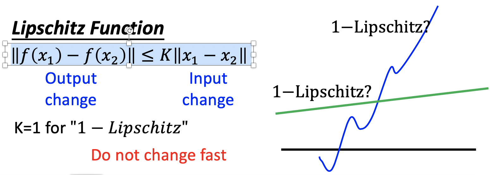
     
   - 如果目标函数$V(G,D)$没有约束的情况下，可以直接使用梯度下降的方法求解最大化的问题。在加上了约束的情况下，WGAN的提出者的解决办法是Weight Clipping，同样使用梯度下降的方法求解，但是给参数一定的限制，当其超过范围$[-c,c]$时，强行重置为边界值。但是这种方法是不能保证训练出来的Discriminator是$1-Lipschitz\ Function$。（秉持先能用，再优化的原则）

     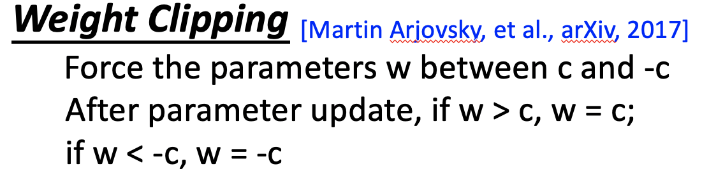
     
     
     
   - 解决$1-Lipschitz\ Function$约束下目标函数$V(G,D)$的求解，另一种方法就是Improved WGAN （WGAN-GP）。文章中提出，只要一个Discriminator满足$1-Lipschitz\ Function$的约束，那么$D(x)$每一处的梯度值的Norm都是小于1的，反之也成立（充要条件）。因为没办法直接求解呆约束的目标函数，但是可以根据充要条件将约束转换到目标函数内，增加一个正则项$-\lambda\int\limits_xmax(0,||\nabla_xD(x)||-1)dx$，为了让目标函数最大化，正则项会尽可能的小，即取零，等价于梯度值的Norm小于1。

     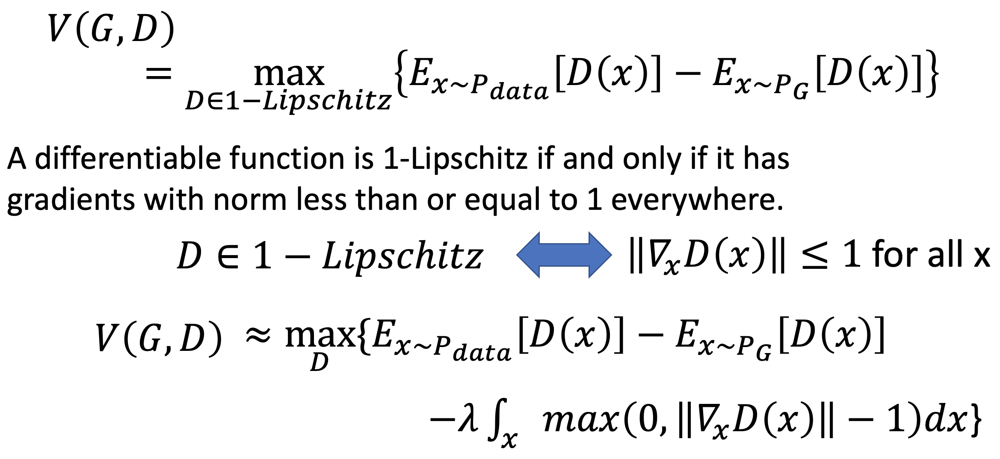
     
   - 但是上式存在一个问题，就是不可能穷举所有的$x$使得$D(x)$每一处的梯度值的Norm都是小于1。因此假设$x$是从$P_{penalty}$中抽样出来的， 所以只需要$P_{penalty}$的范围内$D(x)$每一处的梯度值的Norm都是小于1即可。

     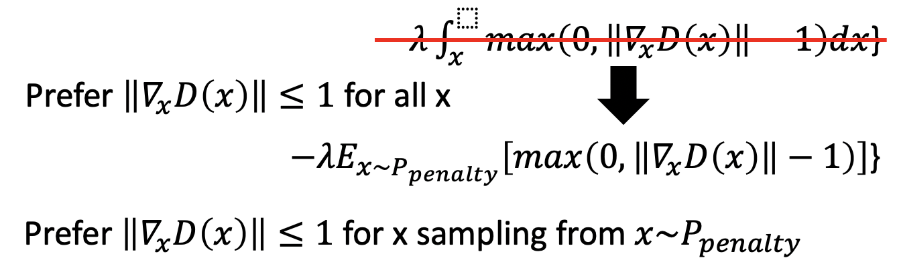
     
   - 在Improved WGAN的论文中，从$P_{data}$中采样一个点，从$P_{G}$中采样一个点，在两点相连的直线上随机采样一个点，认定改点就是从$P_{penalty}$中采样出来的。这样定义$P_{penalty}$能够代替所有$x$的原因是实验结果还不错。直觉上讲，$P_{penalty}$介于$P_{G}$到$P_{data}$，是能够帮助$P_{G}$不断靠近$P_{data}$的。

     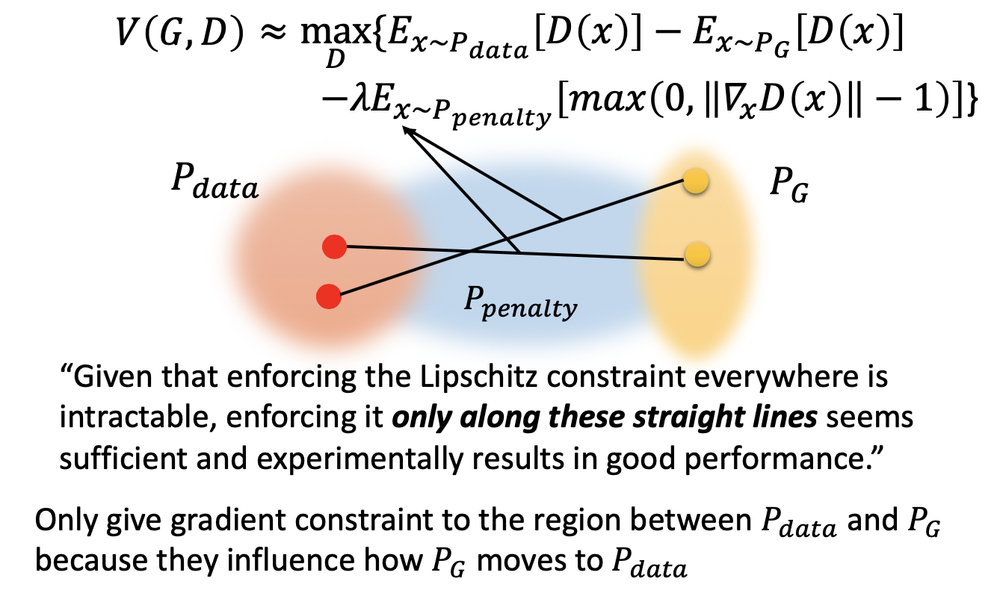
     
   - 在实现Improved WGAN时，又对正则项进行了一次近似，不再是梯度的Norm大于1时进行惩罚，而是要求梯度的norm尽可能的等于1，这样做的实验效果更好。后续又有研究表示$P_{penalty}$应该放在$P_{data}$附近。

     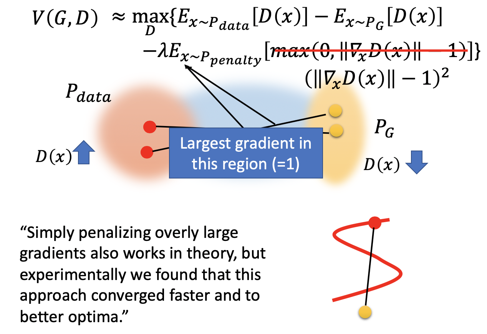
     
   - 只有又提出了Spectrum Norm解决约束的问题，Keep gradient norm smaller than 1 everywhere [Miyato, et al., ICLR, 2018]

     

3. WGAN的训练算法

   - WGAN的训练算法如下：
   
     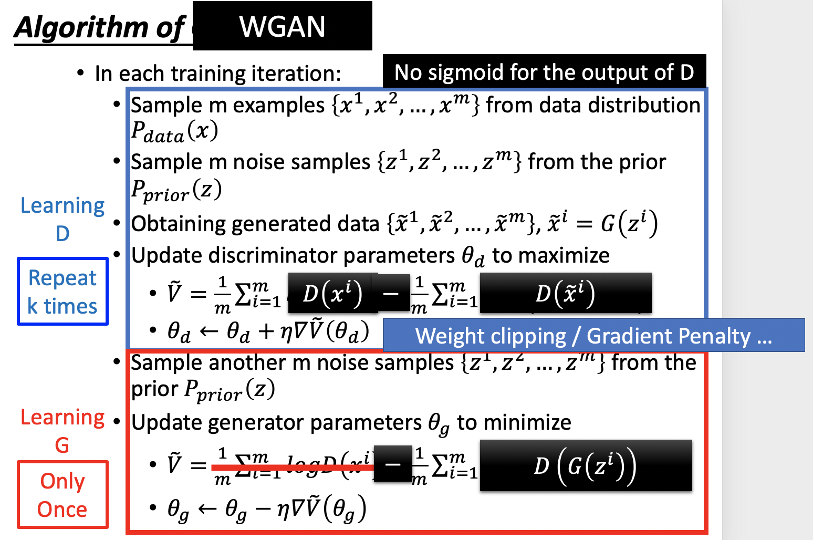

4. Energy-based GAN（EBGAN）
   
   - 将GAN的Binary Classifier Discriminator替换为Auto-Encoder。[Junbo Zhao, et al., arXiv, 2016]
   
     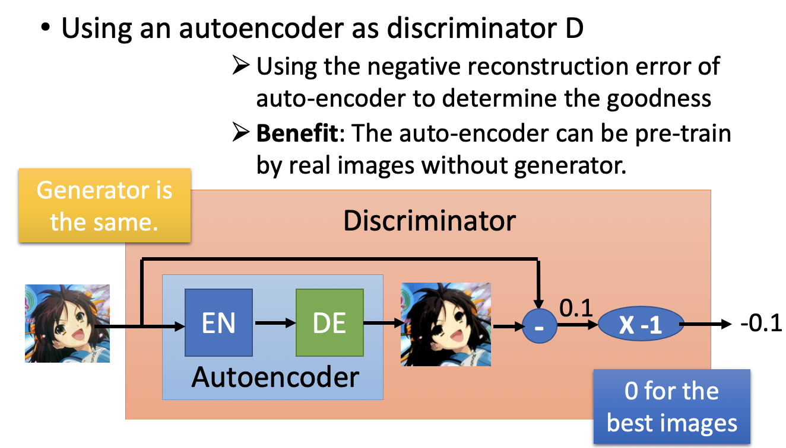

5. Loss-sensitive GAN（LSGAN）

   - 使用Margin的概念辅助训练。

   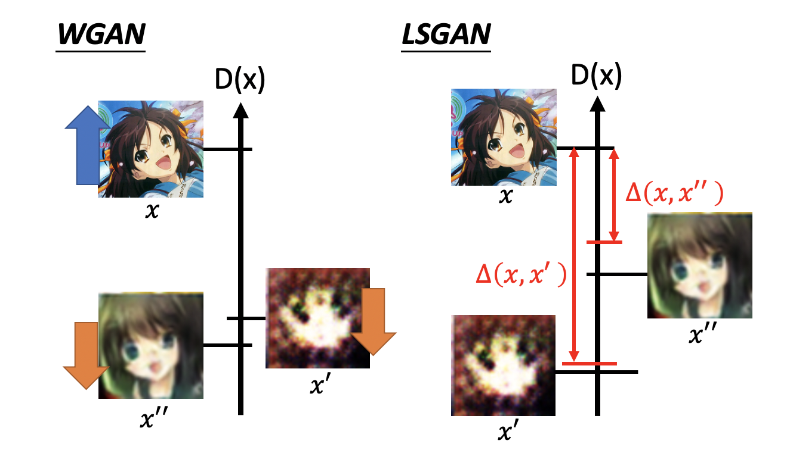

#### 2.Reference

- Ian J. Goodfellow, Jean Pouget-Abadie, Mehdi Mirza, Bing Xu, David Warde-Farley, Sherjil Ozair, Aaron Courville, Yoshua Bengio, Generative Adversarial Networks, NIPS, 2014
- Sebastian Nowozin, Botond Cseke, Ryota Tomioka, “f-GAN: Training Generative Neural Samplers using Variational Divergence Minimization”, NIPS, 2016
- Martin Arjovsky, Soumith Chintala, Léon Bottou, Wasserstein GAN, arXiv, 2017
- Ishaan Gulrajani, Faruk Ahmed, Martin Arjovsky, Vincent Dumoulin, Aaron Courville, Improved Training of Wasserstein GANs, NIPS, 2017
- Junbo Zhao, Michael Mathieu, Yann LeCun, Energy-based Generative Adversarial Network, arXiv, 2016 
- Mario Lucic, Karol Kurach, Marcin Michalski, Sylvain Gelly, Olivier Bousquet, “Are GANs Created Equal? A Large-Scale Study”, arXiv, 2017
- Tim Salimans, Ian Goodfellow, Wojciech Zaremba, Vicki Cheung, Alec Radford, Xi Chen Improved Techniques for Training GANs, NIPS, 2016
- Martin Heusel, Hubert Ramsauer, Thomas Unterthiner, Bernhard Nessler, Sepp Hochreiter, GANs Trained by a Two Time-Scale Update Rule Converge to a Local Nash Equilibrium, NIPS, 2017
- Naveen Kodali, Jacob Abernethy, James Hays, Zsolt Kira, “On Convergence and Stability of GANs”, arXiv, 2017
- Xiang Wei, Boqing Gong, Zixia Liu, Wei Lu, Liqiang Wang, Improving the Improved Training of Wasserstein GANs: A Consistency Term and Its Dual Effect, ICLR, 2018
- Takeru Miyato, Toshiki Kataoka, Masanori Koyama, Yuichi Yoshida, Spectral Normalization for Generative Adversarial Networks, ICLR, 2018