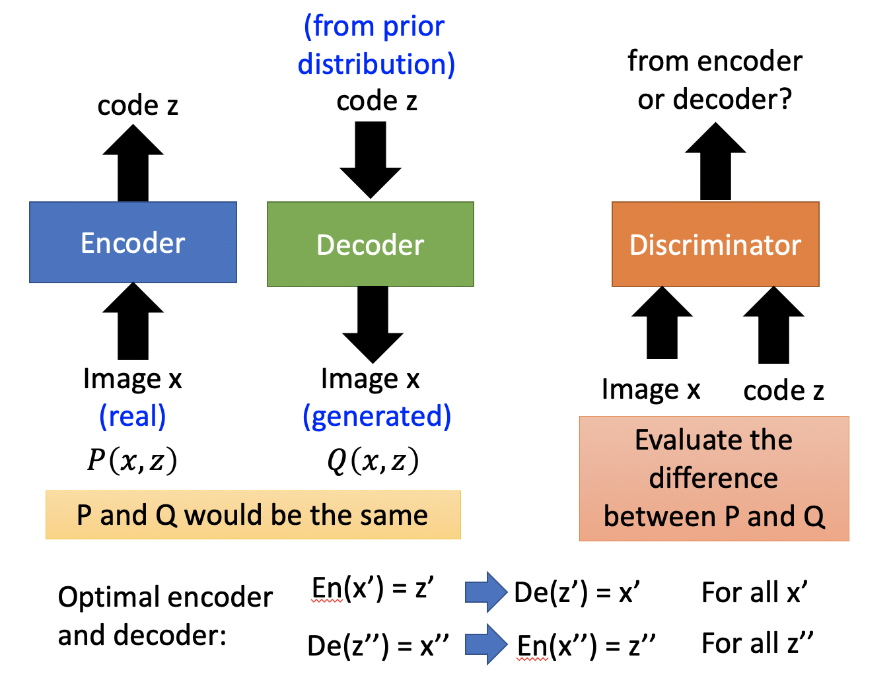

# Chapter 24 - Generative Adversarial Network（Part 5 - Feature Extraction by GAN [InfoGAN / VAE-GAN / BiGAN]）

[1.Feature Extraction by GAN](#1)

​		[1.1 InfoGAN](#1.1)

​		[1.2 VAE - GAN](#1.2)

​		[1.3 BiGAN](#1.3)

​		[1.4 Triple GAN](#1.4)

​		[1.5 Loss-sensitive GAN（LSGAN）](#1.5)

[2.Domain-adversarial Training](#2)

​		[2.1 Feature Disentangle](#2.1)

​		[2.2 Intelligent Photo Editing](#2.2)

​		[2.3 Intelligent Photoshop](#2.3)

​		[2.4 More  Application of GAN on Image](#2.4)

#### Abstract：本章节主要介绍GAN在Feature Extraction中的应用，以及Cycle GAN和如何使用GAN进行Unsupervised Conditional Generation。

#### 1.Feature Extraction by GAN

1. InfoGAN

   - 对于Regular GAN，给定一个Random Vector，模型会产生一个预期Object。Random Vector的每一个维度都代表着某一种属性，修改某一个维度，在Object中就能看到对应的变化。但实际上并不是这种对应关系并不容易被解释，如下如所示第三行中间的七突然多了一横。假设每种颜色代表一种属性的取值，左边是我们想象的样子，通过不断的改变某个维度的值，对应的属性能够有规则的在颜色之间进行变化，但实际上是很不规则的。

     
     
   - 在InfoGAN中，假设输入 $z$ 的分为两部分 $c,z'$。InfoGAN相比 Regular GAN多了一个Classifier，其输入是Generator的输出 $x$，目标是从 $x$ 中预测Generator输入的 $c$ 。Classifier可以被视为一个Decoder，Generator被视为Encoder，二者合起来可以被视为一个"Auto-encoder"。但是这个"Auto-encoder"与传统的Auto-encoder功能恰好相反，传统的Auto-encoder是将Image压缩到code，然后根据code重构Image。此处的"Auto-encoder"是根据一个code产生一张Image，然后根据Image还原出code的一部分。Discriminator的存在也是必要的，因为没有Discriminator时，Generator为了便于Classifier识别，可以直接把 $c,z'$拷贝到 $x$就可以了，不用关心生成图片的好坏。只有Discriminator存在时，才可以约束Generator生成的图片是高质量的。实际实现过程中，Discriminator和Classifier共享参数，只有最后一层不一样，为了产生不同的输出。

     
     
   - InforGAN可以解决Input Feature对Output Object影响不明确的问题。只有Generator做到了 $c$ 对 $x$有比较明确的影响，这样Classifier才能比较容易的将 $c$ 从 $x$ 中还原出来。

     
     
   - 在InfoGAN中，输入 $z$ 的分为两部分 $c,z'$，至于两个部分是怎么区分，是一个因果问题。并不是因为某些维度代表了某些特征，所以被归入了 $c$ 部分，而是因为其被归入了 $c$ 部分，经过不断的训练，才代表了某些特征。下图就是修改了某一个维度后，对输出造成了明确的影响（https://arxiv.org/abs/1606.03657）

     

   

2. VAE - GAN

   - VAE - GAN可以看做是使用VAE强化GAN，也可以看做使用GAN强化VAE。Encoder和Generator（Decoder）组成一个Auto-Encoder，尽可能的要求输入和输出相似、Generator（Decoder）和Discriminator组成一个GAN，DIscriminator用来检验Decoder重构的Object的质量如何。Encoder的目标是最小化重构误差，同时使输出尽可能接近自然分布；Generator（Decoder）的目标是最小化重构误差和骗过Discriminator；Discriminator的目标是分辨真假。（Anders Boesen, Lindbo Larsen, Søren Kaae Sønderby, Hugo Larochelle, Ole Winther, “Autoencoding beyond pixels using a learned similarity metric”, ICML. 2016）

     
     
   - 使用GAN强化VAE可以理解为：实做VAE时，虽然目标函数是最小化重构误差，但是即便误差小，并不代表图片的质量很好，实际的实验结果经常比较模糊。加入Discriminator强制要求图片质量，可以提高VAE的输出质量

   - 使用VAE强化GAN可以理解为：GAN在训练时，Generator的输入都是随机采样出来的，Generator没有看过真正的目标Object是什么样子的，GAN只有经过大量的训练才能学会如何根据输入生成目标Object。但是加上Encoder后，Generator不但要骗过Discriminator，还有另一个目标。就是最小化重构误差，即努力生成一张真正的图片。

   - 综上所述，VAE - GAN的训练会更加稳定。VAE - GAN的训练算法如下：

     
     
     

3. BiGAN

   - BiGAN也是在Auto-Encoder的基础上改进得到的。Encoder的输出不会再作为Decoder的输入，而是将Encoder的输入输出或Decoder的输入输出作为Discriminator的输入，Discriminator的目标是用来判别对应的输入是来自于Encoder还是Decoder。与BiGAN完全一样的还有ALI。
   
     
   
   - BiGAN的训练方法如下：
   
     
   
   - BiGAN的可行性解释：Discriminator的作用就是评价两组采样出来的数据是否接近，当Discriminator无法判断时，就证明两组采样出来的数据非常接近。用Encoder的输入输出代表分布$P(x,z)$，用Decoder的输入输出代表分布$Q(x,z)$，然后通过Discriminator的引导，使得$P(x,z)$和$Q(x,z)$越来越接近。假设存在最完美的情况$P(x,z)$和$Q(x,z)$完全一样，那么一个输入经过Encoder，在经过Decoder后会与最初完全一样；一个输入经过Decoder，在经过Encoder后也会与最初完全一样。
   
     
   
   - 有人认为BiGAN相当于训练了一个Auto-Encoder和一个反向的Auto-Encoder。实际上，前者和后者在训练到最优结果的时候才是一样的，但实际上往往达不到那个最优解。在不是最优解的情况下，二者还是有一定的差异。实验显示，Auto-Encoder的结果倾向于虽然输入和输出很像，但是输出比较模糊；BiGAN的结果倾向于输入和输出不像（例如两个种类的鸟，BiGAN更倾向于捕捉语义层面的信息），但是比较清晰。
   
     
   
     
   
4. Triple GAN
   
   - Triple GAN含有Generator、Discriminator、Classifier。在没有Classifier的情况下Triple GAN就是Conditional GAN。Triple GAN是Semi-Supervised Learning的，Classifier用于有标签的数据分类。恰好Generator可以根据标签生成对象，这样又可以增加Labeled Data，Discriminator用来辨别Classifier的输入输出是否接近真实的，三者形成一个闭环。（Chongxuan Li, Kun Xu, Jun Zhu, Bo Zhang, “Triple Generative Adversarial Nets”, arXiv 2017）
   
     
   

#### 2.Domain-adversarial Training

1. Feature Disentangle

   - Domain-adversarial Training的目标就是训练一个Generator，这个Generator能够抽取输入的Feature。以图像分类为例，可能存在Training Data和Testing Data不匹配的问题，例如一个彩色一个黑白等等。一种解决办法就是通过Generator能够抽取图像的Feature，这些Feature是在同一个维度的空间或同一个分布中。（Hana Ajakan, Pascal Germain, Hugo Larochelle, François Laviolette, Mario Marchand, Domain-Adversarial Training of Neural Networks, JMLR, 2016 ）

   - Feature Extractor就是Generator；Domain Classifier就是Discriminator，用于分别Feature来自于哪一个Domain；还有一个Classifier用于Label的预测，比如判断这个feature代表的是哪一种动物，即抽取特征的最终目的。这三个部分可以一起训练（原文就是一起训练的），也可以像GAN一样迭代的去训练，三者有各自的目标。

     

   - Domain-adversarial Training可以用于Feature Disentangle，以语音为例。假设有一个语音的Auto-Encoder，我们希望中间的Latent Representation能够包含phonetic information和speaker information，但是实际上并非如此，Latent Representation是很复杂的，包含着各种各样的信息，只有这样才能够让Decoder还原出语音。

     

   - 为了获得Latent Representation哪些维度可以表示不同的信息，可以训练两个Encoder，用于抽取不同的问题。

     

   - 对于Speaker Encoder，要求same speaker的输入经过压缩后，输出要尽可能的相似；different speaker的输入经过压缩后，输出的差距要大于某个阈值。

     

     

   - 但是此时只能够保证Speaker Encoder能够抽取语者的信息，但是不能保证Phonetic Encoder不抽取语者的信息。此时需要借鉴Domain-adversarial Training的概念，在训练一个Speaker Classifier接在Phonetic Encoder，只有Phonetic Encoder能够骗过Speaker Classifier，才可以说Phonetic Encoder的输出不会包含语者的信息。

     

   - 实验结果（上面两张图）表明Phonetic Encoder会将同一个词汇（相同颜色）聚合在一起，Speaker Encoder的结果中不同的词汇是混乱在一起的。实验结果（下面两张图）表明Speaker Encoder会将同一个声色（相同颜色）聚合在一起，Phonetic Encoder的结果中不同的词汇是混乱在一起的。

     

     

2. Intelligent Photo Editing

   - Domain-adversarial Training的一个应用案例是修图，可以参考https://www.youtube.com/watch?v=kPEIJJsQr7U。在GAN中Input Vector的每一个维度都可能代表着某种特征，但是每个维度代表着哪一种特征是不知道的，理解这其中的对应关系是一个需要解决的问题。

     

   - 现在的问题是我们可以收集到大量的Image，甚至可以收集到对应的Label和特征（金头发、蓝眼睛等等），但是我们不知道的是某一张Image是由什么样的Input Vector生成的。如果我们知道一张Image是由什么样的Input Vector生成的，那么就可以研究二者之间的对应关系。假设已经有了一个Generator，可以根据Input Vector生成Image，但是我们想要的与Generator的功能恰好相反，所以我们在Generator之前加一个Encoder，构成Auto-Encoder。固定Generator不动，训练Encoder就可以的。在实际过程中，因为Encoder的参数和Discriminator比较像，可以使用Discriminator的参数对Encoder进行初始化。

     

   - 完成上述工作后，可以将Database中所有的Image经过Encoder转换为Vector。以头发的长度为例，我们可以求出所有短发Image对应Vector的平均，也可以求出所有长发Image对应Vector的平均，两个向量的差值（$z_{long}$）就是转换的核心。随意拿出一张短发Image，经过Encoder后再加上差值，送入Generator就可以得到长发的Image。

     

     

3. Intelligent Photoshop

   - 智能PS案例可以参考https://www.youtube.com/watch?v=9c4z6YsBGQ0（Jun-Yan Zhu, Philipp Krähenbühl, Eli Shechtman and Alexei A. Efros. "Generative Visual Manipulation on the Natural Image Manifold", ECCV, 2016. ）（Andrew Brock, Theodore Lim, J.M. Ritchie, Nick Weston, Neural Photo Editing with Introspective Adversarial Networks, arXiv preprint, 2017）

   - 智能PS的基本思想是，将图片在Latent Representation Space中按照提示进行小小的修改，就可以得到新的图片。

     

   - 将Image转换到Latent Representation Space的方法有三种：

     

   - 目标函数有三个部分，第一个部分是要求code重新生成Image时，要符合约束；第二个部分要求与原始图片不要差的太多；第三个部分来自于Discriminator，要求生成的Image尽可能的真实。

     

     

4. More  Application of GAN on Image

   - GAN在影像上还可以做到Image super resolution（Christian Ledig, Lucas Theis, Ferenc Huszar, Jose Caballero, Andrew Cunningham, Alejandro Acosta, Andrew Aitken, Alykhan Tejani, Johannes Totz, Zehan Wang, Wenzhe Shi, “Photo-Realistic Single Image Super-Resolution Using a Generative Adversarial Network”, CVPR, 2016）
   - GAN在影像上还可以做到Image Completion（http://hi.cs.waseda.ac.jp/~iizuka/projects/completion/en/）

