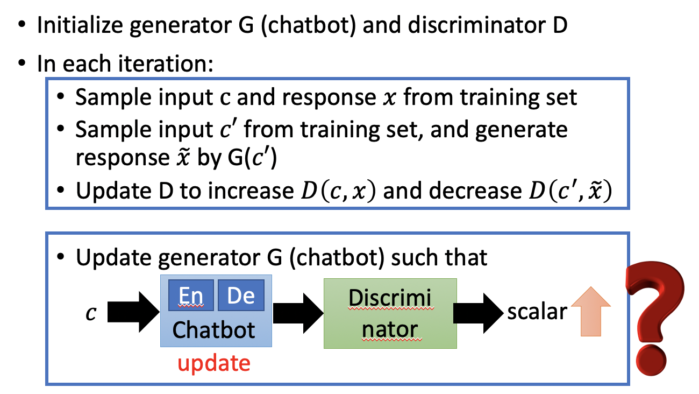

# Chapter 24 - Generative Adversarial Network（Part 6 - Improving Sequence Generation by GAN）

[1.Improving Supervised Seq-to-seq Model](#1)

​		[1.1 Regular Seq2Seq Model训练过程存在的问题](#1.1)

​		[1.2 使用RL训练Seq2Seq Model（Human Feedback）](#1.2)

​		[1.3 使用GAN训练Seq2Seq Model（Discriminator Feedback）](#1.3)

​		[1.4 More Applications](#1.4)

[2.Unsupervised Conditional Sequence Generation](#2)

​		[2.1 Text Style Transfer](#2.1)

​		[2.2 Unsupervised Abstractive Summarization](#2.2)

​		[2.3 Unsupervised Translation](#2.3)

#### 1.Improving Supervised Seq-to-seq Model

1. Regular Seq2Seq Model训练过程存在的问题

   - Audio Speech Recognition、Translation、Chat Bot都属于Conditional Sequence Generation的范畴，其Generator都是Seq2Seq Model。本小节主要介绍的是如何使用GAN的方法训练SeqSeq Model。

   - Regular Seq2Seq Model包含Encoder和Decoder，给Encoder一个输入，Decoder会产生一个对应的是输出。假设输入是“how are you?”，输出的目标就是最大化“I‘m good”的似然估计（等价于最小化交叉熵）。这种训练方法的问题在于，对于两个训练好的Seq2Seq Model，一个输出是“Not bad“，另一个输出是”I'm john“。对于人来说输出“Not bad“更加和里，但是对于机器的评判标准来说，输出是”I'm john“，因为最起码第一个输出”I'm“和与其的”I'm good“很接近。
   
     

   
   
2. 使用RL训练Seq2Seq Model（Human Feedback）

   - Machine（Chat-bot）通过人为的反馈去学习如何最大化Expected Reward。

     
     
   - 由Encoder和Decoder组成的Chatbot的输入是一个句子 $c$，输出是回应的句子 $x$。模型中还需要一个Human或是一个Function，其输入是Input Sentence $c$ 和Response Sentence $x$，输出是$R(c,x)$，用来给出相应的reward。此处的”Human“部分类似以Conditional Generation  by  GAN中的Discriminator，Human相当于一个训练好的模型，不用进行其他训练。Chatbot的目标就是学习如何做大话Expected Reward。（不但以Generator的输出作为输入，同时也要以Generator的输入作为输入）[Li, et al., EMNLP, 2016]

     
     
   - 上述模型的Seq2Seq Model部分可以使用Policy Gradient进行训练，首先计算$\tilde R_{\theta}=\sum\limits_h P(h) \sum\limits_x R(h,x)P_\theta(x|h)$，代表当Seq2Seq Model的参数为$\theta$时可以获得的Reward。其中$\sum\limits_h P(h)$表示各种各样的Input Sentence的概率分布的求和，$\sum\limits_x R(h,x)P_\theta(x|h)$表示给定$h$得到$x$的几率乘以相应的Reward后再求和。最终目标Maximizing expected reward 可以表述为$\theta^*=arg \max\limits_\theta \tilde R_{\theta}$。

     
     
   - 将收益$\tilde R_{\theta}$整理成期望形式，理论上求解期望要穷举所有的$x$和$h$，但是实际上只需要从数据库中进行采样就出N笔数据 $(c^1,x^1),(c^2,x^2),\cdots,(c^N,x^N)$，对每组数据计算收益值后求平均即可。此时发现参数$\theta$不见了，其实$\theta$被转换到从数据库中进行采样的过程中，不同的$\theta$会采样出不同的结果。

     
     
   - 由于$\frac{1}{N}\sum R(h^i,x^i)$没有办法对 $\theta$ 计算微分，所以实做的方法为使用$\tilde R_{\theta}=\sum\limits_h P(h) \sum\limits_x R(h,x)P_\theta(x|h)$计算关于参数$\theta$的梯度。$\tilde R_{\theta}$最后近似于$E_{h\sim P(h),x\sim P_\theta(x|h)}[R(h,x)\nabla logP_\theta(x|h)]$，因为期望是没有办法穷举计算的，所以同样使用采样的方法进行近似。

     
     
   - Policy Gradient在实际实现时，参数更新的方式如下。参数更新量$\nabla\tilde R_{\theta}$的直观解释为：当数据为$(h^i,c^i)$的奖励为正值时，表示机器的回答比较好，那么要输入为$h^i$时要增加回答$x^i$出现的概率，即增大$P_\theta(x^i|h^i)$；反之亦然。每次更新完参数后，要重新采样数据 $(c^1,x^1),(c^2,x^2),\cdots,(c^N,x^N)$，因为参数$\theta$变化时，对应的数据也会变化。

     
     
     
     
   - Summary（比较Maximum Likelihood和Reinforcement Learning）：对于Maximum Likelihood，已知数据$\{(c^1,\hat{x}^1),\cdots,(c^N,\hat{x}^N)\}$，希望出现$c^i$时最大化$\hat{x}^i$出现的概率。对于Reinforcement Learning，数据为$\{(c^1,x^1),\cdots,(c^N,x^N)\}$，这里的response Sentence $x^i$是机器产生的，不一定是对的。RL希望根据Reward不断的教会机器学会好的输出。Maximum Likelihood相当于目标函数中$R(c^i,x^i)=1$的Reinforcement Learning，RL则会根据每一笔数据的正确性给与不同的权重。 

     

   - 在现实的情境中，RL这种利用人的反馈不断的训练机器的代价是很大的，一个好的模型需要成千上万轮训练。所以Alpha GO的训练方式让两个Chat-bot互相训练，然后提前定义一个Evalution Function去评价一组对话的好与坏，但是Evalution Function只能简单的进行评价，比如进入死循环就给差评，做到和人一样的评判是很难的。因此就产生了第二种使用GAN去训练Auto-Encoder的方法。

     
     
     

3. 使用GAN训练Seq2Seq Model（Discriminator Feedback）

   - 在使用RL训练Seq2Seq Model时，需要人工辅助给予feedback；在使用GAN训练Seq2Seq Model时，feedback是Discriminator生成的。[Li, et al., EMNLP, 2017]
   
   - 模型的具体结构如下：Chatbot部分与上一小节相同，Discriminator部分需要实现学习大量人类的对话，能够判别一组对话是否是正常的，然后用于纠正Chatbot的输出。
   
     
     
   - 模型训练算法的伪代码如下：Discriminator的更新部分与GAN或FGAN是相同的，可以套用。
   
     
     
   - 在更新Generator时会存在一个问题。在图像生成中，Generator生成的是一张Image，可以直接作为Discriminator的输入，G和D组成一个更大的网络共同进行训练。但是在Sequence问题中，Generator实际上是一个Seq2Seq Model，因为Seq2Seq Model的每一次的输出是一个分布，然后在分布中采样出一个Word作为句子的一部分。Generator的采样的过程是没有办法微分的，因此G和D就没有办法接起来一起训练。具体解决犯法有三种Gumbel-softmax（[Matt J. Kusner, et al, arXiv, 2016]）、Continuous Input for Discriminator（[Sai Rajeswar, et al., arXiv, 2017][Ofir Press, et al., ICML workshop, 2017][Zhen Xu, et al., EMNLP, 2017][Alex Lamb, et al., NIPS, 2016][Yizhe Zhang, et al., ICML, 2017]）、Reinforcement Learning（[Yu, et al., AAAI, 2017][Li, et al., EMNLP, 2017][Tong Che, et al, arXiv, 2017][Jiaxian Guo, et al., AAAI, 2018][Kevin Lin, et al, NIPS, 2017][William Fedus, et al., ICLR, 2018]）
   
   - 解决方案一（Gumbel-softmax）的实际应用不是很多，核心思想就是利用一些trick将不能微分的部分转换为可微的。具体可以参考（https://gabrielhuang.gitbooks.io/machine-learning/reparametrization-trick.html、https://casmls.github.io/general/2017/02/01/GumbelSoftmax.html、http://blog.evjang.com/2016/11/tutorial-categorical-variational.html）
   
     
     
   - 解决方案二（Continuous Input for Discriminator）的核心思想是避开采样的过程，直接把Word Discribution丢给Discriminator。
   
     
     
     - 但是将一个Continuous Input丢给Discriminator会出现一些问题，Discriminator的目标是分辨一个句子的真假，Real Sentence和Generated Continuous Input在数据结构上就存在着本质的差异，如下图所示。Discriminator不需要根据语义，只需要根据每一列是不是独热编码就可以分辨真假。但是这个缺点可以用WGAN去弥补，因为WGAN给Discriminator增加了$1-Lipschitz\ Function$的约束，所以Discriminator的能力有限，不会学习到直接根据结构特点就可以区分真假。
     
       
     
   - 解决方案三（Reinforcement Learning）就是套用第二小节Human Feedback的思想，原本使用GAN辅助训练Seq2Seq Model时，会直接使用Discriminator判断一组句子的真假，此处结合RL的思想，将Discriminator的输出作为Reward进行训练。然后就是更新Generator最大化Discriminator的输出，以获得最大收益。
   
     
     
     - 更新Generator最大化Discriminator的输出的方法与RL相同，只是将人为给出的Reward $R(c^i,x^i)$替换为$D(c^i,x^i)$
     
       
     
       
     
     - 更新Discriminator的过程为，通过真实问答和机器产生的问答训练Discriminator判断真假，进行更新。
     
     - Training Tip 1：假设$c^i = “What\ is\ your\ name?”$，$x^i = “I\ don’t\ know”$。那么$D(c^i,x^i)$是Negative的，那么你希望更新参数 $\theta$ 减小$logP_\theta(x^i|c^i)$。实际上$logP_\theta(x^i |c^i )=logP(x_1^i |c^i )+logP(x_2^i |c^i,x_1^i )+ logP(x_3^i |c^i,x_{1:2}^i )$，为每个Word的概率之和。如果希望减小$logP_\theta(x^i|c^i)$，等价于希望展开的三项都减小，此时就会存在一个问题。因为第一项$logP(x_1^i |c^i )$代表的是$P("I"|c^i)$，和合理的答案是接近的，例如“I'm john”或“i'm Mary”等等，第一项$logP(x_1^i |c^i )$不应该减小。但是因为也存在$c^i = “What\ is\ your\ name?”$，$x^i = “I\ am\ John”$的例子，可以增加$logP(x_1^i |c^i )$，所以理论上是可行的。但是实际上因为无法产生过多的可能性，所以实验结果还是存在问题的。
     
       
     
     - 具体的解决方案是，增加第一项，降低第二项和第三项。对梯度公式进行改写，原本的公式为对于一组Sentence $(x^i,c^i)$给定一个Reward，改写为对于生成每一个Word的过程都给与一个评价指标 $Q(x^i_{1:t},c^i)$，具体的实现方法为Monte Carlo (MC) Search（[Yu, et al., AAAI, 2017]）、Discriminator For Partially Decoded Sequences（[Li, et al., EMNLP, 2017]）
     
       
     
     - Training Tip 2：RankGAN（Kevin Lin, Dianqi Li, Xiaodong He, Zhengyou Zhang, Ming-Ting Sun, “Adversarial Ranking for Language Generation”, NIPS 2017）
     
   - 使用GAN训练Seq2Seq的实验结果如下，MLE的结果更倾向于回答一些较短的、含糊其辞的答案，例如“i'm sorry”、“I don't Know”等等，这是因为MLE学习到的是更平均的结果，例如Conditional Generation中所有角度火车Image平均的例子。GAN的结果更具有内容性。[Lu, et al., arXiv, 2018][Zhu, et al., arXiv, 2018]
   
     
     
     
   
4. More Applications
   
   - Supervised machine translation 
   - Supervised abstractive summarization [Liu, et al., AAAI 2018]
   - Image/video caption generation [Rakshith Shetty, et al., ICCV 2017][Liang, et al., arXiv 2017]
   

#### 2.Unsupervised Conditional Sequence Generation

1. Text Style Transfer

   - Image Domain Transfer很容易理解，但是Text Style Transfer也是可以做的，例如将正面情绪的文本转换成负面情绪的文本。分为两种，Direct Transformation和Projection to Common Space。

   - Direct Transformation只需要将之前学习过的Cycle GAN的输入输出替换为文本即可。唯一的问题是，输出文本时，可能需要进行采样，具体的解决方法在上一章节已经介绍过了。例如，通过Word Embedding将其转换为Continuous Input Vector。[Lee, et al., ICASSP, 2018]

     
     
     
     
   - Projection to Common Space也是替换输出的格式就可以了，文本领域的为了将两个Domain压缩到同一空间，也需要进行一些约束，目前研究不多，仍待研究。[Zhao, et al., arXiv, 2017][Fu, et al., AAAI, 2018]

     
     
     

2. Unsupervised Abstractive Summarization

   - 摘要生成可以使用Supervised Seq2Seq去做，找到大量的文章和摘要，送入机器进行学习。但是这样的系统至少需要100万个Example，低于100万的Example，机器可能连产生符合文法的句子都做不到。这样的工作量是巨大的。

   - 基于上述问题，提出Unsupervised Learning的方法，收集一些文章，一些摘要，两者不需要相对应。将两者视作两个Domain。模型的结构类似于Cycle GAN。Discriminator通过判断摘要的真假，促使Generator产生类似于人写的摘要，而不是人看不懂的东西，Reconstructor促使Generator写的摘要更像原文。整个模型可以认为是seq2seq2seq auto-encoder。

     
     
   - 实验结果如下：

     
     
     
     
     

3. Unsupervised Translation

   - [Alexis Conneau, et al., ICLR, 2018]
- [Guillaume Lample, et al., ICLR, 2018]
   
