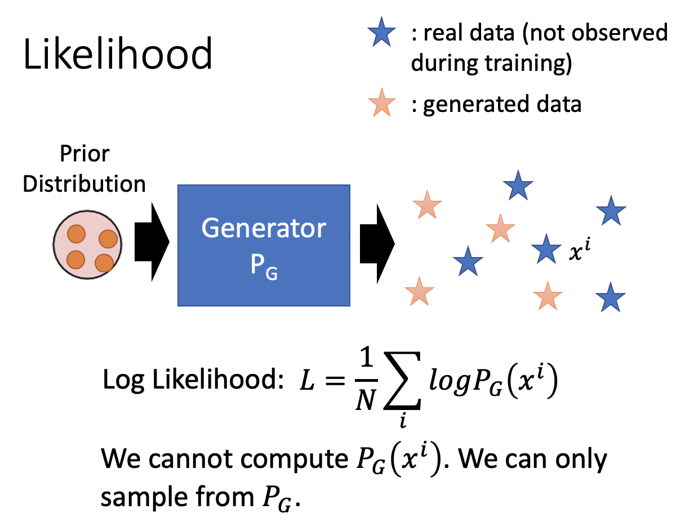
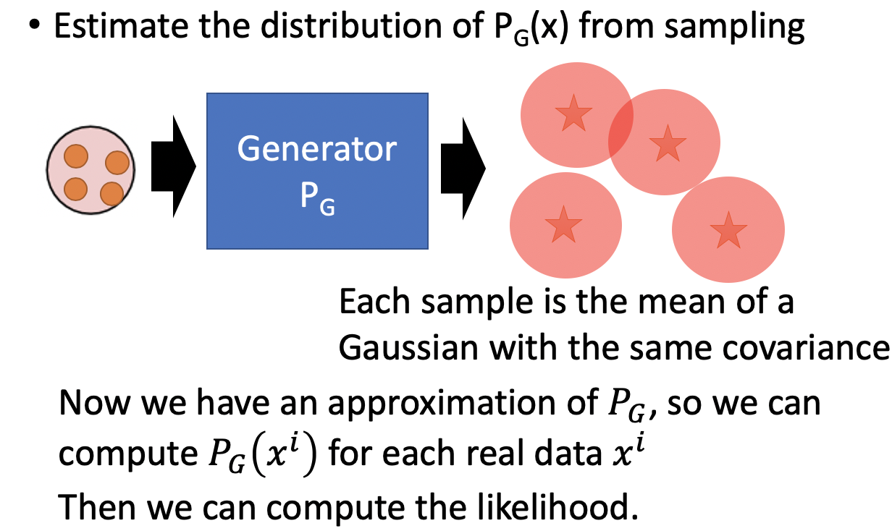
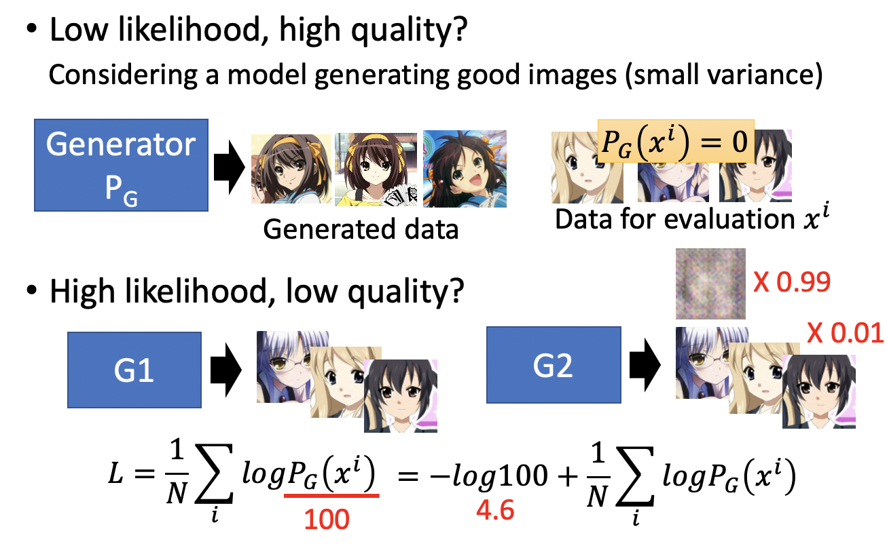
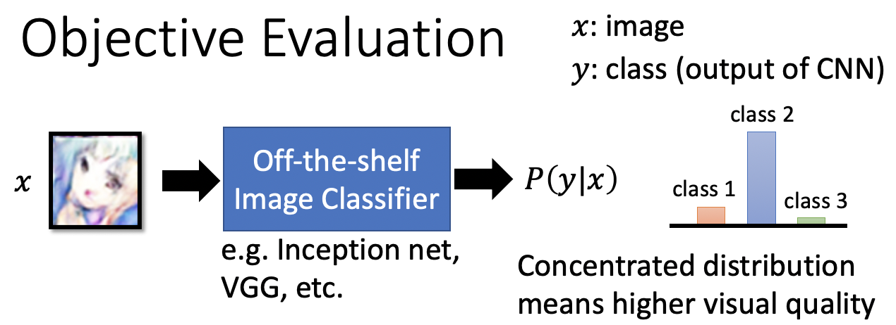
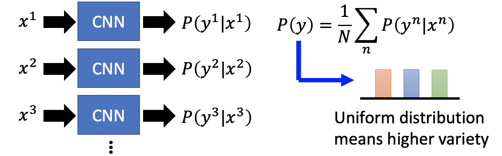
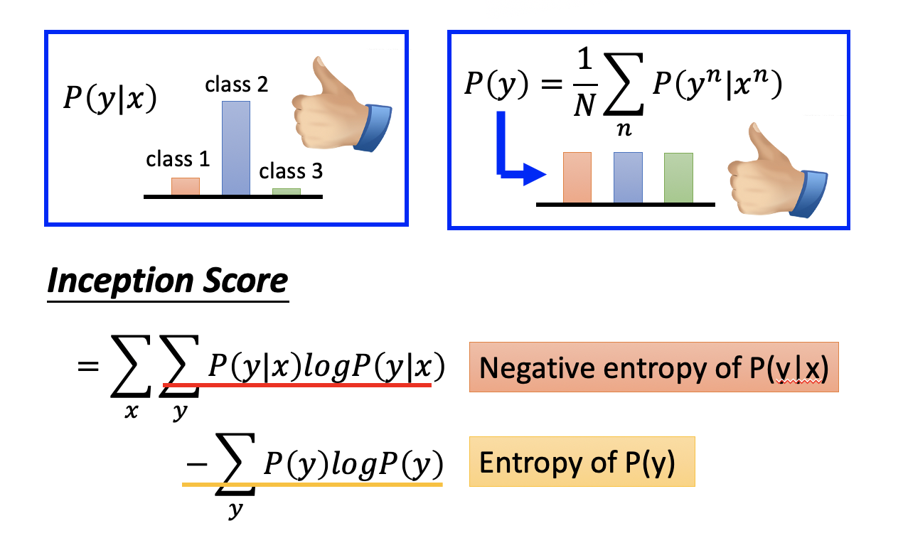

# Chapter 24 - Generative Adversarial Network（Part 7 - Evaluation）

[1.Improving Supervised Seq-to-seq Model](#1)

​		[1.1 Regular Seq2Seq Model训练过程存在的问题](#1.1)

​		[1.2 使用RL训练Seq2Seq Model（Human Feedback）](#1.2)

​		[1.3 使用GAN训练Seq2Seq Model（Discriminator Feedback）](#1.3)

​		[1.4 More Applications](#1.4)

[2.Unsupervised Conditional Sequence Generation](#2)

​		[2.1 Text Style Transfer](#2.1)

​		[2.2 Unsupervised Abstractive Summarization](#2.2)

​		[2.3 Unsupervised Translation](#2.3)

#### Abstract：对于GAN生成的对象，最好的评判标准就是人工评判，但这是费时费力的。本节主要介绍一些GAN Evaluation的知识。（Ref: Lucas Theis, Aäron van den Oord, Matthias Bethge, “A note on the evaluation of generative models”, arXiv preprint, 2015）

#### 1.Improving Supervised Seq-to-seq Model

1. Likelihood Evaluation

   - 传统衡量Generator的方法是计算Generator产生数据的Likelihood，对于一个训练好的Generator，给定一些Real Image $x^i$，计算产生这些Image的几率 $L=\frac{1}{N}\sum\limits_i logP_G(x^i)$，$L$越大表示Generator越可能产生足够真实的对象。但是我们是没有办法算$P_G(x^i)$的，因为对于Generator，输入是Prior Distribution随机采样的Vector，输出是Generated Image，该过程相当于从$P_G$中进行采样。Generator做不到产生某一张指定的图片。如果Generator是一个高斯模型或混合高斯模型，那么一直采样出的样本$x^i$，我们是可以反推出采样出$x^i$的概率，但是因为Generator是一个神经网络，结构过于复杂，我们是没有办法反推的。

     

   - $P_G(x^i)$无法计算的解决办法是**Likelihood - Kernel Density Estimation**。先让Generator产生一堆数据（Vector），然后使用高斯模型去逼近产生的数据。将Generated Vector当做均值，然后指定一个相同的covariance，就可以得到多个高斯分布（红色圆圈）。将所有的高斯分布叠加在一起就得到了一个混合高斯模型，这个混合高斯模型就是Generator $P(G)$的一个近似，于是就可以根据指定的$x^i$反推出$P_G(x^i)$，然后计算 $L=\frac{1}{N}\sum\limits_i logP_G(x^i)$。在该解决办法中，产生数据的个数，方差的选取都没有严格标准，在实际实现还是存在一定的问题的。

     

   - 实际上Likelihood和Quality之间是没有必然联系的。第一种案例是Low likelihood, high quality：假设一个Generator能够产生非常清晰真实的哆啦A梦的图像，但是因为Testing Data的图像全是迪迦奥特曼的，所以$P_G(x^i)=0$，整体的Likelihood也会很小。第二种案例是High likelihood, low quality：假设Generator $G_1$能够产生很清晰高质量的图片，且通过某种超能力手段得知其Likelihood也很高。又有一个Generator $G_2$ ，它99%的可能产生的都是Random Noise，1%的可能性产生于$G_1$一样的图片，但是二者的Likelihood只差了4.6（文献上的Likelihood都是几百多），所以对于$G_2$而言，高Likelihood缺低Quality。

     

     

2. Objective Evaluation

   - 一种实际应用比较广泛的方法就是Objective Evaluation，即使用一个已经训练好的Classifier来评价GAN生成的对象。将一个Generated Object输入Classifier，会产生一个Distribution，如果这个分布越集中，则代表Generated Object的质量越好。[Tim Salimans, et al., NIPS, 2016]

     
     
   - 同时因为可能存在Mode Collapse的问题，模型只能产生某几个比较好的Object，所以还要对多样性进行评估。将多个Generated Object作为输入送入CNN，CNN会产生多个输出分布，对所有分布求平均。平均后的分布越Uniform表示多样性越好。如果平均后的分布某一个类别的可能性很高，就说明Generator更倾向于产生该类别的东西。

     
     
   - 根据质量和多样性两个标准，可以定义一个值 $Inception Score = \sum\limits_x \sum\limits_y P(y|x)logP(y|x)-\sum\limits_y P(y)logP(y)$，第一项表示对每一张Image进行分类，然后求输出分布的Negative Entropy，Negative Entropy用来衡量一个分布是否Sharp；第二项表示所有的分布平均后的信息熵，永来衡量是否统一。

     
     
     

3. We Don't Want Memory GAN

   - Memory GAN：有时候GAN能够产生一些很好的输出，并不代表模型训练的很成功。反而有可能是因为GAN强行记住了Database中的一些数据，直接将其作为输出。于是有人提出将GAN的输出与Database的数据进行一一比对，计算二者的$L1、L2$相似度，但是这是远远不够的。假设有一张生成的羊的图片，下图中的纵轴表示数据库中图片与该图片的距离，原点表示羊的图片和自己最像。横轴表示将羊图片所有像素平移一个单位，数据库中就会有很多和其比较像的图片。因此从pixel-level进行相似度检测是不可行的。该问题尚待解决。
   
