# Chapter 24 - Generative Adversarial Network（Part 8 - More GAN-based Model [SAGAN, BigGAN, SinGAN, GauGAN, GANILLA, NICE-GAN]）

[1.Improving Supervised Seq-to-seq Model](#1)

​		[1.1 GAN Roadmap](#1.1)

​		[1.2 SAGAN（Self-Attention）](#1.2)

​		[1.3 BigGAN（升级版SAGAN）](#1.3)

​		[1.4 SinGAN（将一张图片切割成很多小的图片当做训练资料）](#1.4)

​		[1.5 GauGAN（Conditional Normalization）](#1.5)

​		[1.6 GANILLA（CycleGAN/DualGAN mega升级、宮崎駿Dataset）](#1.6)

​		[1.7 NICE-GAN（D的前半部当成encoder）](#1.7)

#### 1.More GAN-based Model

1. GAN Roadmap

   - 最左边蓝色的分支主要是解决GAN训练稳定性的问题，ImprovedGAN（2016）和GAN（2014）为同一作者，提出了一些方法改善GAN训练的问题；WGAN（2017）使用Wasserstein Distance代替GAN中的JS Divergence；WGAN-GP使用一种比较委婉的方法Gradient Penalty解决了$1-Lipschitz\ Function$的约束求解问题；SNGAN（2018）使用最完美的数学方法解决了WGAN中碰到的问题。

     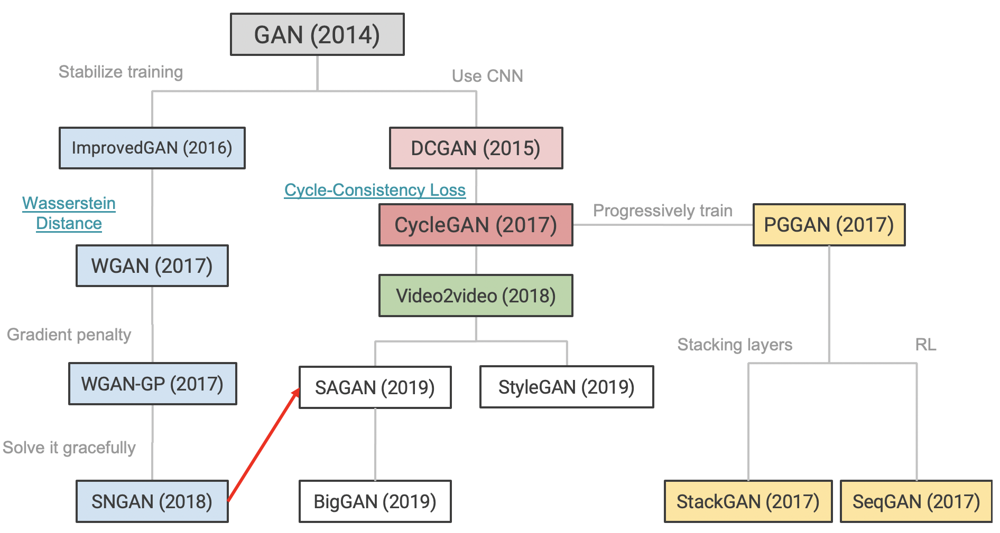
     
   - 右边的分支是GAN在图像领域的应用，DCGAN（2015）在GAN模型中运用了大量的CNN；Cycle GAN（2017）引入了Cycle-Consistency Loss，本章节主要介绍的就是白色部分SAGAN、BigGAN、StyleGAN等等

     

2. Self-attention GAN（SAGAN）

   - Self-attention的作用就是通过Query和Key生成一个Attention Map，表示Input Word之间的关系。

     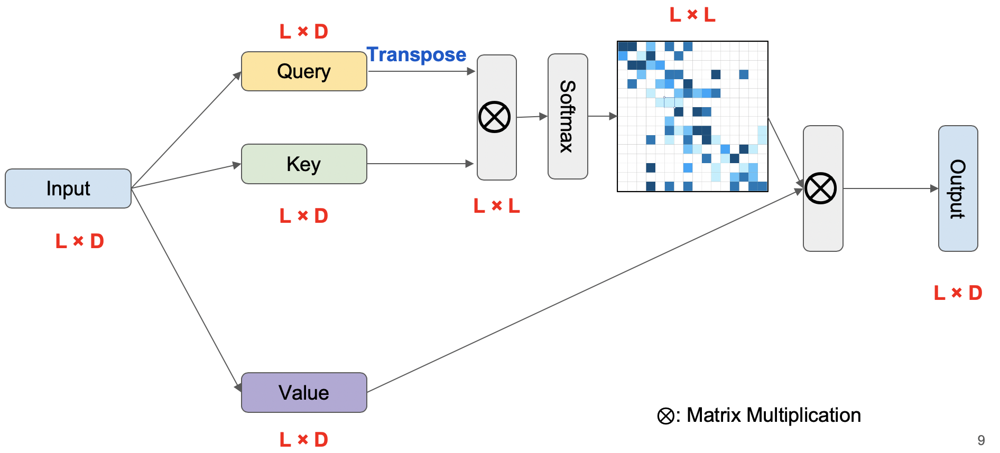
     
   - SAGAN是在SNGAN上进行改进得到的。SN表示Spectral Normalization，SNGAN中Spectral Normalization只应用在Discriminator上，SAGAN将Spectral Normalization用在了Generator和Discriminator上。
  
   - Spectral Normalization在Pytorch中已经有实现好的接口（https://pytorch.org/docs/master/generated/torch.nn.utils.spectral_norm.html）
   
     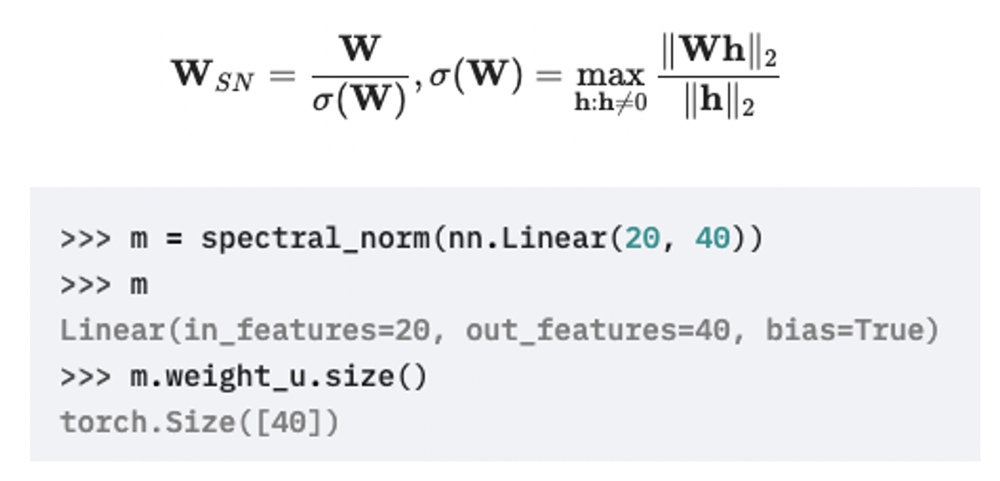
     
   - Regular GAN的训练时，一般G和D会使用不同的Learning Rate。在SAGAN中，使用的策略是Two-Timescale Update Rule（TTUR）。（Heusel, M., Ramsauer, H., Unterthiner, T., Nessler, B., and Hochreiter, S. GANs trained by a two time-scale update rule converge to a local nash equilibrium. In NIPS, pp. 6629–6640, 2017.）
   
     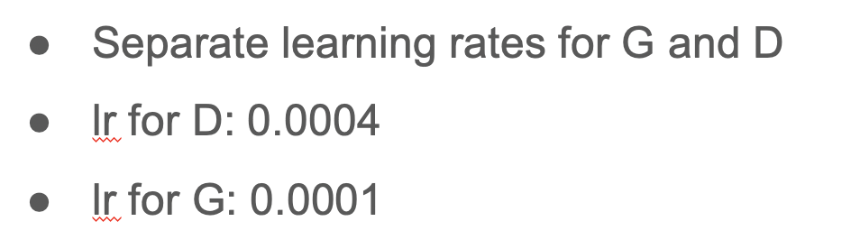
     
   - 实验结果如下：Inception Score已经介绍过，FID指的是将Generated Object的特征抽取出来和训练的真实数据的Feature抽取出来进行对比，越低越好。
   
     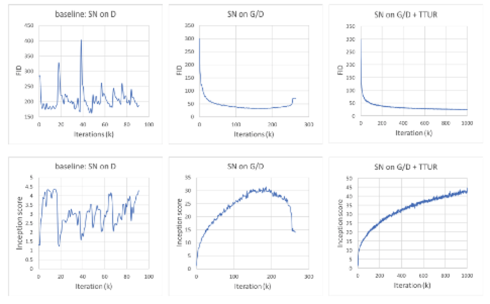
     
     
   
3. BigGAN

   - BigGAN是基于SAGAN和SNGAN改进的，可以说是豪华版的SAGAN。BigGAN方法了一些Hyperparameter和Batchsize。（Brock A, Donahue J, Simonyan K. Large scale gan training for high fidelity natural image synthesis. arXiv preprint arXiv:1809.11096. 2018 Sep 28.）
   
   - BigGAN提出了Truncation trick，规定了才能够Normal Distribution中采样出的向量的Noise，要求噪声小于一个阈值才能输入模型，以促进模型专精于学习图片内容。
   
     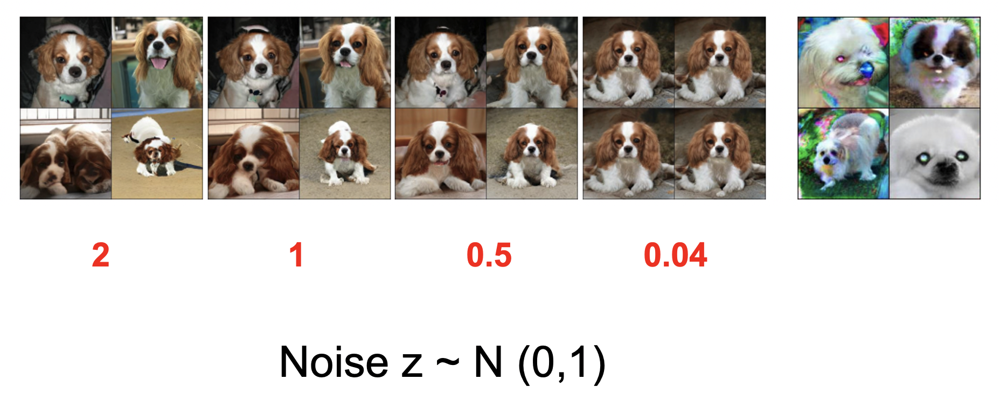
   
   - BigGAN探索了Hyperparameter和Batchsize的大小与模型稳定性之间的关系。
   
     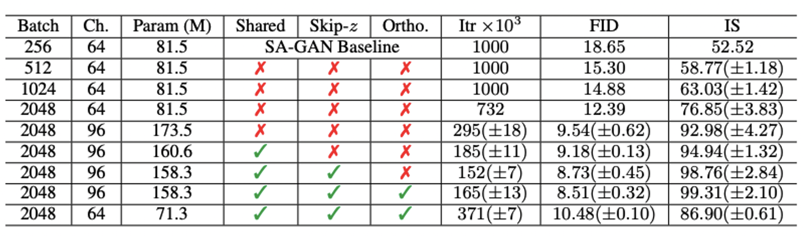
   
   - 同时发现了，模型的学习能了越快，又有可能训练坏掉，需要及时的Early Stop。
   
     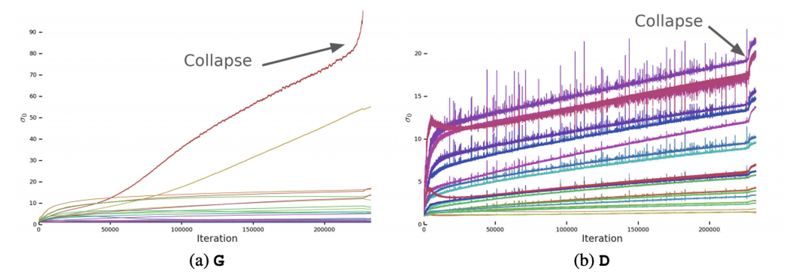
   
     
   
4. SinGAN

   - SinGAN提出了“One training data is enough!”的概念，实际上是将一张训练图像切分成了更小的图像。对于大的图片，可以切分出很多很多小的数据。但是原本的图片比较小的话，就要切分各种大小的图像以增加训练数据集的多样性，但是还是存在一些切分后过小的图片，只蕴含了局部的信息。（https://scontent-tpe1-1.xx.fbcdn.net/v/t1.0-9/98053952_10163743532515296_6125130531014180864_n.jpg?_nc_cat=1&_nc_sid=110474&_nc_ohc=AP1k-nOxv2QAX_24Min&_nc_ht=scontent-tpe1-1.xx&oh=7129f16449e0a1dd5b04ab55fe051485&oe=5EEE2B80）

   - SinGAN提出了Progressively Traind的想法。

     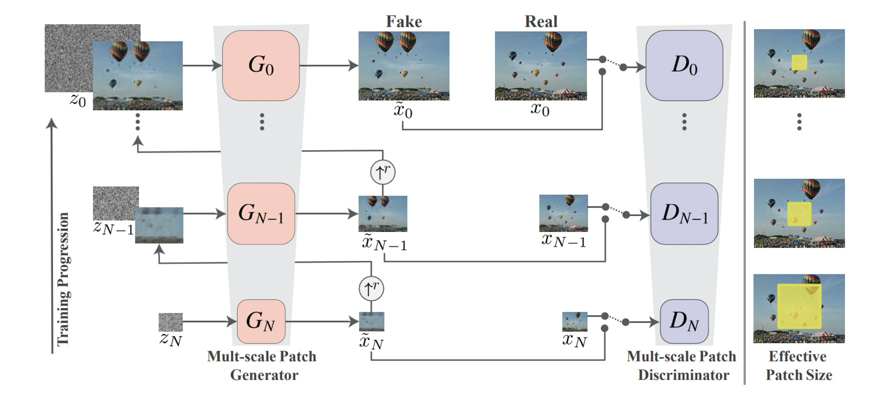

   - 可以用于的场景有Super Resolution、Paint to image、Image editing、Image harmonization

     

5. GauGAN

   - 在GauGAN中，先要定义好每种颜色具体代表哪一种事务。然后随意画一些简单的图片，在给与模型某个风景照，模型就会实现自动的风格转换。（Park T, Liu MY, Wang TC, Zhu JY. Semantic image synthesis with spatially-adaptive normalization. InProceedings of the IEEE Conference on Computer Vision and Pattern Recognition 2019 (pp. 2337-2346).）

     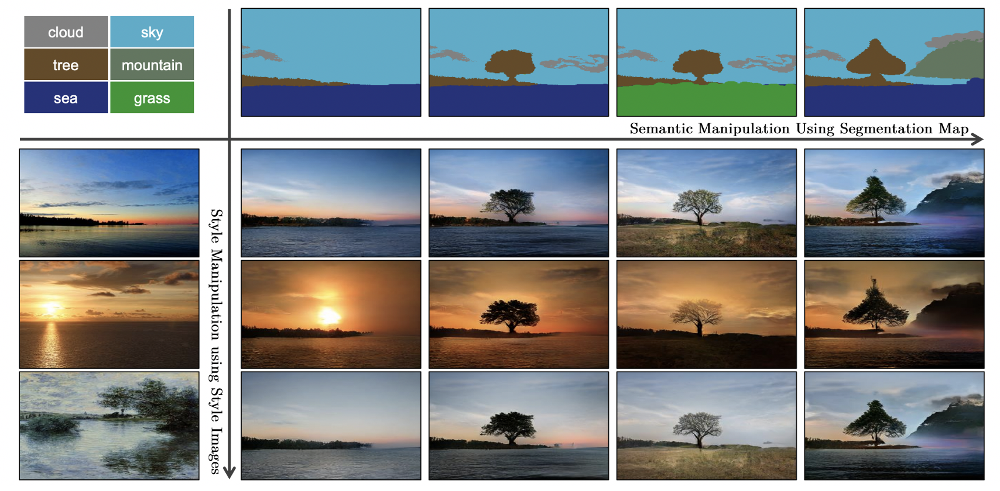

   - GauGAN提出了SPADE，传统的Normalization包括Batch Norm、Layer Norm等等，这些都是Unconditional Normalization，即正则化的参数不会随着训练的进而改变。（Wu Y, He K. Group normalization. InProceedings of the European Conference on Computer Vision (ECCV) 2018 (pp. 3-19).）。SPADE提出的是Conditional Normalization，是一种Input-depedent Normalization。

     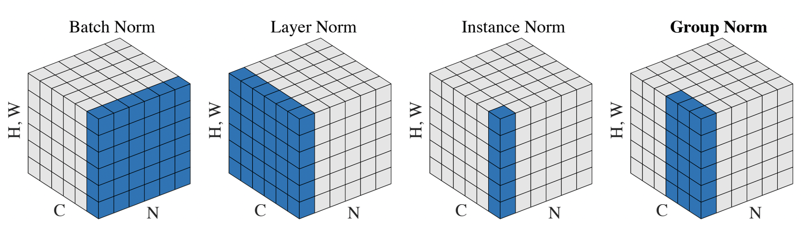

     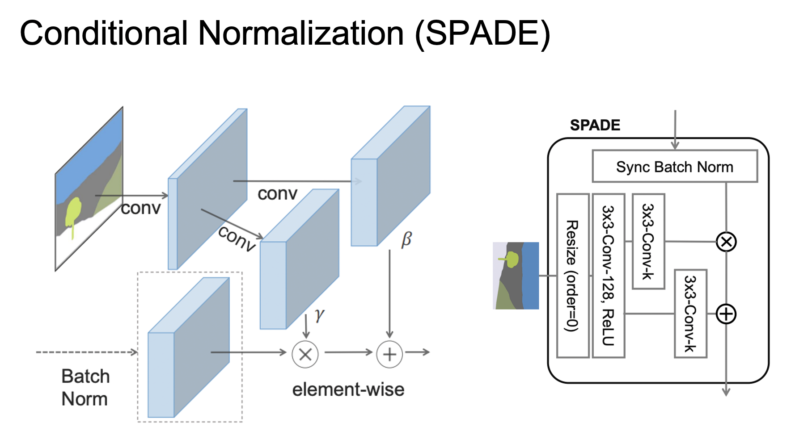

   - GauGAN加入了Encoder，类似于VAE-GAN，用于抽取输入的风景信息。

     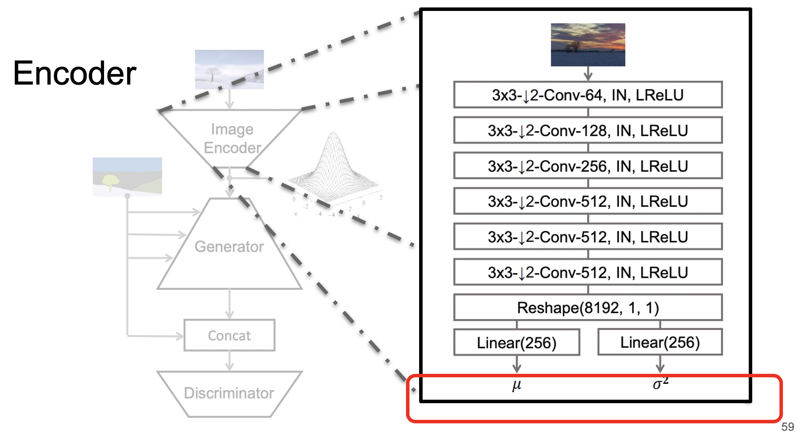

     

6. GANILLA

   - 使用Unpaired data（Hicsonmez S, Samet N, Akbas E, Duygulu P. GANILLA: Generative adversarial networks for image to illustration translation. Image and Vision Computing. 2020 Mar 1;95:103886.）

   - 在风格转换上，兼顾Style和Content，做到一个很好地平衡（e.g. CycleGAN, DualGAN, CartoonGAN）

   - 几种GAN模型的结构对比

     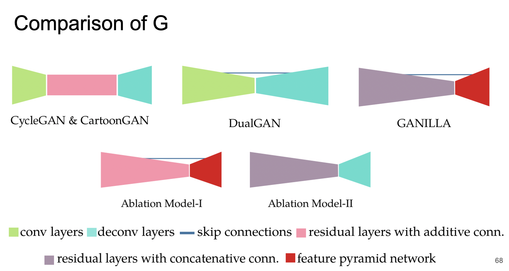

     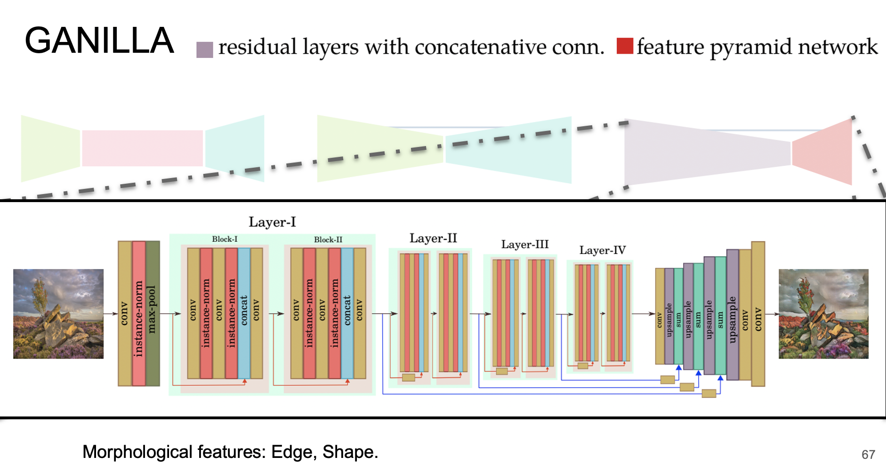

   - GANILLA提出了一个**children’s books illustration dataset**

     

7. NICE-GAN

   - 相比于Cycle GAN加入了Encoder，NICE-GAN不再依赖于Encoder，作者认为Discriminator的前一部分就可以完成Encoder的功能。

     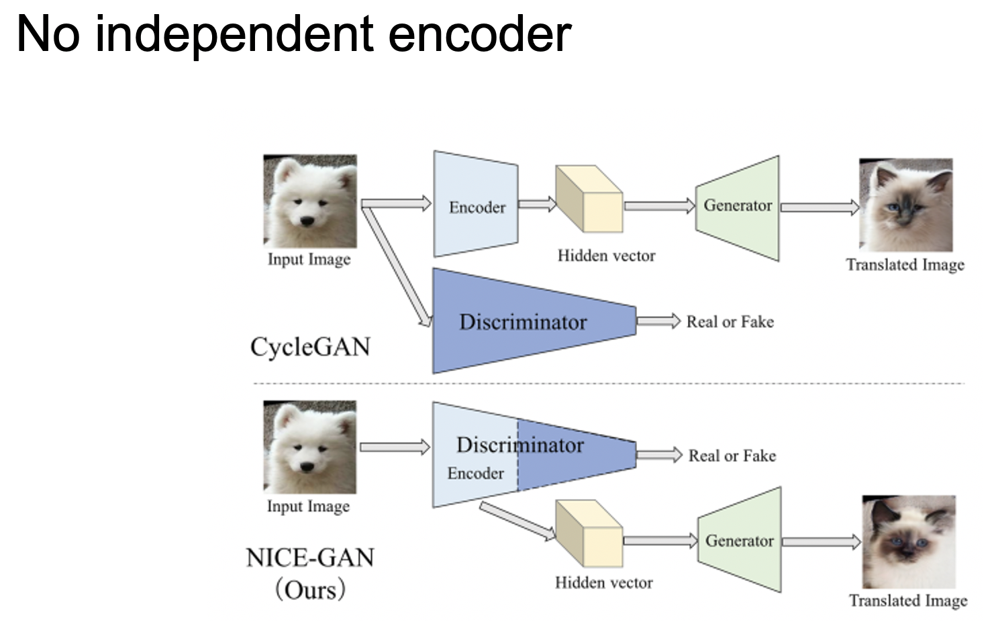

   - NICE-GAN的模型如下：

     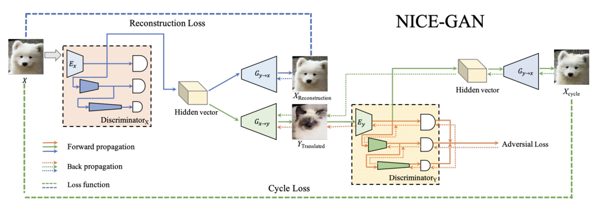

     
