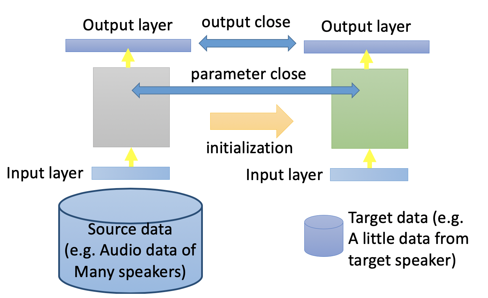
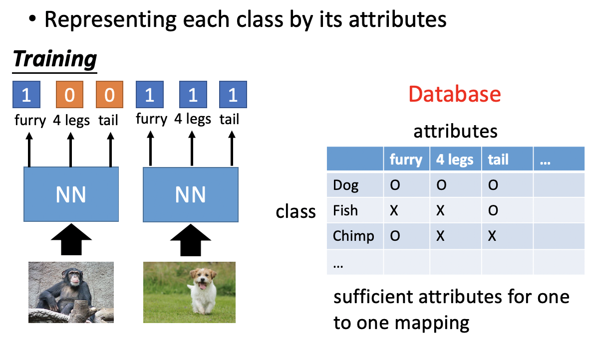

# Chapter 25 - Transfer Learning

[1.Transfer Learning简介](#1)

​		[1.1 Transfer Learning提出的背景](#1.1)

[2.Labeled Source Dara + Labeled Target Data](#2)

​		[2.1 Model Fine-tuning](#2.1)

​		[2.2 Multitask Learning](#2.2)

[3.Labeled Source Dara + Unlabeled Target Data](#3)

​		[3.1 Domain-adversarial Training](#3.1)

​		[3.2 Zero-shot learning](#3.2)

#### 1.Transfer Learning简介

1. Transfer Learning提出的背景

   - Transfer Learning主要应用于数据和相应的Task没有直接关系的环境中。以猫狗图像的分类为例，没有直接关系有很多种可能性，一种是Input Distribution是相同的，但是Task（Label）是不同的；另一种是虽然Task相同，但是Input Distribution是不相同的。

     
     
   - Transfer Learning的存在是因为，在某些领域中数据资源过少，没有办法进行训练，所以希望借鉴其他领域的数据完成任务。例如不同语言的语音识别，医学领域的图像识别、法律领域的文件分析等等。

     
     
   - Transfer Learning会根据两组不相关数据是否有标签分为以下几类。需要注意Transfer Learning中的属于比较混乱。

     
     
     
   

#### 2.Labeled Source Dara + Labeled Target Data

1. Model Fine-tuning

   - 已知少量的Target Data为 $(x^t,y^t)$，大量的Source Data为 $(x^s,y^s)$。当Target Data的数量少到只有几个时，可以被称为One-shot Learning。

   - 具体的案例Speaker Adaption，其中Target Data表示指定人物的语音数据和相应的文本，Source Data表示任何人物的语音数据和相应的文本。实现想法是使用Source Data训练模型，然后使用Target Data去Fine-tune模型（该过程可以直观的理解为，使用Source Data训练模型的参数作为下一步的初始化值）。此处因为Target Data的数量比较少，所以需要注意不要过拟合。

   - 防止过拟合的训练技巧一（Conservative Training）：在使用Target Data进行训练时，增加一些约束（正则项）。例如要求两个模型面对相同的输入，其输出分布尽可能的接近；或者模型参数尽可能的接近等等。

     

   - 防止过拟合的训练技巧二（Layer Transfer）：将训练好的模型中的某几层直接复制到新的模型中，使用target data训练时，只对没有复制的层进行更新。如果target data比较多，那么可以在整体FIne-tune。在不同的领域中，复制的层也是不一样的。在语音领域，通常复制神经网络的最后几层；在图像领域，通常复制前几层，因为前几层学习的是比较广泛的特征，比如线条，轮廓等等，可以被借鉴在任何图像问题上。

     

   - 防止过拟合的训练技巧二（Layer Transfer）：在不同的领域中，复制的层也是不一样的。在语音领域，通常复制神经网络的最后几层；在图像领域，通常复制前几层，因为前几层学习的是比较广泛的特征，比如线条，轮廓等等，可以被借鉴在任何图像问题上。下图是复制不同的层带来的影响分析。（Jason Yosinski, Jeff Clune, Yoshua Bengio, Hod Lipson, “How transferable are features in deep neural networks?”, NIPS, 2014）

     

     

2. Multitask Learning

   - Multitask Learning适用于一些具有一定共同特性的任务，不但关注Target Model的Performance，还要关注Source Model的Performance。

   - 第一种情况，两个任务都是Image Classification，只是属于不同的类别。那么两个Task共用网络的前几层，前几层的训练会使用大量的数据，后几层会各自使用各自的数据。
   
     
     
   - 第二种情况，两个任务的Input之间无法学习出一些共同的特征，那么就各自学习，然后共用中间几层网络（映射到相同的Domain上），后几层各自使用各自的数据。
   
     
     
   - Multitask Learning最成功的案例就是Multilingual Speech Recognition。因为都是人类的语言，所以所有的数据可以共用前几层网络。（**Similar idea in translation**: Daxiang Dong, Hua Wu, Wei He, Dianhai Yu and Haifeng Wang, "Multi-task learning for multiple language translation.“, ACL 2015）
   
     
     
   - 研究发现，目前大部分的语言都是可以互相Transfer的，不存在语系的差异。（Huang, Jui-Ting, et al. "Cross-language knowledge transfer using multilingual deep neural network with shared hidden layers." ICASSP, 2013）
   
     
   
   
   

#### 3.Labeled Source Dara + Unlabeled Target Data
1. Domain-adversarial Training

   - 已知Source Data为 $(x^s,y^s)$，Target Data为 $(x^t)$，两个任务相同，但是数据不匹配。以MINIST为例，将数据集本身视为Source Data（with label），将加上背景颜色以后的数据集视为Target Data（without label）。对于Labeled Source Dara + Unlabeled Target Data的情景，我们会将Source Data视为Training Data，Target Data视为Testing Data。

     
     
   - 第一种解决方案是使用Source Data训练好了一个模型，然后用在Target Data上，这种思路是不可行的。因为在神经网络中，前几层是在抽取特征，后几层在抽取类别信息。那么将两组数据经过几层后的Feature可视化，可以发现不同Domain的数字的特征分布差异很大。即便先使用Source Data训练好了一个模型可以区分红色的点，但还是无法区分蓝色的点。

     
     
   - 第二种解决方案是Domain-adversarial Training，基本思路为训练一个神经网络，神经网络的前几层可以提取出不包含Domain信息的特征，这样就可以将训练好的模型进行迁移使用。即不同Domain的数据经过特征提取后的分布仍是相近的。实现方法可以再提取的Feature后再加一个Domain Classifier，用于判别特征是属于哪个Domain的，只有Feature Extractor提取的特征可以骗过Domain Classifier时，就说明两组特征分布相似了（类似于GAN的想法）。

     
     
   - 在GAN中，Generator的目标是使生成的图片骗过Discriminator，是比较有难度的。在Domain-adversarial Training中Feature Extractor只需要对于任何输入输出零就可以骗过Domain Classifier，所以要对Feature Extractor增加一定的约束，即不但要骗过Domain Classifier，还要让Label Predictor的效果尽可能的好。这就意味着Feature Extractor抽取的特征既不包含Domain的信息，又能够进行分类。三个部分组成一个大的网络，每个部分有自己的目标。

     
     
   - 因为Feature Extractor和Domain Classifier的目标是相反的，所以可以在二者之间使用Gradient Reversal Layer，将Domain Classifier计算好的反向传播梯度乘以$-1$，然后送入Feature Extractor。（Yaroslav Ganin, Victor Lempitsky, Unsupervised Domain Adaptation by Backpropagation, ICML, 2015、Hana Ajakan, Pascal Germain, Hugo Larochelle, François Laviolette, Mario Marchand, Domain-Adversarial Training of Neural Networks, JMLR, 2016 ）

     
     
   - 上述结构的训练有一定难度，如何保证Domain Classifier不坏掉的情况下奋力挣扎，努力区分特征，将Feature Extractor逼到极限，抽取出不含Domain的特征，是需要技巧的。
   
     
   
2. Zero-shot learning

  - 已知Source Data为 $(x^s,y^s)$，Target Data为 $(x^t)$，两个任务不同，具有一定的差异性。这种情形在语音识别中是比较常见的，因为可能许多词汇在语音讯号里都是从来没出现过的。在语音领域的解决办法是，不要直接辨识某一段声音属于哪一个词汇，而是辨别某一段声音属于哪一个因素，然后根据事先建立好的音素和词汇的对应表就可以还原出词汇。

    

  - 在影像领域的解决方案是，将Database中所有Image和类别和一些属性对应起来，建立一个对应的表格。属性的选择要足够丰富，保证每个类别都有一组独一无二的属性表示。

    

  - 在训练的过程中，不直接识别其类别，而是他的属性都是什么样子的。那么在输入一张之前从来没有看过的Image后，也可以根据输出的Attribute Vector计算出最可能的所属类别。

    

  - 当Attribute定义的足够丰富时，就可以进行**Attribute Embedding**。将Database中的所有Image $x^i$ 经过Transform Function $f(*)$ 转换到Embedding Space中，将Attribute Vector $y^i$（类别）也经过Transform Function $g(*)$ 转换到Embedding Space中。要求对应的$x^i$和$y^i$对应的Embedding Point尽可能的接近。那么对于一张之前从来没有看过的Image，将其转换到Embedding Space中，主需要观察和那个类别的Embedding Point最接近，那就属于该类别。

    

  - 如果没有现成的包含Image和Attribute Vector对应关系的Database，那么就可以使用Attribute Embedding + Word Embedding的方法，因为类别名称的Word Embedding也是一个很复杂的Vector bi表示，所以可以使用Word Embedding代替Attribute Vector。

    

  -  上述过程的目标函数可以写为$f^∗,g^∗=arg\ \min\limits_{f,g}\sum\limits_n‖f(x^n )-g(y^n )‖_2 $ ，该公式存在的问题是模型为了最小化所有对应点之间的距离和，可能会将所有点都映射到Embedding Space中的一个点，这样虽然距离最小，但是就失去了分类的意义。所以目标函数既要考虑$x,y$属于同一类时距离最小，还要考虑$x,y$不同类时距离尽可能的大，则目标函数可以改写为$f^∗,g^∗=arg\ \min\limits_{f,g}\sum\limits_n \max\{0,k-f(x^n)\cdot g(y^n))+\max\limits_{m\neq n}f(x^n )\cdot g(y^n)\}$，为了让花括号的部分取零，这后一项必须小于0，意味着$x,y$不同类时Embedding相似度的最大值也要比$x,y$属于同一类时的Embedding相似度小一个常数值 $k$（$k$ 是人工定义的一个Margin）。这样做的目的就是拉近成对的数据，拉远不成对的数据。

    

  - 还有一种更简单粗暴的Zero-shot learning的方法是**Convex Combination of Semantic Embedding**，将Image直接输入神经网络，得到其属于老虎和狮子的几率分别是0.5，然后将该几率作为权重将老虎和狮子的Word Embedding进行加权得到一个向量，寻找与该向量最接近的Word Embedding就是所求的类别。

    

  - Zero-shot learning在文本上的例子是Melvin Johnson, Mike Schuster, Quoc V. Le, Maxim Krikun, Yonghui Wu, Zhifeng Chen, Nikhil Thorat. Google’s Multilingual Neural Machine Translation System: Enabling Zero-Shot Translation, arXiv preprint 2016，其核心思想是将不同语言都映射到一个Language-Independent & Semantic-dependent的空间上，可以理解为机器发明了一种秘密的通用语言，然后输入一种语言，就会被转换为秘密语言，然后再解会人类语言。如下图所示，圈内的红色点是来自于三种语言。

    

  - More about Zero-shot learning：

    - Mark Palatucci, Dean Pomerleau, Geoffrey E. Hinton, Tom M. Mitchell, “Zero-shot Learning with Semantic Output Codes”, NIPS 2009
    - Zeynep Akata, Florent Perronnin, Zaid Harchaoui and Cordelia Schmid, “Label-Embedding for Attribute-Based Classification”, CVPR 2013
    - Andrea Frome, Greg S. Corrado, Jon Shlens, Samy Bengio, Jeff Dean, Marc'Aurelio Ranzato, Tomas Mikolov, “DeViSE: A Deep Visual-Semantic Embedding Model”, NIPS 2013
    - Mohammad Norouzi, Tomas Mikolov, Samy Bengio, Yoram Singer, Jonathon Shlens, Andrea Frome, Greg S. Corrado, Jeffrey Dean, “Zero-Shot Learning by Convex Combination of Semantic Embeddings”, arXiv preprint 2013
    - Subhashini Venugopalan, Lisa Anne Hendricks, Marcus Rohrbach, Raymond Mooney, Trevor Darrell, Kate Saenko, “Captioning Images with Diverse Objects”, arXiv preprint 2016
