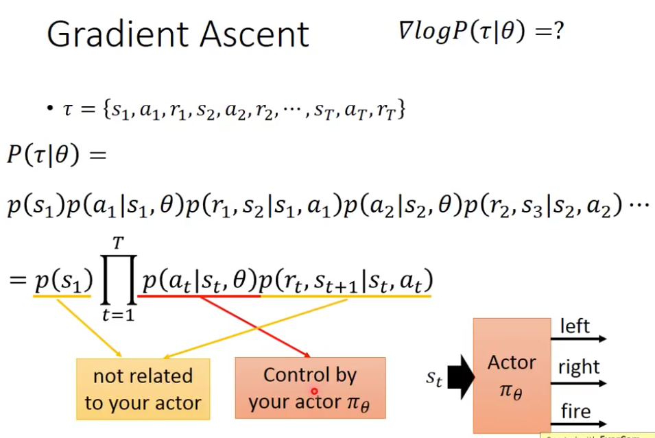

# Chapter 26 - Deep Reinforence Learning（Part 1 - Actor & Critic）

[1.Reinforence Learning Introduction](#1)

​		[1.1 RL的术语与基本思想](#1.1)

​		[1.2 RL的特点](#1.2)

​		[1.3 RL Outline](#1.3)

[2.Policy-based Approach（Learning an Actor）](#2)

​		[2.1 Policy-based Approach三步走](#2.1)

​		[2.2 Step 1：Neural Network  as Actor](#2.2)

​		[2.3 Step 2：Goodness of Actor](#2.3)

​		[2.4 Step 3：Pick the best Actor](#2.4)

[3.Value-based Approach（Learning a Critic）](#3)

​		[3.1 Critic的定义（State Value Function）](#3.1)

​		[3.2 Estimating Critic（State Value Function）](#3.2)

​		[3.3 Critic的定义（State-action Value Function）](#3.3)

[4.Actor-Critic](#4)

​		[4.1 A3C（Asynchronous Advantage Actor-Critic）](#4.1)

[5.Inverse Reinforence Learning](#5)

​		[5.1 Imitation Learning](#5.1)

#### 1.Reinforence Learning Introduction

1. RL的术语与基本思想

   - Deep RL中有Agent、Environment、Observation（State）。Agent可以用来观察环境的变化，Observation是Agent观察到的环境的状态；Agent也可以执行一些Action改变环境，然后获得Reward。Agent的目标是执行Action去最大化Expected Reward。Episode指的是代理和环境从开始到结束的完整交互过程，Agent的目标是在每个Episode中最大化收益。以围棋为例，一个Episode就是一局围棋。

               
     
   - 以Alpha Go为例，Observation就是棋盘的状态，Action就是下棋。执行Action会改变环境的Observation。围棋竞技是一个比较困难的RL Case，因为在多数情况下 $Reward =0$，在胜的时刻 $Reward =1$，在负的时刻 $Reward =-1$。可以描述为有效Reward是一个比较Sparse的情况，如何在有效Reward很少的情况下，还能找到最优解是比较困难的。
   
     
   
     
   
     
   
   - 对于围棋竞技的案例，使用Supervised Learning和Reinforcement Learning是截然不同的。Supervised Learning中，机器8会学习很多的棋谱，遇到不同的情况，就会根据之前学习过的所有棋谱做出下一步决定，Supervised Learning并不一定能够的到最好的下棋机器人，因为有的时候棋谱也不一定是最优的。Reinforcement Learning中，连人都不知道下一步应该落子在哪里，只有通过不断的下棋，最后赢了或输了以后得到positive或negative的Reward。Alpha Go是Supervised Learning和Reinforcement Learning的结合。
   
     
     
   - Reinforcement Learning也可以应用在Chat-bot上，通过对话与不断的反馈改善机器的逻辑，其中反馈可以由人或实现定义的规则（Deep Reinforcement Learning for Dialogue Generation https://arxiv.org/pdf/1606.01541v3.pdf）给出。另一种一种训练方式，是让两个Chat-bot相互对话。（参考GAN中的Improving Seq2Seq Model by RL）
   
     
     
   - RL最广泛的应用是在游戏竞技上（Gym：https://gym.openai.com/ 、Universe：https://openai.com/blog/universe/）
   
   - More Application：Flying Helicopter（https://www.youtube.com/watch?v=0JL04JJjocc）、Driving（https://www.youtube.com/watch?v=0xo1Ldx3L5Q）、Robot（https://www.youtube.com/watch?v=370cT-OAzzM）、Google Cuts Its Giant Electricity Bill With DeepMind-Powered AI（http://www.bloomberg.com/news/articles/2016-07-19/google-cuts-its-giant-electricity-bill-with-deepmind-powered-ai）、Text generation （https://www.youtube.com/watch?v=pbQ4qe8EwLo）
   
       
     
   
2. RL的特点

   - Reward Delay：只有少数Action能够获得Reward，但是这些Action之前所执行的Action作为铺垫并不是毫无意义的。也可以理解为要求机器要有一定的远见，例如在围棋中，短期的牺牲可能获得长期的优势等等。

   - Agent执行的Action会影响之后的过程，所以要教会机器进行Exploration。因为只有大量的探索，才能找到尽可能对的答案。
   
     
   
3. RL Outline

   - RL分为两大部分Policy-based和Value-based，在Policy-based中会学习出一个Actor，在Value-based中会学习出一个Critic。RL中最流行的方法就称为**Aysnchronous Advantage Actor-Critic Algorithm（A3C）**，而Alpha Go是policy-based + value-based + model-based。

     

   - Reference

     

     

#### 2.Policy-based Approach（Learning an Actor）

1. Policy-based Approach三步走

   - Policy-based Approach也是Machine Learning的一种，其目标是学出一个Actor（或Policy），可以等价于寻找一个Function $\pi()$。函数的输入为Observation，函数的输出可以被视为下一步采取的Action。Policy-based Approach就是基于Reward寻找一个最优的Function $\pi$。

     
     
   - 在Chapter 6中学习过，Deep Learning分为三步走：①Define a set of funtion; ②goodness of funtion; ③pick the best function，下面会逐步介绍每个步骤。

     

2. Step 1：Neural Network  as Actor

   - 使用Neural Network定义Function，RL就可以视为Deep Reinforence Learning。NN的输入是Observation，可以由向量或矩阵表示；NN的输出是下一步采取Action，网络的输出层对应着Action集合可能被执行的的概率。一种比较原始的方式是直接使用表格定义一组Observation和Action的关系，但是这种事不可行的，因为游戏竞技中Observation的情况数不胜数，只有使用NN才能胜任。即便NN遇到了没有见过的Observation，也可以给出一定的策略，即NN的泛华能力更强。

     
     
     
     
   
3. Step 2：Goodness of Actor

   - 已知Actor $\pi_{\theta}(s)$，其中$\theta$为网络的参数。使用Actor $\pi_{\theta}(s)$进行Video Game的博弈，一个Episode的Total Reward 为 $R_\theta = \sum\limits_{t=1}^T r_t$。因为Actor的输出是Stochastic的，有很多种可能性（Action的随机性），再加上游戏也有一定的随机性（Observation的随机性），所以即便是同一个Actor，在不同的Episode也会得到不同的Total Reward  $R_\theta$。由此可以认为Total Reward  $R_\theta$是一个Random Variable，所以我们希望最大化的是Total Reward  $R_\theta$的期望值$\tilde{R}_\theta$，即使用期望值$\tilde{R}_\theta$来评价Actor $\pi_{\theta}(s)$的好与坏。

     
   
   - 使用Tarjectory $\tau$表示一个Episode的整个过程，$\tau = \{s_1,a_1，r_1,s_2,a_2，r_2,\cdots,s_T,a_T，r_T\}$，对应的Reward为$R(\tau) = \sum\limits_{n=1}^N r_n$。一个$\tau$对应一个Episode的具体过程，一个episode可能有千千万万种$\tau$。一个具体的 $\tau$ 出现的概率是与Actor的参数 $\theta$有关的，将这个概率表示为 $P(\tau|\theta)$，则$\tilde{R}_\theta = \sum\limits_{\tau}R(\tau)P(\tau|\theta)$。因为不可能穷举出Tarjectory $\tau$的所有实例，所以让Actor $\pi_{\theta}(s)$去玩 $N$ 次游戏，就得到了$\{\tau^1,\tau^2,\cdots,\tau^N\}$，相当于从 $P(\tau|\theta)$中采样$N$个样本。这样就可以使用样本近似期望$\tilde{R}_\theta = \sum\limits_{\tau}R(\tau)P(\tau|\theta) \approx \frac{1}{N}R(\tau^n)$
   
     
   
     
   
4. Step 3：Pick the best Actor

   - Policy Gradient的具体推导过程：

     - 使用Gradient Ascent的方法求解，$\theta^* = arg\ \max\limits_\theta \tilde{R}_\theta,\ \tilde{R}_\theta = \sum\limits_{\tau}R(\tau)P(\tau|\theta)$

       

     - $\nabla \tilde{R}$的计算方式如下。因为$R(\tau)$与$\theta$无关，所以不用进行微分，$R(\tau)$可以视为一个黑盒。遇到图中红色的部分$\sum\limits_\tau P(\tau|\theta)$可以使用采样的方法进行近似。

     

     - $\nabla logP(\tau^n|\theta)$的计算方法如下。

     

     

     - 基于上述推导过程，Gradient Ascent的公式如下。大致含义为：当处于$s_t^n$的步骤时，采取$a_t^n$的概率取对数求梯度再乘以对应episode的Reward。直观的理解为，在$\tau^n$这次游戏中，处于$s_t^n$的步骤时，采取$a_t^n$，如果获得的Reward是正的，那么就要调整参数，扩大处于$s_t^n$的时采取$a_t^n$的概率，即增大$P(a_t^n|s_t^n)$；反之，如果获得的Reward是负的，那么就要调整参数，缩小处于$s_t^n$的时采取$a_t^n$的概率，即减小$P(a_t^n|s_t^n)$。需要注意的是，**对于处于$s_t^n$的时采取$a_t^n$的策略乘以的是episode $\tau^n$的Reward $R(\tau^n)$，而不是Imediate Reward $r_t^n$。**例如开火时会获得奖励，那么如果考虑及时收益，那么最后的模型就会在原地不断的开火，不会移动。

       

     - Policy Gradient是采样$\{\tau^1,\tau^2,\cdots,\tau^N\}$和更新参数交替进行的。

       

   - 如何使用分类器的代码实现Policy Gradient

     - 对于分类问题，假设输入$s$对应的标签是$left$。传统的DNN中目标是Minimize Cross Entropy $-\sum\limits_{i=1}^3 \hat{y}_ilog\ y_i$。因为只有正确标签为1，其余的均为0，所以最小化一个负值，可以等价为最大化一个正值，即Maximize $log\ y_1=logP(left|s)$，使用Gradient Ascent解$\theta \rightarrow \theta+\eta\nabla log\ P(left|s)$。

       
   
     - 假设在$\tau^1$中遇到$s_1^1$，采取的Action为$a_1^1$，那就意味着要求网络的输出尽可能接近$\{left:1,Right:0,Fire:0\}$。由此可知$\nabla \tilde{R}$中的$\nabla log\ P(a_t^n|s_t^n,\theta)$等价于，已知$\{\tau^1,\tau^2,\cdots,\tau^N\}$时，要求模型完成一些列分类任务。
   
       
   
     - $\nabla \tilde{R}$中的$R(\tau^n)$的含义为对每组训练数据$\tau^i$乘以不同的权重，假如$R(\tau^1)=2,R(\tau^2)=1$，就相当于$s_1^1\rightarrow a_1^1$的训练过程出现了两次，$s_1^2\rightarrow a_1^2$的训练过程出现了一次。
   
       
   
     - 基于上述过程，就可以用分类器代码实现Policy  Gradient，只不过比较麻烦，每得到一组$\tau$都要重新训练一次。
   
       
   
   - Policy Gradient中对数的含义：
   
     - 在Gradient Ascent的公式中，不直接求$P(a_t^n|s_t^n,\theta)$，而是取对数是合理的。假设机器在玩游戏时，第13、15、17、33次episode中的某个时间点看到了同一个Observation，分别采取了${a,b,b,b}$的Action（因为Actor的输出是Stochastic的），对应的Total Reward为${2,1,1,1}$。在实际训练中如果直接求$P(a_t^n|s_t^n,\theta)$，机器会偏好出现次数比较多的Action（b），无论这个Action真正的好与坏（因为$\nabla \tilde{R}$计算时是对所有的采样结果进行求和，虽然奖励很低，但出现的次数多，只要Actor增大其出现的概率同样可以达到最大化Reward的目的），从而忽略了真正应该选择的Action a。但是如果取对数后，即便其出现的次数（概率）比较大， 其梯度再除以其出现的概率也不会特别大。相当于通过Normalization避免了之前说的情况。
   
     ​	
   
   - Reward恒正对计算结果的影响：如果$R(\tau^n)$始终为正值，则会出现一些问题。在理想情况下，$R(\tau^n)$始终为正值并不会引发其他问题，假设$a,b,c$的Reward都是正值，大小参考绿色箭头。机器会会降低$b$的概率，增加$a,c$的概率。因为最终的输出会经过Softmax Layer，所以即便$b$的概率增加，但只要小于$a,c$的增加量，其最终都会减小的。但在实际中是通过采样得到的，如果采样结果中没有$a$，那么只会增加$b,c$的几率，然后$a$被采样到的概率更小了，形成了一个负反馈。解决办法就是将Reward定义成可正可负的值，在原有的基础上减去一个bias。
   
     
   
     
   
     

#### 3.Value-based Approach（Learning a Critic）
1. Critic的定义（State Value Function）

   - Critic的定义是：不会计算下一步执行的操作，而是在给定一个Actor的基础上，评判其好坏（Critic is depending on Actor），比如Q_Learning。

   - State Value Function Critic表示为 $V^\pi(s)$，会在输入一个Observation $s$时输出一个标量，用于表示Actor $\pi$从这个Observation开始直到整个Episode结束获得的Cumulated Reward 。如下图所示，左边的图还剩比较多的敌人，在结束时可能获得的分数比较高，所以 $V^\pi(s)$比较大；右边的图还剩比较少的敌人，在结束时可能获得的分数也会比较低，所以 $V^\pi(s)$比较小。
   
     
     
     
   
2. Estimating Critic（State Value Function）

   - Monte-Carlo based approach：Critic会看着Actor玩游戏。假设Actor从看到Observation $s_a$到整个episode结束，获得的Reward是$G_a$，那么Critic就需要学习输入$s_a$，输出$G_a$，即$V^\pi(s_a)=G_a$。同理Actor从看到Observation $s_b$到整个episode结束，获得的Reward是$G_b$，那么Critic就需要学习输入$s_b$，输出$G_b$，即$V^\pi(s_b)=G_b$。

     

   - Temporal-difference approach：在蒙特卡洛的方法中，需要一个Observation直到游戏结束的数据，在Temporal-difference approach中，只需要$\cdots,s_t,a_t,r_t,s_{t+1},\cdots$的数据，Critic就可以进行学习了，$V^\pi(s_t)=V^\pi (s_{t+1})+r_t$。意味着即便不知道$V^\pi(s_t),V^\pi (s_{t+1})$的值，但是直到二者之间差了$r_t$，这样对于一些游戏过程比较漫长的，在游戏没有结束的时候，Critic就可以开始学习了。

     

   - MC与TD的比较：[Sutton, v2, Example 6.4]

     

3. Critic的定义（State-action Value Function）

   - State-action Value Function Critic表示为 $Q^\pi(s,a)$，用于表示Actor $\pi$对于Observation $s$采取了Action $a$后，直到整个Episode结束获得的Cumulated Reward 。如左图所示，Input为$s,a$，Output为$Q^\pi(s,a)$。对于离散的情况也可以改写为Input为$s$，Output为$Q^\pi(s,a=特定值)$。

     

   - 可以使用Critic $Q^\pi(s,a)$找到一个比较好的Actor（**Q-Learning**）。已知一个初始的Actor $\pi$，然后让其和环境进行交互，使用TD或MC的方法学习一个Critic $Q^\pi(s,a)$。根据Critic $Q^\pi(s,a)$找到一个更好的$\pi'$代替$\pi$。

     

   - $\pi'$比$\pi$更好的定义是：使用$V^\pi(s)$对$Q^\pi(s,a)$进行估计。对于所有states $s$都有$V^{\pi'}(s) \geq V^\pi(s)$。$\pi'=arg\ \max\limits_a Q^\pi(s,a)$，即对于一个States $s^i$，穷举所有的Action，找到一个使得$Q^\pi(s^i,a^i)$最大的Action，然后让$\pi'$学习遇到$s^i$时，执行使得Q最大的Action $a^i$。可以理解为使用Q对一系列Action进行评价，然后让新的$\pi'$学会得分最高的Action。$\pi'$没有额外的参数，完全取决于Q。$\pi'=arg\ \max\limits_a Q^\pi(s,a)$的一种解法比较类似于GAN，可以参考Pathwise Derivative Policy Gradient。

     

   - DQN的更多细节可以参考论文：[rainbow]

   

#### 4.Actor-Critic

1. A3C（Asynchronous Advantage Actor-Critic）

   - 之前的Actor都是根据Reward Function的输出进行更新的，等价于根据互动的过程进行学习，但是因为互动的过程存在很大的随机性，所以学习的效果不一定很好。那么新的方法就是不再让Actor根据环境的Reward进行更新，而是根据Critic的输出进行学习。这种思路有很多种实现方法，比较有名的就是Advantage Actor-Critic。
   
   - A3C指的是Asynchronous Advantage Actor-Critic。Asynchronous指存在一个Global的Actor和Critic，每一次要学习的时候，就从Global的Actor和Critic拷贝一组参数，这样就可以构建多个Actor。然后让Actor和环境进行互动，计算需要更新的参数$\Delta \theta$并传回Global的Actor和Critic。整个过程可以理解为创造多个分身进行学习，然后汇总学习结果。
   
     
   
     

#### 5.Inverse Reinforence Learning

1. Imitation Learning

   - Inverse Reinforence Learning其实就是Imitation Learning，指的是在整个互动过程中没有Reward。已知的数据只有Domain Expert提供的相对正确的执行顺序$\{\tau^1,\tau^2,\cdots,\tau^N\}$

     

   - 在围棋中，因为有一定的规则，输就是输，赢就是赢；在游戏中也是如此。在现实生活中，大多数Case都是没有Reward，即便强行定义了一些规则给出Reward也不能得到很好的效果。Inverse Reinforence Learning的过程恰好与RL相反，根据Expert和环境找出Reward Function，然后根据Reward Function找出最好的Actor。

     

   - 在Inverse Reinforence Learning的核心思想是“The teacher is always the  best”，具体过程如下。

     

     

     

   - Inverse Reinforence Learning和GAN的思想有共同之处，如下图所示：Generator相当于Actor，Discriminator相当于Reward Function。

     

     