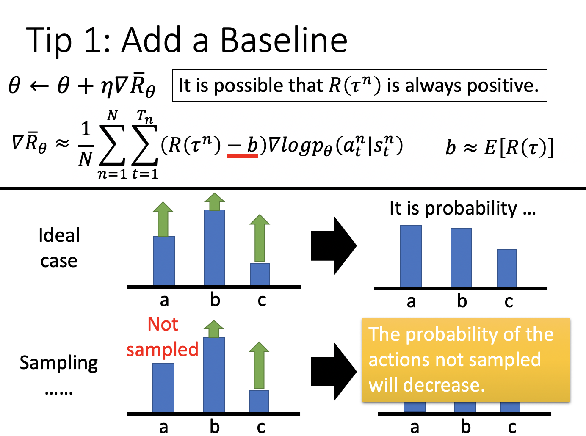

# Chapter 26 - Deep Reinforence Learning（Part 2 - Proximal Policy Optimization（PPO））

[1.Policy Gradient Review](#1)

​		[1.1 RL的目标函数（最大化收益期望）与求解过程（Advantage Function）](#1.1)

[2.From on-policy to off-policy](#2)

​		[2.1 On-Policy和Off-Policy的对比](#2.1)

​		[2.2 Importance Sampling与Off-Policy](#2.2)

​		[2.3 使用Importance Sampling实现从On-Policy到Off-Policy的转换](#2.3)

[3.Add Constrain（PPO / TRPO）](#3)

​		[3.1 PPO与TRPO的定义](#3.1)

​		[3.2 PPO Algorithm和PPO2 Algorithm](#3.2)

#### Abstract：Proximal Policy Optimization是Policy Gradient的进阶版，OpenAI将PPO视为RL的默认算法，足以见其重要性。本章节分为三个部分，第一部分简单的回顾Policy Gradient，然后介绍如何从On-policy过渡到Off-policy，最后介绍PPO。（Deep Mind https://youtu.be/gn4nRCC9TwQ、OpenAI https://blog.openai.com/openai-baselines-ppo/）

#### 1.Policy Gradient Review

1. RL的目标函数（最大化收益期望）与求解过程（Advantage Function）

   - RL中有三个部分，分别是Actor、Environment、Reward Function，后两者是不可控制的。

     
     
   - Policy其实是Actor的另一种名称，Policy $\pi$是神经网络的一组参数$\theta$。Actor、Environment、Reward Function的关系如下：

     
     
   - Actor的是根据Random Variable $R(\tau)$的期望值$\tilde R_\theta$进行更新。

     
     
   - $\tilde R_\theta$的微分求解如下：

     
     
   - $\nabla \tilde R_\theta$的求解技巧一（Add a baseline）：参考Part 1中对Reward恒正对计算结果的影响。

     
     
   - $\nabla \tilde R_\theta$的求解技巧二（Assign Suitable Credit）：对于$\nabla \tilde{R}_\theta  \approx \frac{1}{N} \sum\limits_{n=1}^N \sum\limits_{t=1}^{T_n}(R(\tau^n)-b) \nabla log\ P_\theta(a_t^n|s_t^n)$，意味着对于一个episode $\tau^n$，所有的State-Action Pairs都会乘以同样的Reward权重，即$R(\tau^n)-b$。这明显是不合理的，因为再一局游戏中，会有一些State-Action Pairs比较重要，一些State-Action Pairs不是那么重要，乘以同样的权重会有失偏颇。如下图所示，有两个Episode的Reward分别+3和-7，对于第一个Episode，中间的$s_b,a_2$其实不是好的执行策略，因为它会导致$s_c,a_3$，降低分数。在理想情况下，是没有问题的，因为采样的样本足够多，每个episode的Reward有正有负，有的$s_b,a_2$对应的episode reward为正，有的$s_b,a_2$对应的episode reward为负，综合起来可以进行抵消。但实际上，因为采样数量不足，是存在一定的问题，所以要给每一个State-Action Pair一个独立的权重。对于每一个State-Action Pair，其之前的所有操作的到的Cumulated Reward是和当前State-Action Pair没有关系的，State-Action Pair产生的影响会是之后的所有reward之和，所以给每个State-Action Pair乘以其之后的所有reward之和，即$\sum\limits_{t'=t}^{T_n} r_{t'}^n$。

     
     
     - 基于优化后的权重，再对未来的reward打个折扣，即$\sum\limits_{t'=t}^{T_n} \gamma^{t'-t} r_{t'}^n$，其中$\gamma < 1$，$t'$距离$t$的时间越长，$\gamma^{t'-t}$越小。因为未来的reward中，离当前的Action越远，和当前Action具有因果关系的可能性就越低。除此之外，$b$可以是一个常数，用$E[R(\tau)]$表示，也可以利用NN修改成State-dependent（比较复杂，此处不展开）。将$\sum\limits_{t'=t}^{T_n} \gamma^{t'-t} r_{t'}^n -b$用$A^\theta(s_t,a_t)$表示，称为Advantage Function，意味着在State $s_t$的情况下，执行Action $a_t$会比执行其他Action有多好，是一种相对的好（因为减去了$b$）。
     
       
     
       

   

#### 2.From on-policy to off-policy
1. On-Policy和Off-Policy的对比

   - 我们所需要训练的Agent和与环境交互的Agent是同一个时，称为On-Policy；需要训练的Agent和与环境交互的Agent不是同一个时，称为Off-Policy。通俗的例子为一边下棋一边学棋为On-Policy，一般看棋一边学棋为Off-Policy。

   - 之前所学习的Policy Gradient学习Actor的方法就是On-Policy的。在$\nabla \tilde{R}_\theta  =E_{\tau\sim p_\theta(\tau)}[R(\tau) \nabla log\ P_\theta(\tau)]$中，使用$\pi_\theta$采样数据对$\theta$进行更新，然后我们必须使用新的$\theta$重新采样数据。所以在Policy Gradient中，需要大量的时间去采样数据。于是产生了一种新的策略，使用一个新的参数$\theta'$采样数据，对参数$\theta$进行更新。$\theta'$是固定的，这样采样出的数据就可以重复使用。

     

     

2. Importance Sampling与Off-Policy

   - 假设需要计算$E_{x\sim p}[f(x)]$，但是Distribution $(x)$没有办法进行积分，那么就会使用采样的方法近似积分。如果我们还不能从Distribution $p(x)$中采样数据，只能从另外一个分布$q(x)$中采样数据 $x^i$，那么对$E_{x\sim p}[f(x)]$进行整理，得到$E_{x\sim p}[f(x)]=E_{x\sim q}[f(x)\frac{p(x)}{q(x)}]$，这样就可以使用从$q(x)$中采样的数据进行计算。其中$\frac{p(x)}{q(x)}$称为Importance Weight，用来修正从分布$q(x)$到$p(x)$的差异。

     
     
   - 理论上分布$q(x)$可以是任何一个分布，但实际上如果$q(x)$和$p(x)$会出现一些问题。虽然$E_{x\sim p}[f(x)]=E_{x\sim q}[f(x)\frac{p(x)}{q(x)}]$，但是$Var_{x\sim p}[f(x)]\neq Var_{x\sim q}[f(x)\frac{p(x)}{q(x)}]$，并且$\frac{p(x)}{q(x)}$比较大的话，$Var_{x\sim q}[f(x)\frac{p(x)}{q(x)}]$会更大。理论上如果采样的次数足够多，两者的期望应该是相等的。但是在采样情况比较少的情况下，再加上方差比价大，算出的期望也会差的比较多。
   
     
     
   - 假设$f(x),p(x),q(x)$如下图所示，从蓝色线条$p(x)$的左半部分采样数据，计算出的$E_{x\sim p}[f(x)]$是负值；从绿色线条$q(x)$的右半部分采样数据，计算出的$E_{x\sim q}[f(x)\frac{p(x)}{q(x)}]$是正值，显然两项是不相等的，因为采样的数据点过少。如果采样的数据足够多，在绿色线条$q(x)$的左半部分也采样到了数据，因为$p(x)$很大，$q(x)$很小，$\frac{p(x)}{q(x)}$会很大，再乘以一个负的$f(x)$，就会平衡掉从绿色线条$q(x)$的右半部分采样的数据。
   
     
     
     
   
3. 使用Importance Sampling实现从On-Policy到Off-Policy的转换

   - $\theta'$代表的是与环境交互的Actor，用于训练$\theta$代表的Actor。$\nabla \tilde{R}_\theta  =E_{\tau\sim p_\theta(\tau)}[R(\tau) \nabla log\ P_\theta(\tau)]$可以改写为$\nabla \tilde{R}_\theta  =E_{\tau\sim p_{\theta'}(\tau)}[\frac{p_{\theta}(\tau)}{p_{\theta'}(\tau)}R(\tau) \nabla log\ P_\theta(\tau)]$，这样数据是从$\theta'$中采样的，可以多次使用。

     
     
   - 在第一小节中介绍了Policy Gradient最终的计算方法使用的Advantage Function，即梯度等于$E_{(s_t,a_t)\sim \pi_\theta}[A^\theta(s_t,a_t)\nabla log\ P_\theta(a_t^n|s_t^n)]$，将其转换为Off-Policy后为$E_{(s_t,a_t)\sim \pi_\theta‘}[\frac{P_\theta(s_t,a_t)}{P_{\theta'}(s_t,a_t)}A^{\theta'}(s_t,a_t)\nabla log\ P_\theta(a_t^n|s_t^n)]$。将联合概率展开为条件概率后，假设$p_\theta(s_t)$和$p_{\theta'}(s_t)$是比较相似的，所以约去$\frac{p_\theta(s_t)}{p_{\theta'}(s_t)}$。这么假设的原因一方面是因为在某个时刻看到特定的State的几率和执行什么样的操作关系不大，另一方面原因是这两项没办法计算。

     
     
   - 此时梯度等于$E_{(s_t,a_t)\sim \pi_\theta‘}[\frac{P_\theta(a_t|s_t)}{P_{\theta'}(a_t|s_t)}A^{\theta'}(s_t,a_t)\nabla log\ P_\theta(a_t^n|s_t^n)]$，根据$\nabla f(x)=f(x)\nabla logf(x)$的公式可以反推出最大化的目标函数如下：

     
     
     

#### 3.Add Constrain（PPO / TRPO）
1. PPO与TRPO的定义

   - **Proximal Policy Optimization（PPO）**：在第二小节，我们计算出了梯度值，并反推出了目标函数。但是这写过程都基于Importance Sampling，要求$q(x)$和$p(x)$不能差太多，差太多采样的结果就会有偏差。所以需要增加一个约束，即$\theta$和$\theta'$的KL Divergence，用于衡量二者的相似性。最终的目标韩式要求$J^{\theta'}(\theta)$尽可能大的同时，$\theta$和$\theta'$的差异还不能过大。

     
     
   - **Trust Region Policy Optimization（TRPO）**：TRPO是PPO的前身，TRPO是将KL Divergence当做一个额外的Constrain，没有加入到目标函数中，比较难求解。在WGAN中，因为加入了$1-Lipschitz\ Function$约束，也出现了求解困难的问题，与此处同理。
   
     
     
   - PPO和TRPO中$\theta$和$\theta'$的KL Divergence $KL(\theta,\theta')$并不是将$\theta$和$\theta'$当做两个分布，求解两个分布的距离，或是两组参数上的距离。$KL(\theta,\theta')$代表的是两个Actor行为上的差异（Behavior Distance），即对于同一个State，两个Actor会输出两个代表着下一步执行Action的分布，$KL(\theta,\theta')$就是这两个输出分布之间的距离。如此设计的原因是在RL中参数上的变化和Actor行为上的变化可能是不同的。
   
     
   
2. PPO Algorithm和PPO2 Algorithm

   - PPO算法流程如下，每次迭代使用$\theta^k$采样一次数据，然后对$\theta$多次更新，尽可能的找到使$J^{\theta^k}(\theta)$最大的$\theta$。除此之外，还可以通过改变$\beta$实现自适应的Adaptive KL Penalty。如果$KL(\theta,\theta')$大于事先定的最大阈值，表明KL Divergence一项没有发挥作用，那么增大$\beta$扩大该项的影响；反之如果$KL(\theta,\theta')$小于事先定的最小阈值，表明KL Divergence一项产生的约束过强，那么减小$\beta$弱化该项的影响。

     
     
   - PPO中计算KL Divergence比较麻烦，所以产生的PPO2。

     

     - $clip(a,b,c)$的值在$[b,c]$之间，那么$min()$中的第二项如下图的蓝线：

       

     - $min()$中的第二项如下图的绿线：

       

     - 综合起来，PPO2的图像为下图中的红线：

       

     - PPO2实现$P_\theta(a_t|s_t)$和$P_{\theta^k}(a_t|s_t)$不要差距过大的具体解释为：图中的横轴是$\frac{P_\theta(a_t|s_t)}{P_{\theta^k}(a_t|s_t)}$，当一个State-Action Pair是好的时，我们希望增大其出现的概率，即增大$P_\theta(a_t|s_t)$。虽然$P_\theta(a_t|s_t)$越大越好，但是要求$\frac{P_\theta(a_t|s_t)}{P_{\theta^k}(a_t|s_t)}$不能超过$1+\varepsilon$，比值超过$1+\varepsilon$时也会被强制设置为$1+\varepsilon$，进而也不会得到更多的收益。可以理解为训练$\theta$时，最多也不能超过$\theta^k$的$1+\varepsilon$倍。同理，当一个State-Action Pair是不好的时候，我们希望减小其出现的概率，即减小$P_\theta(a_t|s_t)$。虽然$P_\theta(a_t|s_t)$越小越好，但是要求$\frac{P_\theta(a_t|s_t)}{P_{\theta^k}(a_t|s_t)}$不能低于$1-\varepsilon$，比值低于$1-\varepsilon$时也会被强制设置为$1-\varepsilon$，进而也不会得到更多的收益。可以理解为训练$\theta$时，最多也不能小于$\theta^k$的$1-\varepsilon$倍。总而言之，PPO2通过设置上下界，防止出现$P_\theta(a_t|s_t)$和$P_{\theta^k}(a_t|s_t)$差距过大的情况。

       

