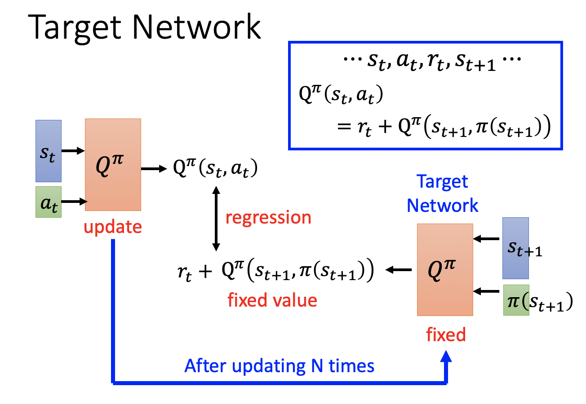
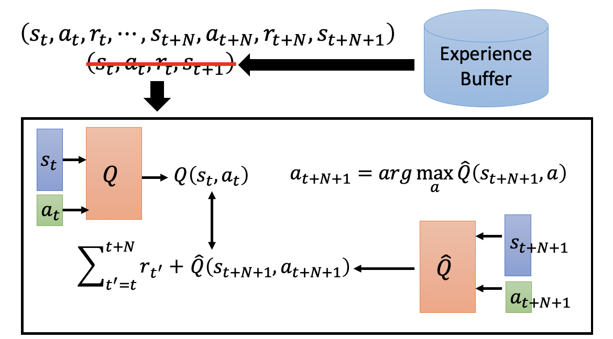
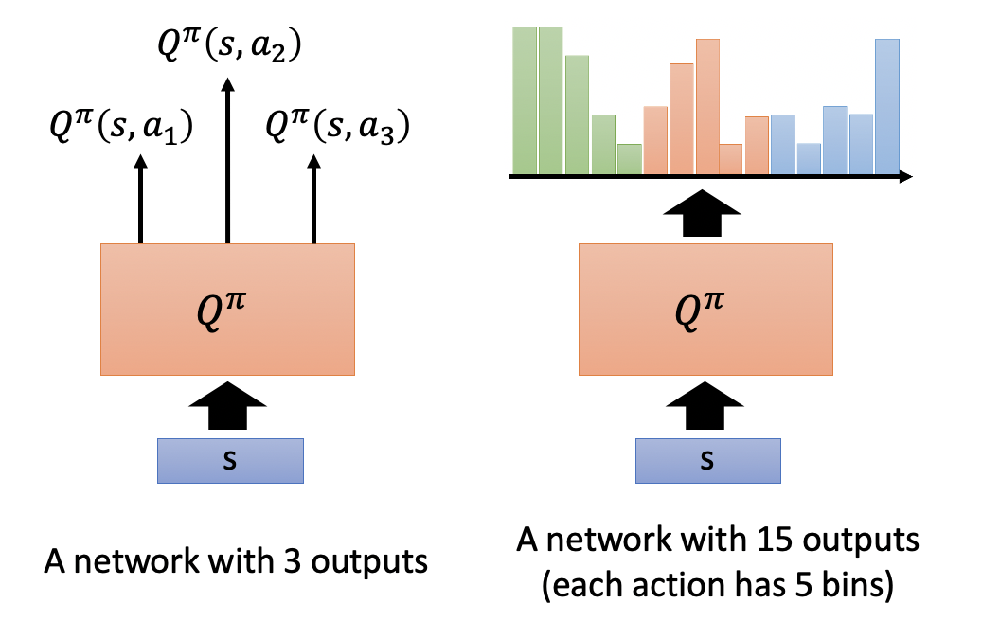

# Chapter 26 - Deep Reinforence Learning（Part 3 - Q Learning）

[1.Value-based Approach Review](#1)

​		[1.1 Value-based Approach的分类与估计方法](#1.1)

[2.Introduction of Q-Learning](#2)

​		[2.1 Q-Learning的大致过程](#2.1)

[3.Tips of Q-Learning（Q-Learning的变种）](#3)

​		[3.1 Double DQN](#3.1)

​		[3.2 Dueling DQN](#3.2)

​		[3.3 Prioritized Reply](#3.3)

​		[3.4 Multi-step](#3.4)

​		[3.5 Noisy Net](#3.5)

​		[3.6 Distributional Q-function](#3.6)

​		[3.7 Rainbow](#3.7)

[4.Q-Learning for Continuous Actions](#4)

​		[4.1 Q-Learning处理连续型Action的难点和解决办法](#4.1)

#### 1.Value-based Approach Review

1. Value-based Approach的分类与估计方法

   - Q-Learning是Value-based Approach，核心思想是训练一个Critic。具体参考Part 1的第三小节Value-based Approach（Learning a Critic）。Critic有两种定义，一种是State value function $V^\pi(s)$，另一种是State-action value function $Q^\pi(s,a)$。State value function $V^\pi(s)$的估算方式有两种，一种是Monte-Carlo（MC）based approach、另一种是Temporal-difference（TD）approach 。

   - MC和TD的差别为：MC会有比较大的Variance，对于同一个State $s_a$，其Cumulated Reward $G_a$差别也会比较大。$G_a$是很多步骤reward的加和，因为博弈过程每一步都有一定的随机性，所以$G_a$的随机性会更大。TD中的$r$是一步的reward，所以Variance会小一些，但是$V^\pi(s)$是比较难估计的。相对来说，TD是比较常用的。
   
     
     
     
     
       
     
   
   
   

#### 2.Introduction of Q-Learning

1. Q-Learning的大致过程

   - Critic $Q^\pi(s,a)$可以衡量一个Actor的好坏，我们可以使用其辅助学习出一个Actor。首先有一个初始的Actor $\pi$，然后使用$Q^\pi(s,a)$去评估，再找到一个好于评估标准的$\pi'$代替$\pi$，迭代进行即可。

     
     
   - $\pi'$比$\pi$更好的定义是：对于所有states $s$都有$V^{\pi'}(s) \geq V^\pi(s)$。$\pi'=arg\ \max\limits_a Q^\pi(s,a)$，即对于一个States $s^i$，穷举所有的Action，找到一个使得$Q^\pi(s^i,a^i)$最大的Action，然后让$\pi'$学习遇到$s^i$时，执行使得Q最大的Action $a^i$。可以理解为使用Q对一系列Action进行评价，然后让新的$\pi'$学会得分最高的Action。$\pi'$没有额外的参数，完全取决于Q。$\pi'=arg\ \max\limits_a Q^\pi(s,a)$的一种解法比较类似于GAN，可以参考Pathwise Derivative Policy Gradient。
   
   - $V^{\pi'}(s) \geq V^\pi(s)$的证明过程如下：
   
     
     
   - Q-Learning的训练技巧一（Target Network）：Q-Learning和Temporal-difference（TD）approach由相似之处。$Q^\pi$是一个神经网络，输入是$s_t,a_t$，输出是$Q^\pi(s_t,a_t)$，那么就有$Q^\pi(s_t,a_t)=r_t+Q^\pi(s_{t+1},\pi(s_{t+1}))$。如下图所示，在输入$s_t,a_t$时，希望输出是$r_t+Q^\pi(s_{t+1},\pi(s_{t+1}))$；在输入$s_{t+1},\pi(s_{t+1})$时，希望输出是$$Q^\pi(s_t,a_t)$$。相当于两组数据的输出互为对方的目标，那么使用一组数据训练时，对于另外一组数据期望的输出就会变化，这样的模型时不太好训练的。在实际过程中，会将右边的$Q_\pi$（Target Network）固定住，那么$r_t+Q^\pi(s_{t+1},\pi(s_{t+1}))$也是固定的，更新左边的$Q_\pi$，相当于进行一个Regression Task。对左边的$Q_\pi$更新几次后，使用左边的$Q_\pi$更新右边的$Q_\pi$。然后不断的重复这个过程。
   
     
     
   - Q-Learning的训练技巧二（Exploration）：在Policy  Gradient中模型输出的是一个分布，Action的选择是Stochastic的。在Q-Learning中Policy是完全依靠于Q-Function的，这不是一种好的数据收集方式。假设State $s$可以采取的Action有$a_1,a_2,a_3$，三者的初始$Q$值均为0。如果某一次采样到了$a_2$，其$Q$值就会被更新。因为Q-Learning中选择Action的方式是选择$Q$值最大的Action，那么之后会已知选择$a_2$，$a_1,a_3$再也不会被选择。形象的可以理解为去一家餐厅吃饭，感觉回锅肉不错，那么以后每次去都会点回锅肉，不会尝试其他菜品。
   
     
     
     - 基于上述问题，我们要鼓励模型进行适当的探索。一种方式是Epsilon Greedy，以$1-\varepsilon$的几率按照Q-Function选择，以$\varepsilon$的几率随机选择。其中$\varepsilon$的值会随着时间递减。第二种方式是Boltzmann Exploration，将$Q\ Value$转换成一个概率分布$P(a|s)$，然后按照这个概率分布选择。
     
       
     
   - Q-Learning的训练技巧三（Replay Buffer）：已知一个Policy $\pi$和环境进行互动收集数据，将所有的数据以 $s_t,a_t,r_t,s_{t+1}$ 的形式存储在Buffer中。Buffer的容量很大，所以其中的数据可能来自多个Policy，只有在Buffer被填满后才会删除旧的经验数据。在每一个迭代过程中，会在Buffer中采样出一个Batch，根据当前Batch的数据更新$Q-Function $。这相当于将Q-Learning转换为Off-Policy的形式，更新过程不再依赖当前Policy $\pi$ 产生的数据。这样可以减少Policy $\pi$与环境互动收集数据的时间，还可以增加更新$Q-Function $所使用的数据的多样性，提高Performance。但是我们的$Q^\pi(s,a)$本来是要观察$\pi$的好与坏，但是数据中混杂了其他Policy的数据，这会产生问题么？答案是不会的，直观的讲，每个Policy $\pi$之间的差距并不会很大，所以不会有太大的影响。
   
     
     
   - Typical Q-Learning Algorithm如下所示：
   
     
     
     
     
   

#### 3.Tips of Q-Learning（Q-Learning的变种）
1. Double DQN

   - [Hado V. Hasselt, “Double Q-learning”, NIPS 2010 Hado van Hasselt, Arthur Guez, David Silver, “Deep Reinforcement Learning with Double Q-learning”, AAAI 2016]

   - 在实验结果中发现，$Q\ Value$往往是被高估的。下图中有四个小游戏，横轴是训练时间，纵轴是$Q\ Value$，橙色的方法是传统的$Q-Function$，蓝色的显示DQN的结果。
   
     
     
   - $Q\ Value$被高估的原因是，假设有四个Action，其本质上的$Q\ Value$是差不多的，但是因为NN估计的一些随机性，某一个Action的$Q\ Value$会比实际高，那么$Q-Function$就会选择这个Action加上$r_t$作为Target，所以Target总会比实际上要大一些。
   
     
     
   - Double  DQN解决$Q\ Value$偏高的原因是，使用两个Function $Q$和$Q'$计算Target。使用$Q-Function$判断所有的Action中，哪个Action使得State $s_{t+1}$时刻的$Q\ Value$最大，然后State $s_{t+1}$时刻的$Q\ Value$是使用$Q’-Function$计算出来的。即便$Q-Function$高估的选出的Action，但是只要第二个$Q’-Function$没有高估就可以了。即便$Q’-Function$高估的选出的Action，那么在$arg$的阶段，$Q-Function$也不会选择这个Action。一种通俗的理解是行政和立法是分离的，$Q-Function$用于提议，$Q’-Function$用于执行。
   
     
     
   - 在实现过程中，Double DQN使用需要更新的Network作为$Q’-Function$，使用Target Network作为$Q-Function$。
   
     
   
2. Dueling DQN

   - [Ziyu Wang, Tom Schaul, Matteo Hessel, Hado van Hasselt, Marc Lanctot, Nando de Freitas, “Dueling Network Architectures for Deep Reinforcement Learning”, arXiv preprint, 2015]

   - Dueling DQN没有修改传统DQN的算法部分，只是修改了其网络结构。上半部分是传统DQN的网络结构，输入是State $s$，输出是$Q(s,a)$。下半部分是Dueling DQN，不直接输出$Q(s,a)$，而是计算出一个scalar $V(s)$，再计算出一个Vector $A(s,a)$，进行加和得到$Q(s,a)=A(s,a)+V(s)$。

     

   - Dueling DQN修改网络的原因为：存在4个State和3个Action，其$Q\ Value$如下所示。假设某一步希望第二列的前两行从3和-1变为4和0，传统的DQN是直接修改输出的$Q\ Value$，Dueling DQN是修改$V(s)$，将0变成1，这样第二列第三行的值也会从-2变成-1。这就意味着即便某次采样只收集了前两行的数据，通过Dueling DQN的方式也可以修改没有被采样到的第三行数据。为了保证训练的时候确实能够修改$V(s)$而不是修改$A(s,a)$的每一行，需要对$A(s,a)$进行一些约束，让NN倾向于通过$V(s)$的改变解决问题。Paper中提出了很多约束，最重要的一条是要求$A(s,a)$中每一列的和为0，那么$V(s)$就可以认为是$Q(s,a)$的列均值。这样在对$Q(s,a)$进行整列更新时，就会倾向于更改$V(s)$，而不是修改$A(s,a)$，因为修改后保持列和为0是比较困难的。

     

   - Dueling DQN的实现方式是得到$A(s,a)$后，先进行Normmalization，然后再和$V(s)$加和得到$Q(s,a)$。

     

     

3. Prioritized Reply

   - 在DQN中，我们是Uniform的从Experience Buffer中采样数据。但是因为有的数据是重要的，有的数据时不重要的，需要区别对待。于是定义$TD\ Error$表示网络的实际输出和期望输出之间的差距，对于$TD\ Error$比较大的数据会以比较高的概率被采样到。直观的理解是，一组数据如果训练的效果不是很好，那么就用它多训练几遍。[https://arxiv.org/abs/1511.05952?context=cs]

     
   
     
   
4. Multi-step

   - Multi-step的核心思想是在MC和TD之间寻找一个平衡。在TD中，一组数据的形式为$s_t,a_t,r_t,s_{t+1}$，Multi-step会将其扩展为N组这样的数据，即$\{s_t,a_t,r_t,s_{t+1},\cdots,s_{t+N},a_{t+N},r_{t+N},s_{t+N+1}\}$。模型的预期输出也变成从$t$到$t+N$的所有收益之和再加上$\hat{Q}(s_{t+N+1},a_{t+N+1}))$

     

     

5. Noisy Net

   - Epsilon Greedy是在Action的过程中加入噪声，获得一些随机的可能。Noisy Net是在参数层面加入噪声。在每个episode开始时，给$Q\ Function$加一个噪声，然后与环境互动。即不同episode是不同的Noise，同一个Episode内Noise是相同的。[https://arxiv.org/abs/1706.10295]、[https://arxiv.org/abs/1706.01905]

     

   - Noise on Action的方法，即便面对同样的State，也可能会执行不同的Action，这与现实世界的Policy是不符的。真实世界的Policy对于同样的State，一般情况Action也会相同。Noise on Parameters对于相似的State会采取同样的Action。Noise on Action相对于随机乱试，Noise on Parameters是有系统的尝试。

     

     

6. Distributional Q-function

   - State-action value function $Q^\pi (s,a)$的含义是Cumulated Reward Expect，一个Episode内的所有Immediate Reward可以组成一个分布，这个分布的期望值才是$Q^\pi (s,a)$。对于下图的两种不同分布，但是$Q^\pi (s,a)$却相同。因此使用State-action value function $Q^\pi (s,a)$代表一个episode的收益，会损失一些信息。

     

   - 在$Q^\pi (s,a)$中，输入一个State $s$，会输出对应的Action的$Q\ Value$。Distributional Q-function的思想是直接输出3个$Q\ Value$的统一分布，可以理解为将每种Action拆成更小的单元，最小单元组合在一起可以表示一个Action。一个Action的所有最小单元的输出值的和为1。所有的绿色表示$a_1$，红色表示$a_2$，以此类推。

     

   - 实验结果如下：https://youtu.be/yFBwyPuO2Vg

     

     

7. Rainbow

   - Rainbow是将上述所有方法都汇总起来。[https://arxiv.org/abs/1710.02298]

     

     

     

#### 4.Q-Learning for Continuous Actions

1. Q-Learning处理连续型Action的难点和解决办法

   - Q-Learning和Policy Gradient相比训练是比较容易且稳定的，Policy Gradient玩游戏基本是不可能的。
   
   - Q-Learning比较难处理Continuous Action的问题，例如自动驾驶场景，方向盘的转动角度问题，就是一个Continuous Action。对于连续型的Action，$a=arg\ \max\limits_a ⁡Q(s,a)$是没有办法通过穷举进行求解。
   
     - 解决办法一是通过采样出N个样本算出结果，这种办法虽然可行，但是准确度比较低。
     
     - 解决办法二是使用Gradient Ascent的方法，将$a$作为参数，进行求解。这种方法会受到运算量大和局部最优的影响。
     
     - 解决办法三对$Q-Function$的网络结构进行重新设计，能够轻松求解$a=arg\ \max\limits_a ⁡Q(s,a)$。网络在以Satate $s$为输入时会输出 Vector $\mu(s)$、Matrix $\Sigma(s)$、Scalar $V(s)$，然后在输入Continuous Action $a$，计算$Q(s,a)=-(a-\mu(s))^T \Sigma(s)(a-\mu(s))+V(s)$。对于这种结构，因为$(a-\mu(s))^T \Sigma(s)(a-\mu(s))$是一个正定矩阵，恒正，那么$-(a-\mu(s))^T \Sigma(s)(a-\mu(s))$一定是负值，其越大$Q(s,a)$越大。当$a=\mu(s)$时，$-(a-\mu(s))^T \Sigma(s)(a-\mu(s))=0$达到最大值，则$Q(s,a)$也最大，所以$\mu(s)=arg\ \max\limits_a ⁡Q(s,a)$
     
       
     
     
   
