# Chapter 26 - Deep Reinforence Learning（Part 4 - Asynchronous Advantage Actor-Critic（A3C））

[1.RL中存在的问题与A3C的提出](#1)

​		[1.1 使用长期收益期望解决即时收益的不稳定问题](#1.1)

​		[1.2 Asynchronous Advantage Actor-Critic（A3C）](#1.2)

[2.Pathwise Derivative Policy Gradient](#2)

​		[2.1 借鉴GAN的思想使用Actor解决Q-Learning的arg max问题](#2.1)

​		[2.2 Pathwise Derivative Policy Gradient算法伪代码](#2.2)

#### Abstract：A3C是Actor-Critic方法中最知名的一种，其原始文章为：[Volodymyr Mnih, Adrià Puigdomènech Badia, Mehdi Mirza, Alex Graves, Timothy P. Lillicrap, Tim Harley, David Silver, Koray Kavukcuoglu, “Asynchronous Methods for Deep Reinforcement Learning”, ICML, 2016]

#### 1.RL中存在的问题与A3C的提出

1. 使用长期收益期望解决即时收益的不稳定问题

   - Policy Gradient Review：Policy Gradient的更新量为$\nabla\tilde{R}_\theta$如下。令$G_t^n=\sum\limits_{t'=t}^{T_n} \gamma^{t'-t} r_{t'}^n$表示Cumulated Reward。实际上由于互动过程存在一定的随机性，$G_t^n$是一个Random Variable。我们是通过采样的方式计算$G_t^n$的值，所以结果很不稳定的，$G_t^n$就变成一个一个Variance很大的Random Variable。只有在采样的数据足够多的情况下，才能准确估计$G_t^n$，但这在实际训练时是不可能的。所以提出一种想法，训练一个网络去估计$G_t^n$的期望值。

     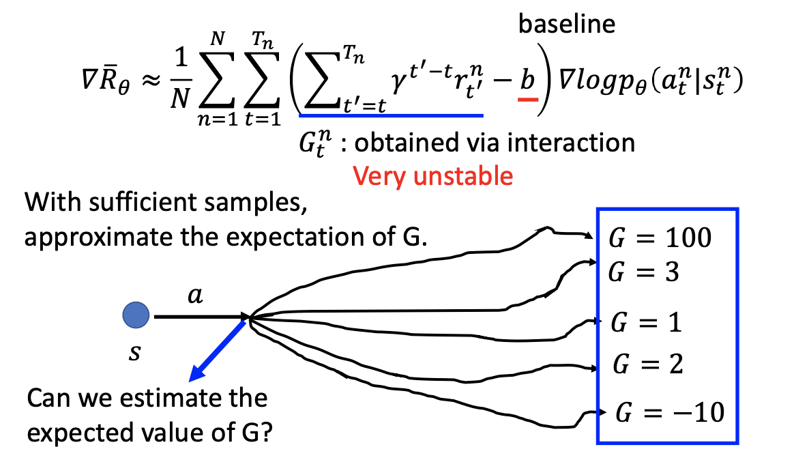
     
   - Q-Learning Review：
   
     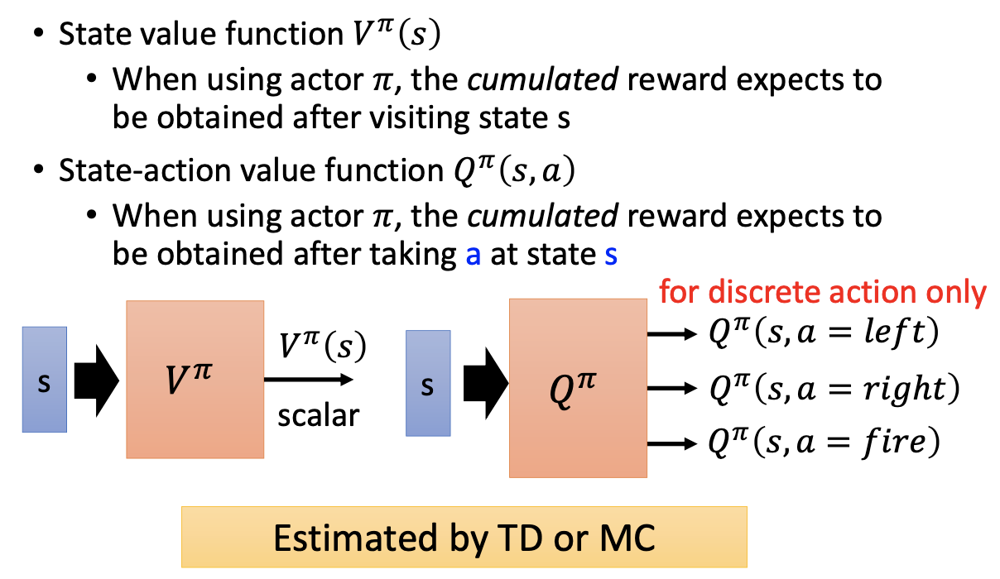
     
   - Actor-Critic：使用Q-Learning的方法计算Policy Gradient中累计收益的期望值。$Q^{\pi_\theta}(s_t^n,a_t^n)$的定义恰好就是Cumulated Reward Expect，所以使用$Q^{\pi_\theta}(s_t^n,a_t^n)$代替$G_t^n$。因为在State $s$时，$V^{\pi_\theta}(s_t^n)$是没有引入Action的Cumulated Reward Expect，$Q^{\pi_\theta}(s_t^n,a_t^n)$是引入了指定Action的Cumulated Reward Expect，所以$V^{\pi_\theta}(s_t^n)$其实是$Q^{\pi_\theta}(s_t^n,a_t^n)$的期望值，所以使用$V^{\pi_\theta}(s_t^n)$代替Baseline $b$。$Q^{\pi_\theta}(s_t^n,a_t^n)-V^{\pi_\theta}(s_t^n)$就会变成一个可正可负的值。
   
     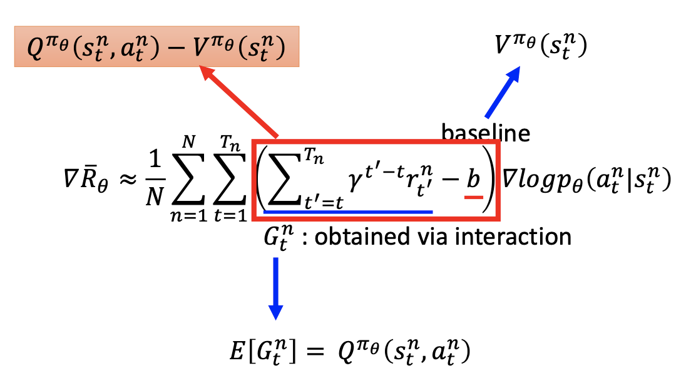
     
   - 基于上述公式，就可以进行代码实现，但是需要两个神经网络分别对$Q,V$进行估测，误差也会更大。那么使用一个网络对$Q,V$进行估计，就需要进行一定的变换。实际上在State $s$采取Action $a$的Reward $r_t^n$也是一个Random Variable，是不确定的。例如在玩游戏时，希望使用一个技能杀死敌人，技能放出后究竟是否能杀死敌人，在决定放技能时还是不确定的。因此有$Q^{\pi}(s_t^n,a_t^n)=E[r_t^n+V^{\pi}(s_{t+1}^n)]$，然后去掉期望符号，近似的认为等式仍然成立。则可以得到$Q^{\pi}(s_t^n,a_t^n)-V^{\pi}(s_t^n)=r_t^n+V^{\pi}(s_{t+1}^n)-V^{\pi}(s_t^n)$，此时公式中存在一个Random Variable $r_t^n$，相比于$G_t^n$， $r_t^n$更稳定一些，因为这只是一步Action的收益。
   
     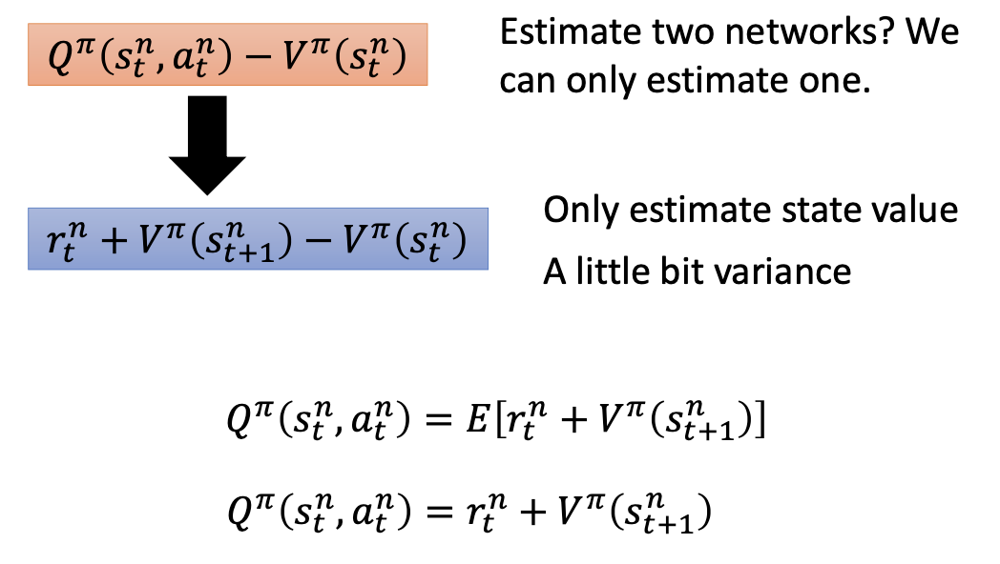
     
   - 因为$r_t^n+V^{\pi}(s_{t+1}^n)-V^{\pi}(s_t^n)$被称为Advantage Function，又是结合了Policy Gradient和Q-Learning，所以这种技术被称为Advantage Actor-Critic。
   
     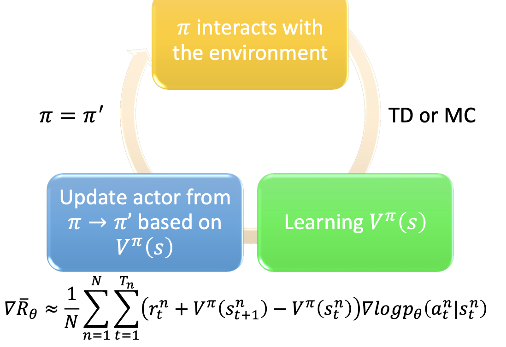
     
   - Advantage Actor-Critic的训练技巧
   
     - Tip 1：Advantage Actor-Critic需要做两件事情，第一件事是输入一个State $s$，输出一个scalar，用来估计$V^{\pi}(s)$；第二件事是使用NN学习一个Actor $\pi(s)$，输入一个State $s$，输出一个Action Distribution。两个网络$\pi(s)$和$V^{\pi}(s)$的前几层共享参数（绿色），先把输入转换成一些High-level的信息，然后在分别处理
     
     - Exploration的过程仍然是很重要的，因此对$\pi(s)$输出的Action Distribution做出一些限制，要求其信息熵不能太小，即不同的Action被执行的几率尽可能平均一点，有利于进行更多的探索。
     
       
   
2. Asynchronous Advantage Actor-Critic（A3C）

   - A3C指的是Asynchronous Advantage Actor-Critic。Asynchronous指存在一个Global的Actor和Critic，每一次要学习的时候，就从Global的Actor和Critic拷贝一组参数，这样就可以构建多个Actor。然后让Actor和环境进行互动，计算需要更新的参数$\Delta \theta$并传回Global的Actor和Critic。整个过程可以理解为创造多个分身进行学习，然后汇总学习结果。

     

   

#### 2.Pathwise Derivative Policy Gradient

1. 借鉴GAN的思想使用Actor解决Q-Learning的arg max问题

   - [David Silver, Guy Lever, Nicolas Heess, Thomas Degris, Daan Wierstra, Martin Riedmiller, “Deterministic Policy Gradient Algorithms”, ICML, 2014]、 [Timothy P. Lillicrap, Jonathan J. Hunt, Alexander Pritzel, Nicolas Heess, Tom Erez, Yuval Tassa, David Silver, Daan Wierstra, “CONTINUOUS CONTROL WITH DEEP REINFORCEMENT LEARNING”, ICLR, 2016]

   - Pathwise Derivative Policy Gradient可以被视为一种解决Q-Learning Continuous Action的方法，也可以视为一种特殊的Actor-Critic方法。传统的Actor-Critic会以State或State-Action Pair作为输入，并给出当前的Action是好是坏。但是Pathwise Derivative Policy Gradient不但会给出当前Action的好与坏，同时还会给出最好的Action。

   - Q-Learning中存在Continuous Action较难处理的问题，虽然可以解决，但是不容易。所以Pathwise Derivative Policy Gradient提出使用Actor解最优化问题，$a=arg\ \max\limits_aQ(s,a)$，对于给定的State $s$解出可以获得最大$Q-Value$的Action $a$。这种想法类似于GAN，GAN中Discriminator无法解决最优化的问题，那么就在训练一个Generator解决该问题。

     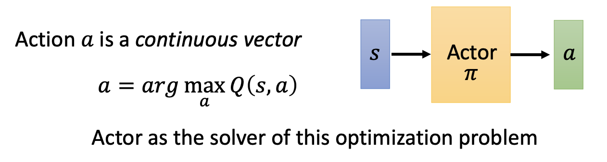

   - 假设已经训练了一个Critic $Q^\pi$，输入是$s,a$，输出是$Q^\pi(s,a)$。然后在训练一个Actor，和Critic组成一个大的网络。Actor的目标是输出合适的Action $a$能够最大化Critic的输出。

     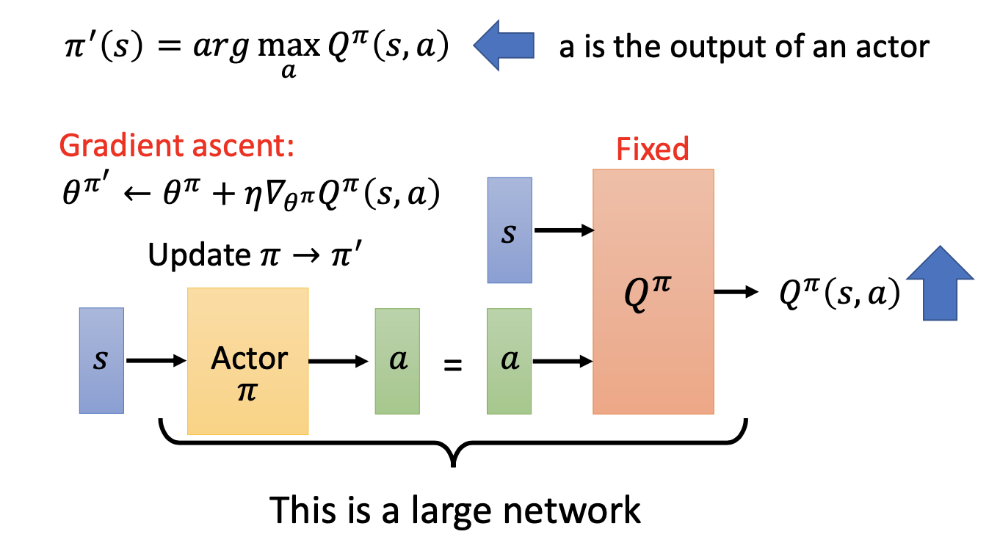

     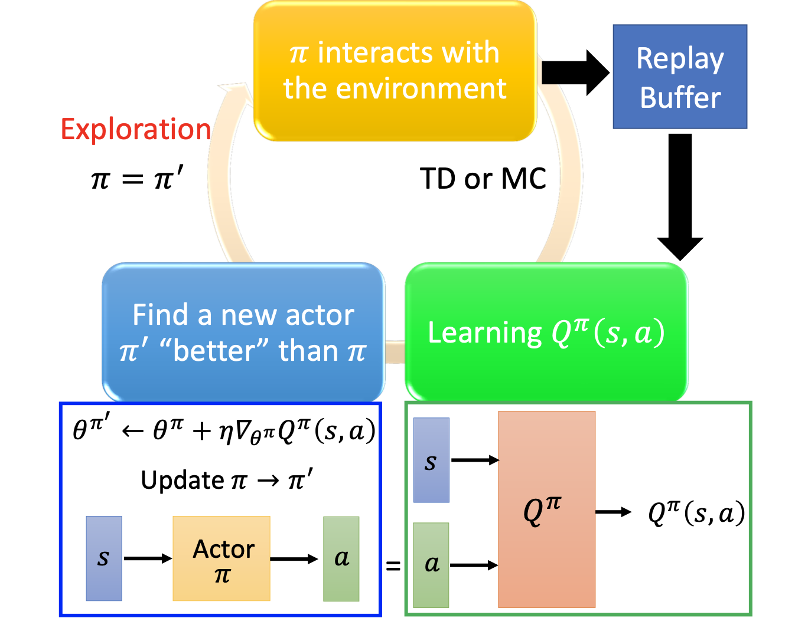

   

2. Pathwise Derivative Policy Gradient算法伪代码

   - Q-Learning的算法伪代码如下，在离散的情况下已知State $s_t$，基于$Q-Function$的结构选择最好的Action $a_t$。

     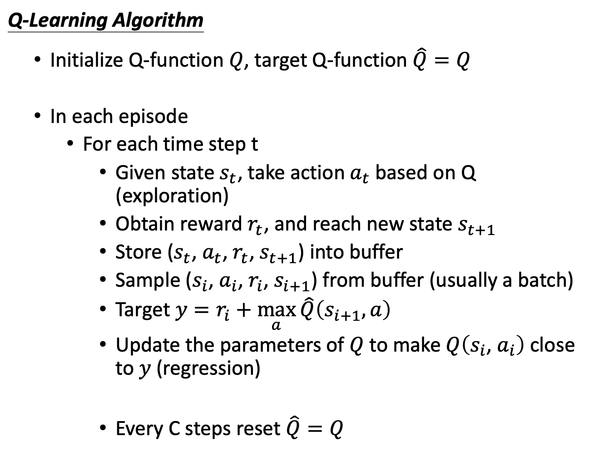
     
   - Pathwise Derivative Policy Gradient的算法伪代码如下，有四处变动。第一处为不在使用$Q-Function$决定将要执行的Action，而是使用Actor $\pi$决定将要执行的Action；第二处为直接将Actor $\pi$的结果代入Target $y$，$\pi'$和$\pi$的区别类似于之前的$Q-function\ Q$和$target\ Q-function\ \hat{𝑄}$ 。
   
     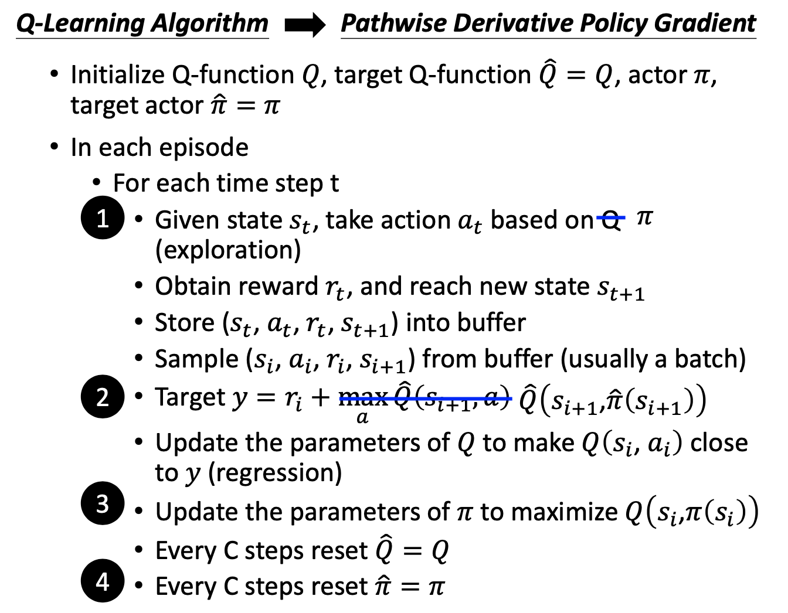
     
   - [David Pfau, Oriol Vinyals, “Connecting Generative Adversarial Networks and Actor-Critic Methods”, arXiv preprint, 2016]中解释了Actor-Critic和GAN之间的关系。两个模型的共同点之一就是都比较难训练。
   
     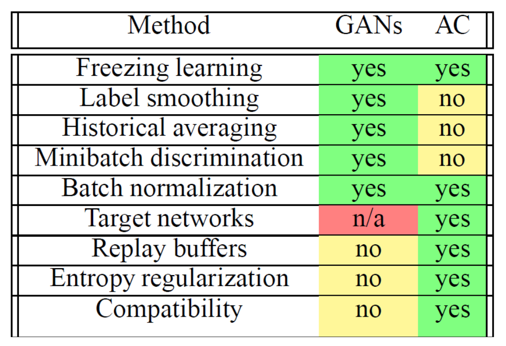
     
     
   
