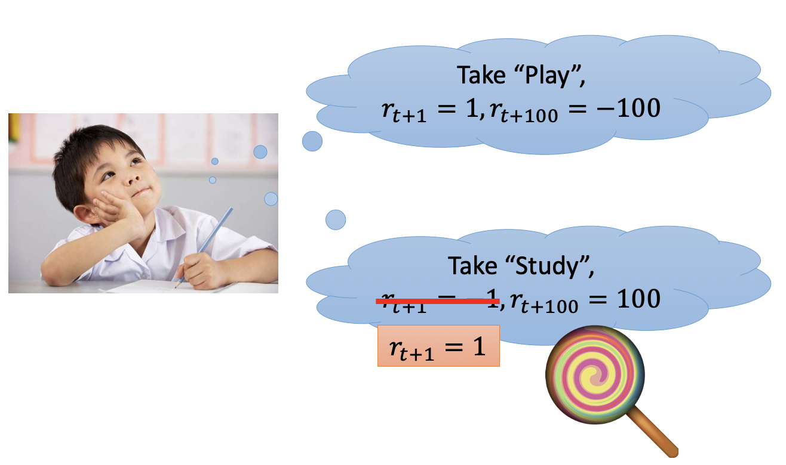
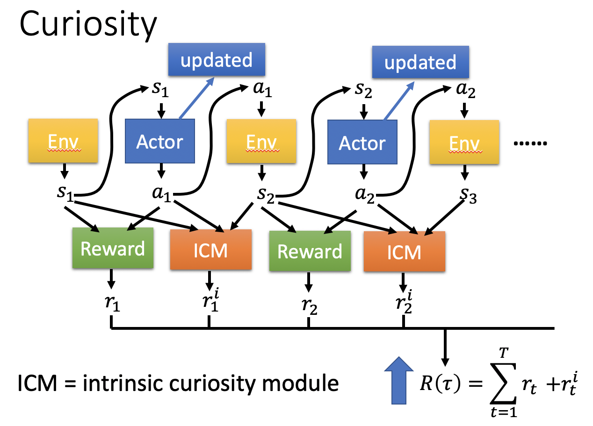
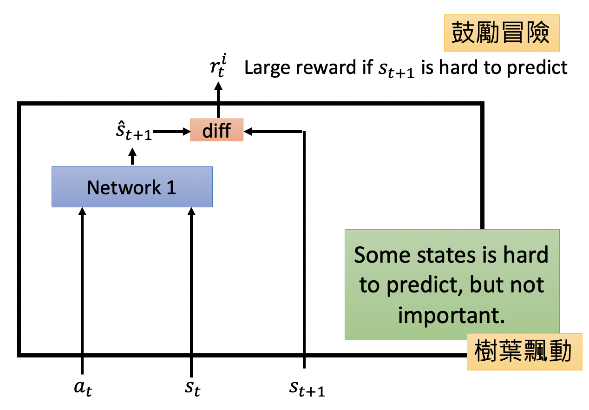
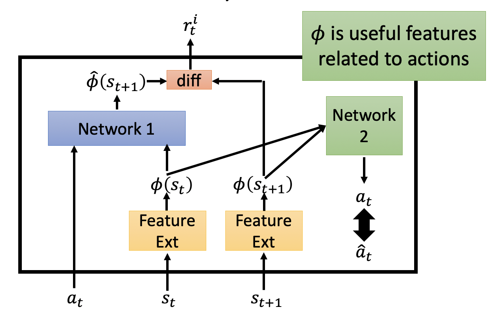
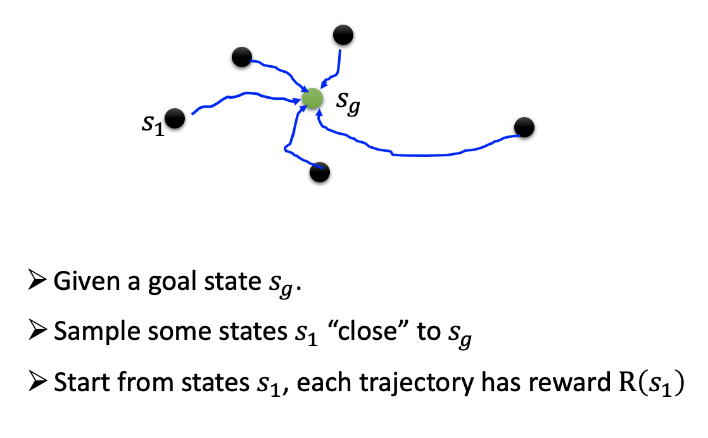
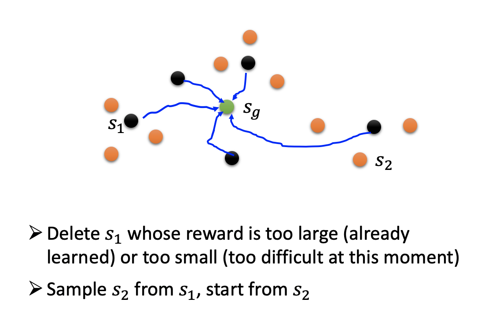

# Chapter 26 - Deep Reinforence Learning（Part 5 - Sparse Reward）

[1.Reward Shaping](#1)

​		[1.1 Reward Shaping的定义](#1.1)

​		[1.2 Curiosity Reward](#1.2)

[2.Curriculum Learning](#2)

​		[2.1 Curriculum Learning的从易到难](#2.1)

​		[2.2 Reverse Curriculum Generation](#2.2)

[3.Hierarchical Reinforcement Learning](#3)

​		[3.1 Curriculum Learning的从易到难](#3.1)

#### Abstract：使用RL训练Agent时，在大多数情况下Agent都是没有办法得到Reward的。例如玩迷宫游戏，只有走出迷宫的最后一个时刻才能得到Reward，其他情况都是没有收益的，这种情况被称为Sparse Reward。

#### 1.Reward Shaping

1. Reward Shaping的定义

   - Reward Shaping的核心思想是根据现实生活的经验，人工的设置一些Reward去引导模型的学习。例如小孩选择“玩耍"，那么会获得的收益 $r_{t+1}=1$，在100个时间单位后的月考中获得的收益 $r_{t+100}=-100$。反之，选择“学习"，那么会获得的收益 $r_{t+1}=-1$，在100个时间单位后的月考中获得的收益 $r_{t+100}=100$。所以人为的将选择“学习"获得的收益设置为 $r_{t+1}=1$。

     
     
   - 例如在荒野求生中，不会在取得最后的胜利后才会获得$Reward$，在捡到枪、急救包等时间时都会获得一定的收益。
   
       
   
2. Curiosity Reward

   - 在原有Reward的基础上，再增加一个$ICM=Intrinsic\ Curiosity\ Moudle$，其输入是$s_1,a_1,s_2$，输出是$r^i_1$。Agent获得的Total Reward $R(\tau)=\sum\limits_{t=1}^T r_t+r^i_t$，最终的目标是最大化Total Reward，即同时最大化$r_t$和$r^i_t$。[https://arxiv.org/abs/1705.05363]

     

   - $ICM\ Reward$的计算方法为，输入$a_t,s_t$，然后使用NN计算下一步的$\hat{s}_{t+1}$，再计算预测结果$\hat{s}_{t+1}$和实际结果$s_{t+1}$的差异，如果二者的差异越大说明下一时刻的State越难预测，则获得的$ICM\ Reward\  r^i_t$越大。该指标用于鼓励Agent进行尝试和冒险。其中的NN是通过大量的$a_t,s_t,s_{t+1}$数据训练出来的。
   
     
   
   - 这种方法存在一个问题，就是一些State比较难预测，但是却是不重要的。例如游戏里面树叶的飘动相当的随机，Agent就会静静的看着树叶飘动，什么都不做就可以了。所以进行一定的改进，引入Feature Extractor，过滤掉State中没有用的信息。
   
     
   
   - Feature Extractor通过训练另一个神经网络实现（Network 2），其输入是$\phi(s_t)、\phi(s_{t+1})$，输出是$\hat{a}$，希望与$a_t$越接近越好。Feature Extractor可行的原因是，通过$\phi(s_t)、\phi(s_{t+1})$可以预测$a_t$，就代表着输入的两个向量中包含的都是与预测Action有关的信息，不会包含其他无关的信息。
   
   

#### 2.Curriculum Learning

1. Curriculum Learning的从易到难

   - Curriculum Learning并不是RL中独有的概念，在其他一些DL中也存在。其核心思想是给予机器的数据的学习难度是从简单到复杂的，从最简单的事情教机器，逐步增加难度，例如九九乘法表到微积分。在RNN中也会让机器先学习比较短的Sequence，然后在学习比较长的Sequence。

2. Reverse Curriculum Generation

   - Curriculum Learning需要人为的根据专业知识为机器设置课程，比较复杂。Reverse Curriculum Generation是一种比较通用的设计课程的方法。首先有一个最理想的结果，$goal\ state\ s_g$，然后采样出距离 $s_g$比较近的其他State，以这些State作为初始状态与环境进行互动，将收益比较极端的State删掉（太小意味着太简单，不需要学习；太大意味着太难，学不会）。然后再以剩下的State为中心，重复进行。

     
     
     
     
     

#### 3.Hierarchical Reinforcement Learning

1. Curriculum Learning的从易到难
   - Hierarchical Reinforcement Learning的核心思想是不同层次的Agent负责不同的功能，一些High-Level的Agent复杂指定目标，然后s分配给一些Low-Level的Agent执行。类似于碰到一个大的任务，我们不会直接去考虑非常细节的技术点，而是通过将任务进行不断的切分，然后解决（分而治之）。