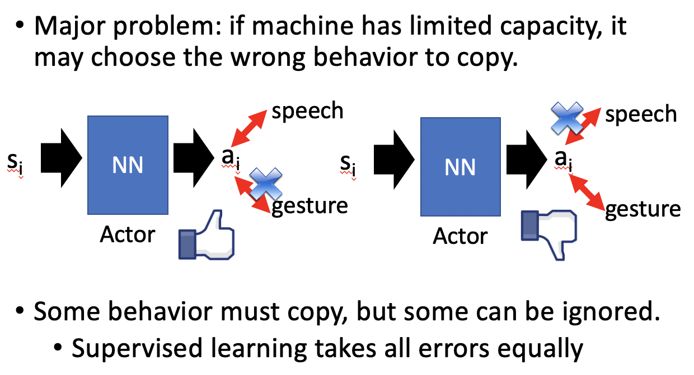

# Chapter 26 - Deep Reinforence Learning（Part 6 - Imitation Learning）

[1.Behavior Cloning](#1)

​		[1.1 Behavior Cloning的定义](#1.1)

​		[1.2 Behavior Cloning中存在的一些问题](#1.2)

[2.Inverse Reinforcement Learning （IRL）](#2)

​		[2.1 IRL的基本过程](#2.1)

#### Abstract：Imitation Learning，又称Learning by demonstration、Apprenticeship learning，Actor虽然可以和环境进行互动，但是没有办法从环境中获得Reward，例如自动驾驶等等，没有明确的Reward可以进行定义。但是机器可以通过学习Expert的范例数据获得经验，主要包含Behavior Cloning、Inverse Reinforcement Learning (inverse optimal control) 等方法。

#### 1.Behavior Cloning

1. Reward Shaping的定义

   - Behavior Cloning类似于Supervised Learning，Expert做什么，机器就学着做什么。

     
     
   - Behavior Cloning中的问题一：Limited Expert Observation
   
     - Expert只能提供有限的数据（Observation or States）。一旦机器由于误操作进入了一个没有学习过的State，就会不知所措。解决办法就是进行Data Aggregation，尽可能的手机多样性的数据。
     
       
       
     - Data Aggregation指的是使用一个Actor与环境进行互动，在每个是个Expert会给出相应的建议，但是Actor $\pi$只会收集建议，并不会听从建议，仍然按照自己的策略进行。这样就有可能进入一些极端情况，也就学习到了极端情况Expert的经验。
     
       
     
       
   
2. Behavior中存在的一些问题

   - Behavior Cloning中的问题二：Agent会学习Expert的所有行为，无论其重要性。如果机器能够完全模仿Expert的行为也还好，但是因为机器的Capacity是有限的，如果机器学了一些错误的东西，就会产生不好的影响。例如一个学生如果学习了老师讲的知识是好的，但是没有学到知识，只学到了老师讲课的姿势就本末倒置了。

     
   
   - 在Supervised Learning中，我们希望training data和testing data的分布尽可能的一致。在Behavior Cloning中，假设训练数据$(s,a)\sim \hat{\pi}(expert)$，测试数据$(s',a')\sim \pi^*(actor\ cloning\ expert)$，只要$\pi^*$和$\hat{\pi}$差了一点点，因为在Supervised Learning中每组数据都是独立的，所以不会产生太大的影响，在RL中存在着比较大的因果关系，所以$s$和$s'$之间也会存在比较大的差异。
   
     
   
   

#### 2.Inverse Reinforcement Learning （IRL）

1. IRL的基本过程

   - Inverse Reinforcement Learning与Reinforcement Learning的区别如下。Inverse Reinforence Learning的过程恰好与RL相反，根据Expert和环境找出Reward Function，然后根据Reward Function按照正常的RL步骤找出最好的Actor。这样的好处是，可以建模出比较简单的Reward Function，但是还能得到比较复杂的Policy。

     

   - 已知两组数据，一组是Expert Experience $\{\hat{\tau_1},\hat{\tau_2},\cdots,\hat{\tau_N}\}$，另一组是Actor $\{\tau_1,\tau_2,\cdots,\tau_N\}$。IRL需要找出一个Reward Function使得$\sum\limits^N_{n=1}R(\hat{\tau})>\sum\limits^N_{n=1}R(\tau)$。得到Reward Function后通过正常的RL找到了一个新的Actor，再生成新的$\{\tau_1,\tau_2,\cdots,\tau_N\}$。按照这个步骤迭代进行。

     

   - Actor相当于Generator，Reward Function相当于Discriminator，整个过程类似于GAN。

     

   - IRL有许多应用，例如ROBOT【Chelsea Finn, Sergey Levine, Pieter Abbeel, ” Guided Cost Learning: Deep Inverse Optimal Control via Policy Optimization”, ICML, 2016】、Third Person Imitation Learning【Bradly C. Stadie, Pieter Abbeel, Ilya Sutskever, “Third-Person Imitation Learning”, arXiv preprint, 2017】

