# Chapter 8   Graph Neural Network
#### 1.Introduction

1. 问题的提出

   - Graph由Node和Edge组成，其中Node和Edge均具有不同的属性，例如分子中的原子和化学键、轨道交通中的地铁站和轨道

     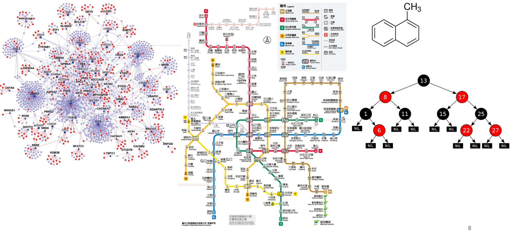

   - GNN可以解决Classification问题（图片如何作为一个输入传入神经网络）和Generation问题（先训练出一个网络，通过噪声等方式生成新的目标）

     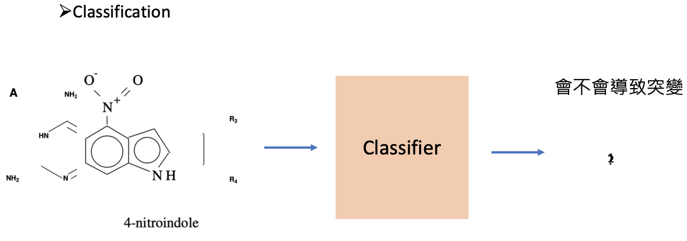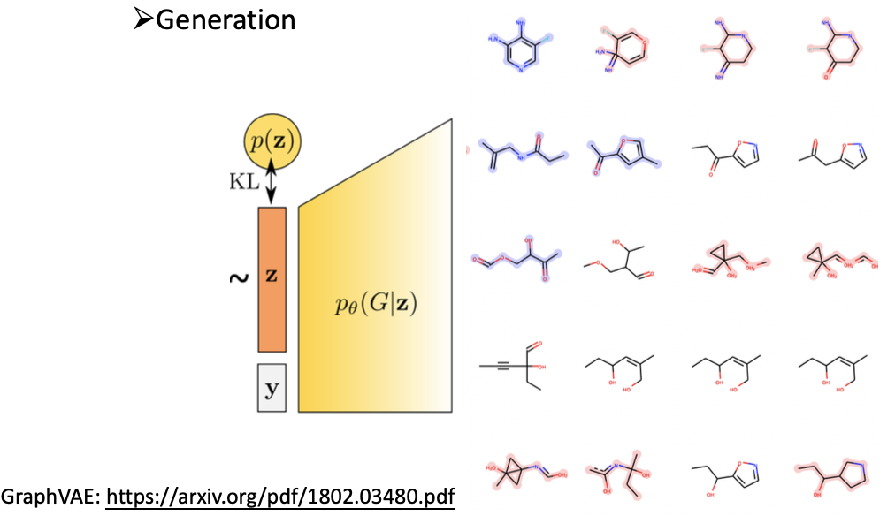
   
   

2. RoadMap

   - 在一些关于图的数据集上，Unlabeled Node的数量要远大于Labeled Node，因此如何利用Labeled Node和图结构是GNN所关注的问题之一。

     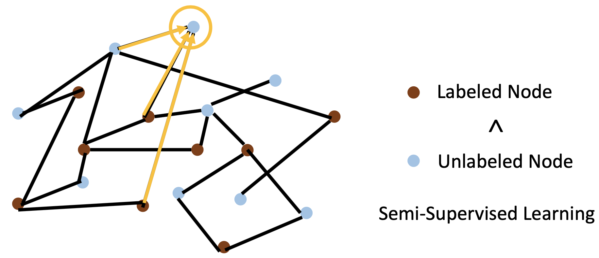

   - ==在CNN中，由于Image是规则的矩阵排列，所以可以之家使用Convolution Kernel抽取局部特征，但是该方法不可以直接套用在Graph上==，改进方法为：

     ​		Solution 1: Generalize the concept of convolution (corelation) to graph → **Spatial-based convolution**

     ​		Solution 2: Back to the definition of convolution in signal processing → **Spectral-based convolution**

     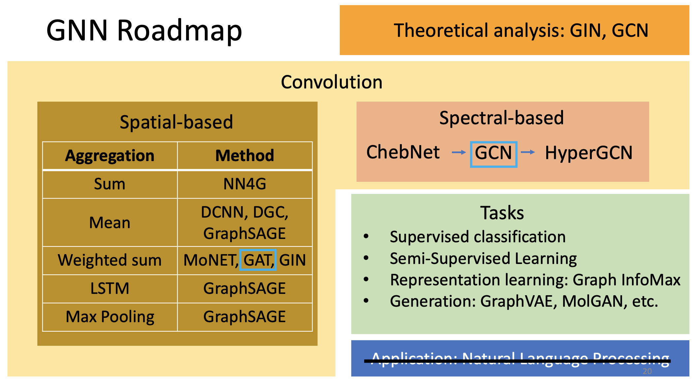

#### 2.Tasks, DataSet, BenchMark

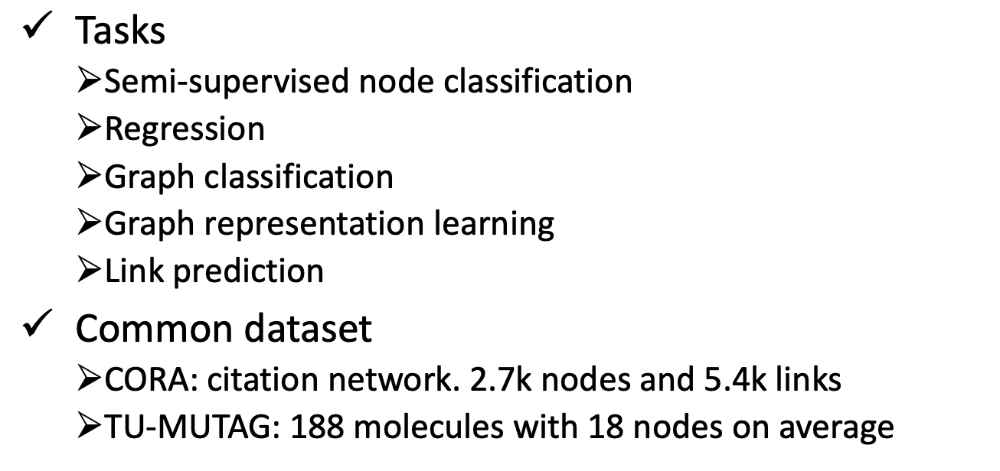

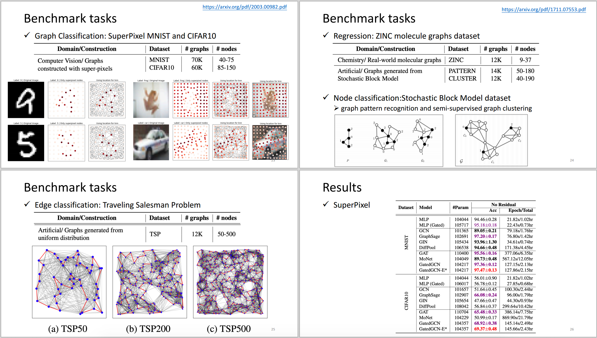

#### 3.Spatial-based GNN

1. Review

   - 在CNN中，通过Feature Map和Kernel进行卷积操作提取小范围的结构特征

     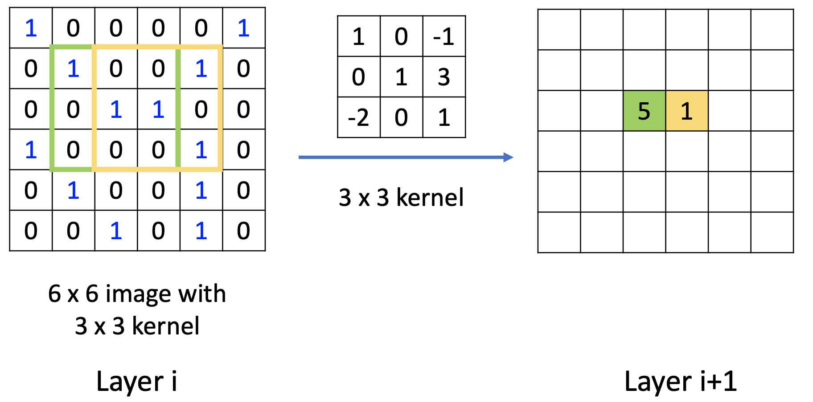

   - GNN Terminology

     Aggregate：用neighbor feature更新下一层的hidden state

     Readout：将所有的nodes的feature集合起来代表整个Graph

     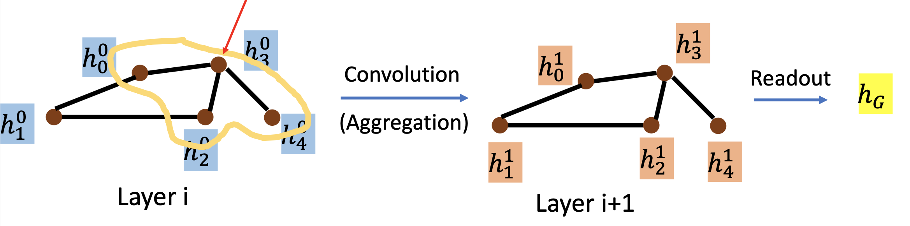

     

2. NN4G（Neural Network for Graph）

   - Aggregate - 以化学分子为例，下图中的节点v表示原子，边表示化学键。在Input Layer中$x_i$表示第i个节点的feature，即该原子的各类化学性质；在Hidden Layer中，$h_i^j$表示第i个隐层第j个节点的feature。

     
     $$
     h_3^1 = \hat{w}_{1,0}·(h_0^0+h_2^0+h_4^0)+\overline{w}_1·x_3
     $$
     
     $$
     h_3^0 = \overline{w}_0·x_3
     $$
     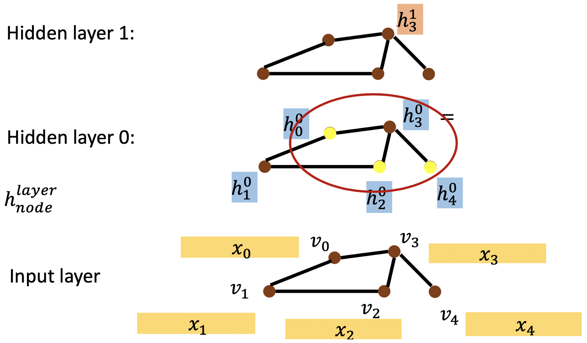

   - Readout - 将每层节点的特征进行平均化，再进行权重求和

     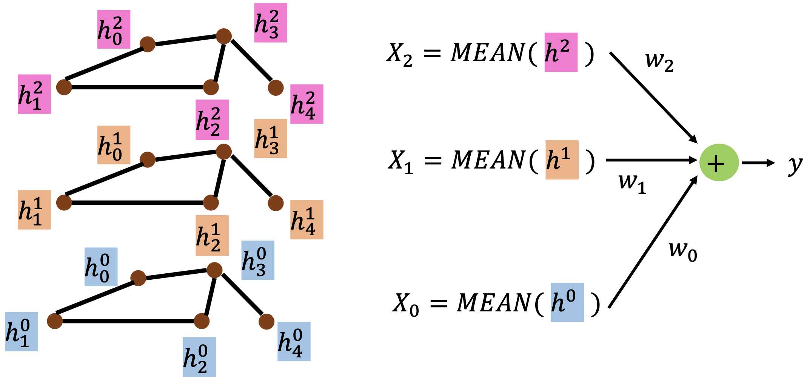

     

3. DCNN（Diffusion Convolution Neural Network）

   - Aggregate - 将邻居节点的距离作为一项考虑因素
     
     对于第一个隐层：$h_3^0 = \hat{w}_3^0·MEAN(d(3,·)=1)，d(3,·)=1表示与v_3距离为1的所有节点，即x_0，x_2和x_4，对满足条件的节点的特征求平均进行加权$
     
     对于第二个隐层：$h_3^1 = \hat{w}_3^1·MEAN(d(3,·)=2)，d(3,·)=2表示与v_3距离为2的所有节点，即x_1和x_3，仍然使用输入层的feature进行更新$
     
     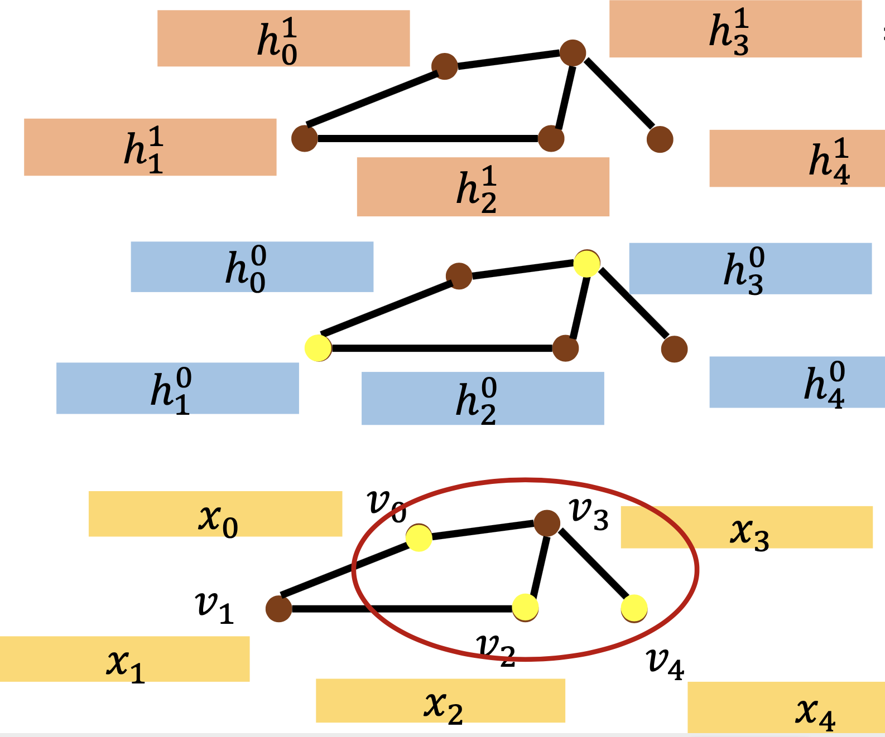               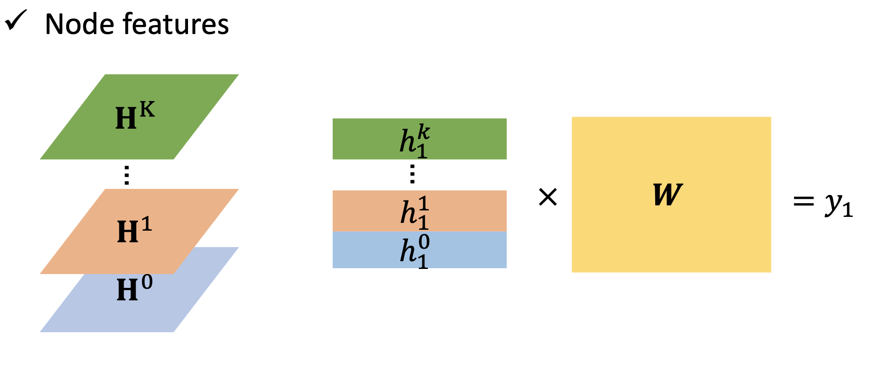
     
   - 每一个隐层的所有节点的特征向量排列成矩阵形式可以得到$H^i$，如上图(右)所示，将每个$H^i$的相同位置的向量抽取出来，即同一节点在不同隐层的表示，再乘以权重就可以得到该节点最终的node representation

   

4. DGC（Diffusion Graph Convolution）

   - Aggregate - 与DCNN相似

   - Readout：将$H^i$相加在一起即可

      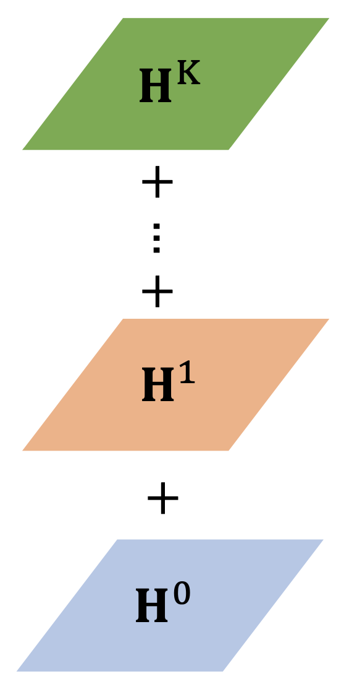

5. MoNET（Mixture Model Networks)

   - 定义了一种新的权重用来代表节点之间的距离：$u(x,y)=(\frac{1}{\sqrt{deg(x)}},\frac{1}{\sqrt{deg(y)}})^T$

   - Aggregate - 使用加权和（Weighted Sum）代替前面方法的简单加和（求均值），$h_3^1 = w(\hat{u}_{3,0})\times h_0^0+w(\hat{u}_{3,2})\times h_2^0+w(\hat{u}_{3,4})\times h_4^0$，其中$w(·)$是神经网络，$\hat u$是$u$的一个transform

     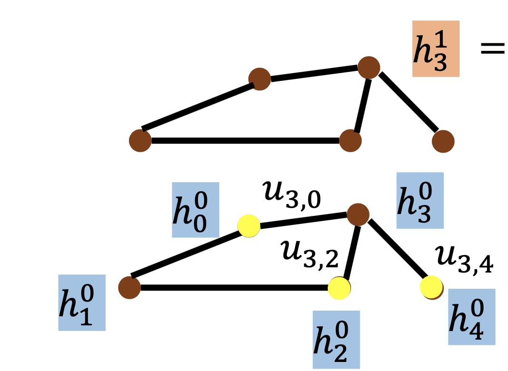

6. GraphSage（SAmple and aggreGatE）

   - GraphSage可以进行transductive和inductive学习

   - Aggregate - 使用了mean、max-pooling、LSTM 

     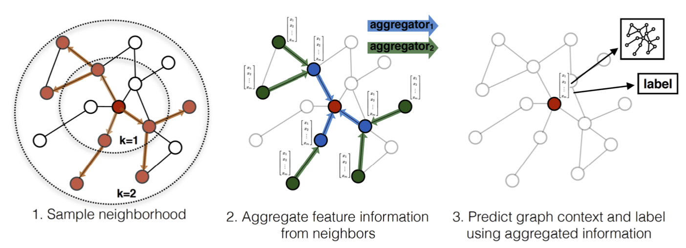

7. GAT（Graph AttentinNeiworks）

   - 对于邻居节点不但要使用weighted sum，而且不同邻居的weight不是通过预先设定的，而是通过网络学习出来的

     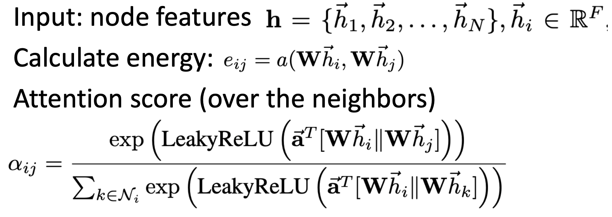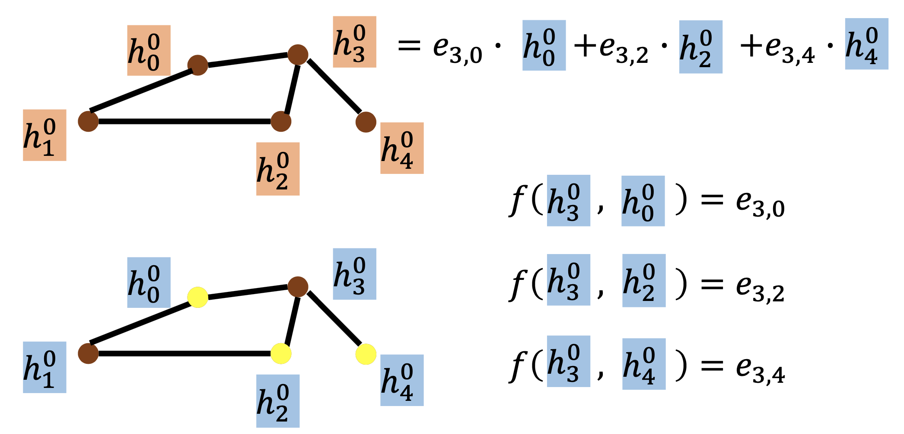

     

8. GIN（Graph Isomorphism Network）

   - 通过理论证明得出，对于某一个节点$v$在第$k$个隐层的表示可以用如下公式进行更新，即“上一个隐层的表示” + “邻居全部加和”
   
     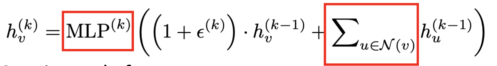
   
   - 使用sum求和，而不能使用mean pooling和max pooling。以第一幅图为例，如果蓝色节点都是相同的话，那么mean pooling后，无法分辨直线结构和三角锥结构
   
     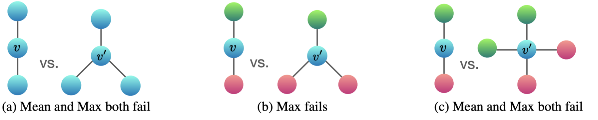

#### 4.Graph Signal Processing and Spectral-based GNN

1. Signal and System Review

   - 在CNN中，因为Image是规则的矩阵排列，所以可以与Kernel进行卷积操作提取特征，在Graph中为了近似这种操作，Spectral-based GNN的做法就是，将input看做信号，对signal和filter进行Fourier Transform，在原有的feature domain中做的卷积操作因为经过傅里叶变换，在新的feature domain中直接进行相乘即可，最后再进行Inverse Fourier Transform

     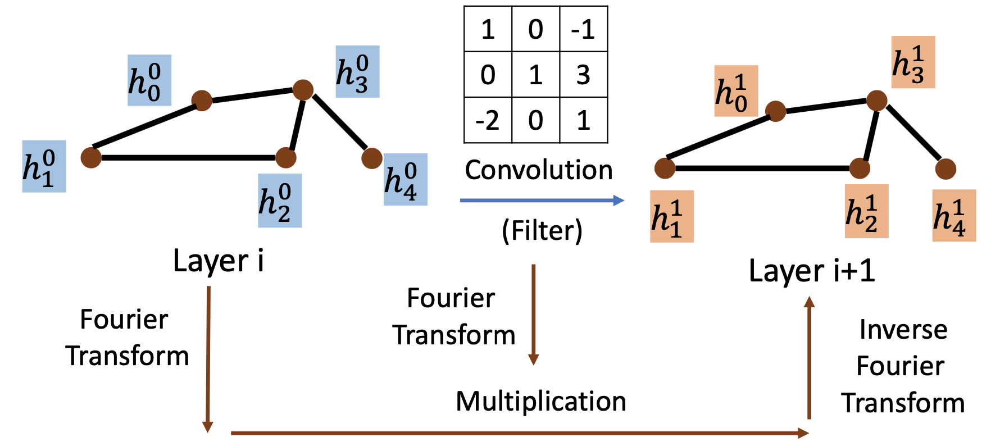

   - 一组信号可以看做一个N-dim Vector，可以由一组正交的分量$\hat{v_k}$组成，即$\vec{A} = \sum\limits_{k=1}^N a_k \hat{v_k}$ ，其中$a_j=\vec{A}·\hat{v_j}$

   - 傅里叶序列可以表示为：

     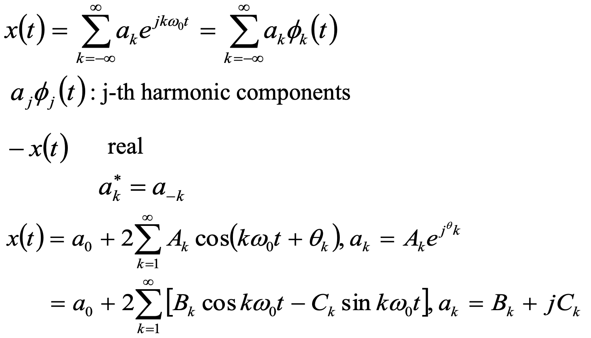

   - 信号可以在由不同的basis组成，例如Impulse Function和Exponential Function均可以合成同一组信号量

     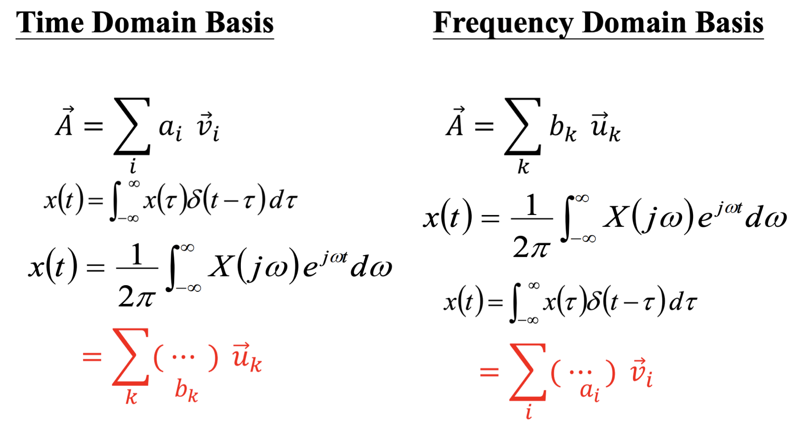

   - Fourier Transform的作用在于通过內积分析basis组合时的系数$x(t)$

     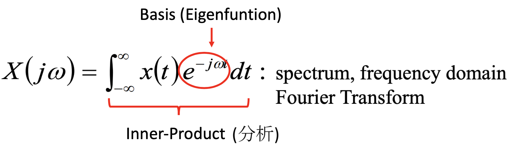

2. Spectral Graph Theory

   - 已知图$G$、节点集合$N$、邻接矩阵(权重矩阵)$A$、度矩阵$D$、节点的信号量$f(i)$。假设在路网图中，节点表示城市，$f(i)$表示城市的规模/人口/迁移量等等

     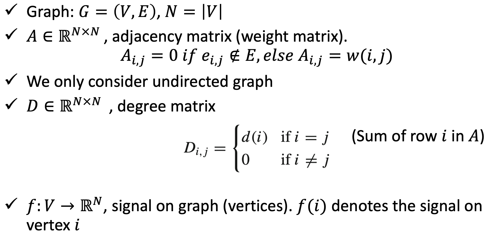    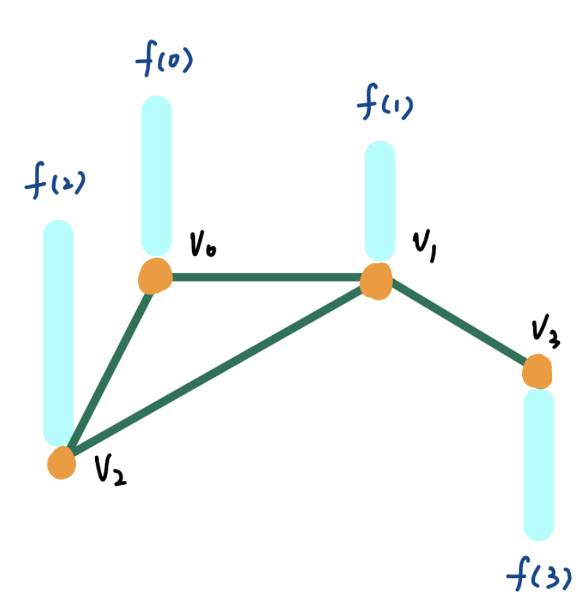

   - Graph Laplacian $L = D - A$，该矩阵为半正定的对称矩阵。对$L$进行SVD降维如下，最终$\lambda_l$称为frequency，$u_l$是与$\lambda_l$相对应的basis

     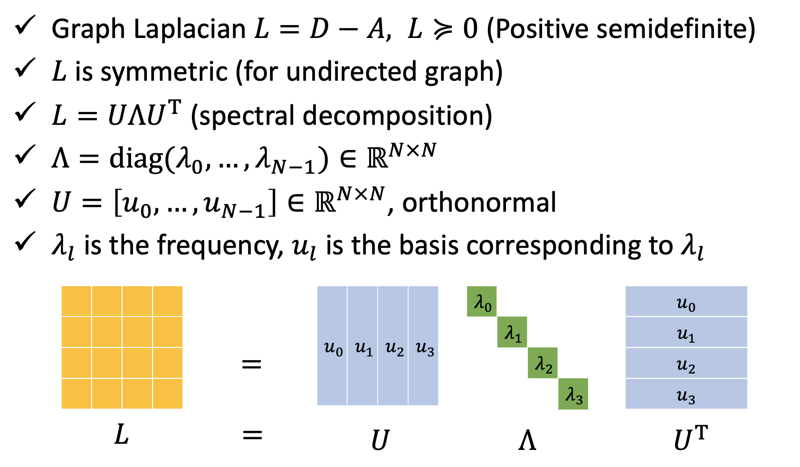

     

     以下图为例对Graph进行处理，并将于特征值对应的特征向量分别绘制在图上。

     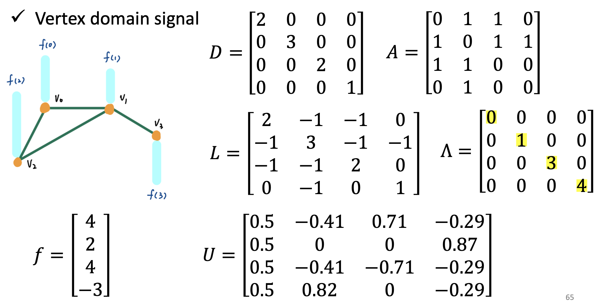

     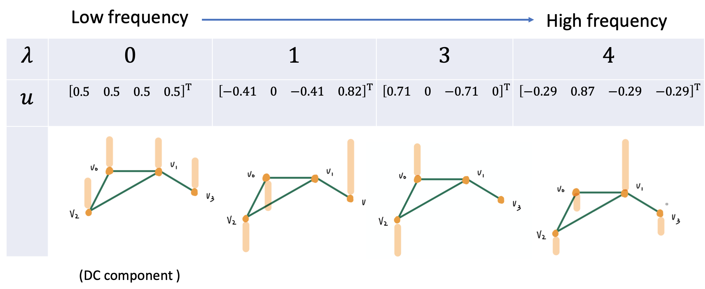

   

   - ==对于Discrete Time Fourier Basis而言，频率越大，相邻两点之间的信号变化量就越大==

     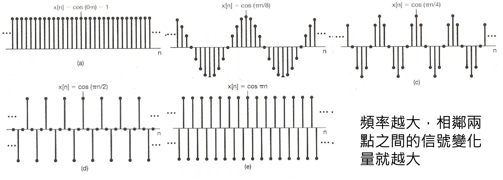

   

   - Vertex Frequency的可解释性描述：$L$相当于在图上的一个operator，$Lf$中的一行$a = 2 \times4 -2 -4 $，其中$2 \times 4$表示$v_0$的信息量(度为2、信号强度为4)，$-2$中的$2$表示邻居$v_1$的信息量，$-4$中的$4$表示邻居$v_4$的信息量。因此，$a$表示当前节点与其相邻节点的信号量差异

     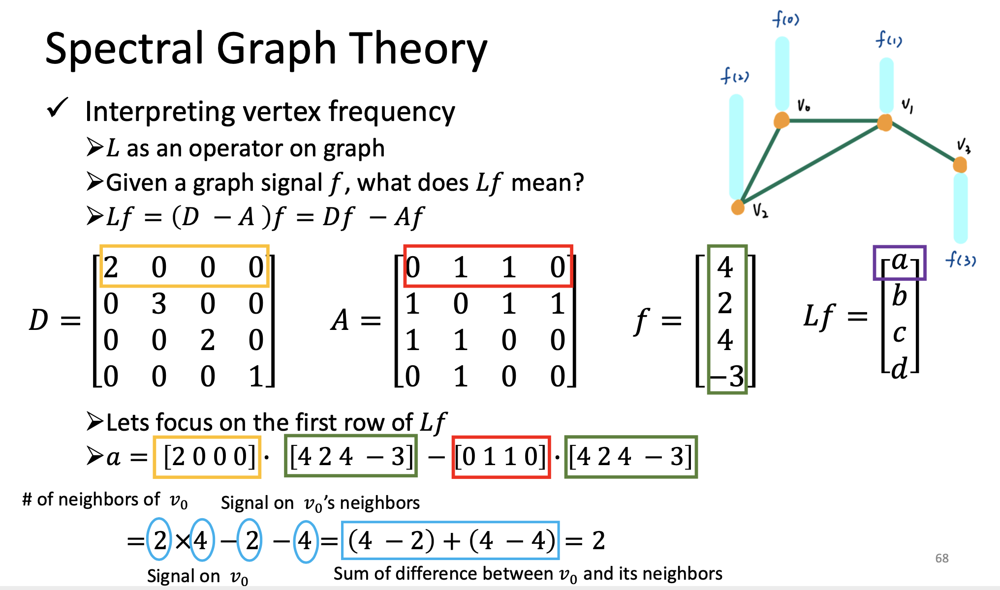

     

     如果想要比较节点之间能量的差异，需要对其进行平方，$f^TLf$表示“Power”，即信号之间的差异，也可理解为smoothness of graph signal。结合上述频率和差异之间的关系，$f^TLf$也可以反映频率的大小。

     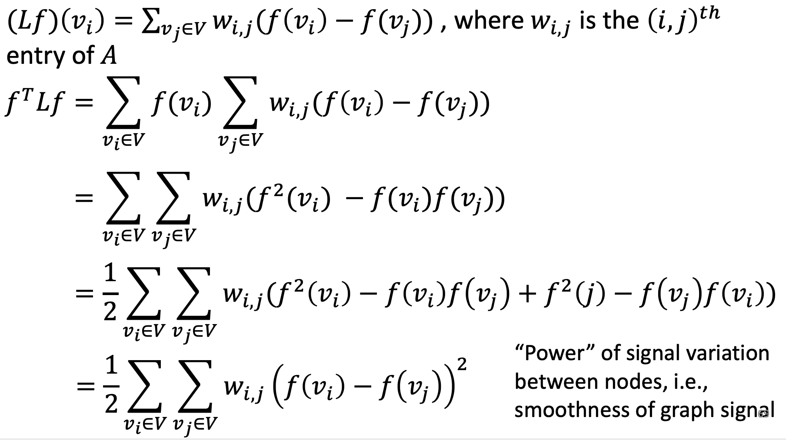

     

     将Graph Laplacian $L$经过分解后得到的特征值和特征向量代入$f^TLf$，可以得到$u_i^T L u_i=u_i^T \lambda_i u_i =$$\lambda_i  u_i^T u_i=\lambda_i$，因此特征值$\lambda_i$就表示了graph中一个信号与其相邻节点的信号之间的差异程度。以一条直线上的20个节点为例，随着$\lambda$的不断增大，相邻点之间的差异逐渐增大，图像逐渐变成一个频率非常高的$sin$函数。

     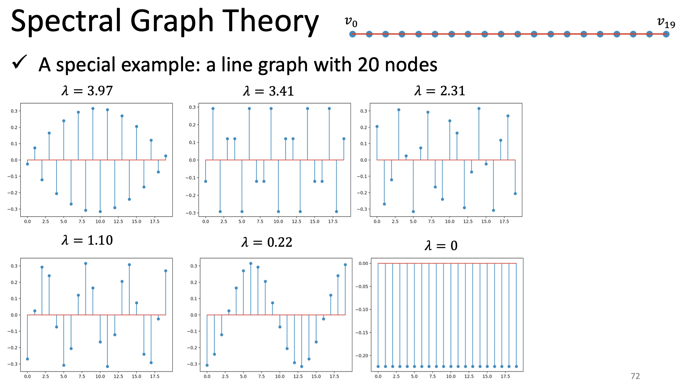

     

   - Graph Fourier Transform of x：$\hat{x} = U^Tx$，其中$U$为特征向量，能够将vertex domain转换到spectral domain

     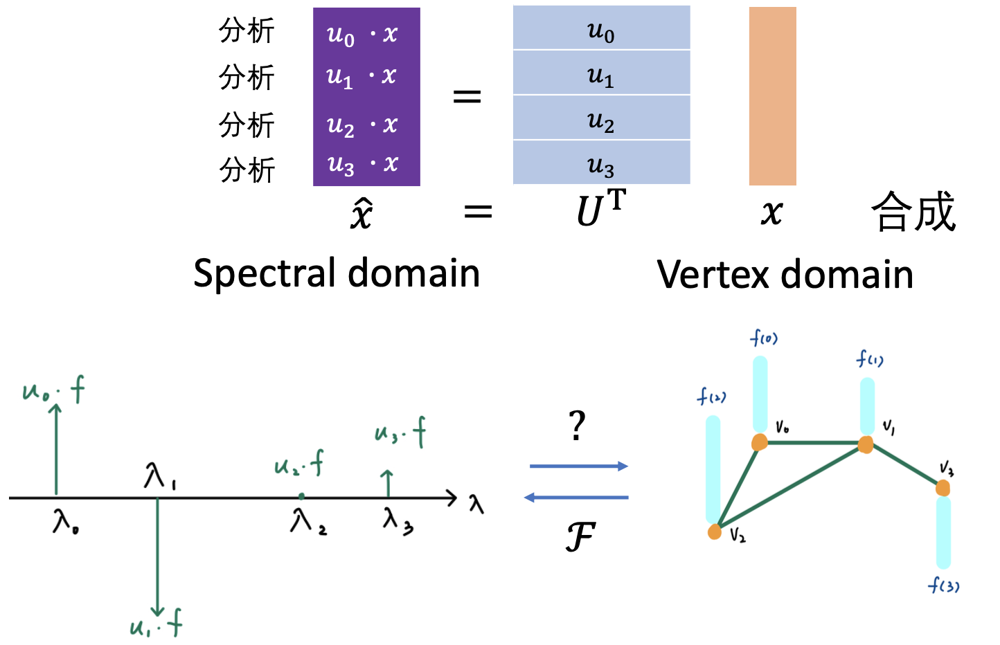

     Inverse Graph Fourier Transform of $\hat{x}$，$x=U\hat{x}$

     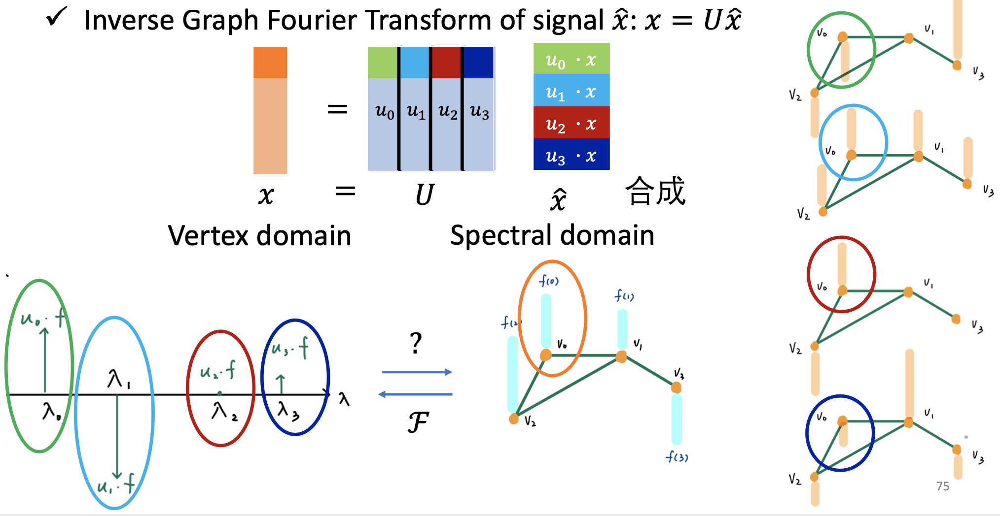

     

   - Filtering - 将vertex domain转换到spectral domain后，相应的卷积操作也转换为乘积操作，也就是filtering。

     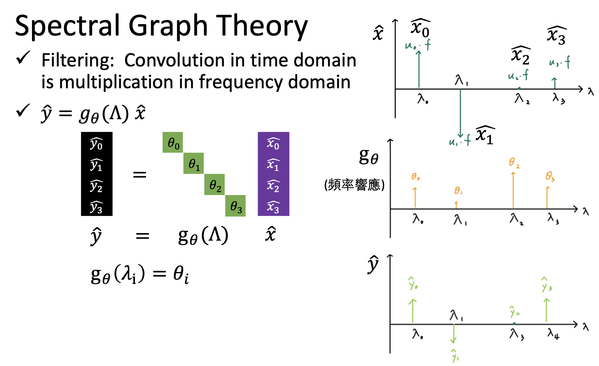

   - 在spectral domain做乘积后，得到了该维度下的信号。此时需要进行Inverse Fourier Transform得到vertex domain下的信号

     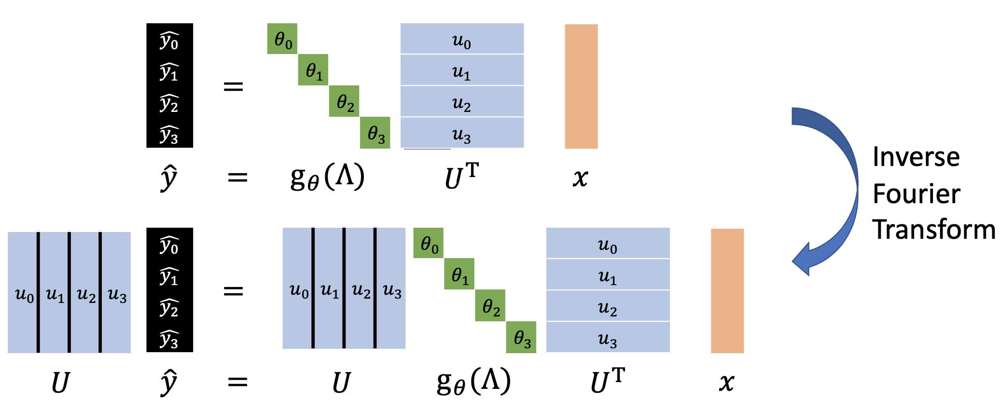

   - 综上，GNN需要学习一个$g_\theta(L)$，其中$L$可以为任意一种函数。因为该矩阵大小与节点数目相同，因此学习的复杂度为$O(N)$

     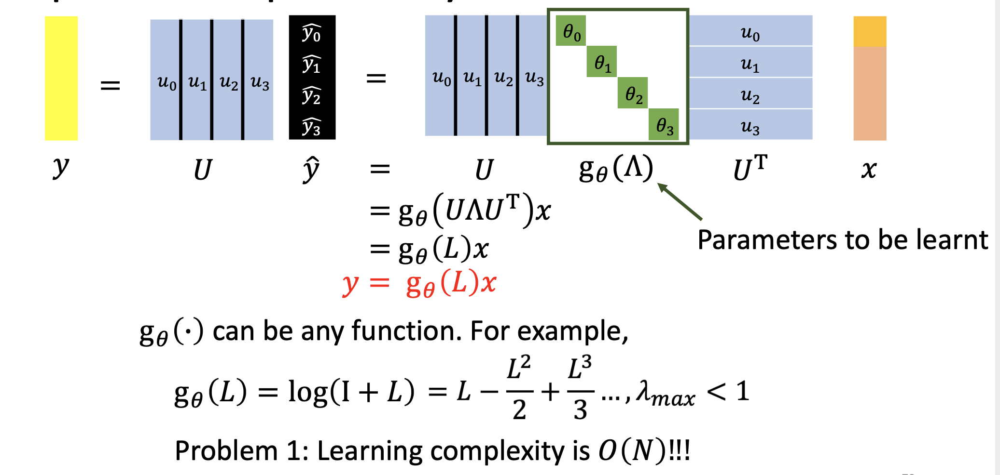

   - $L$的选取和Localize的平衡：

     假设$g_\theta(L)=L$，则$y=Lx$，因为$v_0$和$v_3$没有直连，所以矩阵$L$的第一行第四列为0，使得$v_3$的信号无法传播到$v_0$；

     假设$g_\theta(L)=L^2$，则$y=L^2x$，虽然$v_0$和$v_3$没有直连，但$v_3$的信号仍然可以传播到$v_0$；

     假设connected graph有N个节点，使用$g_\theta(L)=L^N$，则$y=L^Nx$，$L$的每一项都是非零的，经过一次更新，图中的每一个节点都收到剩余其他所有节点传播过来的信号量，此时是没有意义的，因为在CNN中要做的是Localize，而此时已经失去了局部特征抽取的功能

     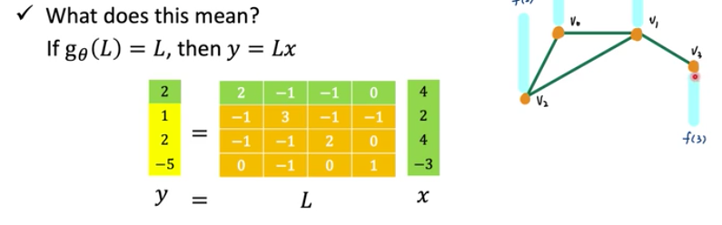

     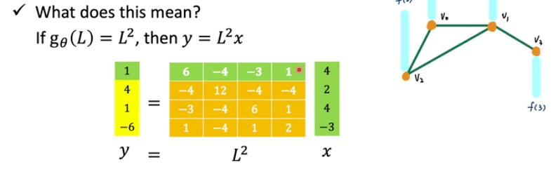

3. ChebNet

   - 通过使$g_\theta(L)$为$L$的多项式以解决$O(N)$复杂度和Localize的问题，即$g_\theta(L)=\sum\limits_ {k=0} ^K \theta_kL^K$，实现了K-Localize和$O(K)$，需要学的就变成了$\theta_k$。但是在最终计算$y$的过程中乘以特征向量使得时间复杂度变为$O(N^2)$

     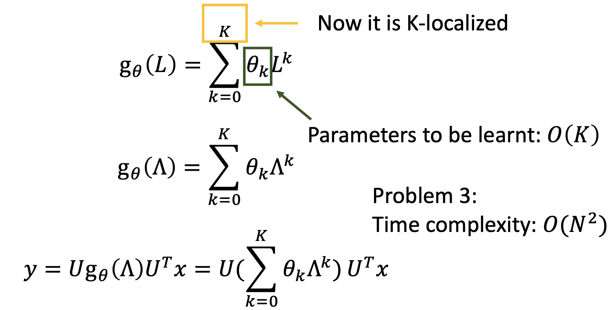

   - 使用Chebyshev Ploynomial代替普通多项式函数解决时间复杂度过高的问题，因为$T_k(\widetilde\Lambda)$会更好计算

     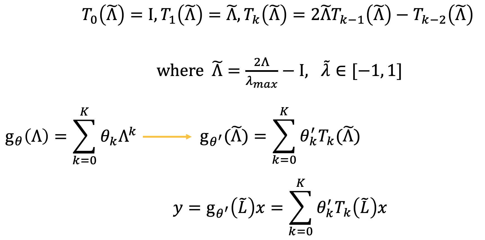

   - 对Chebyshev Ploynomial进行展开，通过递推计算$\bar x_k$使得复杂度降低到$O(KE)$

     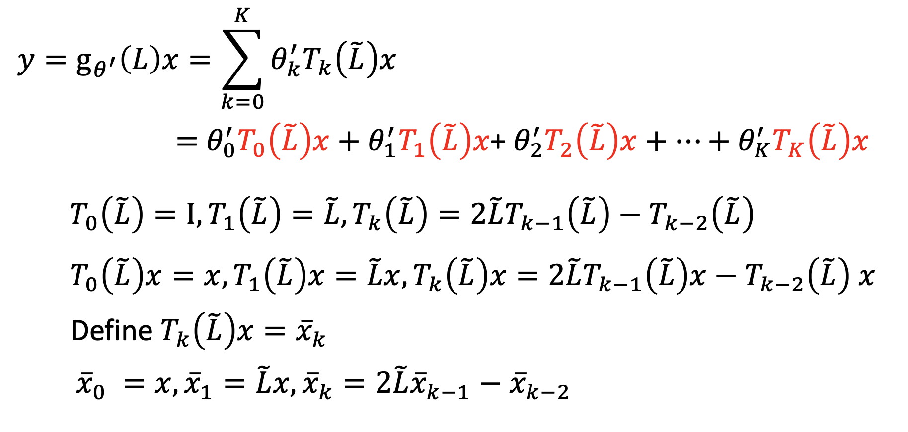

     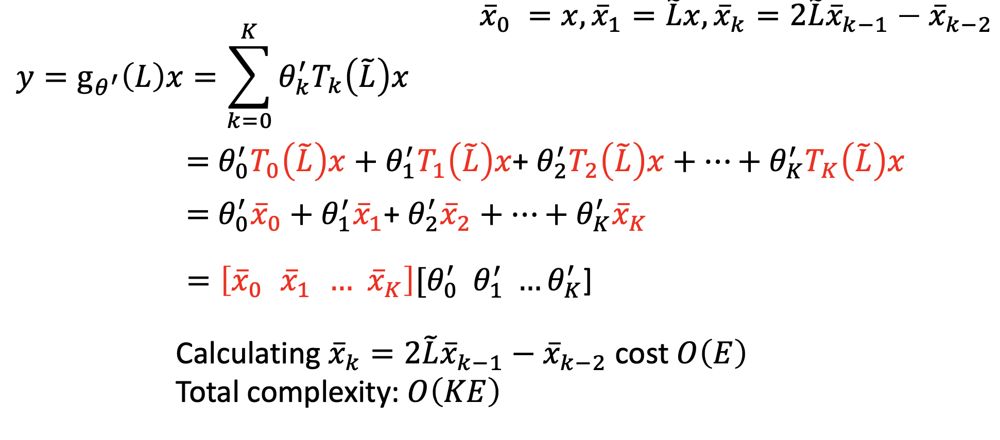

   - 设置多组Filter

     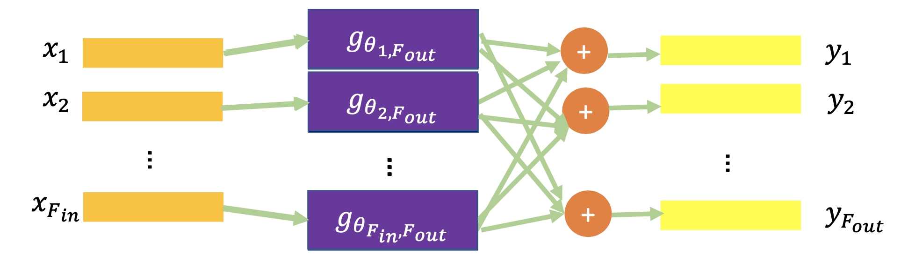

     

4. GCN（Graph Convolution Network）

   - 在ChebNet的基础上，令$K=1$，则有：

     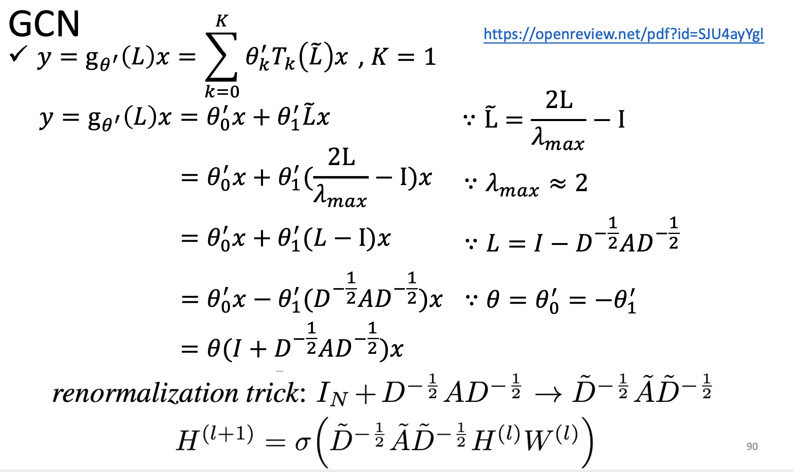

     

   - 将feature进行transform后，计算所有的neighbor(包括自身节点)的weighted sum，然后取平均，加bias，然后送入一个Non-Linear Active Function就可以得到下一层的表示：

     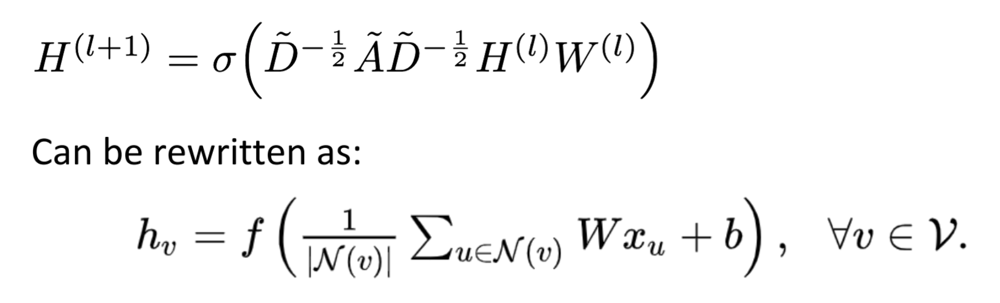

     

#### 5.Graph Generation

1. VAE-based model：Generate a whole graph in one step

   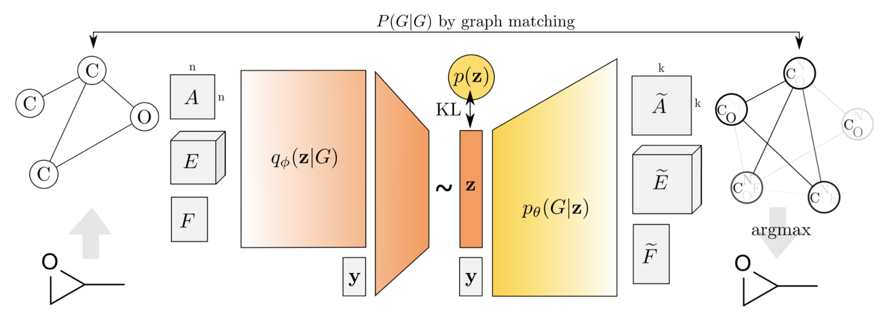

   

2. GAN-based model：Generate a whole graph in one step

   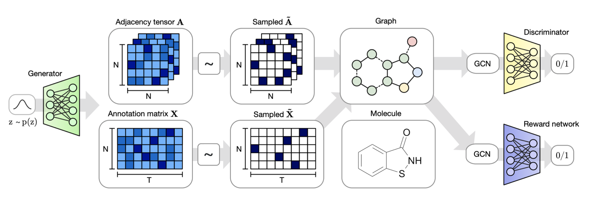

   

3. Auto-regressive-based model：Generate a node or an edge in one step

   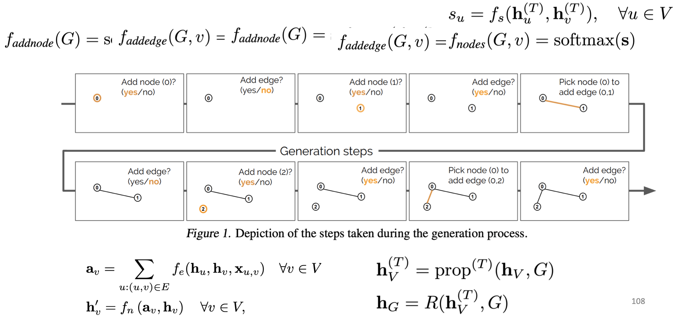
   
   

#### 6.GNN for NLP

1. Semantic Roles Labeling
2. Event Detection
3. Document Time Stamping
4. Name Entity Recognition
5. Relation Extraction
6. Knowledge Graph

#### 7.Summary

1. GAT and GCN are the most popular GNNs
2. Although GCN is mathematically driven, we tend to ignore its math
3. GNN (or GCN) suffers from information lose while getting deeper
4. Many deep learning models can be slightly modified and designed to fit graph data, such as Deep Graph InfoMax, Graph Transformer, GraphBert
5. Theoretical analysis must be dealt with in the future
6. GNN can be applied to a variety of tasks

