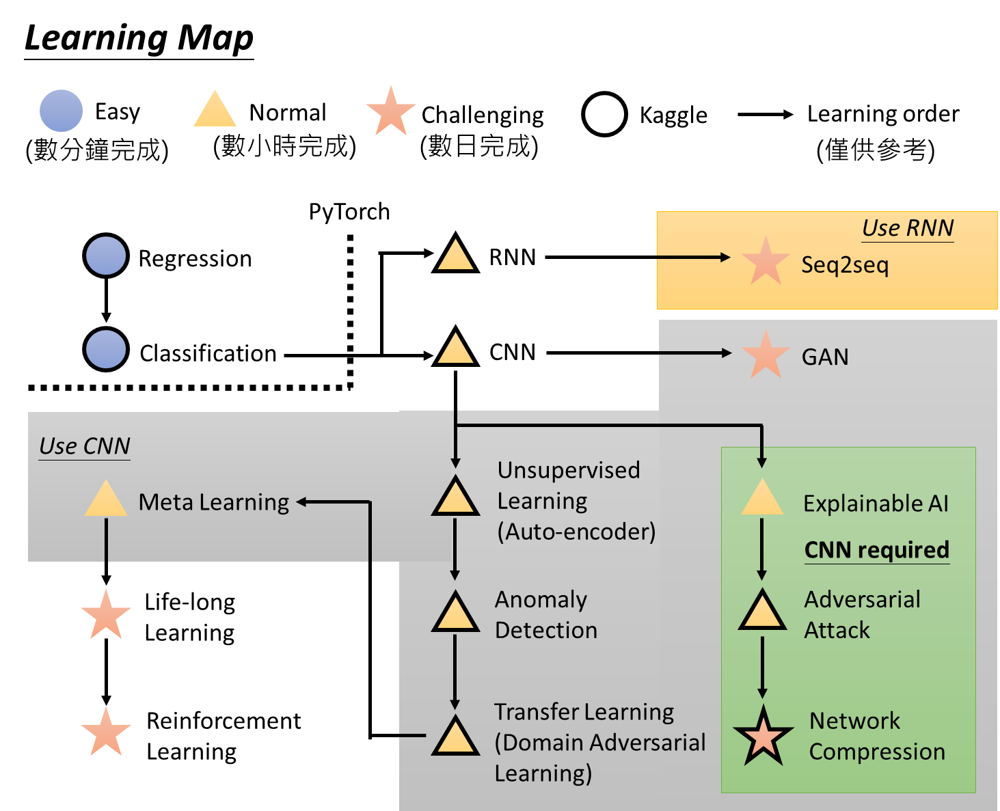

# 李宏毅-机器学习课程学习笔记

### 项目介绍

- 此项目是个人学习李宏毅老师机器学习课程的学习笔记，通过笔记的方式一边巩固学习效果，一边方便后续复习。如有错误，欢迎批评指正。
- 项目包括了机器学习、神经网络、图像处理、NLP相关领域的基础知识和实践应用（具体可以看下文的课程大纲图或目录部分），后续会不断整理面试的知识点进来。
- Chapter 1\~7为手写笔记，Chapter 8\~X为Markdown笔记（建议使用Typora打开）

### 课程大纲图

摘自李宏毅老师课程网站：http://speech.ee.ntu.edu.tw/~tlkagk/courses_ML20.html

### 课程目录

##### Chapter 01 - Outline

##### Chapter 02 - Linear Regression

​		[1~3.线性回归模型的定义与损失函数的使用](#1)

​		[4.梯度下降的原理](#1)

​		[5.过拟合结果可视化](#1)

​		[6.正则化预防过拟合](#1)

​		[7.偏差方差的原理及有偏与无偏估计](#1)

​		[8.使用交叉验证选择最好的模型](#1)

##### Chapter 03 - Gradient Descent

​		[1.梯度下降回顾](#1)

​		[2.Learning Rate的设置与影响](#1)

​		[3.Stochastic Gradient Descent](#1)

​		[4.特征缩放对于梯度下降的影响](#1)

​		[5-6.梯度下降的形式化推导](#1)

##### Chapter 04 - New Optimization based on GD

​		[1~2.SGD与SGDM](#1)

​		[3~5.Adagrad、RMSProp、Adam](#1)

​		[6.最优化算法在实际应用中的比较（Adam和SGD的改进）](#1)

​		[7.Warm-up in Adam](#1)

​		[8.Future Position in Current Step（SGDWM和AdamW）](#1)

​		[9.最优化求解的技巧与总结](#1)

##### Chapter 05 - Classifications（Probability Generative Model & Logistic Regression）

​		[1.概率生成模型的问题描述](#1)

​		[2.贝叶斯分类的基本原理](#1)

​		[3.概率生成模型的Parameters Sharing机制](#1)

​		[4.贝叶斯的数学原理](#1)

​		[5.从Bayes到Logistic](#1)

​		[6.最大似然估计求解Logistic Regression问题](#1)

​		[7.Logistic与Linear Regression的对比](#1)

##### Chapter 06 - Deep Neural Network

​		[1.DL三步走（定义模型函数、定义评价函数、选择最优模型）](#1)

​		[2.Back Propagation](#1)

​		[3.深度学习的训练技巧（过拟合的判断、激活函数的选择、自适应学习率、Early Stopping、正则化、Dropout）](#1)

​		[4.DNN变“深”的原因分析](#1)

##### Chapter 07 - Convolutional Neural Network

​		[1.CNN产生的原因（DNN的参数量过于庞大）](#1)

​		[2.CNN的网络结构（Convolution和MaxPooling）](#1)

​		[3.Filter的工作原理](#1)

##### Chapter 08 - Graph Neural Network

​		[1.Introduction](#1)

​				[1.1 GNN提出的背景](#1.1)

​				[1.2 GNN RoadMap](#1.2)

​		[2.GNN可以解决的问题类型以及相关DataSet和BenchMark](#2)

​		[3.Spatial-based GNN](#3)

​				[3.1 CNN Review](#3.1)

​				[3.2 NN4G（Neural Network for Graph）](#3.2)

​				[3.3 DCNN（Diffusion Convolution Neural Network）](#3.3)

​				[3.4 DGC（Diffusion Graph Convolution）](#3.4)

​				[3.5 MoNET（Mixture Model Networks）](#3.5)

​				[3.6 GraphSage（SAmple and aggreGatE）](#3.6)

​				[3.7 GAT（Graph AttentinNeiworks）](#3.7)

​				[3.8 GIN（Graph Isomorphism Network）](#3.8)

​		[4.Graph Signal Processing and Spectral-based GNN](#4)

​				[4.1 Signal and System Review（信号系统中的数学变换与GNN的关系）](#4.1)

​				[4.2 Spectral Graph Theory（谱图理论）](#4.2)

​				[4.3 ChebNet](#4.3)

​				[4.4 GCN（Graph Convolution Network）](#4.4)

​		[5 Graph Generation（VAE-based model、GAN-based model、Auto-regressive-based model概述）](#5)

​		[6.GNN for NLP（概述）](#6)

​		[7.Summary](#7)

##### Chapter 09 - Recurrent Nueral Network

​		[1.Introduction](#1)

​				[1.1 RNN Application - Slot Filling](#1.1)

​				[1.2 RNN Structure](#1.2)

​		[2.Long Short-term Memory](#2)

​				[2.1 Long Short-term Memory Cell](#2.1)

​				[2.2 LSTM Cell的串联与叠加](#2.2)

​		[3.RNN的学习过程和训练技巧](#3)

​				[3.1 RNN难以训练的原因](#3.1)

​				[3.2 RNN的训练技巧](#3.2)

​		[4.RNN Application](#4)

​				[4.1 Sentiment Analysis（Many to One）](#4.1)

​				[4.2 Key Term Extraction（Many to One）](#4.2)

​				[4.3 Speech Recognizition（Many to Many）](#4.3)

​				[4.4 Machine Translation（Many to Many）](4.4)

​				[4.5 Machine Translation（Many to Many）](#4.5)

​				[4.6 Syntactic Parsing（Beyond Sequence）](#4.6)

​				[4.7 Sequence-to-Sequence Auto-encoder（Text）](#4.7)

​				[4.8 Sequence-to-Sequence Auto-encoder（Speech）](#4.8)

​				[4.9 Chat-bot](#4.9)

​		[5.Attention-based Model（Chapter 11会展开讲解Self-Attention的原理）](#5)

​				[5.1 Attention-based Model基本原理](#5.1)

​				[5.2 Attention-based Model Applications](#5.2)

​		[6.Deep Learning VS. Structured Learning](#6)

​				[6.1 Deep Learning与Structured Learning的比较](#6.1)

​				[6.2 Integrating Deep Learning and Structured Learning](#6.2)

​				[6.3 Structured Learning的本质](#6.3)

##### Chapter 10 - Unsupervised Learning (Word Embedding)

​		[1.Word Encoding的基本方法](#1)

​				[1.1 1-of-N Encoding](#1.1)

​				[1.2 Context在Embedding中的作用](#1.2)

​				[1.3 Count-based Embedding（Glove Vector）](#1.3)

​				[1.4 Prediction-based Embedding（基本原理、CBOW变式、Skip gram变式）](#1.4)

​		[2.Word Embedding Demo](#2)

​				[2.1 Word Embedding Vector蕴含的信息](#2.1)

​				[2.2 Multi-domain Embedding](#2.2)

​				[2.3 Document Embedding](#2.3)

##### Chapter 11 - Semi-supervised Learning

​		[1.Introduction](#1)

​				[1.1 Semi-supervised Learning定义](#1.1)

​				[1.2 可行性分析](#1.2)

​		[2.Semi-supervised Learning for Generative Model](#2)

​				[2.1 Supervised Generative Model](#2.1)

​				[2.2 Semi-supervised Generative Model](#2.2)

​		[3.Low-density Separation（非黑即白）](#3)

​				[3.1 Low-density Separation假设](#3.1)

​				[3.2 Self-training](#3.2)

​				[3.3 Self-training与Semi-supervised Generative Model对比](#3.3)

​				[3.4 Entropy-based Regularization](#3.4)

​				[3.5 Outlook: Semi-supervised SVM](#3.5)

​		[4.Smoothness Assumption（近朱者赤，近墨者黑）](#4)

​				[4.1 Smoothness Assumption定义](#4.1)

​				[4.2 基于平滑理论的半监督学习算法（Cluster and then Label & Graph-based Approach）](#4.2)

​				[4.3 Self-training与Semi-supervised Generative Model对比](#3.3)

​				[4.4 Entropy-based Regularization](#3.4)

​				[4.5 Outlook: Semi-supervised SVM](#3.5)

​		[5.Better Representation（去芜存菁，化繁为简）](#5)

##### Chapter 12 - Explainable Machine Learning（Part 1）

​		[1.Introduction](#1)

​				[1.1 Explainable ML的基本概念](#1.1)

​				[1.2 Interpretable v.s. Powerful](#1.2)

​		[2.Local Explanation：Explain the Decision（Questions: Why do you think this image is a cat?）](#2)

​				[2.1 Important Component与Gradient-based Method](#2.1)

​				[2.2 Limitation of Gradient based Approaches](#2.2)

​				[2.3 Attack Interpretation](#2.3)

​				[2.4 Saliency Map Case Study](#2.4)

​		[3.Global Explanation：Explain the whole Model（Questions: What do you think a “cat” looks like?）](#3)

​				[3.1 Activation Maximization Review](#3.1)

​				[3.2 “Regularization” from Generator](#3.2)

​				[3.3 Self-training与Semi-supervised Generative Model对比](#3.3)

​				[3.4 Entropy-based Regularization](#3.4)

​				[3.5 Outlook: Semi-supervised SVM](#3.5)

​		[4.Using A Model to Explain Another Model](#4)

​				[4.1 基本原理](#4.1)

​				[4.2 Local Interpretable Model - Agnostic Explanations（LIME - 基于Linear Model）](#4.2)

​				[4.3 Local Interpretable Model - Agnostic Explanations（LIME - 基于Decision Tree）](#4.3)

##### Chapter 12 - Explainable Machine Learning（Part 2）

​		[1.Explain a trained model - Attribution（Local v.s. Global attribution / Completeness / Evaluation）](#1)

​				[1.1 Local Gradient-based](#1.1)

​				[1.2 Global Attribution](#1.2)

​				[1.3 Evaluation](#1.3)

​				[1.4 Summary](#1.4)

​		[2.Explain a trained model - Probing（BERT / Good Probing Model）](#2)

​				[2.1 BERT基本原理](#2.1)

​				[2.2 What does BERT learn?（BERT Rediscovers the Classical NLP Pipeline ）](#2.2)

​				[2.3 What does BERT might not learn?](#2.3)

​				[2.4 What is a good prob?](#2.4)

​		[3.Explain a trained model - HeatMap（Activation map \ Attention map）](#3)

​				[3.1 Activation Map：CNN Dissection](#3.1)

​				[3.2 Attention map as explanation](#3.2)

​		[4.Create an explainable model](#4)

​				[4.1 CNN Explainable Model的难点](#4.1)

​				[4.2 Constraining activation map](#4.2)

​				[4.3 Encoding Prior](#4.3)

##### Chapter 13 - Attack and Defense（Part 1）

​		[1.Introduction](#1)

​				[1.1 Attack Model基本原理](#1.1)

​				[1.2 如何求解Attack Model](#1.2)

​				[1.3 Example](#1.3)

​		[2.Attack Approaches](#2)

​				[2.1 Related References](#2.1)

​				[2.2 Fast Gradient Sign Method (FGSM)](#2.2)

​				[2.3 White Box v.s. Black Box](#2.3)

​				[2.4 Universal Adversarial Attack](#2.4)

​				[2.5 Adversarial Reprogramming](#2.5)

​				[2.6 Audio Attack & Text Attack](#2.6)

​		[3.Defense](#3)

​				[3.1 Passive Defense](#3.1)

​				[3.2 Proactive Defense](#3.2)

##### Chapter 13 - Attck and Defense（Part 2）

​		[1.Attacks on Image](#1)

​				[1.1 One Pixel Attack基本思想](#1.1)

​				[1.2 One Pexel Attack的求解](#1.2)

​		[2.Attacks on Audio](#2)

​				[2.1 Attacks on ASR](#2.1)

​				[2.2 Attacks on ASV](#2.2)

​				[2.3 Hidden Voice Attack](#2.3)

##### Chapter 14 - Network Compression（Part 1）

​		[1.Network Purning](#1)

​				[1.1 神经网络修剪的基本原理](#1.1)

​				[1.2 Network Pruning - Practical Issue](#1.2)

​		[2.Knowledge Distillation（知识蒸馏）](#2)

​				[2.1 Knowledge Distillation基本原理](#2.1)

​				[2.2 训练技巧](#2.2)

​		[3.Parameter Quantization](#3)

​				[3.1 Parameter Quantization的三种解决方案](#3.1)

​				[3.2 Binary Connect Network](#3.2)

​		[4.Architecture Design](#3.2)

​				[4.1 隐层的增加与参数的减少](#4.1)

​				[4.2 Depthwise Separable Convolution](#4.2)

​				[4.3 More Related Paper](#4.3)

​		[5.Dynamic Computation](#5)

​				[5.1 计算资源与计算目标的动态调整](#5.1)

##### Chapter 14 - Network Compression（Part 2）

​		[1.Network Compression Review](#1)

​				[1.1 Network Compression常用的解决办法](#1.1)

​		[2.Knowledge Distillation（知识蒸馏）](#2)

​				[2.1 Knowledge Distillation基本原理](#2.1)

​				[2.2 Logits Distillation](#2.2)

​				[2.3 Feature Distillation](#2.3)

​				[2.4 Relational Distillation](#2.4)

​		[3.Network Purning](#3)

​				[3.1 Network Purning Case](#3.1)

​				[3.2 Evaluate Importance](#3.2)

​				[3.3 More About Lottery Ticket Hypothesis](#3.3)

​		[4.Reference](#4)

##### Chapter 15 - Conditional Generation by RNN & Attention

​		[1.Generation](#1)

​				[1.1 Structured Object Generation Model](#1.1)

​				[1.2 Conditional Generation](#1.2)

​		[2.Attention（Dynamic Conditional Generation）](#2)

​				[2.1 Attention-based Model](#2.1)

​				[2.2 Machine Translation with Attention-based Model](#2.2)

​				[2.3 Speech Recognition with Attention-based Model](#2.3)

​				[2.4 Image Caption with Attention-based Model](#2.4)

​				[2.5 Memory Network](#2.5)

​				[2.6 Neural Turing Machine](#2.6)

​		[3.Tips for Training Generation Model](#3)

​				[3.1 Attention Weight Regularization](#3.1)

​				[3.2 Mismatch between Train and Test](#3.2)

​				[3.3 Beam Search（束搜索）](#3.3)

​				[3.4 Object level v.s. Component level](#3.4)

​		[4.Pointer Network](#4)

​				[4.1 Pointer Network基本原理](#4.1)

​		[5.Recursive Structure](#5)

​				[5.1 Sentiment Analysis Application](#5.1)

​				[5.2 Function f 的内部细节](#5.2)

​				[5.3 More Application](#5.3)

##### Chapter 16 - Self-Attention & Transformer（Part 1）

​		[1.Self-attention机制原理](#1)

​				[1.1 RNN与CNN解决序列问题](#1.1)

​				[1.2 Self-Attention的基本过程](#1.2)

​				[1.3 Self-Attention的矩阵表示](#1.3)

​				[1.4 Multi-head Self-attention（以2 heads 为例）](#1.4)

​				[1.5 Positional Encoding](#1.5)

​		[2.Self-attention在Seq2Seq Model中的用法](#2)

​				[2.1 Seq2Seq with Self-attention模型结构](#2.1)

​		[3.Transformer](#3)

​				[3.1 模型结构](#3.1)

​				[3.2 Attention Visualization](#3.2)

​				[3.3 Example Application](#3.3)

##### Chapter 16 - Self-Attention & Transformer（Part 2）

​		[1.Transformer Family](#1)

​				[1.1 Transformer Review](#1.1)

​				[1.2 Sandwich Transformers](#1.2)

​				[1.3 Universal Transformer](#1.3)

​		[2.Residual Shuffle Exchange Network](#2)

​				[2.1 Switch Unit 和 Residual Shuffle Exchange Network](#2.1)

​		[3.BERT Family](#3)

​				[3.1 BERT](#3.1)

​				[3.2 ALBERT](#3.2)

​				[3.3 Reformer](#3.3)

##### Chapter 17 - Unsupervised Learning（Dimension Deduction）

​		[1.Clustering Algorithm](#1)

​				[1.1 基本聚类算法](#1.1)

​		[2.Dimension Reduction](#2)

​				[2.1 Dimension Reduction的可行性分析](#2.1)

​				[2.2 Principle Component Analysis （PCA）](#2.2)

​				[2.3 PCA – Another Point of View（SVD）](#2.3)

​				[2.4 PCA与Auto Encoder](#2.4)

​				[2.5 Weakness of PCA](#2.5)

​				[2.6 PCA Application](#2.6)

​				[2.7 PCA与NMF](#2.7)

​		[3.Matrix Factorization](#3)

​				[3.1 矩阵分解的基本方法与在推荐系统中的应用](#3.1)

​				[3.2 矩阵分解在Topic Analysis中的应用](#3.2)

##### Chapter 18 - Unsupervised Learning（Neighbor Embedding）

​		[1.Locally Linear Embedding （LLE）](#1)

​				[1.1 LLE的基本原理](#1.1)

​		[2.Laplacian Eigenmaps](#2)

​				[2.1 Laplacian Eigenmaps的基本原理](#2.1)

​		[3.T-distributed Stochastic Neighbor Embedding（t-SNE）](#3)

​				[3.1 t-SNE的基本原理](#3.1)

##### Chapter 19 - Unsupervised Learning（Auto-Encoder）

​		[1.Auto Encoder](#1)

​				[1.1 Auto Encoder与PCA的相同之处](#1.1)

​				[1.2 Auto-encoder – Text Retrieval](#1.2)

​				[1.3 Auto-encoder – Similar Image Search](#1.3)

​				[1.4 Auto-encoder – Pre-training DNN](#1.4)

​				[1.5 Auto-encoder for CNN](#1.5)

​				[1.6 De-noising Auto-encoder](#1.6)

​		[2.Decoder](#2)

​				[2.1 Auto-encoder与Generation](#2.1)

​		[3.More Non-Linear Dimension Reduction Model](#3)

​				[3.1 Restricted Boltzmann Machine](#3.1)

​				[3.2 Deep Belief Network](#3.2)

​		[4.Auto-Encoder的改进与思考](#4)

​				[4.1 More than minimizing reconstruction error](#4.1)

​				[4.2 More Interpretable Embedding（Voice Conversion）](#4.2)

​				[4.3 Discrete Representation](#4.3)

​				[4.4 Sequence as Embedding](#4.4)

​				[4.5 Tree as Embedding](#4.5)

##### Chapter 20 - Unsupervised Learning（Generative Model）

​		[1.Pixel RNN](#1)

​				[1.1 Pixel RNN的基本原理与应用场景](#1.1)

​				[1.2 Practicing Generation Models：Pokémon Creation](#1.2)

​		[2.Variational Autoencoder（VAE）](#2)

​				[2.1 VAE的基本过程](#2.1)

​				[2.2 VAE与Auto Encoder的区别](#2.2)

​				[2.3 VAE的数学解释（Gaussian Mixture Model）](#2.3)

​		[3.Generative Adversarial Network (GAN)](#3)

​				[3.1 GAN的基本原理](#3.1)

##### Chapter 21 - BERT

​		[1.Embeddings from Language Model（ELMO）](#1)

​				[1.1 Contextualized Word Embedding](#1.1)

​				[1.2 Embeddings from Language Model（ELMO）](#1.2)

​		[2.Bidirectional Encoder Representations from Transformers （BERT）](#2)

​				[2.1 BERT的网络结构](#2.1)

​				[2.2 BERT的训练技巧](#2.2)

​				[2.3 BERT的使用方法](#2.3)

​				[2.4 What does BERT learn?](#2.4)

​				[2.5 Multilingual BERT](#2.5)

​		[3.Enhanced Representation through Knowledge Integration （ERNIE）](#3)

​				[3.1 ERNIE的基本思想](#3.1)

​		[4.Generative Pre-Training（GPT）](#4)

​				[4.1 GPT的基本思想](#4.1)

​				[4.2 GPT的神奇之处（Zero-shot Learning）](#4.2)

##### Chapter 22 - Self-supervised Learning

​		[1.Self-supervised Learning](#1)

​				[1.1 Self-supervised Learning的常见模型](#1.1)

​		[2.Reconstruction Task](#2)

​				[2.1 Reconstruction on Text](#2.1)

​				[2.2 Reconstruction on Image](#2.2)

​		[3.Contrastive Learning](#3)

​				[3.1 CPC和SimCLR](#3.1)

​		[4.Reference](#4)

##### Chapter 23 - Anomaly Detection

​		[1.Anomaly Detection](#1)

​				[1.1 Anomaly Detection的基本原理](#1.1)

​				[1.2 Anomaly Detection按照数据类型的分类](#1.2)

​		[2.Case 1 - With Label（Classifier）](#2)

​				[2.1 用分类器的输出分布进行异常检测](#2.1)

​				[2.2 模型的评价](#2.2)

​				[2.3 使用Classifier进行异常检测的问题](#2.3)

​		[3.Case 2 - Without Label（Classifier）](#3)

​				[3.1 最大似然估计实现异常检测](#3.1)

​		[4.更多实现异常检测的方法](#4)

​				[4.1 Auto-Encoder](#4.1)

​				[4.2 One-class SVM](#4.2)

​				[4.3 Isolated Forest](#4.3)

​		[5.More About Anomaly Detection](#5)

​				[5.1 Classic Method](#5.1)

​				[5.2 Anomaly detection on Image](#5.2)

​				[5.3 Anomaly detection on Audio](#5.3)

##### Chapter 24 - Generative Adversarial Network（Part 1 - Introduction）

​		[1.Basic Idea of GAN](#1)

​				[1.1 Generator与Discriminator](#1.1)

​				[1.2 GAN Algorithm](#1.2)

​		[2.GAN as structured learning](#2)

​				[2.1 Structured Learning的难点与解决方案](#2.1)

​		[3.Can Generator learn by itself? YES！](#3)

​				[3.1 使用Auto-Encoder实现Generator的独自学习](#3.1)

​		[4.Can Discriminator generate? YES, but diffiuclt!](#4)

​				[4.1 使用Discriminator完成Generative Task的基本方法](#4.1)

​				[4.2 具体算法描述与可视化分析](#4.2)

​		[5.GAN = Generator + Discriminator](#5)

​				[5.1 Generator与Discriminator的相辅相成](#5.1)

##### Chapter 24 - Generative Adversarial Network（Part 2 - Conditional Generation by GAN）

​		[1.Conditional Generation by GAN](#1)

​				[1.1 Conditional GAN中Generator与Discriminator的设计](#1.1)

​				[1.2 Conditional GAN 的实际应用](#1.2)

​		[2.Unsupervised Conditional Generation by GAN](#2)

​				[2.1 Unsupervised Conditional Generation by GAN的提出背景](#2.1)

​				[2.2 实现方案一：Direct transformation](#2.2)

​				[2.3 实现方案二：Projection to Common Space](#2.3)

​				[2.4 Application](#2.4)

##### Chapter 24 - Generative Adversarial Network（Part 3 - Theory behind GAN [Divergence & FGAN]）

​		[1.Theory behind GAN](#1)

​				[1.1 Generator与最大似然估计（KL Divergence）](#1.1)

​				[1.2 Discriminator与如何就算KL Divergence](#1.2)

​				[1.3 GAN的目标函数](#1.3)

​				[1.4 GAN的求解算法](#1.4)

​				[1.5 Intuition GAN](#1.5)

​		[2.FGAN：General Framework of GAN](#2)

​				[2.1 FGAN提出的原因](#2.1)

​				[2.2 F-Divergence](#2.2)

​				[2.3 F-Divergence与GAN的结合](#2.3)

##### Chapter 24 - Generative Adversarial Network（Part 4 - Tips for Improving GAN [WGAN]）

​		[1.WGAN解决的问题及原理](#1)

​				[1.1 JS Divergence与分布无重叠之间的矛盾](#1.1)

​				[1.2 Wasserstein Distance（Earth Mover’s Distance）](#1.2)

​				[1.3 WGAN的训练算法](#1.3)

​				[1.4 Energy-based GAN（EBGAN）](#1.4)

​				[1.5 Loss-sensitive GAN（LSGAN）](#1.5)

​		[2.Reference](#2)

##### Chapter 24 - Generative Adversarial Network（Part 5 - Feature Extraction by GAN [InfoGAN / VAE-GAN / BiGAN]）

​		[1.Feature Extraction by GAN](#1)

​				[1.1 InfoGAN](#1.1)

​				[1.2 VAE - GAN](#1.2)

​				[1.3 BiGAN](#1.3)

​				[1.4 Triple GAN](#1.4)

​				[1.5 Loss-sensitive GAN（LSGAN）](#1.5)

​		[2.Domain-adversarial Training](#2)

​				[2.1 Feature Disentangle](#2.1)

​				[2.2 Intelligent Photo Editing](#2.2)

​				[2.3 Intelligent Photoshop](#2.3)

​				[2.4 More  Application of GAN on Image](#2.4)

##### Chapter 24 - Generative Adversarial Network（Part 6 - Improving Sequence Generation by GAN）

​		[1.Improving Supervised Seq-to-seq Model](#1)

​				[1.1 Regular Seq2Seq Model训练过程存在的问题](#1.1)

​				[1.2 使用RL训练Seq2Seq Model（Human Feedback）](#1.2)

​				[1.3 使用GAN训练Seq2Seq Model（Discriminator Feedback）](#1.3)

​				[1.4 More Applications](#1.4)

​		[2.Unsupervised Conditional Sequence Generation](#2)

​				[2.1 Text Style Transfer](#2.1)

​				[2.2 Unsupervised Abstractive Summarization](#2.2)

​				[2.3 Unsupervised Translation](#2.3)

##### Chapter 24 - Generative Adversarial Network（Part 7 - Evaluation）

​		[1.Improving Supervised Seq-to-seq Model](#1)

​				[1.1 Regular Seq2Seq Model训练过程存在的问题](#1.1)

​				[1.2 使用RL训练Seq2Seq Model（Human Feedback）](#1.2)

​				[1.3 使用GAN训练Seq2Seq Model（Discriminator Feedback）](#1.3)

​				[1.4 More Applications](#1.4)

​		[2.Unsupervised Conditional Sequence Generation](#2)

​				[2.1 Text Style Transfer](#2.1)

​				[2.2 Unsupervised Abstractive Summarization](#2.2)

​				[2.3 Unsupervised Translation](#2.3)

##### Chapter 24 - Generative Adversarial Network（Part 8 - More GAN-based Model [SAGAN, BigGAN, SinGAN, GauGAN, GANILLA, NICE-GAN]）

​		[1.Improving Supervised Seq-to-seq Model](#1)

​				[1.1 GAN Roadmap](#1.1)

​				[1.2 SAGAN（Self-Attention）](#1.2)

​				[1.3 BigGAN（升级版SAGAN）](#1.3)

​				[1.4 SinGAN（将一张图片切割成很多小的图片当做训练资料）](#1.4)

​				[1.5 GauGAN（Conditional Normalization）](#1.5)

​				[1.6 GANILLA（CycleGAN/DualGAN mega升级、宮崎駿Dataset）](#1.6)

​				[1.7 NICE-GAN（D的前半部当成encoder）](#1.7)

##### Chapter 25 - Transfer Learning

​		[1.Transfer Learning简介](#1)

​				[1.1 Transfer Learning提出的背景](#1.1)

​		[2.Labeled Source Dara + Labeled Target Data](#2)

​				[2.1 Model Fine-tuning](#2.1)

​				[2.2 Multitask Learning](#2.2)

​		[3.Labeled Source Dara + Unlabeled Target Data](#3)

​				[3.1 Domain-adversarial Training](#3.1)

​				[3.2 Zero-shot learning](#3.2)

##### Chapter 26 - Deep Reinforence Learning（Part 1 - Actor & Critic）

​		[1.Reinforence Learning Introduction](#1)

​				[1.1 RL的术语与基本思想](#1.1)

​				[1.2 RL的特点](#1.2)

​				[1.3 RL Outline](#1.3)

​		[2.Policy-based Approach（Learning an Actor）](#2)

​				[2.1 Policy-based Approach三步走](#2.1)

​				[2.2 Step 1：Neural Network  as Actor](#2.2)

​				[2.3 Step 2：Goodness of Actor](#2.3)

​				[2.4 Step 3：Pick the best Actor](#2.4)

​		[3.Value-based Approach（Learning a Critic）](#3)

​				[3.1 Critic的定义（State Value Function）](#3.1)

​				[3.2 Estimating Critic（State Value Function）](#3.2)

​				[3.3 Critic的定义（State-action Value Function）](#3.3)

​		[4.Actor-Critic](#4)

​				[4.1 A3C（Asynchronous Advantage Actor-Critic）](#4.1)

​		[5.Inverse Reinforence Learning](#5)

​				[5.1 Imitation Learning](#5.1)

##### Chapter 26 - Deep Reinforence Learning（Part 2 - Proximal Policy Optimization（PPO））

​		[1.Policy Gradient Review](#1)

​				[1.1 RL的目标函数（最大化收益期望）与求解过程（Advantage Function）](#1.1)

​		[2.From on-policy to off-policy](#2)

​				[2.1 On-Policy和Off-Policy的对比](#2.1)

​				[2.2 Importance Sampling与Off-Policy](#2.2)

​				[2.3 使用Importance Sampling实现从On-Policy到Off-Policy的转换](#2.3)

​		[3.Add Constrain（PPO / TRPO）](#3)

​				[3.1 PPO与TRPO的定义](#3.1)

​				[3.2 PPO Algorithm和PPO2 Algorithm](#3.2)

##### Chapter 26 - Deep Reinforence Learning（Part 3 - Q Learning）

​		[1.Value-based Approach Review](#1)

​				[1.1 Value-based Approach的分类与估计方法](#1.1)

​		[2.Introduction of Q-Learning](#2)

​				[2.1 Q-Learning的大致过程](#2.1)

​		[3.Tips of Q-Learning（Q-Learning的变种）](#3)

​				[3.1 Double DQN](#3.1)

​				[3.2 Dueling DQN](#3.2)

​				[3.3 Prioritized Reply](#3.3)

​				[3.4 Multi-step](#3.4)

​				[3.5 Noisy Net](#3.5)

​				[3.6 Distributional Q-function](#3.6)

​				[3.7 Rainbow](#3.7)

​		[4.Q-Learning for Continuous Actions](#4)

​				[4.1 Q-Learning处理连续型Action的难点和解决办法](#4.1)